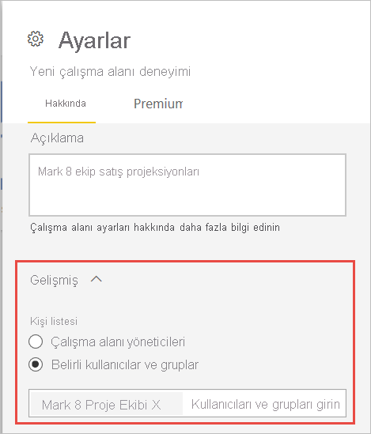

# Power BI'da yeni çalışma alanları oluşturma

Bu makalede, *klasik* çalışma alanı yerine *yeni bir çalışma alanının* nasıl oluşturulacağı açıklanmaktadır. İki tür çalışma alanı da iş arkadaşlarınızla işbirliği yaptığınız yerlerdir. Bu çalışma alanlarında pano, rapor ve sayfalandırılmış rapor koleksiyonları oluşturursunuz. Dilerseniz bu koleksiyonu bir *uygulamaya* paketleyip daha geniş bir kitleye dağıtabilirsiniz. Daha fazla arka plan bilgisi için [yeni çalışma alanları](service-new-workspaces.md) makalesine bakın.

Klasik çalışma alanınızı geçirmeye hazır mısınız? Ayrıntılar için bkz. [Power BI'da klasik çalışma alanlarını yeni çalışma alanlarına yükseltme](service-upgrade-workspaces.md).

> [!NOTE]
> İçerik paketi oluşturmayla ilgili bilgi mi arıyorsunuz? Bu özellik kullanımdan kaldırılıyor. Şimdi içerik paketlerinizi uygulamalara yükseltmek için iyi bir zaman. Zaman çizelgesi için [Announcing Power BI admins can upgrade classic workspaces](https://powerbi.microsoft.com/blog/announcing-power-bi-admins-can-upgrade-classic-workspaces-and-roadmap-update/) (Power BI yöneticileri klasik çalışma alanlarını yükseltebilir) başlıklı blog gönderisinin çalışma alanlarını yükseltme yol haritası bölümüne bakın.
> 

## Yeni çalışma alanlarından birini oluşturma

1. İşe çalışma alanını oluşturarak başlayın. **Çalışma alanları** > **Çalışma alanı oluştur**'u seçin.
   
     

2. **Klasik sürüme geri al**'ı seçmediğiniz müddetçe otomatik olarak yükseltilmiş bir çalışma alanı oluşturacaksınız.
   
     
     
     **Klasik sürüme geri al**’ı seçerseniz Microsoft 365 grubunu temel alan bir [klasik çalışma alanı](service-create-workspaces.md) oluşturursunuz.

2. Çalışma alanına benzersiz bir ad verin. Ad kullanılamıyorsa, düzenleyerek benzersiz bir ad haline getirin.
   
     Çalışma alanından oluşturduğunuz uygulama, çalışma alanıyla aynı ada ve simgeye sahip olacaktır.
   
1. Aşağıda, çalışma alanınız için ayarlayabileceğiniz bazı isteğe bağlı öğeler verilmiştir:

    - Bir **Çalışma alanı görüntüsü** yükleyin. Dosyalar .png veya .jpg biçiminde olabilir. Dosya boyutu 45 KB'tan küçük olmalıdır. 
    - Microsoft 365 grubu dosya depolama konumu kullanmak için [bir OneDrive Çalışma Alanı belirtin](#set-a-workspace-onedrive).    
    - [Kişi listesi ekleyin](#create-a-contact-list). Varsayılan olarak, çalışma alanı yöneticileri kişiler arasındadır. 
    - Çalışma alanı için [katkıda bulunanların uygulamayı güncelleştirmesine izin verme](#allow-contributors-to-update-the-app)
    - Çalışma alanını bir **Ayrılmış kapasiteye** atamak için **Premium** sekmesinde **Ayrılmış kapasite**'yi seçin.

        

1. **Kaydet**’i seçin.

    Power BI çalışma alanını oluşturur ve açar. Üyesi olduğunuz çalışma alanlarının listesinde bunu görürsünüz. 

## Çalışma alanınıza erişim izni verme

Çalışma alanında yönetici rolüne sahip herkes başkalarını farklı rollere ekleyerek bu kişilere, çalışma alanına erişim izni verebilir. Çalışma alanı oluşturucuları otomatik olarak yönetici olur. Rollerin açıklaması için [Yeni çalışma alanlarındaki roller](service-new-workspaces.md#roles-in-the-new-workspaces) bölümüne bakın.

> [!NOTE]
> Çalışma alanındaki içeriğe göz atan Power BI Pro kullanıcılarında satır düzeyi güvenliği (RLS) zorunlu tutmak için kullanıcılara Görüntüleyici Rolü atayın. Farklı rollerin açıklamaları için [Yeni çalışma alanlarındaki roller](service-new-workspaces.md#roles-in-the-new-workspaces) bölümüne bakın.

1. Yönetici olduğunuzdan, çalışma alanı içerik listesi sayfasında **Erişim**’i görürsünüz.

    

1. Bu çalışma alanlarına güvenlik gruplarını, dağıtım listelerini, Microsoft 365 gruplarını veya kişileri yönetici, üye, katkıda bulunan ya da görüntüleyici olarak ekleyin. 

    

9. **Ekle** > **Kapat**'ı seçin.

## OneDrive çalışma alanı ayarlama

OneDrive Çalışma Alanı özelliği, SharePoint Belge Kitaplığı dosya depolama alanının çalışma alanı kullanıcıları tarafından kullanılabildiği bir Microsoft 365 grubu yapılandırmanızı sağlar. Grubu önce Power BI dışında oluşturacaksınız. 

Power BI, Microsoft 365 grubu üyeliğiyle çalışma alanı erişimi olacak şekilde yapılandırılmış kullanıcı veya grupların izinlerini eşitlemez. En iyi yöntem, bu ayarda dosya depolama alanını yapılandırdığınız aynı Microsoft 365 Grubuna [çalışma alanı erişim izni](#give-access-to-your-workspace) vermektir. Ardından Microsoft 365 grubunun üyeliğini yöneterek çalışma alanı erişimini yönetin. 

1. Yeni **Çalışma Alanı OneDrive** ayarına iki şekilde erişebilirsiniz:

    İlk kez oluşturduğunuzda **Çalışma alanı oluştur** bölmesinden.

    Gezinti bölmesinde, **Çalışma alanları**’nın yanındaki oku ve sonra çalışma alanı adı > **Çalışma alanı ayarları**’nın yanındaki **Diğer seçenekler** (...) düğmesini seçin. **Ayarlar** bölmesi açılır.

    

2. **Gelişmiş** > **Workspace OneDrive** altında, daha önce oluşturduğunuz Microsoft 365 grubunun adını yazın. URL’yi değil, yalnızca adı yazın. Power BI, grup için otomatik olarak OneDrive'ı seçer.

    

3. **Kaydet**’i seçin.

### Çalışma alanı OneDrive konumuna erişim

OneDrive konumunuzu yapılandırdıktan sonra, bunu tıpkı Power BI hizmetindeki diğer veri kaynaklarını aldığınız gibi alırsınız.

1. Gezinti bölmesinde **Veri Al**’ı seçip **Dosyalar** kutusunda **Al** seçeneğini belirleyin.

    

1.  **OneDrive – İş** girişi, kendi kişisel OneDrive İş kopyanızdır. İkinci OneDrive, eklediğiniz kopyadır.

    

## Kişi listesi oluşturma

Çalışma alanında oluşan sorunlar hakkında hangi kullanıcıların bildirim alacağını belirtebilirsiniz. Varsayılan olarak, çalışma alanı yöneticisi olarak belirtilen tüm kullanıcı veya gruplar bildirim alır, ancak *kişi listesine* başkalarını da ekleyebilirsiniz. Kullanıcıların çalışma alanıyla ilgili yardım alabilmesi için kişi listesinde yer alan kullanıcılar veya gruplar kullanıcı arabiriminde listelenir.

1. Yeni **Kişi listesi** ayarına iki şekilde erişebilirsiniz:

    İlk kez oluşturduğunuzda **Çalışma alanı oluştur** bölmesinden.

    Gezinti bölmesinde, **Çalışma alanları**’nın yanındaki oku ve sonra çalışma alanı adı > **Çalışma alanı ayarları**’nın yanındaki **Diğer seçenekler** (...) düğmesini seçin. **Ayarlar** bölmesi açılır.

    

2. **Gelişmiş**, **Kişi listesi** bölümünde **Çalışma alanı yöneticileri** varsayılan değerini kabul edin veya kendi **Belirli kullanıcılar veya gruplar** listenizi ekleyin. 

    

3. **Kaydet**’i seçin.

## Katkıda bulunanların uygulamayı güncelleştirmesine izin verme

**Katkıda bulunanların bu çalışma alanı için uygulamayı güncelleştirmesine izin ver** ayarı, çalışma alanı Yöneticilerinin Katkıda Bulunan rolüne sahip kullanıcılara çalışma alanı için uygulamayı güncelleştirme özelliği devretmesini sağlar. Varsayılan olarak yalnızca çalışma alanı Yöneticileri ve Üyeleri çalışma alanı için uygulamayı yayımlayıp güncelleştirebilir. 

1. Bu ayara erişmek için gezinti bölmesinde, **Çalışma alanları**’nın yanındaki oku, sonra çalışma alanı adının yanındaki **Diğer seçenekler** (...) düğmesini ve **Çalışma alanı ayarları**‘nı seçin. **Ayarlar** bölmesi açılır.

    

2. **Gelişmiş** bölümünde **Güvenlik ayarları**’nı genişletin. **Katkıda bulunanların bu çalışma alanı için uygulamayı güncelleştirmesine izin ver** seçeneğini belirleyin. 

Etkinleştirildiğinde, katkıda bulunanlar şunları yapabilir:
* Ad, simge, açıklama, destek sitesi ve renk gibi uygulama meta verilerini güncelleştirme
* Raporları veya veri kümelerini ekleme gibi, uygulamaya dahil edilen öğeleri ekleyip kaldırma
* Uygulama gezintisini veya uygulama açıldığında görünen varsayılan öğeyi değiştirme

Ancak katkıda bulunanlar şunları yapamaz:
* Uygulamayı ilk kez yayımlama
* Uygulama iznine sahip olan kişileri değiştirme

## Yeni çalışma alanlarındaki uygulamalar

İçerik paketleri yerine, yeni çalışma alanının kullanacağı *uygulamalar* oluşturabilir ve kullanabilirsiniz. Uygulamalar, üçüncü taraf hizmetlere ve kurumsal verilere bağlanan pano, rapor ve veri kümesi koleksiyonlarıdır. Uygulamalar, Microsoft Dynamics CRM, Salesforce ve Google Analytics gibi hizmetlerden veri almayı kolaylaştırır.

Yeni çalışma alanı deneyimiyle, kurumsal içerik paketleri oluşturamaz veya kullanamazsınız. İç ekiplerinizin, kullanmakta olduğunuz içerik paketlerine yönelik uygulamalar sağlamasını isteyin. 

### Uygulamayı dağıtma

Kuruluşunuzda büyük bir hedef kitleye resmi içerik dağıtmak istiyorsanız, çalışma alanınızdan bir *uygulama* yayımlayabilirsiniz.  İçerik hazır olduğunda, yayımlamak istediğiniz panoları ve raporları seçip bunları bir uygulama olarak yayımlarsınız. Her çalışma alanından bir uygulama oluşturabilirsiniz.

[Yeni çalışma alanlarından uygulama yayımlama](service-create-distribute-apps.md) hakkında bilgi edinin.

## Sonraki adımlar
* [Power BI'da yeni çalışma alanlarında çalışmayı düzenleme deneyimi](service-new-workspaces.md) makalesini okuyun
* [Klasik çalışma alanları oluşturma](service-create-workspaces.md)
* [Power BI’da yeni çalışma alanlarından uygulama yayımlama](service-create-distribute-apps.md)
* Sorularınız mı var? [Power BI Topluluğu'na sorun](https://community.powerbi.com/)
