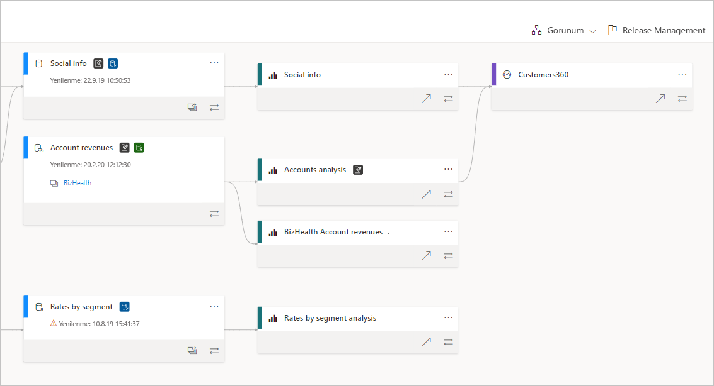
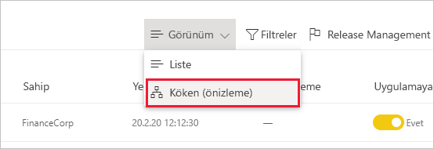
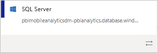
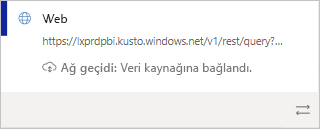
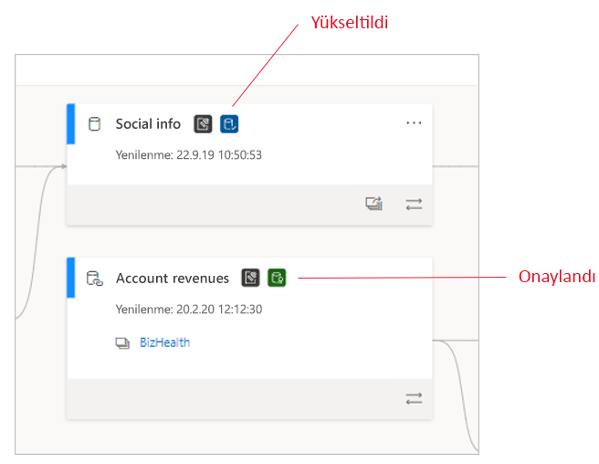
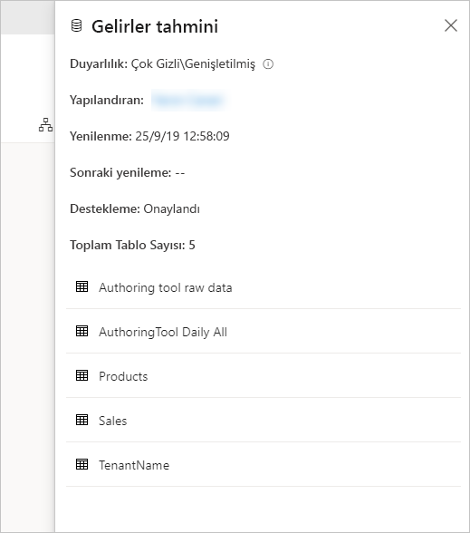
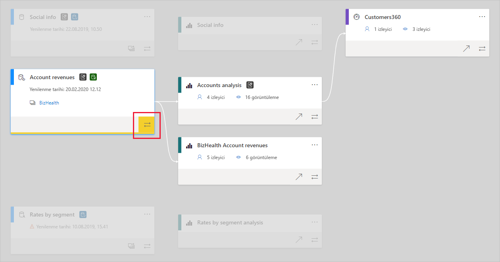

# Veri kökeni
Modern iş zekası (BI) projelerinde verilerin veri kaynağından hedefine akışını anlamak güç olabilir. Birden çok veri kaynağına, yapıta ve bağımlılığa yayılan gelişmiş analiz projeleri oluşturduğunuzda bu güçlük daha da artar. "Bu verileri değiştirirsem ne olur?" veya "Bu rapor neden güncel değil?" gibi soruları yanıtlamak kolay olmayabilir. Bunu anlamak için bir uzman takımı veya derin bir araştırma gerekebilir. Veri kökeni görünümünü, bu soruları yanıtlamanıza yardımcı olmak için tasarladık.

 
Power BI'da panolar, raporlar, veri kümeleri ve veri akışları gibi çeşitli yapıt türleri vardır. Birçok veri kümesi ve veri akışı SQL Server gibi dış veri kaynaklarına ve diğer çalışma alanlarındaki dış veri kümelerine bağlanır. Bir veri kümesi sahip olduğunuz çalışma alanının dışındaysa, BT'deki birine veya başka bir analiste ait veri kümesinde olabilir. Dış veri kaynakları ve veri kümeleri verilerin nihai olarak nereden geldiğini bilmeyi zorlaştırır. Hem karmaşık projeler hem de daha basit olanlar için köken görünümünü sunuyoruz.

Köken görünümünde çalışma alanında yer alan tüm yapıtlar arasındaki köken ilişkilerini ve çalışma alanının tüm dış bağımlılıklarını görürsünüz. Hem yukarı hem de aşağı doğru akan veri akışlarıyla bağlantılar da dahil olmak üzere tüm çalışma alanı yapıtları arasındaki bağlantıları gösterir.    

> [!VIDEO https://youtu.be/rUj06dqB98g]

## Köken görünümünü inceleme

İster yeni ister klasik olsun her çalışma alanının otomatik olarak bir köken görünümü vardır. Bu görünümü görmek için çalışma alanında en azından Katkıda Bulunan rolüne sahip olmanız gerekir. Ayrıntılar için bu makalenin [İzinler](#permissions) bölümüne bakın.

* Köken görünümüne erişmek için çalışma alanı listesi görünümüne gidin. **Liste görünümü**'nün yanındaki oka dokunun ve **Köken görünümü**'nü seçin.

   

Bu görünümde tüm çalışma alanı yapıtlarını ve verilerin bir yapıttan diğerine nasıl aktığını görürsünüz.

**Veri kaynakları**

Veri kümeleriyle veri akışlarının verilerini aldığı veri kaynaklarını görürsünüz. Veri kaynağı kartlarında, kaynağı belirlemeye yardımcı olabilecek daha fazla bilgi görürsünüz. Örneğin Azure SQL Server için veritabanı adı da gösterilir.

 
**Ağ geçitleri**

Veri kaynağı şirket içi bir ağ geçidi üzerinden bağlandıysa, ağ geçidi bilgileri veri kaynağı kartına eklenir. Ağ geçidi yöneticisi veya veri kaynağı kullanıcısı olarak izinleriniz varsa, ağ geçidi adı gibi ek bilgiler görürsünüz.

**Veri kümeleri ve veri akışları**
 
Veri kümelerinde ve veri akışlarında son yenileme zamanını, ayrıca veri kümesinin veya veri akışının sertifikalı ya da yükseltilmiş olup olmadığını görürsünüz.

 
Çalışma alanındaki rapor başka bir çalışma alanında yer alan bir veri kümesi veya veri akışı üzerinde oluşturulduysa, söz konusu veri kümesinin veya veri akışının kartında kaynak çalışma alanının adını görürsünüz. Kaynak çalışma alanının adını seçerek o çalışma alanını gidersiniz.

* Herhangi bir yapıtın seçenekler menüsünü görüntülemek için **Diğer seçenekler (...)** öğesini seçin. Liste görünümünde sağlanan tüm eylemleri sunar.

Herhangi bir yapıtta daha fazla meta veri görmek için yapıt kartının kendisini seçin. Yapıtla ilgili ek bilgiler yan bölmede görüntülenir. Aşağıdaki resimde, yan bölmede seçilen veri kümesinin meta verileri görüntülenir.

 
## Herhangi bir yapıt için kökeni gösterme 

Belirli bir yapıtın kökenini görmek istediğinizi varsayalım.

* Yapıtın altındaki çift oku seçin.

   

   Power BI söz konusu yapıtla ilgili tüm yapıtları vurgular ve kalanları soluk gösterir. 

## Gezinti ve tam ekran 

Köken görünümü etkileşimli bir tuvaldir. Hem tuvalde gezinmek hem de yakınlaştırıp uzaklaştırmak için fareyi veya dokunmatik yüzeyi kullanabilirsiniz.

* Yakınlaştırmak ve uzaklaştırmak için sağ alt köşedeki menüyü ya da farenizi veya dokunmatik yüzeyinizi kullanın.
* Grafın kendisine daha fazla yer açmak için sağ alt köşedeki tam ekran seçeneğini kullanın. 

    

## İzinler

* Köken görünümünü görmek için Power BI Pro lisansınız olmalıdır.
* Köken görünümü yalnızca çalışma alanına erişimi olan kullanıcılara sağlanır.
* Kullanıcıların çalışma alanı üzerinde Yönetici, Üye veya Katkıda Bulunan rolü olmalıdır. Görüntüleyici rolü olan kullanıcılar köken görünümüne geçemez.

## Önemli noktalar ve sınırlamalar

- Köken görünümü Internet Explorer'da kullanılamaz. Ayrıntılar için bkz. [Power BI için desteklenen tarayıcılar](../fundamentals/power-bi-browsers.md).

## Sonraki adımlar

* [Çalışma alanları arasında veri kümelerine giriş (önizleme)](../connect-data/service-datasets-across-workspaces.md)
* [Veri kümesi etki analizi](service-dataset-impact-analysis.md)
