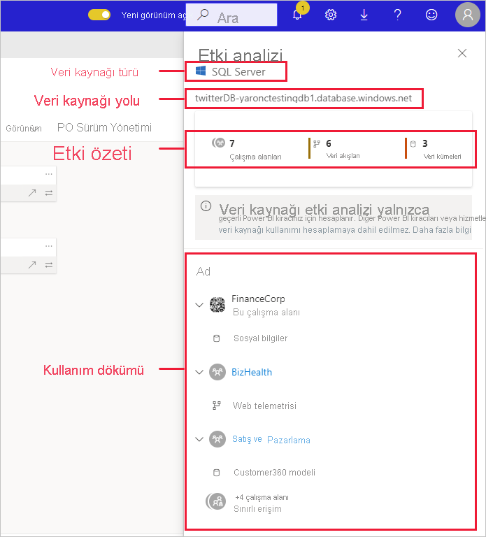
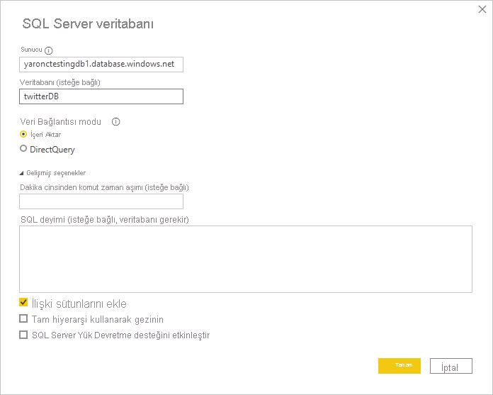

# Veri kaynağı etki analizi

Veri kaynağı etki analizi kuruluşunuz genelinde veri kaynaklarınızın nerede kullanıldığını görmenize yardımcı olur. Veri kaynağı geçici veya kalıcı olarak çevrimdışı bırakılırsa kimlerin etkilendiğini görmek isterseniz bu yararlı olabilir. Kaç çalışma alanı, veri akışı ve veri kümesinin veri kaynağını kullandığını gösterir ve etkilenen veri akışı ve veri kümelerinin bulunduğu çalışma alanlarına kolay erişim sağlar; böylece daha ayrıntılı olarak araştırabilirsiniz.

Veri kaynağı etki analizi kiracıdaki veri yinelemesini belirlemenize de yardımcı olur (örneğin farklı kullanıcılar aynı veri kaynağının üstüne benzer modeller kuruyorsa). Veri kaynağı etki analizi, bu yedekli veri kümelerini ve veri akışlarını bulmanıza yardımcı olarak “tek gerçeklik kaynağı” hedefini destekler.

## Veri kaynağı etki analizi gerçekleştirme

Veri kaynağı etki analizi gerçekleştirmek için:

1. İlgilendiğiniz veri kaynağını içeren çalışma alanına gidin ve [köken görünümünü](service-data-lineage.md) açın.
1. Veri kaynağının kartını bulun ve etki analizi simgesine tıklayın.

    
 
Etki analizi yan paneli açılır.

 
* **Veri kaynağı türü**: Veri kaynağı türünü gösterir
* **Veri kaynağı yolu**: Power BI Desktop’ta tanımlanan veri kaynağı yolu. Örneğin yukarıdaki resimde SQL sunucusu veritabanı veri kaynağının yolu Power BI Desktop’ta tanımlandığı gibi (aşağıda gösterilmiştir) "twitterDB-yaronctestingdb1.database.windows.net" bağlantı dizesidir. “twitterDB” veritabanı adından ve “yaronctestingdb1.database.windows.net” sunucu adından oluşur.

    
 
* **Etki özeti**: Etkilenme olasılığı olan çalışma alanlarının, veri akışlarının ve veri kümelerinin sayısını gösterir. Bu sayı erişiminiz olmayan çalışma alanlarını içerir.
* **Kullanım dökümü**: Size her çalışma alanı için etkilenen veri akışlarının ve veri kümelerinin adlarını gösterir. Belirli bir çalışma alanındaki etkiyi daha ayrıntılı incelemek için çalışma alanı adına tıklayarak çalışma alanını açın. Etkilenen çalışma alanına geldiğinizde bağlı raporların ve panoların ayrıntılarını görmek için [veri kümesi etki analizini](service-dataset-impact-analysis.md) kullanın.

## Gizlilik

Etki analizi yan bölmesinde yalnızca erişiminiz olan çalışma alanlarının, veri kümelerinin ve veri akışlarının gerçek adlarını görürsünüz. Erişiminiz olmayan öğeler Sınırlı erişim olarak listelenir. Bunun nedeni bazı öğe adlarının kişisel bilgiler içermesidir.
Etki özeti sayımları erişiminiz olmayan çalışma alanlarında bulunanlar da dahil olmak üzere tüm veri akışlarını ve veri kümelerini içerir.

## Sınırlamalar

Veri kaynağı etki analizi henüz sayfalandırılmış raporlar için desteklenmemektedir, bu nedenle veri kaynağının kiracıdaki bu tür raporları doğrudan etkileyip etkilemediğini görmezsiniz.

## Sonraki adımlar

* [Veri kümesi etki analizi](service-dataset-impact-analysis.md)
* [Veri kökeni](service-data-lineage.md)