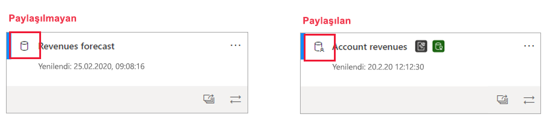
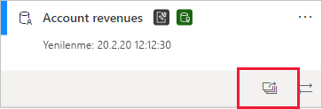
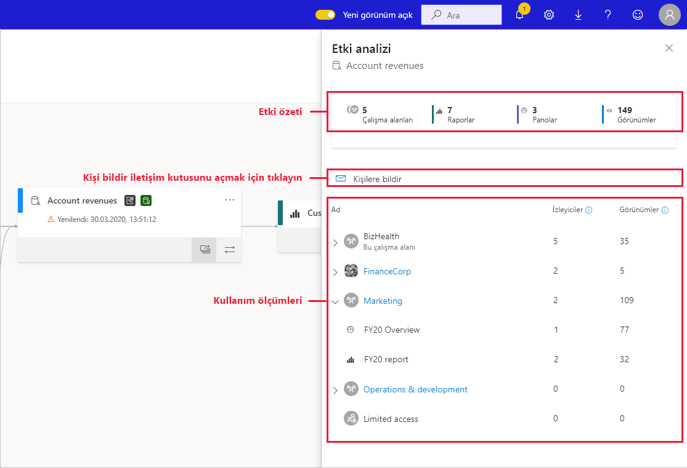
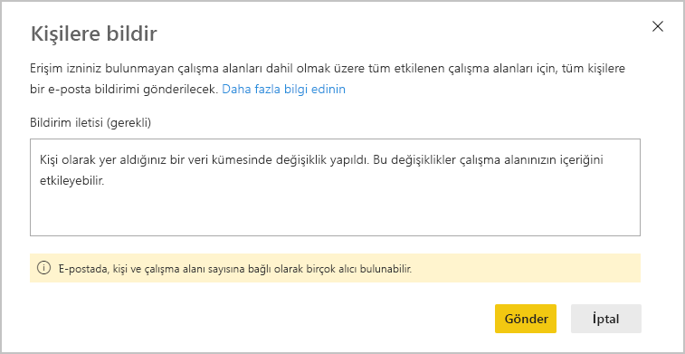
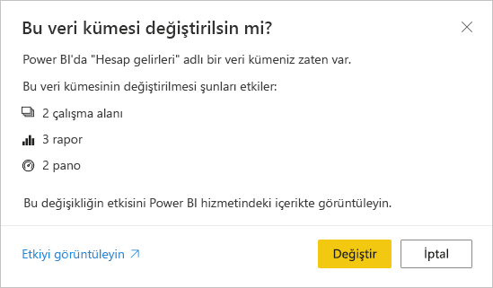

# Veri kümesi etki analizi

Veri kümesinde değişiklikler yaparken veya yapmayı düşünürken, bu değişikliklerin söz konusu veri kümesine bağımlı olan aşağı akış raporlarını ve panolarını nasıl etkileyeceğini değerlendirebilmek önemlidir. **Veri kümesi etki analizi** bu değerlendirmeyi yaparken size yardımcı olabilecek bilgiler sağlar.
* Yaptığınız değişiklikten kaç çalışma alanının, raporun ve panonun etkilenebileceğini gösterir ve daha fazla araştırma yapabilmeniz için etkilenen raporlarla panoların bulunduğu çalışma alanlarına kolayca gitmenizi sağlar.
* Etkilenme olasılığı olan öğelerin kaç benzersiz ziyaretçisi olduğunu ve görünümlerin sayısını gösterir. Bu bilgiler aşağı akış öğesi için değişikliğin genel etkisini saptamanıza yardımcı olur. Örneğin, 20.000 benzersiz görüntüleyicisi olan bir raporda yapılan değişikliğin etkisini araştırmak büyük olasılıkla üç görüntüleyicisi olan bir rapordaki değişikliğin etkisini araştırmaktan daha önemlidir.
* Yaptığınız veya yapmayı düşündüğünüz değişiklik hakkında ilgili kişileri bilgilendirmek için kolay bir yol sağlar.

Veri kümesi etki analizi, [veri kökeni görünümünün](service-data-lineage.md) içinden kolayca başlatılabilir.

## Paylaşılan veri kümelerini belirleme

Hem paylaşılan hem de paylaşılmayan veri kümeleri üzerinde veri kümesi etki analizi yapabilirsiniz. Bununla birlikte çalışma alanları arasında paylaşılan veri kümeleri için özellikle yararlı olur çünkü paylaşılmayan veri kümelerinde bağımlılıkların tümü veri kümesiyle aynı çalışma alanında yer alırken, paylaşılan veri kümelerinde aşağı akış bağımlılıklarının net bir görüntüsünü elde etmek çok daha karmaşıktır.

Köken görünümünde, veri kümesi kartının sol üst köşesinde görüntülenen simgeye bakarak paylaşılan veri kümeleriyle paylaşılmayan veri kümelerini birbirinden ayırt edebilirsiniz.

## Veri kümesi etki analizi yapma

Paylaşılsın veya paylaşılmasın, çalışma alanındaki tüm veri kümelerinde etki analizi yapabilirsiniz. Köken görünümünde gösterilen ama aslında başka bir çalışma alanında yer alan dış veri kümelerinde etki analizi yapamazsınız. Dış veri kümesinde etki analizi yapmak için kaynak çalışma alanına gitmeniz gerekir.

Veri kümesi etki analizi yapmak için veri kümesi kartında etki analizi düğmesine tıklayın.

Etki analizi yan paneli açılır.

* **Etki özeti**, etkilenme olasılığı olan çalışma alanları, raporlar ve panoların sayısının yanı sıra, veri kümesine bağlı tüm aşağı akış raporlarına ve panolarına ilişkin görünümlerin toplam sayısını da gösterir.
* **Kişilere bildirme** bağlantısı, herhangi bir veri kümesi değişikliği hakkında bir ileti oluşturabileceğiniz ve etkilenen çalışma alanlarının kişi listelerine gönderebileceğiniz iletişim kutusunu açar. 
* **Kullanım dökümü** her çalışma alanı için, çalışma alanının içindeki etkilenmiş olabilecek raporlar ve panoların toplam görünüm sayısını, ayrıca her rapor ve pano için toplam görüntüleyici ve görünüm sayısını gösterir. Burada:
   * Görüntüleyiciler: Raporu veya panoyu görüntülemiş olan farklı kullanıcıların sayısı.
   * Görünümler: Rapor veya pano için görünümlerin sayısı

Kullanım ölçümleri son 30 güne ilişkindir (geçerli gün hariç tutulur). Sayı, ilgili uygulamalar yoluyla gelen kullanımı içerir. Ölçümler hem kiracı genelinde veri kümesinin kullanımını anlamanıza hem de veri kümenizdeki değişikliklerin olası etkisini değerlendirmenize yardımcı olur.

## Kişilere bildirme

Veri kümesinde değişiklik yaptıysanız veya yapmayı düşünüyorsanız, ilgili kullanıcılarla iletişim kurup onları bilgilendirmek isteyebilirsiniz. Kişilere bildirimde bulunduğunuzda, etkilenen tüm çalışma alanlarının [kişi listelerine](../collaborate-share/service-create-the-new-workspaces.md#create-a-contact-list) e-posta gönderilir. Adınız e-postada görüntülendiğinden kişiler sizi bulabilir ve yeni bir e-posta yazışmasında yanıtlayabilir. 

1. Etki analizi yan bölmesinde **Kişilere bildir**’e tıklayın. Kişilere bildir iletişim kutusu görüntülenir.

   

1. Metin kutusunda değişikliklerle ilgili bazı ayrıntılar girin.
1. İleti hazır olduğunda **Gönder**’e tıklayın.

> [!NOTE]
> Etki analizi yaptığınız veri kümesi klasik bir çalışma alanında yer alıyorsa, kişilere bildirme özelliği kullanılamaz.

## Gizlilik

Veri kümesinde etki analizi yapmak için veri kümesi üzerinde yazma izinleriniz olmalıdır. Etki analizi yan bölmesinde yalnızca erişiminiz olan çalışma alanlarının, raporların ve panoların gerçek adlarını görürsünüz. Erişiminiz olmayan öğeler **Sınırlı erişim** olarak listelenir. Bunun nedeni bazı öğe adlarının kişisel bilgiler içermesidir.

Bazı çalışma alanlarına erişiminiz olmasa bile bu çalışma alanlarının özetlenmiş kullanım ölçümlerini görürsünüz ve kişilere bildirme iletileriniz söz konusu çalışma alanlarının kişi listelerine ulaşır.

## Power BI Desktop’tan etki analizi

Power BI Desktop’ta bir veri kümesinde değişiklik yaptığınızda ve ardından bunu Power BI hizmetine yeniden yayımladığınızda, değişiklikten kaç çalışma alanı, rapor ve panonun etkilenmiş olabileceği bir iletiyle size gösterilir ve şu anda yayımlanmış durumda olan veri kümesinin yerine değiştirdiğiniz veri kümesinin konmasını istediğinizi onaylamanız istenir. Ayrıca iletide Power BI hizmetindeki tüm veri kümesi etki analizinin bağlantısı sağlanır. Burada daha fazla bilgi görebilir ve yaptığınız değişikliğin risklerini azaltacak önlemler alabilirsiniz.

> [!NOTE]
> İletide yer alan bilgiler yalnızca olası etkiyi gösteri; her şeyin bozulduğunu göstermesi gerekmez. Çoğu zaman veri kümesi değişikliklerinin aşağı akış raporlarında ve panolarında olumsuz etkisi olmaz; yine de olası etkiyle ilişkili netlik sağlayan bu iletiyi alırsınız.
>
>İletide çalışma alanı sayısının gösterilmesi için, birden fazla çalışma alanının etkilenen rapor ve panolar içeriyor olması gerekir.

## Sınırlamalar

* Klasik ve kişisel çalışma alanları için kullanım ölçümleri şu anda desteklenmemektedir.

## Sonraki adımlar

* [Çalışma alanları arasında veri kümelerine giriş (önizleme)](../connect-data/service-datasets-across-workspaces.md)
* [Veri kökeni](service-data-lineage.md)

