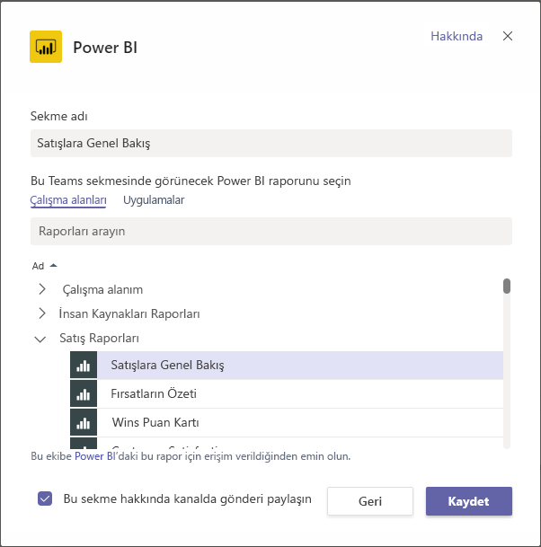

# Power BI sekmesinden Microsoft Teams’e rapor ekleme

Güncelleştirilmiş Microsoft Teams için Power BI sekmesi sayesinde etkileşimli raporları Microsoft Teams kanallarına ve sohbetlerine kolayca ekleyebilirsiniz. Microsoft Teams için Power BI sekmesini kullanarak iş arkadaşlarınızın, ekibinizin kullandığı verileri kullanmasına ve verilerin ekip kanallarınızda tartışılmasına yardımcı olun.  Rapor, pano ve uygulamalarınızın bağlantısını Microsoft Teams ileti kutusuna yapıştırdığınızda, bağlantı önizlemesi bunlar hakkında bilgiler gösterir. Kullanıcılarınız, bağlantının onları hangi öğeye götüreceğini daha kolay bir şekilde anlayabilir.

## Gereksinimler

**Microsoft Teams için Power BI sekmesinin** çalışması şunlara bağlıdır:

- Kullanıcılarınızın bir Power BI Pro lisansına sahip olması veya raporun Power BI lisansına sahip bir [Power BI Premium kapasite (EM veya P SKU)](../admin/service-premium-what-is.md) içinde yer alması.
- Microsoft Teams’te Power BI sekmesinin bulunması.
- Kullanıcıların, raporu kullanmak üzere Power BI lisansını etkinleştirmek için Power BI hizmetinde oturum açmış olması.
- Power BI sekmesi olan Microsoft Teams’e rapor eklemek için, raporu barındıran çalışma alanında en azından Görüntüleyici rolünüz olmalıdır. Farklı roller hakkında bilgi edinmek için [Yeni çalışma alanlarındaki roller](service-new-workspaces.md#roles-in-the-new-workspaces) bölümüne bakın.
- Raporu Microsoft Teams’in Power BI sekmesinde görmek için kullanıcıların rapor görüntüleme izni olmalıdır.

Ayrıca, **bağlantı önizlemelerinin** çalışması şunlara bağlıdır:
- Kullanıcıların, Microsoft Teams için Power BI sekmesini kullanma gereksinimlerini karşılaması.
- Kullanıcıların Power BI hizmetinde oturum açmış olması. 

## Raporunuzu ekleme

Raporunuzu bir Microsoft Teams kanalına veya sohbetine eklemek için bu adımları izleyin.

1. Microsoft Teams’de bir kanalı veya sohbeti açıp **+** simgesini seçin.

    

2. Power BI sekmesini seçin.

    

3. Sunulan seçenekleri kullanarak çalışma alanı veya Power BI uygulaması kaynaklarından bir rapor seçin.

    

4. Sekme adı, rapor adıyla eşleşecek şekilde otomatik olarak güncelleştirilir ancak dilerseniz değiştirebilirsiniz. 

5. **Kaydet**’e basın.

## Power BI sekmesine eklenmesi desteklenen raporlar
Power BI sekmesine şu türdeki raporları ekleyebilirsiniz:

- Etkileşimli ve sayfalandırılmış raporlar.
- Çalışma alanım, yeni çalışma alanı deneyimleri ve klasik çalışma alanları içindeki raporlar.
- Power BI uygulamalarındaki raporlar.

## Bağlantı önizlemesini alma

Power BI hizmetindeki içeriğin bağlantı önizlemesini almak için bu adımları izleyin.

1. Bağlantıyı, Power BI hizmetindeki bir rapor, pano veya uygulamaya kopyalayın. Örneğin, tarayıcınızın adres çubuğundaki bağlantıyı kopyalayın.

2. Bağlantıyı Microsoft Teams ileti kutusuna yapıştırın. İstenirse bağlantı önizleme hizmetinde oturum açın. Bağlantı önizlemesinin yüklenmesi için birkaç saniye beklemeniz gerekebilir.

    

3. Temel bağlantı önizlemesi, başarıyla oturum açıldıktan sonra gösterilir.

    

4. Zengin önizleme kartını göstermek için genişlet simgesini seçin.

    

5. Zengin bağlantı önizlemesi kartı, bağlantıyı ve ilgili eylem düğmelerini gösterir

    

6. İletiyi gönderin.

## Raporlara erişim verme

Bir raporu Microsoft Teams’e eklediğinizde veya bir öğeye bağlantı gönderdiğinizde, kullanıcılara raporu görüntüleme izni otomatik olarak verilmez. [Kullanıcıların raporu Power BI’da görüntülemesine izin vermeniz](service-share-dashboards.md) gerekir. Bu işlemi kolaylaştırmak isterseniz ekibiniz için bir Microsoft 365 Grubu kullanabilirsiniz.

> [!IMPORTANT]
> Power BI hizmetinde, raporu görebilecek olan kullanıcıları belirleyip listede olmayanlara erişim izni vermeyi unutmayın.

Ekibinizdeki herkesin raporlara erişmesini sağlamak için raporları Power BI’da tek bir çalışma alanına yerleştirip ekibinizin Microsoft 365 Grubuna bu çalışma alanına erişim izni verebilirsiniz.

## Bağlantı önizlemeleri 

Bağlantı önizlemeleri, Power BI’daki şu öğeler için sağlanır:
- Raporlar
- Panolar
- Uygulamalar

Bağlantı önizleme hizmeti için kullanıcılarınızın oturum açması gerekir. Oturumu kapatman için ileti kutusunun altındaki Power BI simgesini seçin ve sonra oturumu kapat seçeneğini belirleyin.

## Bir konuşma başlat

Teams’e bir Power BI raporu sekmesi eklediğinizde Teams, rapor için otomatik olarak bir sekme görüşmesi oluşturur. 

- Sağ üst köşedeki **Sekme görüşmesini göster** seçeneğini belirleyin.

    

    İlk açıklama, raporun bir bağlantısıdır. Teams kanalındaki herkes görüşmede raporu görebilir ve rapor hakkında tartışabilir.

    

## Bilinen sorunlar ve sınırlamalar

- Power BI, Microsoft Teams ile aynı yerelleştirilmiş dilleri desteklemez. Bu nedenle, eklenen rapordaki yerelleştirme doğru olmayabilir.
- Power BI panoları, Microsoft Teams için Power BI sekmesine eklenemez.
- Power BI lisansı veya raporu görme izni olmayan kullanıcılar “İçerik kullanılamıyor” iletisiyle karşılaşır.
- Internet Explorer 10 kullanıyorsanız sorunlarla karşılaşabilirsiniz. <!--You can look at the [browsers support for Power BI](../consumer/end-user-browsers.md) and for [Microsoft 365](https://products.office.com/office-system-requirements#Browsers-section). -->
- Microsoft Teams için Power BI sekmesinde [URL filtreleri](service-url-filters.md) desteklenmez.
- Yeni Power BI sekmesi ulusal bulutlarda kullanılamaz. Power BI uygulamalarındaki yeni çalışma alanı deneyimini veya raporları desteklemeyen eski bir sürüm kullanılabilir. 
- Sekmeyi kaydettikten sonra, sekme ayarlarından sekme adı değiştirilemez. Değiştirmek için yeniden adlandırma seçeneğini kullanın.
- Bağlantı önizleme hizmetinde Çoklu Oturum Açma desteklenmez.
- Bağlantı önizlemeleri, toplantı sohbetinde veya özel kanallarda çalışmaz.

## Sonraki adımlar
- [Panoları iş arkadaşlarınızla ve diğer kişilerle paylaşma](service-share-dashboards.md)  
- [Power BI'da uygulama oluşturma ve dağıtma](service-create-distribute-apps.md)  
- [Power BI Premium nedir?](../admin/service-premium-what-is.md)

Başka bir sorunuz mu var? [Power BI Topluluğu'na sorun](https://community.powerbi.com/)
