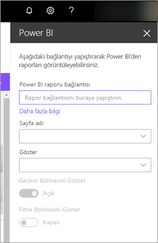

# SharePoint Online’da rapor web bölümü ekleme

Power BI'ın SharePoint Online'a yönelik yeni rapor web bölümü ile etkileşimli Power BI raporlarını SharePoint Online sayfalarına kolayca ekleyebilirsiniz.

Yeni **SharePoint Online'a ekle** seçeneğini kullandığınızda eklenen raporlar [satır düzeyinde güvenlik (RLS)](../admin/service-admin-rls.md) aracılığıyla tüm öğe izinlerini ve veri güvenliğini dikkate alır. Bu sayede güvenli iç portalları daha kolay bir şekilde oluşturabilirsiniz.

## Gereksinimler

**SharePoint Online’a Ekle** raporlarının çalışması için aşağıdakiler gereklidir:

* Bir Power BI Pro lisansı veya bir Power BI lisansı ile [Power BI Premium kapasitesi (EM veya P SKU)](../admin/service-premium-what-is.md).
* SharePoint Online'a yönelik Power BI web bölümü için [Modern Sayfalar](https://support.office.com/article/Allow-or-prevent-creation-of-modern-site-pages-by-end-users-c41d9cc8-c5c0-46b4-8b87-ea66abc6e63b) gereklidir.
* Ekli bir raporu kullanmak için kullanıcıların Power BI hizmetinde oturum açarak Power BI lisanslarını etkinleştirmeleri gerekir.

## Raporunuzu ekleme
Raporunuzu SharePoint Online’a eklemek için rapor URL’sini alıp bunu SharePoint Online’ın Power BI web bölümüyle birlikte kullanın.

### Bir rapor URL’si alma

1. Raporu Power BI’da görüntüleyin.

2. **Diğer seçenekler (...)** açılır menüsünde **Ekle** > **SharePoint Online**’ı seçin.

    

3. İletişim kutusundan rapor URL’sini kopyalayın.

    

### Power BI raporunu bir SharePoint Online sayfasına ekleme

1. SharePoint Online'da hedef sayfayı açıp **Düzenle**'yi seçin.

    

    Veya, yeni bir modern site sayfası oluşturmak için Sharepoint Online’da **+ Yeni**’yi seçin.

    

2. **+** açılan öğeyi seçin ve ardından **Power BI** web bölümünü belirleyin.

    

3. **Rapor ekle**'yi seçin.

      

4. Önceden kopyaladığınız rapor URL’sini **Power BI rapor bağlantısı** bölmesine yapıştırın. Rapor otomatik olarak yüklenir.

    

5. SharePoint Online kullanıcılarınızın bu değişikliği görebilmesi için **Yayımla**'yı seçin.

    

## Raporlara erişim verme

Bir raporu SharePoint Online'a eklediğinizde kullanıcılara raporu görüntüleme izni otomatik olarak verilmez. Görüntüleme izinlerini Power BI’da ayarlamanız gerekir.

> [!IMPORTANT]
> Power BI hizmetinde, raporu görebilecek olan kullanıcıları belirleyip listede olmayanlara erişim izni vermeyi unutmayın.

Power BI’da rapor erişimi sağlamanın iki yöntemi bulunur. İlk yöntem, SharePoint Online ekip sitenizi oluşturmak için bir Microsoft 365 Grubu kullanıyorsanız kullanıcıyı, **Power BI hizmetindeki çalışma alanının** ve **SharePoint sayfasının** bir üyesi olarak eklemedir. Daha fazla bilgi için bkz. [Bir çalışma alanını yönetme](service-manage-app-workspace-in-power-bi-and-office-365.md).

İkinci yöntem de bir uygulamaya rapor ekleyip bunu kullanıcılarla doğrudan paylaşmadır:  

1. Bir Pro kullanıcısı olması gereken yazar, çalışma alanında bir rapor oluşturur. *Power BI ücretsiz kullanıcılarıyla* paylaşım yapabilmek için çalışma alanının *Premium çalışma alanı* olarak ayarlanması gerekir.

2. Yazar uygulamayı yayımlar ve yükler. Uygulamanın SharePoint Online’a eklemek için kullanılan rapor URL’sine erişimi olması için yazarın uygulamayı yüklemesi gerekir.

3. Artık tüm kullanıcılar da uygulamayı yükleyebilir. Uygulamanın son kullanıcılar için önceden yüklenmesini sağlamak için [Power BI yönetici portalından](../admin/service-admin-portal.md) etkinleştirebildiğiniz **Uygulamayı otomatik olarak** yükle özelliğini de kullanabilirsiniz.

   

4. Yazar uygulamayı açar ve rapora gider.

5. Yazar, uygulama tarafından yüklenen raporun ekleme URL'sini kopyalar. Çalışma alanında bulunan özgün rapor URL’sini kullanmayın.

6. SharePoint Online'da yeni bir ekip sitesi oluşturun.

7. Önceden kopyaladığınız rapor URL’sini Power BI web bölümüne ekleyin.

8. Verilerden faydalanacak olan tüm son kullanıcıları ve/veya grupları SharePoint Online sayfasına ve oluşturduğunuz Power BI uygulamasına ekleyin.

    > [!NOTE]
    > **Kullanıcıların veya grupların SharePoint sayfasındaki raporu görebilmeleri için hem SharePoint Online sayfasına hem de Power BI uygulamasındaki rapora erişebiliyor olmaları gerekir.**

Artık son kullanıcılar SharePoint Online'daki ekip sitesine giderek sayfadaki raporları görüntüleyebilir.

## Çok faktörlü kimlik doğrulaması

Power BI ortamınızda oturum açmak için çok faktörlü kimlik doğrulaması kullanmanız gerekiyorsa kimliğinizi doğrulamak için bir güvenlik cihazıyla oturum açmanız istenebilir. Bu durum SharePoint Online oturumunuzu çok faktörlü kimlik doğrulaması kullanmadan açmış olmanız ancak Power BI ortamınızın, bir hesabı doğrulamak için güvenlik cihazı istemesi istemesi durumunda ortaya çıkar.

> [!NOTE]
> Power BI, Azure Active Directory 2.0 ile çok faktörlü kimlik doğrulamasını henüz desteklemiyor. Kullanıcılar bir hata iletisi alır. Kullanıcı, güvenlik cihazını kullanarak SharePoint Online oturumu açması halinde raporu görüntüleyebilir.

## Web bölümü ayarları

SharePoint Online’ın web bölümü için Power BI’da düzenleyebileceğiniz ayarlar aşağıda verilmiştir:

| Özellik | Açıklama |
| --- | --- |
| Sayfa adı |Web bölümünün varsayılan sayfasını ayarlar. Açılan listeden bir değer seçin. Herhangi bir sayfa görüntülenmiyorsa raporunuzda tek sayfa vardır veya yapıştırdığınız URL bir sayfa adı içeriyordur. Belirli bir sayfayı seçmek için URL'deki rapor bölümünü kaldırın. |
| Göster |Raporun SharePoint Online sayfasına nasıl yerleştirileceğini ayarlar. |
| Gezinti Bölmesini Göster |Sayfa gezinti bölmesini gösterir veya gizler. |
| Filtre Bölmesini Göster |Filtre bölmesini gösterir veya gizler. |

## Yüklenmeyen raporlar

Raporunuz Power BI web bölümünde yüklenmiyorsa aşağıdaki iletiyi görebilirsiniz:

Bu iletinin iki olası nedeni vardır.

1. Rapor erişiminiz yok.
2. Rapor silinmiştir.

Sorunu çözmenize yardımcı olması için SharePoint Online sayfasının sahibiyle iletişime geçin.

## Lisanslama

SharePoint’te rapor görüntüleyen kullanıcıların bir **Power BI Pro lisansına** sahip olması veya içeriğin bir **[Power BI Premium kapasitesinde (EM veya P SKU)](../admin/service-admin-premium-purchase.md)** bulunması gerekir.

## Bilinen sorunlar ve sınırlamalar

* Hata: "Hata oluştu, lütfen oturumu kapatıp yeniden açmayı ve bu sayfayı yeniden ziyaret etmeyi deneyin. Bağıntı Kimliği: undefined, http yanıt durumu: 400, sunucu hata kodu 10001, ileti: Yenileme belirteci eksik"
  
  Bu hatayı almaya devam ederseniz aşağıdaki sorun giderme adımlarından birini deneyin.
  
  1. SharePoint oturumunuzu kapatıp tekrar açın. Tekrar oturum açmadan önce tüm tarayıcı pencerelerini kapattığınızdan emin olun.

  2. Kullanıcı hesabınız için çok faktörlü kimlik doğrulaması (MFA) kullanmanız gerekiyorsa, SharePoint oturumunuzu MFA cihazınızı (telefon uygulaması, akıllı kart vb.) kullanarak açtığınızdan emin olun.
  
  3. Azure B2B Konuk kullanıcı hesapları desteklenmez. Kullanıcılar bölümün yüklendiğini gösteren Power BI logosunu görür, ancak rapor gösterilmez.

* Power BI, SharePoint Online ile aynı yerelleştirilmiş dilleri desteklemez. Bu nedenle, eklenen rapordaki yerelleştirme doğru olmayabilir.

* Internet Explorer 10 kullanıyorsanız sorunlarla karşılaşabilirsiniz. <!--You can look at the [browsers support for Power BI](../consumer/end-user-browsers.md) and for [Microsoft 365](https://products.office.com/office-system-requirements#Browsers-section). -->

* Power BI web bölümü [ulusal bulutlar](https://powerbi.microsoft.com/clouds/) için kullanılamaz.

* Klasik SharePoint Sunucusu bu web bölümü ile desteklenmez.

* [URL filtreleri](service-url-filters.md), SPO web bölümü ile desteklenmez.

## Sonraki adımlar

* [Son kullanıcıların modern site oluşturmasına izin verme veya bunu engelleme](https://support.office.com/article/Allow-or-prevent-creation-of-modern-site-pages-by-end-users-c41d9cc8-c5c0-46b4-8b87-ea66abc6e63b)  
* [Power BI'da uygulama oluşturma ve dağıtma](service-create-distribute-apps.md)  
* [Panoları iş arkadaşlarınızla ve diğer kişilerle paylaşma](service-share-dashboards.md)  
* [Power BI Premium nedir?](../admin/service-premium-what-is.md)
* [Raporu güvenli bir portala veya web sitesine ekleme](service-embed-secure.md)

Başka bir sorunuz mu var? [Power BI Topluluğu'na sorun](https://community.powerbi.com/)
