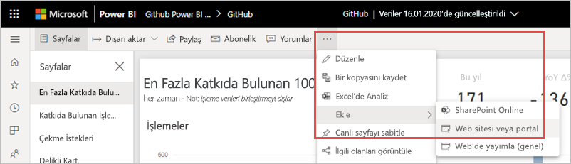
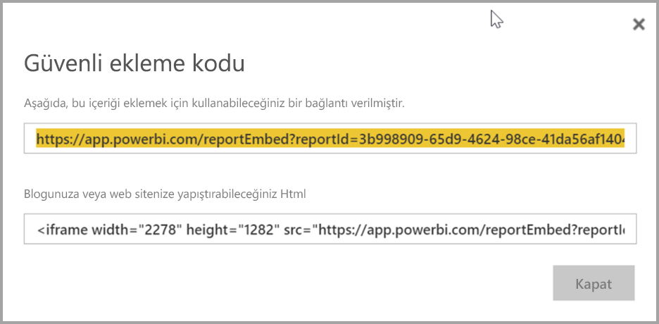
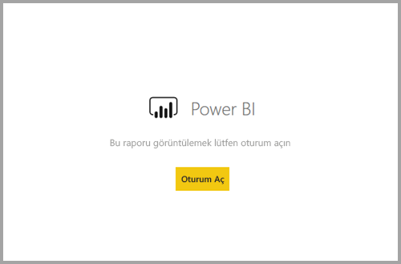
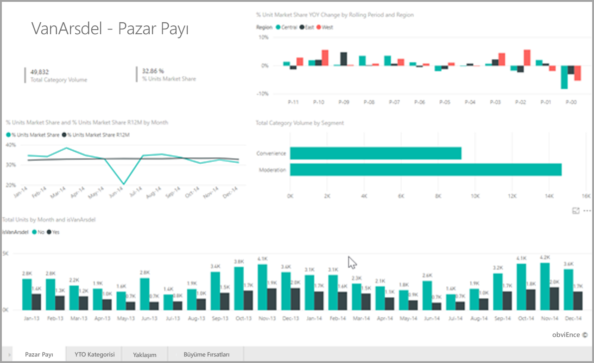
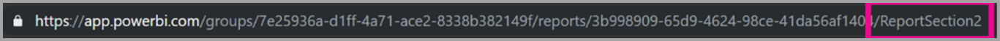

# <a name="embed-a-report-in-a-secure-portal-or-website"></a>Raporu güvenli bir portala veya web sitesine ekleme

Power BI raporları için güvenli **Ekleme** özelliğiyle, raporları dahili web portallarına kolayca ve güvenli bir şekilde ekleyebilirsiniz. Bu portallar **bulut tabanlı** olabilir veya **şirket içinde barındırılabilir** (SharePoint 2019 gibi). Eklenen raporlarda [satır düzeyi güvenlik (RLS)](../admin/service-admin-rls.md) aracılığıyla tüm öğe izinlerine ve veri güvenliğine uyulur. Bunlar, URL veya iFrame kabul eden bir portala kodsuz ekleme sağlar. 

**Ekle** seçeneği [URL filtrelerini](service-url-filters.md) ve URL ayarlarını da destekler. Bu seçenek, portalları yalnızca temel HTML ve JavaScript bilgisi gerektiren düşük kodlu bir yaklaşım kullanarak tümleştirmenize olanak tanır.

## <a name="how-to-embed-power-bi-reports-into-portals"></a>Power BI raporlarını portallara ekleme

1. Power BI hizmetinde bir raporu açın.

2. **Diğer seçenekler (...)** menüsünde **Ekle** >  **Web sitesi veya portal**’ı seçin.

    

2. Raporu güvenle eklemek için kullanabileceğiniz bir bağlantı ve iFrame sağlayan iletişim kutusunu açmak için **Ekle** seçeneğini belirtin.

    

3. Kullanıcının doğrudan bir rapor URL’sini veya web portalında gömülü bir raporu açmasına bakılmaksızın, rapor erişimi kimlik doğrulaması gerektirir. Kullanıcı, tarayıcı oturumunda Power BI’da oturum açmadıysa aşağıdaki ekran görüntülenir. **Oturum Aç**’ı seçtiklerinde yeni bir tarayıcı penceresi veya sekmesi açılabilir. Oturum açmaları istenmezse açılır pencere engelleyicileri denetlemelerini sağlayın.

    

4. Kullanıcı oturum açtıktan sonra, verileri gösteren ve sayfa gezintisine ve filtre ayarlarına olanak tanıyan rapor açılır. Yalnızca görüntüleme izni olan kullanıcılar raporu Power BI’da görebilir. Tüm [satır düzeyi güvenlik (RLS)](../admin/service-admin-rls.md) kuralları da uygulanır. Son olarak, kullanıcının doğru bir biçimde lisanslanmış olması gerekir. Power BI Pro lisansı gereklidir veya rapor bir Power BI Premium kapasitesinde yer alan bir çalışma alanında olmalıdır. Kullanıcı, her yeni tarayıcı penceresini açtığında oturum açmalıdır. Ancak, oturum açıldığında diğer raporlar otomatik olarak yüklenir.

    

5. iFrame kullanırken, portalınızın web sayfasına sığması için **yükseklik** ve **genişliği** düzenlemeniz gerekebilir.

    

## <a name="granting-report-access"></a>Rapor erişimi verme

**Ekle** seçeneği, kullanıcılara raporu görüntüleme iznini otomatik olarak vermez. Görüntüleme izinleri Power BI hizmetinde ayarlanır.

Power BI hizmetinde, ekli raporları erişim gerektiren kullanıcılarla paylaşabilirsiniz. Microsoft 365 Grubu kullanıyorsanız, kullanıcıyı çalışma alanı üyesi olarak listeleyebilirsiniz. Daha fazla bilgi için bkz. [Power BI ve Microsoft 365'te çalışma alanınızı yönetme](service-manage-app-workspace-in-power-bi-and-office-365.md).

## <a name="licensing"></a>Lisanslama

Kullanıcıların, eklenen raporu görüntülemek için Power BI Pro lisansına sahip olması veya içeriğin bir [Power BI Premium kapasitesinde (EM veya P SKU)](../admin/service-admin-premium-purchase.md) bulunması gerekir.

## <a name="customize-your-embed-experience-using-url-settings"></a>URL ayarlarını kullanarak ekleme deneyiminizi özelleştirme

Ekleme URL’sinin giriş ayarlarını kullanarak kullanıcı deneyimini özelleştirebilirsiniz. Sağlanan iFrame’de URL’nin **src** ayarlarını güncelleştirebilirsiniz.

| Özellik  | Açıklama  |
|-----------|--------------|
| pageName  | **pageName** sorgu dizesi parametresini, hangi rapor sayfasının açılacağını ayarlamak için kullanabilirsiniz. Aşağıda gösterildiği gibi, bu değeri bir raporu Power BI hizmetinde görüntülerken rapor URL’sinin son kısmında bulabilirsiniz. |
| URL Filtreleri  | Eklenen içeriği filtrelemek için Power BI kullanıcı arabirimden aldığınız ekleme URL'sinde [URL Filtreleri](service-url-filters.md) kullanabilirsiniz. Bu şekilde, yalnızca temel düzeyde bir HTML ve JavaScript deneyimiyle alt düzey kod tümleştirmeleri oluşturabilirsiniz.  |

## <a name="set-which-page-opens-for-an-embedded-report"></a>Katıştırılmış bir rapor için hangi sayfanın açılacağını belirleyin 

**pageName** değerini bir raporu Power BI hizmetinde görüntülerken rapor URL’sinin son kısmında bulabilirsiniz.

1. Raporu web tarayıcınızda Power BI hizmetinde açın ve adres çubuğundan adres çubuğu URL’sini kopyalayın.

    

2. **pageName** ayarını URL'nin sonuna ekleyin.

    

## <a name="filter-report-content-using-url-filters"></a>URL filtrelerini kullanarak rapor içeriğini filtreleme 

Farklı rapor görünümleri sağlamak için [URL Filtrelerini](service-url-filters.md) kullanabilirsiniz. Örneğin aşağıdaki URL, Enerji sektörüne ilişkin verileri gösterecek şekilde raporu filtreler.

**pageName** ile [URL Filtreleri](service-url-filters.md)'nin birlikte kullanılması güçlü bir sonuç verebilir. Temel HTML ve JavaScript kullanarak deneyimler oluşturabilirsiniz.

Örneğin, HTML sayfasına ekleyebileceğiniz bir düğme aşağıda verilmiştir:

```html
<button class="textLarge" onclick='show("ReportSection", "Energy");' style="display: inline-block;">Show Energy</button>
```

Düğme seçildiğinde, iFrame'i Enerji sektörü filtresini içeren güncelleştirilmiş bir URL ile güncelleştirmesi için bir işlev çağrılır.

```javascript
function show(pageName, filterValue)

{

var newUrl = baseUrl + "&pageName=" + pageName;

if(null != filterValue && "" != filterValue)

{

newUrl += "&$filter=Industries/Industry eq '" + filterValue + "'";

}

//Assumes there's an iFrame on the page with id="iFrame"

var report = document.getElementById("iFrame")

report.src = newUrl;

}
```


Alt düzey kodlu özel bir deneyim oluşturmak için istediğiniz kadar çok düğme ekleyebilirsiniz. 

## <a name="considerations-and-limitations"></a>Önemli noktalar ve sınırlamalar

* Sayfalandırılmış raporlar güvenli ekleme senaryolarında desteklenir ve URL parametrelerine sahip sayfalandırılmış raporlar da desteklenir. [Sayfalandırılmış rapor için bir URL’deki rapor parametrelerini geçirme](../paginated-reports/report-builder-url-pass-parameters.md) hakkında daha fazla bilgi edinin.

* Güvenli ekleme özelliği Power BI hizmetinde yayımlanmış olan raporlarda çalışır.

* Kullanıcı her yeni tarayıcı penceresini açtığında raporu görüntülemek için oturum açmalıdır.

* Bazı tarayıcılarda, özellikle de InPrivate veya Incognito modları kullanıldığında oturum açtıktan sonra sayfayı yenilemeniz gerekir.

* Desteklenmeyen tarayıcı sürümleri kullanılıyorsa sorunlarla karşılaşabilirsiniz. Power BI [aşağıdaki tarayıcı listesini](../fundamentals/power-bi-browsers.md) destekler.

* Klasik SharePoint Server desteklenmez çünkü Internet Explorer’ın 11’den önceki sürümlerini veya uyumluluk görünümü modunun etkinleştirilmesini gerektirir.

* Çoklu oturum açma deneyiminden yararlanabilmek için, [SharePoint Online'da Ekle seçeneğini](service-embed-report-spo.md) kullanın veya [verilerin kullanıcıya ait olması](../developer/embedded/embed-sample-for-your-organization.md) ekleme yöntemini kullanarak özel tümleştirme oluşturun. 

* **Ekle** seçeneğiyle birlikte sağlanan otomatik kimlik doğrulama özelliği Power BI JavaScript API’si ile çalışmaz. Power BI JavaScript API'sinde, ekleme için [verilerin kullanıcıya ait olması](../developer/embedded/embed-sample-for-your-organization.md) ekleme yöntemini kullanın. 

* Kimlik doğrulaması belirtecinin ömrü AAD ayarlarınıza göre denetlenir. Kimlik doğrulama belirtecinin süresi dolduğunda, güncelleştirilmiş bir kimlik doğrulaması belirteci almak için kullanıcının tarayıcıyı yenilemesi gerekir. Varsayılan yaşam süresi bir saat olsa da bu süre kuruluşunuzda daha kısa veya daha uzun olabilir.  Bu senaryoda, belirteci otomatik olarak yenileme özelliği yoktur.

## <a name="next-steps"></a>Sonraki adımlar

* [Power BI'da çalışmanızı paylaşmanın yolları](service-how-to-collaborate-distribute-dashboards-reports.md)

* [URL'de sorgu dizesi parametreleri kullanarak bir raporu filtreleme](service-url-filters.md)

* [SharePoint Online'da rapor web bölümüyle ekleme](service-embed-report-spo.md)

* [Power BI'dan Web'de yayımlama](service-publish-to-web.md)
