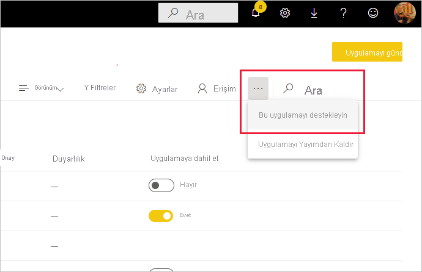

# İçeriğinizi onaylama

Power BI değerli, yüksek kaliteli içeriklerinizin görünürlüğünü artırmak üzere onları onaylamak için kullanabileceğiniz iki yol sağlar: **yükseltme** ve **onaylama** .

* **Yükseltme** : Yükseltme, değerli olduğunu ve başkalarının da kullanabileceğini düşündüğünüz içerikleri vurgulamanın bir yoludur. İçeriklerin kuruluş içinde işbirliğine dayalı bir şekilde kullanılmasını ve yayılmasını teşvik eder.

    Tüm içerik sahipleri ve içeriğin bulunduğu çalışma alanı üzerinde yazma izinleri olan tüm üyeler, paylaşım için yeterince iyi olduğunu düşündükleri içerikleri yükseltebilir.

* **Onaylama** : Onaylama içeriğin kuruluş kalite standartlarını karşıladığı ve kuruluş genelinde kullanılmaya hazır, güvenilir ve yetkilendirilmiş olarak kabul edilebileceği anlamına gelir.

    İçerikleri yalnızca yetkili gözden geçirenler onaylayabilir. İçeriklerinin onaylanmasını isteyen ancak bunu kendileri yapamayan içerik sahiplerinin gerekli onay işlemleri için kuruluşa özgü yönergeleri izlemesi gerekir.

Şu anda aşağıdakiler için onaylama işlemi yapılabilir
* Veri kümeleri
* Veri akışları (önizleme)
* Raporlar (önizleme)
* Uygulamalar (önizleme)

Bu makalede yetkili gözden geçirenler için [içerik yükseltme](#promote-content) ve [içerik onaylama](#certify-content), diğer kullanıcılar için ise [onay isteme](#request-content-certification) adımları anlatılmaktadır.

Onay hakkında daha fazla bilgi edinmek için bkz. [Onay: Power BI içeriklerini yükseltme ve onaylama](service-endorsement-overview.md).

## İçeriği yükseltme

İçeriği yükseltmek için yükseltmek istediğiniz içeriğin bulunduğu çalışma alanında yazma izinleriniz olmalıdır.

>[!NOTE]
>Aşağıda veri kümeleriyle ilgili örnek onay iletişim kutusu gösterilmiştir. Diğer içerik türleriyle ilgili iletişim kutuları da neredeyse aynıdır ve aynı radyo düğmesi seçeneklerine sahiptir. 

1. Yükseltmek istediğiniz içeriğin [Ayarlar](#how-to-get-to-content-settings) sayfasına gidin.

1. Onay bölümünü genişletin ve **Yükseltildi** öğesini seçin. Bir veri kümesini yükseltiyorsanız veri kümesiyle ilgili kısa bir açıklama yazın.

    

1. **Apply** (Uygula) seçeneğini belirleyin.

## İçeriği onaylama

İçerikleri onaylamak büyük bir sorumluluktur ve yalnızca yetkili kullanıcılar tarafından yapılabilir. Diğer kullanıcılar [içerik onayı isteğinde bulunabilir](#request-content-certification). Bu bölümde içerik onaylama adımları anlatılmaktadır.

>[!NOTE]
>Aşağıda veri kümeleriyle ilgili örnek onay iletişim kutusu gösterilmiştir. Diğer içerik türleriyle ilgili iletişim kutuları da neredeyse aynıdır ve aynı radyo düğmesi seçeneklerine sahiptir. 

1. Onaylamak istediğiniz içeriğin bulunduğu çalışma alanı üzerinde yazma izinleri alın. Bu izinleri içerik sahibinden veya çalışma alanında yönetici izinlerine sahip bir kullanıcıdan isteyebilirsiniz.

1. İçeriği dikkatli bir şekilde inceleyin ve kuruluşunuzun onaylama standartlarına uygun olup olmadığını belirleyin.

1. İçeriği onaylamaya karar verirseniz bulunduğu çalışma alanına gidin ve ardından onaylamak istediğiniz içeriğin [Ayarlar](#how-to-get-to-content-settings) sayfasını açın.

1. Onay bölümünü genişletin ve **Onaylandı** 'yı seçin. 

    

1. **Apply** (Uygula) seçeneğini belirleyin.

## İçerik onayı isteğinde bulunma

İçeriğinizi onaylamak istiyorsanız ancak bunun için yetkiniz yoksa aşağıdaki adımları izleyin.

>[!NOTE]
>Aşağıda veri kümeleriyle ilgili örnek onay iletişim kutusu gösterilmiştir. Diğer içerik türleriyle ilgili iletişim kutuları da neredeyse aynıdır ve aynı radyo düğmesi seçeneklerine sahiptir. 

1. Onaylanmasını istediğiniz içeriğin bulunduğu çalışma alanına gidip içeriğin [Ayarlar](#how-to-get-to-content-settings) sayfasını açın.

1. Onay bölümünü genişletin. İçeriği onaylama yetkiniz olmadığından **Onaylandı** düğmesi gri renkte olacaktır. İçeriğinizi onaylatma hakkında bilgi almak için ilgili bağlantıya tıklayın.

    
    
    >[!NOTE]
    >Yukarıdaki bağlantıya tıkladığınızda bu not açıldıysa Power BI yöneticiniz herhangi bir bilgi sağlamamış demektir. Bu durumda doğrudan Power BI yöneticisiyle iletişime geçin.

## İçerik ayarlarına ulaşma

Onay iletişim kutusuna ulaşmak için onaylamak istediğiniz içeriğin ayarlarına girmeniz gerekir. Aşağıda her bir içerik türünde Ayarlar sayfasına erişmek için yapmanız gerekenler listelenmiştir.

* **Veri kümeleri** : Liste görünümünde onaylamak istediğiniz veri kümesinin üzerine gelin, **Diğer seçenekler (...)** öğesine tıklayın ve açılan menüden **Ayarlar** 'ı seçin.
* **Veri akışları** (önizleme): Liste görünümünde onaylamak istediğiniz veri akışının üzerine gelin, **Diğer seçenekler (...)** öğesine tıklayın ve açılan menüden **Ayarlar** 'ı seçin.

* **Raporlar** (önizleme): Liste görünümünde onaylamak istediğiniz raporun üzerine gelin, **Diğer seçenekler (...)** öğesine tıklayın ve açılan menüden **Ayarlar** 'ı seçin. Alternatif olarak rapor açıkken **Dosya > Ayarlar** 'ı seçebilirsiniz.

* **Uygulamalar** (önizleme): Uygulama çalışma alanına gidin, menü çubuğundan **Diğer seçenekler (...)** öğesine tıklayıp **Bu uygulamayı onayla** 'yı seçin.

    

## Sonraki adımlar

* [İçerik onayı hakkında daha fazla bilgi edinin](service-endorsement-overview.md)
* [İçerik onayını etkinleştirme](../admin/service-admin-setup-certification.md) (Power BI yöneticileri)
* Sorularınız mı var? [Power BI Topluluğu'na sorun](https://community.powerbi.com/)
