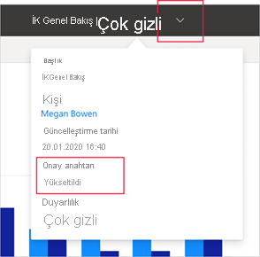

# Onay - Power BI içeriklerini yükseltme ve onaylama

## Onaya genel bakış

Kuruluşlarda genellikle Power BI kullanıcılarının paylaşmasına ve yeniden kullanmasına yönelik çok fazla içerik bulunur. Güvenilir ve yetkili kişilerin onayladığı içerikleri bulmak zor olabilir. Onay, kullanıcıların ihtiyaç duyduğu yüksek kaliteli içeriğe daha kolay erişmelerini sağlar. Onaylanan içerikler etiketleri sayesinde hem Power BI'da hem de kullanıcıların Power BI içeriği aradığı ortamlarda (Excel gibi) kolayca ayırt edilebilir. Ayrıca bu içeriklere aramalarda öncelik verilir ve bazı listelerde arama ölçütü olarak kullanılabilir.

İki tür onay vardır: **yükseltme** ve **onaylama** .

* **Yükseltme** : Yükseltme, kullanıcıların değerli olduğunu ve başkalarının da kullanabileceğini düşündüğü içerikleri vurgulamasına olanak tanır. İçeriklerin kuruluş içinde işbirliğine dayalı bir şekilde yayılmasını teşvik eder.

    Tüm içerik sahipleri veya içeriğin bulunduğu çalışma alanı üzerinde yazma izinleri olan tüm üyeler, paylaşım için yeterince iyi olduğunu düşündükleri içerikleri kolayca yükseltebilir.

* **Onaylama** : Onaylama içeriğin kuruluş kalite standartlarını karşıladığı ve kuruluş genelinde kullanılmaya hazır, güvenilir ve yetkilendirilmiş olarak kabul edilebileceği anlamına gelir.

    İçerikleri yalnızca Power BI yöneticisi tarafından seçilen bir grup gözden geçiren onaylayabilir. İçeriklerinin onaylanmasını isteyen ancak bunu kendileri yapamayan içerik sahiplerinin gerekli onay işlemleri için kuruluşa özgü yönergeleri izlemesi gerekir.

    **Onaylama seçeneğini kullanabilmeniz için Power BI yöneticinizin bunu kuruluşunuz için etkinleştirmiş ve yapılandırmış olması gerekir** .

Aşağıdaki görüntüde rapor oluşturmak için kullanacağınız bir veri kümesini ararken onaylı içeriğin (yükseltilmiş ve onaylanmış) nasıl belirtildiği gösterilmiştir.

## Onaylanabilecek içerik türleri
Power BI şu an için aşağıdaki içeriklere yönelik onay desteği sunmaktadır:
* Veri kümeleri
* Veri akışları (önizleme)
* Raporlar (önizleme)
* Uygulamalar (önizleme)

## Onaylanmış içeriği tanımlama

Onaylanmış içerikler hem Power BI'da hem de Power BI içeriğinin bulunabileceği Excel gibi ortamlarda yer alan listelerde, kartlarda ve diğer yerlerde rozetler ve simgelerle etiketlenir. Onaylı içerikler aşağıdaki rozetler ve simgelerle gösterilir.

|Rozet|Simge|
|---------|---------|
|||
|||
|||

Ayrıca açık raporların veya uygulamaların onay durumunu üst bilgiden görebilirsiniz.
* Onay durumu hem üst bilgide hem de onayı veren kullanıcıyı görebileceğiniz üst bilgi açılan menüsünde gösterilir.

    

* Yükseltme durumu yalnızca üst bilgi açılan menüsünde gösterilir.
 
    

## Bir uygulamayı veya raporu onaylama kararını verme

Onaylama seçeneğini kullanıcıların bulmasını, kullanmasını ve gerekirse yeniden paylaşmasını istediğiniz içerik öğeleri (uygulamalar, raporlar, veri kümeleri ve veri akışları) için kullanmanız gerekir.

Power BI'da geniş bir hedef kitleyle paylaşmak istediğiniz verileri bir uygulama aracılığıyla paylaşmanız önerilir. Bu en iyi deneyimi uygularsanız kullanıcılar ilgili uygulamayı kolayca bulabilir. Bu gibi durumlarda uygulamayı onaylamanız gerekir. 

Raporları doğrudan paylaşmayı tercih ederseniz raporun kendisini onaylamanız gerekecektir. 

Rapor veya uygulama paylaşırken temel alınan veri kümelerinin temiz ve paylaşılmaya hazır olması durumunda ilgili veri kümelerini onaylamak da iyi bir fikirdir. Aynı şey veri akışları için de geçerlidir.  

## Sonraki adımlar

* [Power BI içeriklerini yükseltme veya onaylama](service-endorse-content.md)
* [Kuruluşunuz için onayı etkinleştirme](../admin/service-admin-setup-certification.md) (Power BI yöneticileri)
* Sorularınız mı var? [Power BI Topluluğu'na sorun](https://community.powerbi.com/)