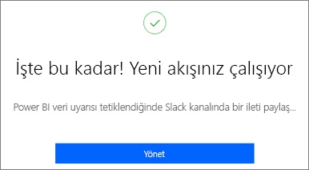
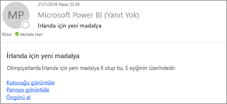
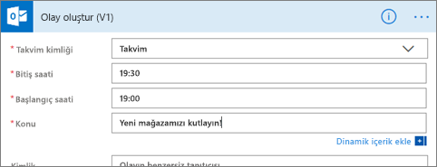
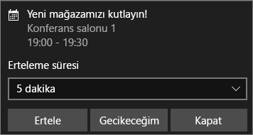

# Veri uyarılarını Power Automate ile tümleştirme

[Power Automate](/power-automate/getting-started)'i kullanarak Power BI'ı sık kullandığınız uygulamalar ve hizmetlerle tümleştirebilirsiniz. Power Automate ile bildirimleri almak, dosyaları eşitlemek, veri toplamak ve daha fazlası için otomatik iş akışları oluşturabilirsiniz. Bu makalede Power BI veri uyarısından otomatik olarak bir e-posta oluşturma adımları anlatılmıştır.

## Ön koşullar
Bu makalede biri şablondan, diğeri sıfırdan olmak üzere iki farklı akışı oluşturma adımları gösterilmektedir. Eğitimi takip edebilmek için, [Power BI'da bir veri uyarısı oluşturun](../create-reports/service-set-data-alerts.md) ve [Power Automate'e kaydolun](https://flow.microsoft.com/#home-signup). Ücretsizdir!

## Şablondan akış oluşturma
Bu görevde bir Power BI veri uyarısı (bildirim) tarafından tetiklenen basit bir akış oluşturmak için şablon kullanıyoruz.

1. Power Automate’te oturum açın (flow.microsoft.com).
2. **Şablonlar**'ı seçin, **Power BI** > **Power BI veri uyarısı tetiklendiğinde hedef kitleye bir e-posta gönder** girişini bulun.
   
    :::image type="content" source="media/service-flow-integration/power-automate-templates.png" alt-text="Power Automate'teki Power BI veri uyarısı tetiklendiğinde hedef kitleye bir e-posta gönder şablonunun ekran görüntüsü.":::

### Akışı oluşturma
Bu şablonda bir tetikleyici (Power BI veri uyarısı) ve bir eylem (e-posta gönderme) vardır. Bir alan seçtiğinizde Power Automate ekleyebileceğiniz dinamik içerikleri görüntüler.  Bu örnekte, kutucuk değerini ve kutucuk URL'sini ileti gövdesine ekledik.

1. **Devam**’ı seçin.

    :::image type="content" source="media/service-flow-integration/power-automate-power-bi-mail.png" alt-text="Power Automate, Power BI'dan e-posta seçeneğinin ekran görüntüsü.":::

1. **Uyarı kimliği** kutusunda bir Power BI veri uyarısı seçin. Uyarı oluşturma hakkında bilgi edinmek için bkz. [Power BI'daki veri uyarıları](../create-reports/service-set-data-alerts.md).
   
    :::image type="content" source="media/service-flow-integration/power-automate-select-alert-id.png" alt-text="Uyarı kimliği kutusundaki Bir uyarı seçin öğesinin ekran görüntüsü.":::
2. Bir veya daha fazla geçerli e-posta adresi girin.

3. Power Automate, **Konu** ve **Gövde** alanlarını otomatik olarak oluşturur. Bu değerleri kullanabilir veya değiştirebilirsiniz. Gövde metninde biçimlendirme için HTML kullanılır.

    :::image type="content" source="media/service-flow-integration/power-automate-autogenerated-email.png" alt-text="Power Automate tarafından otomatik olarak oluşturulan e-posta metninin ekran görüntüsü.":::

1. İletiyi oluşturmayı tamamladığınızda **Sonraki adım**'ı veya **Kaydet**'i seçin.  Akış oluşturulur ve değerlendirilir.  Power Automate herhangi bir hata bulması durumunda sizi bilgilendirir.
2. Hata bulunması halinde bunları düzeltmek için **Akışı düzenle**'yi, aksi halde, yeni akışı çalıştırmak için **Bitti**'yi seçin.
   
   
5. Veri uyarısı tetiklendiğinde Power Automate belirttiğiniz adreslere bir e-posta gönderir.  
   
   

## Sıfırdan akış oluşturma
Bu görevde, bir Power BI veri uyarısı (bildirim) ile tetiklenen basit bir akışı sıfırdan oluşturuyoruz.

1. Power Automate’te oturum açın (flow.microsoft.com).
2. **Oluştur** > **Otomatik akış**'ı seçin.

    :::image type="content" source="media/service-flow-integration/power-automate-create-automated-flow.png" alt-text="Power Automate > Oluştur > Otomatik akış seçiminin ekran görüntüsü.":::   
3. **Otomatik akış oluştur** ekranında akışınıza bir ad verin.
1. **Akışınızın tetikleyicisini seçin** alanında **Power BI** araması yapın.
1. **Power BI - Veri temelli uyarı tetiklendiğinde** > **Oluştur**'u seçin.

    :::image type="content" source="media/service-flow-integration/power-automate-build-automated-flow.png" alt-text="Otomatik akış oluştur adımının ekran görüntüsü.":::

### Akışınızı oluşturma
1. **Uyarı kimliği** kutusunda uyarınızın adını seçin. Uyarı oluşturma hakkında bilgi edinmek için bkz. [Power BI'daki veri uyarıları](../create-reports/service-set-data-alerts.md).

    :::image type="content" source="media/service-flow-integration/power-automate-select-alert-id-scratch.png" alt-text="Uyarının adını seçme adımının ekran görüntüsü.":::   

2. **Yeni adım**'ı seçin.
   
3. **Bir eylem seçin** alanında **Outlook** > **Etkinlik oluştur**'u bulun.

    :::image type="content" source="media/service-flow-integration/power-automate-choose-action-create-event.png" alt-text="Bir eylem seçin > Etkinlik oluştur seçiminin ekran görüntüsü.":::   
4. Etkinlik alanlarını doldurun. Bir alan seçtiğinizde Power Automate ekleyebileceğiniz dinamik içerikleri görüntüler.
   
   
5. Gerekli alanları doldurduktan sonra, **Akış oluştur**'u seçin.  Power Automate akışı kaydeder ve değerlendirir. Herhangi bir hatayla karşılaşılmazsa **Bitti**'yi seçerek bu akışı çalıştırın.  Yeni akış **Akışlarım** sayfanıza eklenir.
   
   
6. Akış Power BI veri uyarınız ile tetiklendiğinde aşağıdakine benzer bir Outlook etkinlik bildirimi alırsınız.
   
    

## Sonraki adımlar
* [Power Automate kullanmaya başlama](/power-automate/getting-started/)
* [Power BI hizmetinde veri uyarısı oluşturma](../create-reports/service-set-data-alerts.md)
* [iPhone'unuzda veri uyarısı oluşturma](../consumer/mobile/mobile-set-data-alerts-in-the-mobile-apps.md)
* Başka bir sorunuz mu var? [Power BI Topluluğu'na başvurun](https://community.powerbi.com/)
