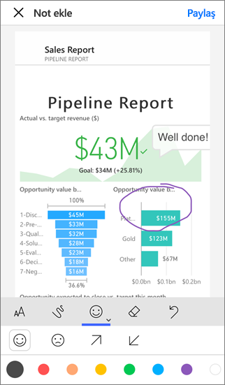

# Power BI’da işbirliği yapma ve paylaşma yöntemleri

Panolar ve raporlar oluşturdunuz. Bu pano ve raporlar üzerinde iş arkadaşlarınızla işbirliği yapmak istiyor olabilirsiniz. Belki de daha geniş bir kitleye dağıtmaya hazırsınızdır. Panolar ve raporlar üzerinde işbirliği yapmanın ve bunları paylaşmanın en iyi yolu nedir? Bu makalede, seçeneklerinizi karşılaştıracağız.

*Power BI hizmetindeki uygulamalar*

**İşbirliği yapma**

- Anlamlı raporlar ve panolar oluşturmak üzere iş arkadaşlarınızla *çalışma alanlarında* işbirliği yapma.
- *Microsoft Teams* ’de işbirliği yapma.

**Panoları ve raporları dağıtma veya paylaşma**

- Çalışma Alanım bölümünüzden veya başka bir çalışma alanından *panoları ve raporları paylaşma*.
- Power BI *mobil uygulamalarından* not ekleme ve paylaşma.
- Çalışma alanlarındaki panoları ve raporları *uygulamalarda* gruplandırma ve bunları daha büyük bir grupta ya da kuruluş genelinde dağıtma.
- Raporları *güvenli portallara* veya *genel web sitelerine* ekleme.
- Raporları yazdırma.
- Microsoft AppSource üzerinden dış Power BI kullanıcılarına dağıtabileceğiniz bir *şablon uygulaması* oluşturma.
 
**Veri paylaşımı**

- İş arkadaşlarının kendi çalışma alanlarında kendi raporları için temel olarak kullanabilecekleri *paylaşılan veri kümeleri* oluşturma.
- Ortak veri kaynağı paylaşma yöntemi olarak *veri akışları* oluşturma.

Hangisini seçerseniz seçin içeriğinizi paylaşmak için [Power BI Pro lisansınız](../fundamentals/service-features-license-type.md) olmalı veya içerik [Premium kapasitede](../admin/service-premium-what-is.md) yer almalıdır. Lisans gereksinimleri, seçiminize bağlı olarak içeriğinizi görüntüleyen iş arkadaşlarınıza göre farklılık gösterir. Aşağıda ayrıntılara yer verilmiştir. 

## Çalışma alanında işbirliği yapma

Birlikte çalışan ekiplerin kolayca işbirliği yapabilmesi için aynı belgelere erişmesi gerekir. Power BI çalışma alanlarında ekipler panolarının, raporlarının, veri kümelerinin ve çalışma kitaplarının hem sahipliğini hem de yönetimini paylaşır. Bazen Power BI kullanıcıları çalışma alanlarını kurumsal yapılara göre düzenler veya belirli projeler için çalışma alanı oluşturur. Diğer bazı kuruluşlar da, kullandıkları raporların veya panoların farklı sürümlerini depolamak üzere çeşitli çalışma alanları kullanır. 

Çalışma alanları, iş arkadaşlarınızın sahip olacağı izinleri belirleyen roller sağlar. Çalışma alanını düzenleyebilecek, içeriği düzenleyip dağıtabilecek veya yalnızca görüntüleyebilecek kişileri belirlemek için bu rolleri kullanın. [Yeni çalışma alanlarındaki roller](service-new-workspaces.md#roles-in-the-new-workspaces) hakkında daha fazla bilgi edinin.

İçerik üzerinde ortak sahipliğe olanak sağladığından, çalışma alanları işbirliği açısından Çalışma Alanım’dan daha iyidir. Siz ve tüm ekibiniz kolayca güncelleştirmeler yapabilir ve diğer kişilere erişim verebilir. Çalışma Alanım en iyi şekilde tek tek kişiler tarafından özel veya kişisel içerik için kullanılır.

Şimdi diğer iş arkadaşlarınızla paylaşmanız gereken tamamlanmış bir panonuzun olduğunu düşünün. Onlara panoya erişim vermenin en iyi yolu hangisidir? Yanıt, bir dizi faktöre bağlıdır. 

- İş arkadaşlarının panoyu güncel tutması veya çalışma alanındaki tüm içeriğe erişmesi gerekiyorsa bu kişileri Üyeler veya Katkıda Bulunanlar olarak çalışma alanına ekleyin. 
- Çalışma arkadaşlarınızın yalnızca çalışma alanındaki içeriği görüntülemesi gerekiyorsa onları Görüntüleyiciler olarak ekleyin.
- Çalışma arkadaşlarının o panoyu görmesi ama çalışma alanındaki tüm içeriği görmemesi gerekiyorsa onlarla doğrudan panoyu paylaşabilirsiniz.
- Pano birçok iş arkadaşınıza dağıtmanız gereken pano ve rapor kümesinin bir parçasıysa bu durumda en iyi seçenek bir *uygulama* yayımlamak olabilir.

[Yeni çalışma alanları oluşturma](service-create-the-new-workspaces.md) hakkında bilgi edinin. 

## Microsoft Teams’de işbirliği yapma

Microsoft Teams’e Power BI raporlarınızı ve Power BI sayfalandırılmış raporlarınızı ekleyerek kuruluşunuzda veri odaklı işbirliğini artırın. Power BI hizmeti, raporlar için **Teams’de Paylaş** düğmesine sahiptir. Her bir rapor için ayrı Power BI sekmeleri ekleyebilir ve her bir sekmeye raporun adını veya başka bir ad verebilirsiniz. 

Microsoft Teams’e bir Power BI raporu sekmesi eklediğinizde Teams, rapor için otomatik olarak bir sekme görüşmesi oluşturur. Microsoft Teams kanalındaki herkes konuşmada raporu görebilir ve rapor hakkında tartışabilir. 

:::image type="content" source="media/service-how-to-collaborate-distribute-dashboards-reports/power-bi-teams-conversation-tab.png" alt-text="Microsoft Teams konuşma sekmesi":::

[Power BI ile Microsoft Teams’de işbirliği yapma](service-collaborate-microsoft-teams.md) hakkında daha fazla bilgi edinin.

## Panoları ve raporları paylaşma

Power BI Desktop’ta bir raporu tamamladığınızı ve diğer kişilerin bu rapora erişmesini istediğinizi varsayalım. Bunu yapmanın bir yolu, söz konusu panoyu ve raporu Power BI hizmetinde *paylaşmaktır*. Bunu kendi Çalışma Alanım bölümünüzde veya başka bir çalışma alanında paylaşabilirsiniz. Belki de bununla çalışmak için bir pano oluşturabilirsiniz, artık hazırsınız.

İçeriğinizi paylaşmak için bir Power BI Pro lisansına sahip olmanız gerekir. Paylaştığınız kişilerin de bir Power BI lisansına sahip olması veya içeriğin [Premium kapasitedeki](../admin/service-premium-what-is.md) bir çalışma alanında olması gerekir. Panoyu veya raporu paylaştığınızda, alıcılar bu panoyu ya da raporu görüntüleyebilir ve bunlarla etkileşim kurabilir. İzin verirseniz panoyu veya raporu düzenleyebilirler ve bunun bir kopyasını oluşturup kendi çalışma arkadaşlarıyla paylaşabilirler. Bu kişiler, panoda veya raporlarda sizinle aynı verileri görür. [Satır düzeyi güvenlik (RLS)](../admin/service-admin-rls.md) uygulanmadığı sürece temel veri kümesindeki tüm verilere erişebilirler.

Kuruluşunuz dışındaki kişilerle de paylaşımda bulunabilirsiniz. Bu kişiler de panoyu veya raporu görüntüleyebilir, bununla etkileşimli çalışabilir ancak paylaşamaz. 

Power BI hizmetinden [panolar ve raporlar paylaşma](service-share-dashboards.md) hakkında daha fazla bilgi edinin. Alternatif olarak, bir bağlantıya filtre ekleyip [raporunuzun filtrelenmiş bir görünümünü paylaşma](service-share-reports.md) hakkında daha fazla bilgi edinebilirsiniz.

## Power BI mobil uygulamalarından not ekleme ve paylaşma

iOS cihazları ve Android cihazlar için Power BI mobil uygulamalarında bir kutucuğa, rapora veya görsele not ekleyebilir ve bunu e-posta yoluyla başkalarıyla paylaşabilirsiniz.

Kutucuğun, raporun veya görselin bir anlık görüntüsünü paylaşıyorsunuz. Alıcılar, e-postayı hazırlarken gördüğünüz içeriğin aynısını görür. E-posta aynı zamanda panonun veya raporun bir bağlantısını da içerir. Alıcıların nesneyi açabilmesi için Power BI Pro lisansına sahip olması veya içeriğin [Premium kapasitede](../admin/service-premium-what-is.md) olması ve içeriği alıcılarınızla paylaşmış olmanız gerekir. Kutucukların anlık görüntülerini yalnızca aynı etki alanında olduğunuz iş arkadaşlarınıza değil, dilediğiniz kişiye gönderebilirsiniz.

iOS ve Android mobil uygulamalarında [kutucuk, rapor ve görsellere not ekleme ve bunları paylaşma](../consumer/mobile/mobile-annotate-and-share-a-tile-from-the-mobile-apps.md) hakkında daha fazla bilgi edinin.

Ayrıca, Windows 10 için Power BI uygulamasında [bir kutucuk anlık görüntüsü paylaşabilirsiniz](../consumer/mobile/mobile-windows-10-phone-app-get-started.md), ancak not ekleyemezsiniz.

## Uygulamada içgörüler dağıtma

Panonuzu kuruluşunuz içinde geniş bir kitleye dağıtmak istediğinizi varsayalım. İş arkadaşlarınızla birlikte bir *çalışma alanı* oluşturdunuz ve daha sonra bu çalışma alanında panolar, raporlar ve veri kümeleri oluşturup geliştirdiniz. Şimdi de panoları ve raporları seçip bir gruba veya tüm kuruluşa bir *uygulama* olarak yayımlayacaksınız.

Power BI hizmetinde ([https://app.powerbi.com](https://app.powerbi.com)) uygulamaları kolayca bulabilir ve yükleyebilirsiniz. İş kullanıcılarınıza uygulamaya ait bir doğrudan bağlantı gönderebilirsiniz veya kullanıcılar söz konusu uygulamayı AppSource'ta arayabilir. Power BI yöneticinizin izin vermesi durumunda bir uygulamayı otomatik olarak iş arkadaşlarınızın Power BI hesaplarına yükleyebilirsiniz. [Uygulama yayımlama](service-create-distribute-apps.md) hakkında bilgi edinin.

Kullanıcılar uygulamayı yükledikten sonra tarayıcılarında veya mobil cihazlarında görüntüleyebilir.

Kullanıcılarınızın uygulamanızı görüntülemesi için bir Power BI Pro lisansına sahip olması ya da uygulamanın bir Power BI Premium kapasitede depolanmış olması gerekir. Ayrıntılar için [Power BI Premium nedir?](../admin/service-premium-what-is.md) makalesini okuyun.

Uygulamaları kuruluşunuzun dışındaki kişilere de yayımlayabilirsiniz. Onlar uygulama içeriğini görüntüleyebilir, bunlarla etkileşimli çalışabilir ancak başkalarıyla paylaşamaz. Şimdi *şablon uygulamaları* oluşturup bunları herhangi bir Power BI müşterisine dağıtabilirsiniz.

## Raporları güvenli portallara veya genel Web sitelerine ekleme

### Güvenli portallara ekleme

Power BI raporlarını kullanıcılarınızın bunları bulmayı bekleyeceği portallara veya web sitelerine ekleyebilirsiniz.  
Power BI hizmetindeki **SharePoint Online’da Ekle** ve **Ekle** seçenekleri sayesinde şirket içi kullanıcılarınız için raporları güvenle ekleyebilirsiniz. Hangi seçeneği kullanırsanız kullanın, Power BI kullanıcıların içeriği görebilmesi için tüm izinleri ve veri güvenliğini zorunlu tutar. Raporu görüntüleyen kişinin uygun lisansa sahip olması gerekir.  

- **SharePoint Online'da Ekle** seçeneği SharePoint Online için Power BI web bölümüyle çalışır. Raporun nasıl ekleneceğini denetleyebildiğiniz bir çoklu oturum açma deneyimi sağlar. [SharePoint Online’da Ekleme](service-embed-report-spo.md) hakkında daha fazla bilgi edinin.
- **Ekle** seçeneği, URL veya iFrame kullanılarak içerik eklemeyi destekleyen her portalda veya web sitesinde çalışır. [Ekleme](service-embed-secure.md) seçeneği hakkında daha fazla bilgi edinin.

### Genel web sitelerine yayımlama

**Web’de yayımla** özelliğiyle blog gönderileri, web siteleri, sosyal medya ve diğer çevrimiçi iletişimlere görselleştirmeler ekleyerek Power BI raporlarını İnternet’te yayımlayabilirsiniz. Raporlarınız, İnternet'te herkes tarafından görüntülenebilir ve yayımladığınız içeriği kimlerin görebildiğini denetleyemezsiniz. Kullanıcıların bu işlemler için bir Power BI lisansına sahip olması gerekmez. Web'de yayımlama özelliği yalnızca düzenleyebileceğiniz raporlar için kullanılabilir. Sizinle paylaşılan veya bir uygulamada bulunan raporları web'de yayımlayamazsınız. [Web’de yayımlama](service-publish-to-web.md) hakkında bilgi edinin.

>[!Warning]
>[Web'de yayımla](service-publish-to-web.md)'yı yalnızca içeriği şirket içinde değil de herkese açık olarak paylaşmak için kullanın.

## PDF veya başka türde bir statik dosya olarak yazdırma ya da kaydetme

Power BI hizmetinden şu öğeleri yazdırabilir, PDF veya başka bir statik dosya biçimi olarak farklı kaydedebilirsiniz:

- Panonun tamamı
- Pano kutucuğu
- Rapor sayfası
- Sayfalandırılmış rapor
- Power BI hizmetinden bir görselleştirme. 

Tek seferde yalnızca Power BI raporlarının bir sayfasını yazdırabilirsiniz. Raporun tamamını tek seferde yazdıramazsınız. [Bir raporu veya panoyu statik dosya olarak yazdırma veya kaydetme](../consumer/end-user-print.md) hakkında bilgi edinin.

Öte yandan, sayfalandırılmış raporlar yazdırılmak üzere tasarlanmıştır. Ayrıntılar için [Power BI raporları ile sayfalandırılmış raporların karşılaştırılmasını](../paginated-reports/paginated-reports-report-builder-power-bi.md#compare-power-bi-reports-and-paginated-reports) okuyun. 

## Şablon uygulamaları oluşturma ve dağıtma

*Şablon uygulamaları* çoğunlukla Microsoft AppSource'ta herkese açık olarak dağıtılmak üzere tasarlanır. Bir uygulama oluşturur ve çok az kodlamayla veya hiç kodlama yapmadan bunu herhangi bir Power BI müşterisine dağıtabilirsiniz. Müşterileriniz kendi verilerine bağlanır ve kendi hesaplarının örneğini oluşturur. [Power BI şablon uygulamaları](../connect-data/service-template-apps-overview.md) ile ilgili daha fazla bilgi edinin.

## Veri kümesini paylaşma

Kabul etmek gerekir ki bazı kişiler raporlarında kaliteli, iyi tasarlanmış veri modelleri oluşturma konusunda daha yeteneklidir. Belki siz de bu kişilerden birisiniz. Tüm kuruluşunuz bu iyi tasarlanmış veri modellerinden yararlanabilir. *Paylaşılan veri kümeleri* bu rolü üstlenir. Herkesin kullanması gereken bir veri modeliyle rapor oluşturduğunuzda, bu raporu Power BI hizmetine kaydedebilir ve doğru kişilere bunu kullanma izni verebilirsiniz. Ardından onlar da sizin veri kümenizde raporlar oluşturabilir. Bu şekilde herkes raporlarında aynı verileri temel alır ve aynı "doğru bilgi sürümünü" görür.

[Paylaşılan veri kümelerini oluşturma ve kullanma](../connect-data/service-datasets-across-workspaces.md) hakkında daha fazla bilgi edinin.

## Veri akışları oluşturma

*Veri akışları* , dağınık kaynaklardan alınan verileri birleştirip bunları modellemesi için hazırlamanın self servis bir yöntemidir. Analistler büyük verileri alma, dönüştürme, tümleştirme ve zenginleştirme amacıyla veri akışları oluşturur. Power BI hizmetindeki çalışma alanlarında bulunan veri akışlarını oluşturup yönetirler. [Veri akışları ile self servis veri hazırlığı](../transform-model/dataflows/dataflows-introduction-self-service.md) hakkında bilgi edinin.

## Önemli noktalar ve sınırlamalar

- Power BI Rapor Sunucusu’ndaki raporları paylaşamazsınız. Bunun yerine, [kendiniz veya başkaları için abonelikler](/sql/reporting-services/working-with-subscriptions-web-portal) oluşturabilirsiniz.

## Sonraki adımlar

- [İş arkadaşlarınızla ve diğer kullanıcılarla pano paylaşma](service-share-dashboards.md)
- [Power BI'da uygulama oluşturma ve yayımlama](service-create-distribute-apps.md)
- [Raporu güvenli bir portala veya web sitesine ekleme](service-embed-secure.md)

Geri bildirimde bulunmak ister misiniz? [Power BI Topluluğu sitesine](https://community.powerbi.com/) giderek önerilerinizi belirtin.

Başka bir sorunuz mu var? [Power BI Topluluğu'na başvurun](https://community.powerbi.com/)