# Yeni çalışma alanı deneyiminde kullanım ölçümlerini izleme (önizleme)

İçeriğinizin nasıl kullanıldığını bilmeniz etkinizi göstermenize ve çalışmalarınızı önceliklendirmenize yardımcı olur. Kullanım ölçümleriniz, raporlarınızdan birinin her gün kuruluşun çok büyük bir segmenti tarafından kullanıldığını gösterebilir. Oluşturduğunuz panoyu kimsenin görüntülemediğini de gösterebilir. Bu tür geri bildirimler çalışmalarınızı yönlendirme açısından benzersizdir.

Modern çalışma alanlarında rapor oluşturuyorsanız gelişmiş kullanım ölçümleri raporlarına erişebilirsiniz. Bu ölçümler tüm kuruluşunuzda söz konusu raporları kimlerin nasıl kullandığını keşfetmenizi sağlar. Ayrıca üst düzey performans sorunlarını da belirleyebilirsiniz. Modern Çalışma Alanı deneyimindeki geliştirilmiş kullanım raporları, [Power BI panoları ve raporları için kullanım ölçümlerini izleme](service-usage-metrics.md) başlığı altında belgelenen mevcut kullanım ölçümleri raporlarının yerini alır.

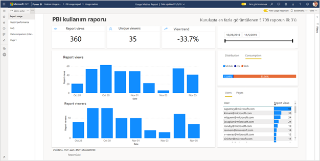

> [!NOTE]
> Kullanım ölçümleri raporlarını yalnızca Power BI hizmetinde çalıştırabilirsiniz. Öte yandan kullanım ölçümleri raporunu kaydeder veya bir panoya sabitlerseniz mobil cihazlarda açıp raporla etkileşimli çalışabilirsiniz.

## Önkoşullar

- Kullanım ölçümleri verilerini çalıştırmak ve bu verilere erişmek için Power BI Pro lisansı gerekir. Öte yandan kullanım ölçümleri özelliği, atanan lisanslarından bağımsız olarak tüm kullanıcılara ilişkin kullanım bilgilerini toplar.
- Raporda geliştirilmiş kullanım ölçümlerine erişmek için, rapor bir modern çalışma alanında bulunmalı ve söz konusu rapor üzerinde düzenleme erişiminiz olmalıdır.
- Power BI yöneticinizin içerik oluşturucuları için kullanım ölçümlerini etkinleştirmiş olması gerekir. Power BI yöneticiniz kullanım ölçümlerinde kullanıcı başına veri toplanmasını da etkinleştirmiş olabilir. [Yönetim portalında bu seçenekleri etkinleştirmeyi](../admin/service-admin-portal.md#control-usage-metrics) öğrenin.

## Geliştirilmiş kullanım ölçümleri raporunu oluşturma ve görüntüleme

Yalnızca yönetici, üye veya katkıda bulunan izinlerine sahip kullanıcılar geliştirilmiş kullanım ölçümleri raporunu görüntüleyebilir. Görüntüleyici izinleri yeterli değildir. Raporunuzun durduğu modern çalışma alanında en azından katkıda bulunan izinlerine sahipseniz, aşağıdaki yordamı kullanarak geliştirilmiş kullanım ölçümlerini görüntüleyebilirsiniz:

1. Kullanım ölçümlerini analiz etmek istediğiniz raporun bulunduğu çalışma alanını açın.
2. Çalışma alanı içerik listelerinin birinden raporun bağlam menüsünü açın ve **Kullanım ölçümleri raporunu görüntüle**’yi seçin. Alternatif olarak raporu açın, sonra komut çubuğunda bağlam menüsünü açın ve ardından **Kullanım ölçümleri**’ni seçin.

    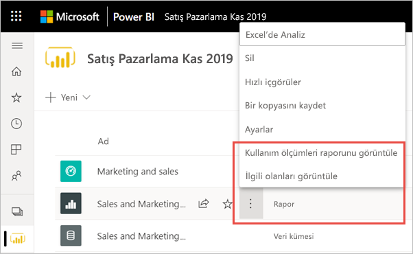

1. Bunu ilk kez yaptığınızda Power BI, kullanım ölçümleri raporunu oluşturur ve hazır olduğunda sizi bilgilendirir.

    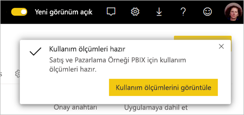

1. Sonuçları görmek için **Kullanım ölçümlerini görüntüle**'yi seçin.
2. Bunu ilk kez yapıyorsanız Power BI eski kullanım ölçümleri raporunu açabilir. Geliştirilmiş kullanım ölçümleri raporunu görüntülemek için, sağ üst köşede Yeni kullanım raporu kapalı anahtarını **Açık** konuma getirin.

    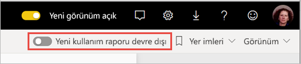

    > [!NOTE]
    > Yeni kullanım raporu anahtarının görüntülenmesi için raporunuzun bir modern çalışma alanında bulunuyor olması gerekir. Eski çalışma alanlarında geliştirilmiş kullanım ölçümleri raporları sağlanmaz.

## Geliştirilmiş kullanım ölçümleri raporu hakkında

Bu geliştirilmiş kullanım ölçümleri raporunu görüntülediğinizde Power BI önceden hazırlanmış bir rapor üretir. Bu raporda söz konusu içeriğin son 30 günlük kullanım ölçümleri yeri alır. Rapor zaten aşina olduğunuz Power BI raporlarına benzer. Son kullanıcılarınızın web üzerinden mi yoksa mobil uygulamadan mı erişim sağladığını görebilir, bu bilgiye göre filtreleme yapabilirsiniz. Raporlarınız geliştikçe kullanım ölçümleri raporları da gelişir. Her gün yeni verilerle güncelleştirilir.

> [!NOTE]
> Kullanım ölçümleri raporları Son Görüntülenen, Çalışma Alanı, Sık Kullanılanlar veya diğer içerik listelerinde gösterilmez. Bu raporlar uygulamaya eklenemez. Kullanım ölçümleri raporundaki kutucuklardan birini bir panoya sabitlerseniz bu panoyu uygulamaya ekleyemezsiniz.

### Kullanım ölçümleri raporu veri kümesi

Geliştirilmiş kullanım ölçümleri raporunu ilk kez başlattığınızda Power BI otomatik olarak bir Kullanım Ölçümleri Raporu veri kümesi oluşturur. Geliştirilmiş ölçümleri raporu bu veri kümesini temel alır. Ardından Power BI bu veri kümesini her gün yeniler. Yenileme zamanlamasını değiştiremezsiniz ama Power BI’ın kullanım ölçümleri verilerini yenilemek için kullandığı kimlik bilgilerini güncelleştirebilirsiniz. Kimlik bilgilerinin süresi dolduysa veya veri kümesinin bulunduğu çalışma alanından kullanım ölçümleri raporunu ilk kez başlatan kullanıcıyı kaldırdıysanız, zamanlanmış yenilemeyi sürdürmeniz gerekebilir.

> [!NOTE]
> Hala önizleme aşamasındayken, kullanım ölçümleri veri kümesinde özel raporları etkileyecek küçük değişiklikler olabilir.  

### Kullanım ölçümleri raporu sayfaları

Geliştirilmiş kullanım ölçümleri raporu aşağıdaki rapor sayfalarını içerir:

- **Rapor kullanımı**    Rapor görünümleri ve rapor görüntüleyicileri hakkında tarihe göre kaç kullanıcının görüntülediği gibi bilgiler sağlar.
- **Rapor performansı**    Tipik rapor açılış sürelerini tüketim yöntemine ve tarayıcı türlerine göre ayrılmış olarak gösterir.
- **SSS**     Sık sorulan "Görüntüleyici" nedir ve "Görünüm" nedir gibi soruların yanıtlarını sağlar.

### Hangi ölçümler raporda yer alır?

| **Sayfa** | **Ölçüm** | **Açıklama** |
| --- | --- | --- |
| Kullanım bildirme | Rapor görünümleri/Rapor açılışları | Biri her rapor açtığında ve raporda benzersiz girişler gösterdiğinde bir Rapor Görünümü kaydı alınır. Bu görünüm "Rapora ne sıklıkta erişiliyor?" sorusunu yanıtlar. Rapor Görünümü'nün bu tanımı önceki kullanım ölçümleri raporlarından farklıdır. Rapor sayfalarının değiştirilmesi artık ek bir Rapor Görünümü olarak kabul edilmez. Bunun yerine rapor sayfalarının değiştirilmesi bir sonraki ölçüm olan Rapor Sayfası Görünümlerinde hesaba katılır. Paylaşım ve sabitleme gibi etkinlikler artık kullanım ölçümlerinde dikkate alınmaz. |
| Kullanım bildirme | Rapor Sayfası görünümleri | Biri bir rapor sayfasını her görüntülediğinde bir Rapor Sayfası Görünümü kaydı alınır. Tüm sayfalar genelinde görünümlerin toplamını temsil eder. Bu görünüm "Rapor sayfalarına ne sıklıkta erişiliyor?" sorusunu yanıtlar. Dolayısıyla rapor sayfalarının değiştirilmesi Rapor Sayfası Görünümlerinde hesaba katılır. Önemli ayrıntılar için bkz. [Önemli noktalar ve Sınırlamalar](#considerations-and-limitations). |
| Kullanım bildirme | Benzersiz görüntüleyiciler | Görüntüleyici, zaman aralığı içinde raporu en az bir kez açmış olan kişidir (AAD kullanıcı hesabı temelinde). |
| Kullanım bildirme | Görünüm eğilimi | Görünüm eğilimi zaman içindeki görünüm sayısı değişikliklerini yansıtır. Seçilen zaman aralığının ilk yarısını ikinci yarısıyla karşılaştırır. |
| Kullanım bildirme | Tarih dilimleyici | Rapor kullanım sayfasında zaman aralığını değiştirebilir, örneğin haftalık veya iki haftalık eğilimleri hesaplayabilirsiniz. Rapor kullanımı sayfasının sol alt köşesinde, seçili rapor için kullanım verilerinin sağlandığı en erken ve en geç tarihi belirleyebilirsiniz. |
| Kullanım bildirme | Derece | Sınıflandırma, kuruluştaki diğer tüm raporlarla karşılaştırıldığında, görünüm sayısı temelinde raporun popülerliğini gösterir. Derece olan 1, raporun kuruluştaki tüm raporlarda en çok görüntülenme sayısına sahip olduğu anlamına gelir.   |
| Kullanım bildirme | Günlük rapor görünümü sayısı | Günlük toplam Rapor Görünümlerinin sayısı. Rapor düzeyinde sayılır, Rapor Sayfası Görünümleri dikkate alınmaz. |
| Kullanım bildirme | Günlük rapor görüntüleyici sayısı | Raporu görüntüleyen farklı kullanıcıların toplam sayısı (AAD kullanıcı hesabına göre). |
| Kullanım bildirme | Dağıtım yöntemi | Kullanıcıların rapora nasıl eriştiği; örneğin çalışma alanının üyeleri olarak, raporun onlarla paylaşılması yoluyla veya uygulamayı yükleyerek. |
| Kullanım bildirme | Platform dilimleyici | Rapora Power BI hizmetinden (powerbi.com) veya Power BI Embedded üzerinden mi yoksa mobil cihazdan mı erişim sağlandığı. |
| Kullanım bildirme | Rapor görünümleri olan kullanıcılar | Raporu açan kullanıcıların görünüm sayısına göre sıralanmış listesini gösterir. |
| Kullanım bildirme | Sayfalar | Raporda 1'den fazla sayfa varsa raporu görüntülenen sayfalara göre dilimleyebilirsiniz. "Boş" seçeneği rapor sayfasının dilimleyici listesinde yeni sayfanın görüntülenmesinden sonraki 24 saat içinde eklendiği veya rapor sayfalarının silindiği anlamına gelir. Bu gibi durumlarda "Boş" seçeneği görüntülenir. |
| Rapor performansı | Tipik açılış süresi | Tipik rapor açılış süresi, raporu açma işleminin süresinin yüzde birlik bölümünün 50’ncisine karşılık gelir. Diğer bir deyişle, rapor açma eylemlerinin %50’sinin tamamlanma süresinin altında kalan süredir. Rapor performansı sayfası da tipik rapor açılış süresini tüketim yöntemine ve tarayıcı türüne göre ayırır. Şu an için raporun ilk yüklenmesi ve ilk sayfanın görüntülenmesi için geçerli performansı ölçüyoruz. Ölçüm, rapor isteğiyle birlikte başlayıp son görselin işlenmesi tamamlandığında sona erer. Dilimleme, filtreleme ve sayfa değiştirme gibi rapor etkileşimleri performans ölçümlerine dahil değildir.  |
| Rapor performansı | Açılış süresi eğilimi | Açılış süresi eğilimi, rapor açma performansının zaman içindeki değişikliklerini yansıtır. Bu, raporun seçilen zaman aralığının ilk yarısındaki açılış sürelerini ikinci yarısındaki sürelerle karşılaştırır. |
| Rapor performansı | Tarih dilimleyici | Rapor performansı sayfasında zaman aralığını değiştirebilir, örneğin haftalık veya iki haftalık eğilimleri hesaplayabilirsiniz. Rapor performansı sayfasının sol alt köşesinde, seçili rapor için kullanım verilerinin sağlandığı en erken ve en geç tarihi belirleyebilirsiniz. |
| Rapor performansı | Günlük performans | Tek tek her gün için hesaplanan rapor açma eylemlerinin %10’unun, %50’sinin ve %90’ının performansı. |
| Rapor performansı | yedi günlük performans | Her tarih için son yedi gün boyunca hesaplanan rapor açma eylemlerinin %10’unun, %50’sinin ve %90’ının performansı. |
| Rapor performansı | Tüketim yöntemi | Kullanıcıların raporu nasıl açtığı; örneğin Power BI hizmeti (powerbi.com), Power BI Embedded veya mobil cihaz yoluyla. |
| Rapor performansı | Browsers (Tarayıcılar) | Kullanıcıların raporu açmak için kullandıkları tarayıcı; örneğin Firefox, Microsoft Edge ve Chrome. |

### Görünüm ve Görüntüleyici ölçümlerinin açıklayıcı bir örneği

Aşağıda gösterildiği gibi üç kullanıcı tarafından erişilen dört raporumuz olduğunu düşünün:

| **Rapor Adı** | **Kullanım Deseni** |
| --- | --- |
| KPI Raporu | <ul><li>A kullanıcısı raporun 1. sayfasını açar. |
| İK Raporu | <ul><li>A kullanıcısı raporun 1. sayfasını açar, ardından 2. sayfayı, 3. sayfayı ve 4. sayfayı görüntüler. Sonra yeniden 1. sayfayı görüntüler. |
| Finans Raporu | <ul><li>A kullanıcısı raporun 1. sayfasını açar, ardından 2. sayfayı görüntüler.</li><li>B kullanıcısı raporun 1. sayfasını açar.</li><li>C kullanıcısı raporun 1. sayfasını açar, ardından 3. sayfayı görüntüler.</li></ul> |
| Satış Raporu | <ul><li>A kullanıcısı raporun 1. sayfasını açar, ardından 2. sayfayı görüntüler</li><li>C kullanıcısı raporun 2. sayfasını açar (örneğin yer işareti aracılığıyla)</li><li>Gün içinde daha sonra C kullanıcısı raporun 1. sayfasını açar </li></ul> |

Tüm istemci telemetrisinin Power BI'a ulaştığı varsayıldığında, sonuçta şu ölçümler elde edilir:

| **Rapor Adı** | **Rapor Görünümleri** | **Rapor Sayfası Görünümleri** | **Görüntüleyiciler** |
| --- | --- | --- | --- |
| KPI Raporu | 1 | 1 | 1 |
| İK Raporu | 1 | 5 | 1 | 
| Finans Raporu | 3 | 5 | 3 |
| Satış Raporu | 3 | 4 | 2 |

## Kullanım ölçümleri raporu kimlik bilgilerini güncelleştirme

Kullanım Ölçümleri Raporu veri kümesini devralmak ve kimlik bilgilerini güncelleştirmek için aşağıdaki yordamı kullanın.

1. Kullanım Ölçümleri Raporu veri kümesini güncelleştirmek istediğiniz raporun bulunduğu çalışma alanını açın.
2. Üst kısımdaki siyah üst bilgi çubuğunda **Ayarlar** simgesini, sonra da **Ayarlar**’ı seçin.

    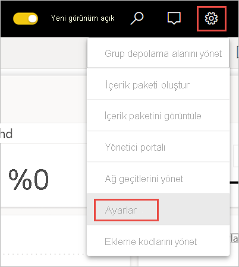

3. **Veri Kümeleri** sekmesine geçin.

1. Kullanım Ölçümleri Raporu veri kümesini seçin. 

    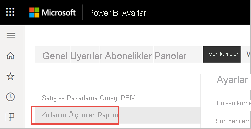
    
    Geçerli veri kümesi sahibi siz değilseniz, veri kaynağı kimlik bilgilerini güncelleştirebilmek için önce sahipliği devralmanız gerekir. 
    
5. **Devral** düğmesini seçin, sonra **Veri kümesi ayarlarını devral** iletişim kutusunda **Devral**’ı yeniden seçin.

1. **Veri kaynağı kimlik bilgileri**’nin altında **Kimlik bilgilerini düzenle**’yi seçin.

    

2. **Kullanım Ölçümleri Raporunu Yapılandır** iletişim kutusunda **Oturum aç**’ı seçin.

    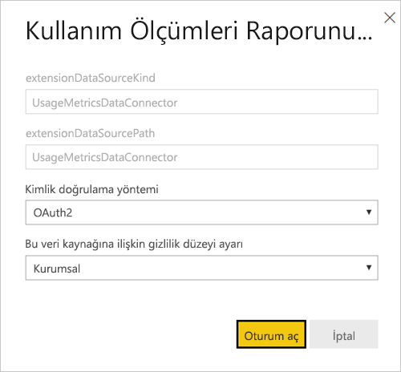

1. Oturum açma dizisini tamamlayın ve veri kaynağının başarıyla güncelleştirildiğine ilişkin bildirime dikkat edin.

    > [!NOTE]
    > Kullanım Ölçümleri Raporu veri kümesi son 30 günün kullanım verilerini içerir. Yeni kullanım verilerinin içeri aktarılması 24 saat kadar sürebilir. Power BI kullanıcı arabirimini kullanarak el ile yenileme tetikleyemezsiniz.

## Kullanım ölçümleri raporunu devre dışı bırakma

Kullanım ölçümleri raporları, Power BI yöneticileri veya genel yöneticiler tarafından etkinleştirilip devre dışı bırakılabilecek bir özelliktir. Yöneticiler kullanım ölçümlerine erişim sahibi olan kullanıcılar üzerinde ayrıntılı denetime sahiptir. Varsayılan olarak bu özellik, kuruluştaki tüm kullanıcılar için Etkin durumdadır. Bu ayarlarla ilgili ayrıntılar için Yönetim portalı makalesinde [Kullanım ölçümlerini denetleme](../admin/service-admin-portal.md#control-usage-metrics) konusuna bakın.

> [!NOTE]
> Yalnızca Power BI kiracısının yöneticileri Yönetim portalını ve düzenleme ayarlarını görebilir.

## Kullanım ölçümleri raporundan kullanıcı bilgilerini dışlama

Varsayılan olarak, kullanım ölçümleri için kullanıcı başına verileri etkinleştirilir. İçerik tüketicisinin hesap bilgileri ölçümler raporuna eklenir. Yöneticiler kullanıcıların bir bölümü veya tümü için bu bilgilerin kullanıma sunulmasını istemezse, kullanıcı bilgilerini kullanım raporunuzun dışında tutabilir. Power BI yönetici portalı kiracı ayarlarında, belirtilen güvenlik grupları veya kuruluşun tamamı için kullanım ölçümlerinde kullanıcı başına verilerini devre dışı bırakabilir.

1. Yönetici portalının **Kiracı ayarları** sekmesindeki **Denetim ve kullanım ayarları**’nın altında **İçerik oluşturucuları için kullanım ölçümlerinde kullanıcı başına veriler**’i genişletin ve **Devre Dışı**’nı seçin.

2. **Geçerli kullanım ölçümleri içeriğindeki tüm kullanıcıya özgü verileri silinip silinmeyeceğine** karar verin. **Uygula**’yı seçin.

    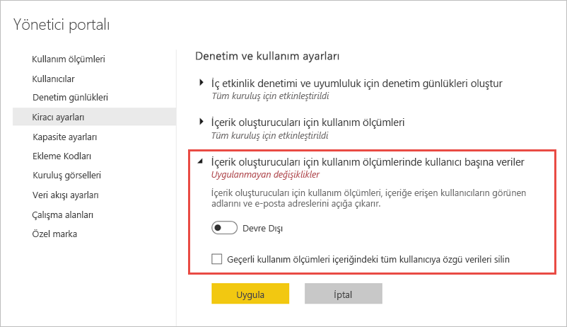

Kullanıcı bilgileri dışlandıysa, kullanım raporunda bu kullanıcılara Adsız kullanıcılar olarak başvurulur.

Yöneticiler kullanım ölçümlerini kuruluşun tamamı için devre dışı bırakırken Tüm mevcut kullanım ölçümleri içeriğini silin seçeneğini kullanarak kullanım ölçümleri raporları kullanılarak oluşturulmuş olan mevcut tüm raporları ve pano kutucuklarını silebilir. Bu seçenek, kullanmakta olanlar dahil olmak üzere kuruluştaki tüm kullanıcılar için kullanım ölçümlerine yönelik erişimi kaldırır. Kullanım ölçümleri içeriğini silme işlemi geri alınamaz.

> [!NOTE]
> Yalnızca Power BI kiracısının yöneticileri Yönetici portalını görebilir ve İçerik oluşturucuları için kullanım ölçümlerinde kullanıcı başına veriler ayarını yapılandırabilir.

## Kullanım ölçümleri raporunu özelleştirme

Rapor verilerini yakından incelemek veya temel veri kümesiyle kendi raporlarınızı oluşturmak için birkaç seçeneğiniz vardır:

- **Power BI hizmetinde [raporun bir kopyasını oluşturma.](#create-a-copy-of-the-usage-report)**   Kullanım ölçümleri raporunun kendi gereksinimlerinize göre özelleştirebileceğiniz ayrı bir örneğini oluşturmak için **Kopyasını kaydet**’i kullanın.
- **Yeni bir raporla [veri kümesine bağlanın](#create-a-new-usage-report-in-power-bi-desktop).**   Her çalışma alanı için, daha önce [Kullanım ölçümleri raporu veri kümesi](#usage-metrics-report-dataset) bölümünde açıklandığı gibi veri kümesinin adı "Kullanım Ölçümleri Raporu" olur. Power BI Desktop'ı kullanarak temel veri kümesine dayanan özel kullanım ölçümleri raporları da oluşturabilirsiniz.
- **[Excel’de Çözümle’yi kullanın](#analyze-usage-data-in-excel).**   Ayrıca Power BI kullanım verilerini Microsoft Excel'in PivotTable, grafik ve dilimleyici özelliklerinde de analiz edebilirsiniz. [Excel’de Çözümle](service-analyze-in-excel.md) özelliği hakkında daha fazla bilgi edinin.

### Kullanım raporunun kopyasını oluşturma

Önceden hazırlanmış salt okunur bir kullanım raporunun kopyasını oluşturduğunuzda, Power BI raporun düzenlenebilir bir örneğini oluşturur. İlk bakışta iki rapor aynı görünür. Ama artık raporu Düzenleme görünümünde açabilir; yeni görselleştirme, filtre ve sayfa ekleyebilir, var olan görselleştirmeleri değiştirebilir veya silebilir ve başka işlemler yapabilirsiniz. Power BI yeni raporu geçerli çalışma alanına kaydeder.

1. Yeni kullanım ölçümleri raporunda **Diğer seçenekler** menüsünü (...) ve sonra da **Kopyasını kaydet**’i seçin.

    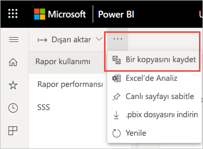

2. **Raporunuzu kaydedin** iletişim kutusunda bir ad girin ve **Kaydet**’i seçin.

    Power BI düzenlenebilir bir Power BI raporu oluşturur, bunu geçerli çalışma alanına kaydeder ve raporun kopyasını açar. 

3. **Diğer seçenekler** menüsünü (…) seçin ve sonra da **Düzenle**’yi seçerek Düzenleme görünümüne geçin. 

    Örneğin filtreleri değiştirebilir, yeni sayfalar ekleyebilir, yeni görselleştirmeler oluşturabilir, yazı tiplerini ve renklerini biçimlendirebilirsiniz.

1. Yeni rapor geçerli çalışma alanında Raporlar sekmesine kaydedilir ve Son görüntülenen içerik listesine eklenir.

    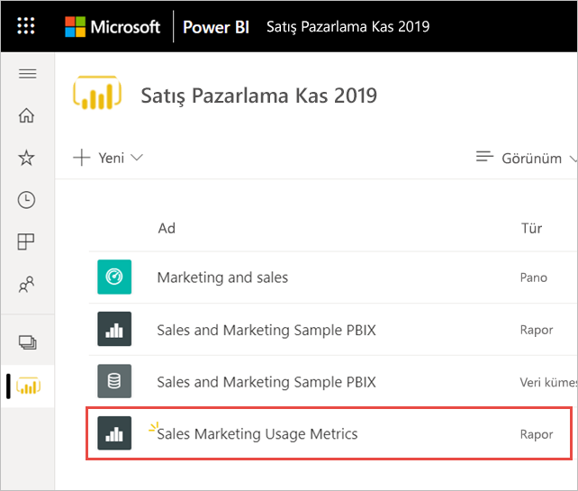
    
> [!NOTE]
> Kullanım ölçümleri raporunuzun bir kopyasını kaydettiğinizde normal bir Power BI raporu gibi kullanabilirsiniz. Görüntüleyici rolüne sahip olan kullanıcılar dahil olmak üzere çalışma alanında görüntüleme izinlerine sahip olan tüm kullanıcıların erişimine açık olur.

### Power BI Desktop'ta yeni kullanım raporu oluşturma

Power BI Desktop’ta Kullanım Ölçümleri Raporu veri kümesini temel alan yeni bir kullanım raporu oluşturabilirsiniz. Kullanım Ölçümleri Raporu veri kümesiyle bağlantı kurmak ve kendi raporunuzu oluşturmak için, Power BI Desktop’ta Power BI hizmeti oturumu açmanız gerekir. 

1. Power BI Desktop'ı açın.

2. Power BI hizmetinde oturum açmadıysanız **Dosya** menüsünde **Oturum aç**’ı seçin.

1. Kullanım Ölçümleri Raporu veri kümesine bağlanmak için **Giriş** şeridinde **Veri Al**’ı seçin.

4. Sol bölmede **Power Platform**’u seçin, sonra da **Power BI veri kümeleri** > **Bağlan**’ı seçin.

    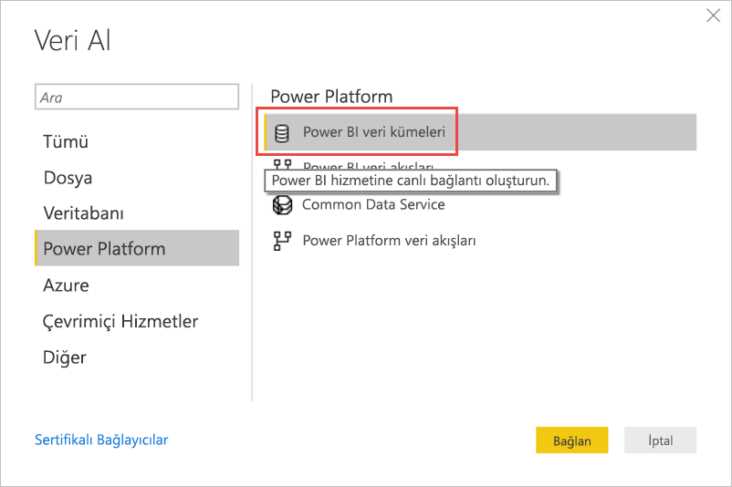

1. Ekranı kaydırarak istenen veri kümesine gelin veya arama kutusuna *Kullanım Ölçümleri Raporu* yazın. 

6. Çalışma Alanı sütununda doğru veri kümesini seçtiğinizi onaylayın, ardından **Oluştur**’u seçin. 

    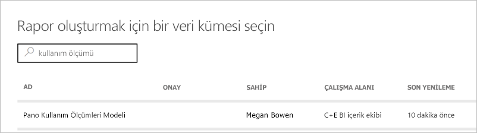

7. Power BI Desktop’ta, seçilen veri kümesindeki tablolara, sütunlara ve ölçülere erişmenizi sağlayan Alanlar listesini gözden geçirin.

    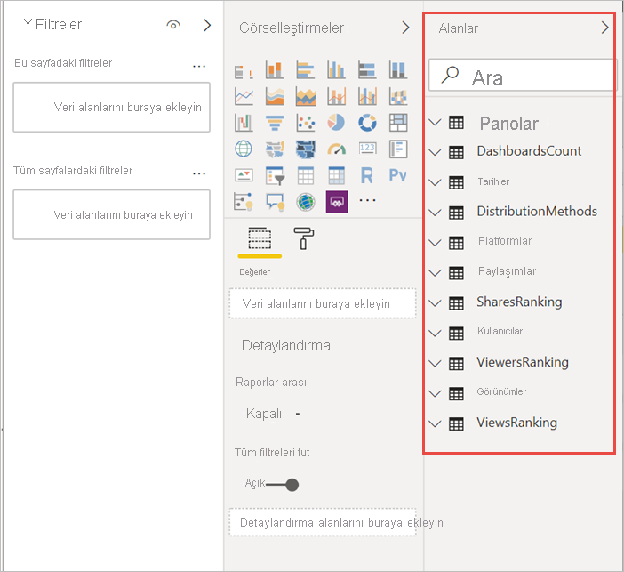

1. Artık tümüyle aynı Kullanım Ölçümleri Raporu veri kümesinden özel kullanım raporları oluşturabilir ve bunları paylaşabilirsiniz.

### Excel’de kullanım verilerini analiz etme

Excel’de kullanım verilerine bağlandığınızda, önceden tanımlanmış ölçüleri kullanan PivotTable’lar oluşturabilirsiniz. Excel PivotTable'larının Power BI veri kümesine bağlanırken sayısal alanların sürükle ve bırak ile toplama özelliğini desteklemediğini aklınızda bulundurun.

1. İlk olarak, henüz yapmadıysanız [kullanım ölçümleri raporunun kopyasını oluşturun](#create-a-copy-of-the-usage-report). 

2. Yeni kullanım ölçümleri raporunu açın, **Diğer seçenekler** menüsünü (…) ve sonra da **Excel’de Çözümle**’yi seçin.

    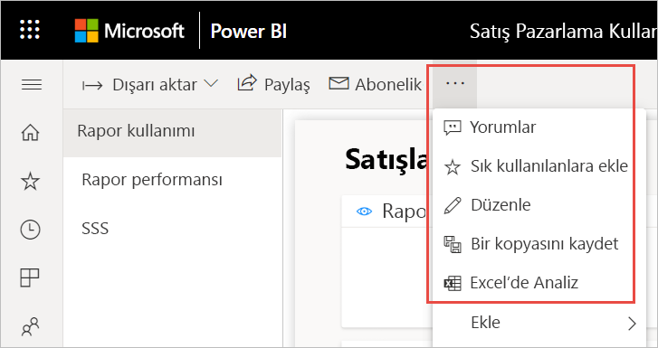

1. **Öncelikle bazı Excel güncelleştirmeleri yapmanız gerekiyor** iletişim kutusunu görüyorsanız **İndir**’i seçin ve Power BI bağlantısı için en son güncelleştirmeleri yükleyin. Aksi takdirde **Bu güncelleştirmeleri zaten yükledim** öğesini seçin.

    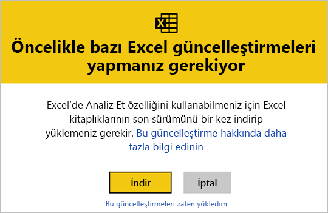

    > [!NOTE]
    > Bazı kuruluşların Grup İlkesi kuralları, Excel'e gerekli olan Excel'de Çözümle güncelleştirmelerinin yüklenmesini engelleyebilir. Güncelleştirmeleri yükleyemiyorsanız yöneticinizle görüşün.

1. Kullanım Ölçümleri raporu.odc dosyasıyla ne yapmak istediğinizi soran tarayıcı iletişim kutusunda **Aç**’ı seçin.

    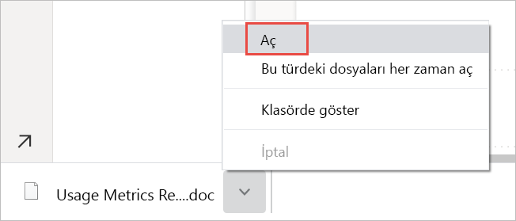

1. Power BI Excel’i başlatır. .odc dosyasının dosya adını ve yolunu doğrulayın, sonra da **Etkinleştir**’i seçin.

    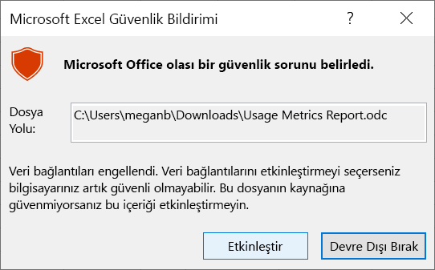

1. Artık Excel açıldığı ve boş bir PivotTable’ınız olduğuna göre, alanları Satırlar, Sütunlar, Filtreler ve Değerler kutularına sürükleyebilir, ardından kullanım verilerinizde özel görünümler oluşturabilirsiniz.

    

## Ulusal bulutlarda kullanım ölçümleri

Power BI, ayrı ayrı ulusal bulutlarda kullanılabilir. Bu bulutlar hizmet teslimi, veri dayanıklılığı, erişim ve denetimle ilgili yerel yasal düzenlemelere yönelik benzersiz bir modelle birlikte, Power BI'ın küresel sürümüyle aynı güvenlik, gizlilik, uyumluluk ve saydamlık düzeyleri sunar. Modern kullanım ölçümleri şu an için aşağıdaki ulusal bulutlarda kullanılabilir durumdadır: 

- ABD Devlet Topluluğu Bulutu
- ABD Devlet Topluluğu Bulutu Yüksek
- ABD Savunma Bakanlığı
- Çin

Daha fazla bilgi için [ulusal bulutlar](https://powerbi.microsoft.com/clouds/) konusuna bakın.

## Önemli noktalar ve sınırlamalar

Geliştirilmiş kullanım ölçümleri raporuyla bu raporun öncülünü karşılaştırırken farklılıklar olabileceğini ve bunların nedenlerini anlamak önemlidir. Özellikle Rapor Görünümü ölçümleri şimdi Power BI hizmetinden toplanan etkinlik verilerini temel almaktadır. Kullanım ölçümleri raporunun önceki sürümleri, yalnızca hizmetten toplanan kullanım ölçümleriyle her zaman eşleşmeyen istemci telemetrisine dayanıyordu. Üstelik geliştirilmiş kullanım ölçümleri raporunda farklı bir “Rapor Görünümü” tanımı kullanılır. Rapor Görünümü, birisi raporu her açtığında hizmette kaydedildiği şekliyle bir rapor açma olayıdır. Rapor sayfalarının değiştirilmesi artık ek bir Rapor Görünümü olarak kabul edilmez. Şimdi özel olarak tek tek sayfa görünümlerini sayan bir Rapor Sayfası Görünümü ölçümü ekledik.

> [!NOTE]
> Geliştirilmiş kullanım ölçümleri raporu Power BI hizmetinden toplanan etkinlik verilerine dayandığından, Rapor Görünümü ölçümleri artık denetim günlüklerinin ve etkinlik günlüklerinin toplam sayılarıyla eşleşir. Tutarsız ağ bağlantıları, reklam engelleyiciler veya istemci tarafı sorunlarından dolayı etkinliklerin eksik veya fazla sayılması artık Görüntüleyici ve Rapor Görünümü sayılarını çarpıtmaz. Bununla birlikte Rapor Sayfası Görünümleri hala istemci telemetrisine dayanmaktadır ve etkilenebilir.

Önceki kullanım ölçümleri raporlarıyla geliştirilmiş raporlar arasında yukarıda belirtilen farklara ek olarak, önceki sürüm için aşağıdaki sınırlamalara da dikkat edin:

- Pano kullanım ölçümleri hala kullanım ölçümleri raporlarının önceki sürümüne dayanıyor ve henüz modern kullanım ölçümlerinde sağlanmıyor.
- Geliştirilmiş kullanım ölçümleri raporları yalnızca modern çalışma alanlarındaki raporlarda kullanılabiliyor. Eski çalışma alanlarındaki raporlar yalnızca kullanım ölçümleri raporlarının önceki sürümünü destekler.
- Performansı verileri ve Rapor Sayfası Görünümü ölçümleri, Power BI’a veri gönderen istemciyi/cihazı kullanır. Ağ gecikme süresi, reklam engelleyiciler, güvenlik duvarları ve kuruluşunuz tarafından ayarlanan ağ kurallarına bağlı olarak bu veriler asla Power BI’a ulaşamayabilir. Dolayısıyla performans ve Rapor Sayfası Görünümü verileri tüm görünümleri veya tüm kullanıcıları içermeyebilir.
- Bazı görünüm türleri performans ölçümlerine dahil edilmez. Örneğin kullanıcı e-posta iletisinde bir raporun bağlantısını seçtiğinde, Rapor Görünümü rapor kullanımında hesaba katılır ama performans ölçümlerinde olay yoktur.
- Sayfalandırılmış Raporlar için rapor performansı ölçümleri kullanılamaz. Bu tür raporlar için ne Rapor kullanımı sayfasındaki Sayfalar sekmesi ne de Rapor performansı sayfasındaki grafikler veri gösterir.
- İç içe gruplar kullanıldığında kullanıcı maskeleme beklendiği gibi çalışmaz. Kuruluşunuz Power BI yönetici portalı kiracı ayarlarında İçerik oluşturucuları için kullanım ölçümlerinde kullanıcıya özgü veriler ayarını devre dışı bıraktıysa yalnızca en üst düzeydeki üyeler maskelenir. Alt grupların üyeleri hala görünür durumdadır.
- Kullanım Ölçümleri Raporu veri kümesini başlatmak birkaç dakika sürebilir ve sonuçta boş bir kullanım ölçümleri raporu gösterilebilir, çünkü Power BI kullanıcı arabirimi yenileme işleminin bitmesini beklemez. Yenileme işleminin başarılı olduğunu doğrulamak için Kullanım Ölçümleri Raporu veri kümesi ayarlarında yenileme geçmişini denetleyin.
- Kullanım Ölçümleri Raporu veri kümesini başlatma işlemi, yenileme sırasında karşılaşılan zaman aşımından dolayı başarısız olabilir. Bu sorunu çözmek için aşağıdaki Sorun Giderme bölümüne bakın.
- Kullanım ölçümleri raporu için paylaşım devre dışı bırakıldı. Kullanıcılara rapora okuma erişimi vermek için öncelikle çalışma alanı erişimi vermeniz gerekir.
- Bazı senaryolarda performans verilerinin eksik olduğunu fark edebilirsiniz. Bu durum, kullanıcı açtığı bir rapor ile, raporun yüklenmesi tamamlanmadan etkileşim kurduğunda veya rapor yüklenirken bir sorun oluştuğunda ortaya çıkabilir. 

## Sık sorulan sorular

Yukarıda anlatılan önemli noktalar ve sınırlamalara ek olarak, kullanım ölçümleriyle ilgili aşağıdaki soru ve yanıtlar kullanıcılara ve yöneticilere yardımcı olabilir:

**S:** Neden Rapor Görünümlerinden daha az Rapor Sayfası Görünümü görüyorum, en azından aynı sayıda olmaları gerekmiyor mu? 
**Y:** Rapor Görünümleri rapor ilk açıldığında oluşturulan sunucu telemetrisini kullanır. Rapor açıldıktan sonra, sayfa tanımları kullanıcı cihazına zaten yüklenir. Rapor Sayfası Görünümleri kullanıcıların cihazlarından Power BI'a ulaşan kullanım verilerini kullanır. Bu bazen [Önemli Noktalar ve Sınırlamalar](#considerations-and-limitations) altında açıklandığı gibi engellenebilir.

**S:** Raporda kullanım ölçümlerini çalıştıramıyorum.
**Y:** Kullanım ölçümlerimi yalnızca sahip olduğunuz veya düzenleme izniniz olan raporlarda görebilirsiniz.

**S:** Mevcut kullanım ölçümleri raporumun sağ üst köşesinde Yeni kullanım raporu açık düğmesini neden göremiyorum?
**Y:** Geliştirilmiş kullanım ölçümleri raporu yalnızca modern çalışma alanlarındaki raporlarda kullanılabilir.

**S:** Rapor hangi zaman aralığını kapsar?
**Y:** Kullanım raporu, geçerli günün etkinlikleri hariç son 30 günün etkinlik verilerini temel alır. Rapor kullanım sayfasındaki Tarih dilimleyicisini kullanarak zaman aralığını daraltabilir, örneğin yalnızca son haftanın verilerini analiz edebilirsiniz.

**S:** En son etkinlik verilerini ne zaman göreceğim?
**Y:** Kullanım raporu UTC saat dilimine göre son tamamlanmış güne kadar olan etkinlik verilerini içerir. Raporda gösterilen veriler, veri kümesinin yenileme zamanına da bağlıdır. Power BI veri kümesini günde bir kez yeniler.

**S:** Veriler güncel değil gibi görünüyor.
**Y:** Yeni etkinlik verilerinin kullanım raporunda görüntülenmesinin 24 saat kadar sürebileceğini unutmayın.

**S:** Kullanım verilerinin veri kaynağı nedir?
**Y:** Kullanım Ölçümleri Raporu veri kümesi özel Kullanım Ölçümleri Veri Bağlayıcısı’nı kullanarak verilerini Power BI’ın dahili bir kullanım ölçümleri deposundan içeri aktarır. Kullanım Ölçümleri Veri Bağlayıcısı’nın kimlik bilgilerini Kullanım Ölçümleri Raporu veri kümesinin ayarlar sayfasında güncelleştirebilirsiniz.

**S:** Verilere nasıl bağlanabilirim? Veya varsayılan raporu nasıl değiştirebilirim?
**Y:** Salt okunur, önceden oluşturulmuş kullanım raporunun bir kopyasını oluşturabilirsiniz. Raporun kopyası aynı Kullanım Ölçümleri Raporu veri kümesine bağlanır ve rapor ayrıntılarını düzenlemenize olanak tanır.

**S:** "Görüntüleyici" ve "Görünüm" nedir?
**Y:** Görüntüleyici, zaman aralığı içinde raporu en az bir kez açmış olan kişidir. Görünüm, bir rapor açma olayıdır. Birisi raporu her açtığında bir rapor görünümü kaydedilir.
Görünüm tanımının önceki kullanım ölçümleri raporlarından farklı olduğuna dikkat edin. Rapor sayfalarının değiştirilmesi artık ek bir görünüm olarak kabul edilmez.

**S:** "Görünüm eğilimi" nasıl hesaplanır?
**Y:** Görünüm eğilimi zaman içindeki görünüm sayısı değişikliklerini yansıtır. Seçilen zaman aralığının ilk yarısını ikinci yarısıyla karşılaştırır. Rapor kullanım sayfasındaki Tarih dilimleyicisini kullanarak zaman aralığını değiştirebilir, haftalık veya iki haftalık eğilimleri hesaplayabilirsiniz.

**S:** "Dağıtım" ve "Platform" ne anlama gelir?
**Y:** Dağıtım, görüntüleyicilerin rapora nasıl erişim elde ettiğini gösterir: doğrudan paylaşılan, çalışma alanı erişimi yoluyla veya uygulama aracılığıyla.
Platform, görüntüleyicinin raporu açmak için kullandığı teknolojiyi gösterir: PowerBI.com, Mobile veya Embedded yoluyla.

**S:** Rapor sınıflandırması nasıl çalışır?
**Y:** Sınıflandırma, kuruluştaki diğer tüm raporlarla karşılaştırıldığında, görünüm sayısı temelinde raporun popülerliğini gösterir. Derece olan 1, raporun kuruluştaki tüm raporlarda en çok görüntülenme sayısına sahip olduğu anlamına gelir.

**S:** "Adsız Kullanıcılar" kimdir?
**Y:** Kuruluşunuz kullanıcı bilgilerini kullanım raporunuzdan dışlamaya karar verebilir. Kullanım raporunda dışlanan kullanıcılara Adsız kullanıcılar olarak başvurulur.

**S:** "Tipik rapor açılış süresi" nedir?
**Y:** Tipik rapor açılış süresi, raporu açma işleminin süresinin yüzde birlik bölümünün 50’ncisine karşılık gelir. Diğer bir deyişle, rapor açma eylemlerinin %50’sinin tamamlanma süresinin altında kalan süredir. Rapor performansı sayfası da tipik rapor açılış süresini tüketim yöntemine ve tarayıcı türüne göre ayırır.

**S:** "Açılış süresi eğilimi" nasıl hesaplanır?
**Y:** Açılış süresi eğilimi, rapor açma performansının zaman içindeki değişikliklerini yansıtır. Bu, raporun seçilen zaman aralığının ilk yarısındaki açılış sürelerini ikinci yarısındaki sürelerle karşılaştırır. Rapor performansı sayfasındaki Tarih dilimleyicisini kullanarak zaman aralığını değiştirebilir, örneğin haftalık veya iki haftalık eğilimleri hesaplayabilirsiniz.

**S:**  Kullanım ölçümleri raporunun önceki sürümünde dört rapor vardı ama geliştirilmiş sürümde yalnızca üç rapor görüntüleniyor.
**Y:**  Geliştirilmiş kullanım ölçümleri raporu yalnızca son 30 gün içinde açılmış olan raporları içeriyor; oysa önceki sürüm son 90 günün raporlarını kapsıyordu. Bir rapor geliştirilmiş kullanım ölçümleri raporunda yer almıyorsa büyük olasılıkla kullanılmasının üzerinden 30 günden fazla bir süre geçmiştir.

## Sorun giderme: Veri kümesini silme

Veri tutarlılığı veya yenileme sorunlarından kuşkulanıyorsanız, mevcut Kullanım Ölçümleri Raporu veri kümesini silmek anlamlı olabilir. Ardından Kullanım Ölçümlerini Görüntüle işlemini yeniden çalıştırıp ilişkili geliştirilmiş kullanım ölçümleri raporlarıyla yeni bir veri kümesi oluşturabilirsiniz. Şu adımları izleyin.

### Veri kümesini silme

1. Kullanım Ölçümleri Raporu veri kümesini sıfırlamak istediğiniz raporun bulunduğu çalışma alanını açın.

2. Üst kısımdaki siyah üst bilgi çubuğunda **Ayarlar** simgesini, sonra da **Ayarlar**’ı seçin.

    

3. **Veri Kümeleri** sekmesine geçin ve Kullanım Ölçümleri Raporu veri kümesini seçin. 

    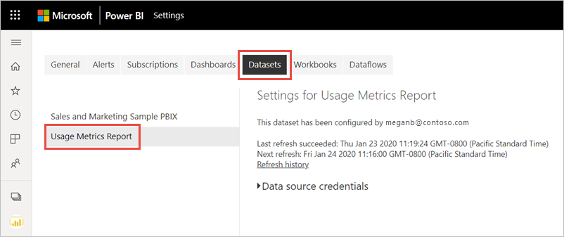

5. Tarayıcınızın adres çubuğunda görüntülenen URL’den çalışma alanı ve veri kümesi kimliklerini kopyalayın.

    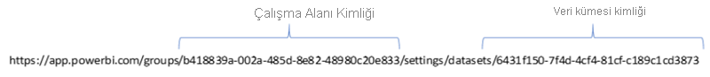

1. Tarayıcınızda [https://docs.microsoft.com/rest/api/power-bi/datasets/deletedatasetingroup](/rest/api/power-bi/datasets/deletedatasetingroup) adresine gidin ve **Dene** düğmesini seçin.

    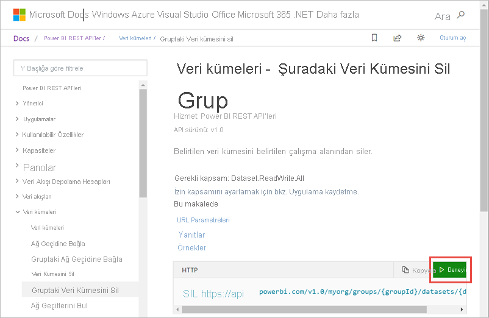

1. Power BI’da oturum açın, Çalışma Alanı kimliğini **groupId** metin kutusuna ve veri kümesi kimliğini **datasetId** metin kutusuna yapıştırın, sonra da **Çalıştır**’ı seçin. 

    

1. **Çalıştır** düğmesinin altında, hizmetin **200** Yanıt Kodunu döndürdüğünü doğrulayın. Bu kod, veri kümesinin ve onunla ilişkilendirilmiş kullanım ölçümleri raporlarının başarıyla silindiğini gösterir.

    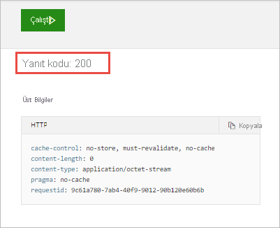

### Yeni bir kullanım ölçümleri raporu oluşturma

1. Power BI hizmetine döndüğünüzde veri kümesinin gittiğini görürsünüz.

    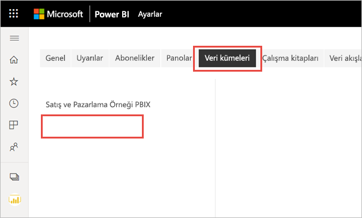

2. Kullanım Ölçümleri raporunu Raporlar listesinde görmeye devam ediyorsanız tarayıcınızı yenileyin.

3. [Yeni bir kullanım ölçümleri raporu oluşturun](#create--view-an-improved-usage-metrics-report).

## Sonraki adımlar

[Yönetim portalında Power BI’ı yönetme](../admin/service-admin-portal.md)

Başka bir sorunuz mu var? [Power BI Topluluğu'na başvurun](https://community.powerbi.com/)
