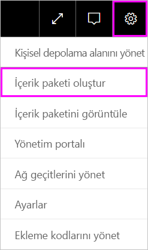
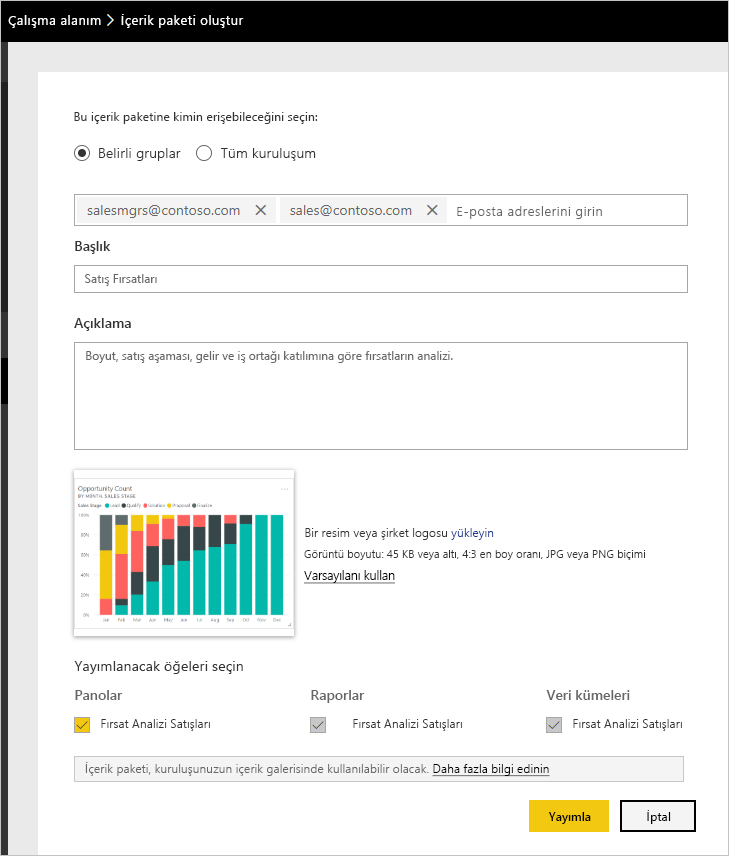
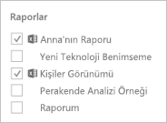
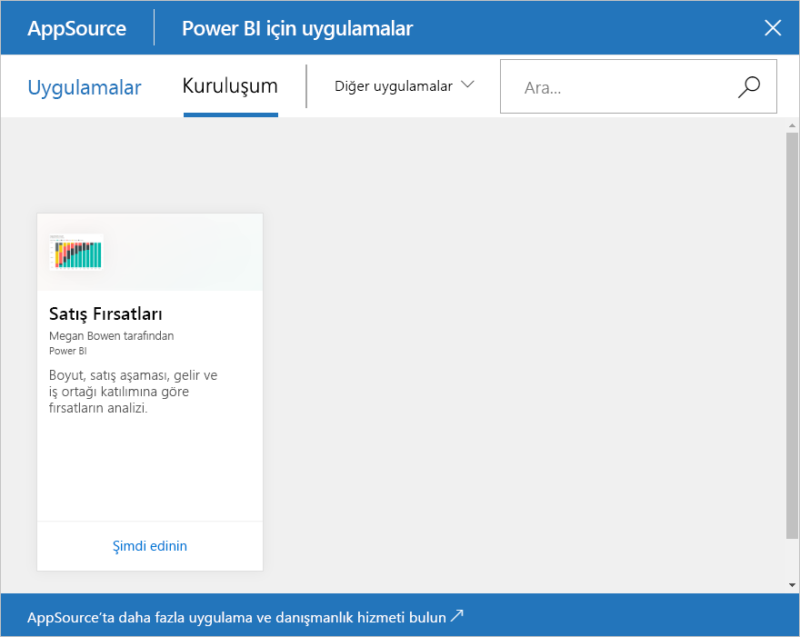

# Öğretici: Power BI kurumsal içerik paketi oluşturma ve yayımlama

Bu öğretici kapsamında Power BI'da bir kurumsal içerik paketi oluşturacak, belirli bir gruba erişim izni sağlayacak ve içerik paketini kuruluşunuzun içerik paketi kitaplığında yayımlayacaksınız.

İçerik paketi oluşturma işlemi, pano paylaşmaktan veya bir grupta bunlara yönelik işbirliği yapmaktan farklıdır. Durumunuza en uygun seçeneğe karar vermek için [Power BI’da çalışmanızı paylaşmanın yolları](service-how-to-collaborate-distribute-dashboards-reports.md) makalesini okuyun.

Kurumsal içerik paketleri oluşturabilmek için bir [Power BI Pro hesabına](https://powerbi.microsoft.com/pricing) sahip olunması gerekir.

> [!NOTE]
> Yeni çalışma alanı deneyiminde kurumsal içerik paketleri oluşturamaz veya yükleyemezsiniz. Henüz yapmadıysanız, şimdi içerik paketlerinizi uygulamalara yükseltmek için iyi bir zamandır. [Yeni çalışma alanı deneyimi hakkında daha fazla bilgi](service-create-the-new-workspaces.md) edinin.

## İçerik paketi oluşturma ve yayımlama

Contoso'da Yayın Yöneticisi olduğunuzu ve yeni bir ürün lansmanı için hazırlandığınızı hayal edin.  Paylaşmak istediğiniz raporları içeren bir pano oluşturdunuz. Başlatmayı yöneten diğer çalışanlar bunları yararlı bulabilir. Panoyu ve raporları iş arkadaşlarınıza paket halinde bir çözüm olarak sunmak istiyorsunuz.

Birlikte ilerlemek ister misiniz? [Power BI hizmeti](https://powerbi.com)’nde **Çalışma Alanım**'a gidin. Sonra **Veri Al** > **Örnekler** > **Fırsat Analizi Örneği** > **Bağlan**’a giderek kendi kopyanızı alın.

1. Gezinti bölmesinde **Çalışma Alanları** > **Çalışma alanlarım**'ı seçin.

1. Üst gezinti bölmesinde dişli simgesini  seçin. > **İçerik paketi oluştur**.

   

1. **İçerik paketi oluştur** penceresinde aşağıdaki bilgileri girin.  

   Kuruluşunuzun içerik paketi kitaplığının hızla dolabileceğini aklınızda bulundurun. Kitaplıkta, kuruluş veya gruplar için yayımlanmış yüzlerce içerik paketi bulunabilir. İçerik paketinize anlamlı bir ad verin, iyi bir açıklama ekleyin ve doğru kitleyi seçin.  İçerik paketinizin arama yoluyla kolayca bulunabilmesini sağlayan sözcükler kullanın. Böylece içerik paketinizi gelecekte kolayca bulabilirsiniz.

      

    1. **Belirli Gruplar**’ı seçin.

    1. Kişilerin, [Office 365 gruplarının](https://support.office.com/article/Create-a-group-in-Office-365-7124dc4c-1de9-40d4-b096-e8add19209e9), dağıtım gruplarının veya güvenlik gruplarının tam e-posta adreslerini girin. Örnek: salesmgrs@contoso.com; sales@contoso.com

        Bu öğreticide grubunuzun e-posta adresini kullanmayı deneyin.

    1. İçerik paketini *Sales Opportunities* olarak adlandırın.

        > [!TIP]
        > İçerik paketini adlandırırken panonun adını da ekleyebilirsiniz. Bu sayede iş arkadaşlarınız, içerik paketinize bağlandıktan sonra panoyu daha kolay bir şekilde bulabilirler.

    1. Önerilen: Bir açıklama ekleyin. Bu sayede iş arkadaşlarınız, ihtiyaç duydukları içerik paketlerini daha kolay bir şekilde bulabilir. Açıklamanın yanı sıra, iş arkadaşlarınızın bu içerik paketini aramak için kullanabilecekleri anahtar sözcükler ekleyin. Soru sormak isteyen veya yardıma ihtiyacı olan iş arkadaşlarınız için iletişim bilgilerinizi ekleyin.

    1. Grup üyelerinin içerik paketini bulmasını kolaylaştırmak için bir resim veya logo yükleyin.

        Görüntünün taranması, metnin taranmasından daha hızlı bir işlemdir. Ekran görüntüsünde **Fırsat Sayısı** sütun grafik kutucuğunun bir görüntüsü gösterilmiştir.

    1. **Opportunity Analysis Sample** panosunu seçerek içerik paketine ekleyin.

        Power BI, ilişkili raporu ve veri kümesini otomatik olarak ekler. İsterseniz başka öğeler de ekleyebilirsiniz.

       > [!NOTE]
       > Power BI yalnızca düzenleyebileceğiniz panoları, raporları, veri kümelerini ve çalışma kitaplarını listeler. Bu nedenle, uygulama sizinle paylaşılan herhangi birini göstermez.

   1. Excel çalışma kitaplarınız varsa bunları **Raporlar** bölümünde, bir Excel simgesiyle birlikte görürsünüz. Çalışma kitaplarınızı da içerik paketine ekleyebilirsiniz.

      

      > [!NOTE]
      > Grup üyeleri, Excel çalışma kitabını görüntüleyemezse [OneDrive İş'te çalışma kitabını söz konusu kullanıcılarla paylaşmanız](https://support.office.com/article/Share-documents-or-folders-in-Office-365-1fe37332-0f9a-4719-970e-d2578da4941c) gerekebilir.

1. İçerik paketini grubun kurumsal içerik paketi kitaplığına eklemek için **Yayımla**'yı seçin.  

   İçerik paketi başarıyla yayımlandığında bir başarılı iletisi görürsünüz.

1. Grubunuzun üyeleri **Veri Al** > **Kuruluş İçerik Paketleri** seçeneğine gittiğinde içerik paketinizi görürler.

   

   > [!TIP]
   > Tarayıcınızda görüntülenen URL, bu içerik paketi için benzersiz bir adrestir.  İş arkadaşlarınızı bu yeni içerik paketinden haberdar etmek ister misiniz?  URL'yi bir e-postaya yapıştırmanız yeterli.

1. Grup üyeleriniz **Bağlan**'ı seçtiklerinde [içerik paketinizi görüntüleyebilir ve çalışmaya başlayabilirler](service-organizational-content-pack-copy-refresh-access.md).

## Sonraki adımlar

* [Power BI'da kuruluş içerik paketlerine giriş](service-organizational-content-pack-introduction.md).

* [Kuruluş içerik paketlerini yönetme, güncelleştirme ve silme](service-organizational-content-pack-manage-update-delete.md).

* [Power BI'da bir uygulama yayımlama](service-create-distribute-apps.md).

* [OneDrive İş nedir?](https://support.office.com/article/What-is-OneDrive-for-Business-187f90af-056f-47c0-9656-cc0ddca7fdc2)

* Başka bir sorunuz mu var? [Power BI Topluluğu'na başvurun](https://community.powerbi.com/)
