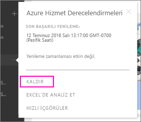

# Power BI kurumsal içerik paketi bağlantınızı kaldırma

> [!NOTE]
> Kurumsal içerik paketleri kullanımdan kaldırılıyor. Henüz yapmadıysanız, şimdi içerik paketlerinizi uygulamalara yükseltmek için iyi bir zamandır. Zaman çizelgesi için [Announcing Power BI admins can upgrade classic workspaces](https://powerbi.microsoft.com/blog/announcing-power-bi-admins-can-upgrade-classic-workspaces-and-roadmap-update/) (Power BI yöneticileri klasik çalışma alanlarını yükseltebilir) başlıklı blog gönderisinin çalışma alanlarını yükseltme yol haritası bölümüne bakın.
> 

İş arkadaşlarınızdan biri bir içerik paketi oluşturuyor. AppSource'ta bu içerik paketini bulup Power BI çalışma alanınıza ekliyorsunuz. Bir süre sonra bu içerik paketine ihtiyacınız olmadığını düşünüyorsunuz.  İçerik paketini nasıl kaldırırsınız?

Bir içerik paketini kaldırmak için veri kümesini silersiniz.  

* Gezinti bölmesinde veri kümesinin sağında bulunan üç nokta simgesini seçin ve ardından **Kaldır \> Evet** seçeneğini belirleyin.  
  
  

Veri kümesi kaldırıldığında, ilişkili olduğu tüm raporlar ve panolar da kaldırılır. Ancak, içerik paketi bağlantınızı kestiğinde söz konusu içerik paketi kuruluşunuzun AppSource hesabından silinmez.  AppSource'a dilediğiniz zaman geri dönüp içerik paketini çalışma alanınıza tekrar ekleyebilirsiniz. [AppSource'taki bir içerik paketini silebilmeniz](service-organizational-content-pack-manage-update-delete.md) için içerik paketini sizin oluşturmuş olmanız gerekir.

## Sonraki adımlar
* [Kurumsal içerik paketlerine giriş](service-organizational-content-pack-introduction.md) 
* [Power BI'da uygulama oluşturma ve dağıtma](service-create-distribute-apps.md) 
* [Power BI hizmetinde tasarımcılar için temel kavramlar](../fundamentals/service-basic-concepts.md)  
* Başka bir sorunuz mu var? [Power BI Topluluğu'na başvurun](https://community.powerbi.com/)
