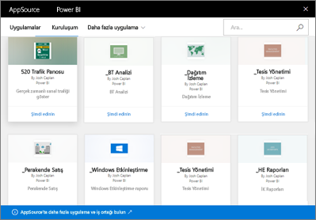

# Power BI'da kurumsal içerik paketlerine giriş
> [!NOTE]
> Yeni çalışma alanı deneyiminde kurumsal içerik paketleri oluşturamaz veya bunları yükleyemezsiniz. Henüz yapmadıysanız, şimdi içerik paketlerinizi uygulamalara yükseltmek için iyi bir zamandır. [Yeni çalışma alanı deneyimi hakkında daha fazla bilgi](service-create-the-new-workspaces.md) edinin.
> 

Raporları ekibinize düzenli olarak dağıtmak için e-postaları mı kullanırsınız? Onun yerine şunu deneyin: Panolarınızı, raporlarınızı, Excel çalışma kitaplarınızı ve veri kümelerinizi paketleyip bunları *kurumsal içerik paketi* olarak ekibinize yayımlayın. Ekibiniz, oluşturduğunuz içerik paketlerini kolaylıkla bulabilir &#151; paketlerin tümü AppSource'ta bulunur. Power BI'ın parçası olduklarından etkileşimli veri araştırma, yeni görseller, Soru-Cevap, diğer veri kaynaklarıyla tümleştirme, veri yenileme ve daha fazlası dahil olmak üzere tüm Power BI özelliklerinden yararlanırlar.

İçerik paketi oluşturma işlemi, pano paylaşmaktan veya bir çalışma alanında bunlara yönelik işbirliği yapmaktan farklıdır. Kendi durumunuz için en iyi seçeneği belirlemek üzere [Panolar ve raporlar üzerinde nasıl işbirliği yapabilir ve bunları nasıl paylaşabilirim?](service-how-to-collaborate-distribute-dashboards-reports.md) makalesini okuyun. 

AppSource'ta kuruluşun tamamında, dağıtım veya güvenlik gruplarında ve [ait olduğunuz Microsoft 365 gruplarında](https://support.office.com/article/Create-a-group-in-Office-365-7124dc4c-1de9-40d4-b096-e8add19209e9) yayımlanan içerik paketlerine göz atabilir ve bunları arayabilirsiniz. Belirli bir grubun üyesi değilseniz, söz konusu grupla paylaşılan içerik paketlerini görmezsiniz. Grup üyelerinin tamamı içerik paketi verilerine, raporlara, çalışma kitaplarına ve panolara aynı şekilde salt okunur erişime (ayrıcalıklarınızın veri kaynağı ile devralındığı SQL Server Analysis Services (SSAS) veri kaynakları dışında) sahip olur.

Panolar, raporlar ve Excel çalışma kitapları salt okunurdur ancak içerik paketinin size ait kişiselleştirilmiş sürümünü oluşturmak için bir başlangıç noktası olarak panoları ve raporları kopyalayıp kullanabilirsiniz.

> [!NOTE]
> Kurumsal içerik paketleri yalnızca sizin ve iş arkadaşlarınızın [Power BI Pro lisanslarınız](../fundamentals/service-features-license-type.md) olması halinde kullanılabilir.
> 
> 

## *AppSource* nedir?
Bir kurumsal içerik paketi yayımlandığında AppSource'a eklenir.  Bu merkezi depo, üyelerin kendileri için yayımlanan panolara, raporlara ve veri kümelerine göz atıp bunları keşfetmesini kolaylaştırır.  

* AppSource'u görüntülemek için **Veri Al** > **Kuruluşum** > **Al** seçeneklerini belirleyin.

## Kurumsal içerik paketinin yaşam döngüsü
Tüm Power BI Pro kullanıcıları kurumsal içerik paketleri oluşturabilir, yayımlayabilir ve bunlara erişebilir. Yalnızca içerik paketi oluşturucusu çalışma kitabını ve veri kümesini değiştirebilir, yenilemeyi zamanlayabilir ve silebilir.

Yaşam döngüsü aşağıdaki gibidir:

1. Nate, Power BI Pro'da bir içerik paketi oluşturur ve bunu Pazarlama dağıtım grubunda yayımlar. Yenileme ayarları, veri kümesi ile devralınır ve yalnızca Nate tarafından değiştirilebilir.
   
   > [!NOTE]
   > Nate, içerik paketini üyesi olduğu bir [Power BI çalışma alanından](service-create-distribute-apps.md) oluşturması halinde, çalışma alanından ayrılsa bile Power BI çalışma alanındaki diğer kişiler sahipliği devralabilir.
   > 
   > 
2. Nate, dağıtım grubuna posta gönderir ve gruptakilere yeni içerik paketinden bahseder.
3. Power BI Pro'da Pazarlama dağıtım grubunun üyesi olan Jane, AppSource'ta bir içerik paketini arayıp pakete bağlanır. Jane'in artık salt okunur bir kopyası var. Jane, gezinti bölmesinde pano adının ve rapor adının solunda bir paylaşım simgesi bulunduğundan kopyanın salt okunur olduğunu anlar. Pano seçildiğinde görünen kilit simgesi, Jane'in bir içerik paketi panosuna baktığını anlamasını sağlar. 
4. Jane’in panoyu özelleştirmeye karar verdiğini varsayalım. Artık panonun ve raporların bir kopyasına sahip olur. Jane'in çalışmaları kaynağı, özgün içerik paketini veya diğer dağıtım grubu üyelerini etkilemez. Artık her biri panonun ve raporun kendisine ait kopyası üzerinde çalışıyor.
5. Nate panoda güncelleştirmeler yapar ve hazır olduğunda içerik paketinin yeni sürümünü yayımlar.
   
   * Bir başka dağıtım grubu üyesi olan Julio, özgün içerik paketini özelleştirmedi. Yeni değişiklikler Julio'nun kendi içerik paketi sürümüne otomatik olarak uygulanır.  
   * Jane ise içerik paketini özelleştirdi. Jane, yeni bir sürüm olduğuna ilişkin bildirim alır.  AppSource'a giderek, kendi kişiselleştirilmiş sürümünü kaybetmeden güncelleştirilmiş içerik paketini alabilir. Jane artık 2 sürüm sahip: kişiselleştirilmiş sürüm ve güncelleştirilmiş içerik paketi.
6. Nate'in güvenlik ayarlarını değiştirdiğini varsayalım. Julio ve Jane içeriğe artık erişemez. Veya Pazarlama dağıtım grubundan çıkarıldıklarını varsayalım.
   
   * Julio özgün içerik paketini güncelleştirmediğinden içerik otomatik olarak kaldırılır. 
   * Jane ise içerik paketini özelleştirdi. Panoyu bir sonraki açışında, özgün içerik paketinden gelen tüm kutucuklar gitmiş olur ancak Jane’in başka raporlardan sabitlediği kutucuklar (kullanma iznine hâlâ sahip olduğu) görünmeye devam eder. İlişkili raporlar ve veri kümeleri artık kullanılamaz (ve bunların gezinti bölmesinde görünmez).
7. Şimdi de Nate'in içerik paketini sildiğini varsayalım.
   
   * Julio özgün içerik paketini güncelleştirmediğinden içerik otomatik olarak kaldırılır. 
   * Jane ise içerik paketini özelleştirdi. Panoyu bir sonraki açışında, özgün içerik paketinden gelen tüm kutucuklar gitmiş olur ancak Jane’in başka raporlardan sabitlediği kutucuklar görünmeye devam eder. İlişkili raporlar ve veri kümeleri artık kullanılamaz (ve bunların gezinti bölmesinde görünmez).

## Veri güvenliği
Dağıtım grup üyelerinin tümü, verilere yönelik olarak içerik paketi oluşturucusuyla aynı izinlere sahiptir. Bunun tek istisnası SQL Server Analysis Services (SSAS) şirket içi tablo veri kümeleridir. Raporlar ve panolar, şirket içi SSAS modeline canlı bağlandığından her bir dağıtım grubu üyesinin kimlik bilgileri, üyenin erişebildiği verileri belirlemek için kullanılır.

## Sonraki adımlar
* [Kurumsal içerik paketi oluşturma ve yayımlama](service-organizational-content-pack-create-and-publish.md)
* [Power BI'da uygulama oluşturma ve dağıtma](service-create-distribute-apps.md) 
* [Power BI hizmetinde tasarımcılara yönelik temel kavramlar](../fundamentals/service-basic-concepts.md)
* Başka bir sorunuz mu var? [Power BI Topluluğu'na başvurun](https://community.powerbi.com/)
