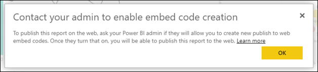

# Power BI'dan Web'de yayımlama

Power BI’daki **Web’de yayımlama** seçeneği sayesinde etkileşimli Power BI içeriğini blog gönderilerine, web sitelerine, e-postalara veya sosyal medyaya kolayca ekleyebilirsiniz. Ayrıca yayımladığınız görselleri kolayca düzenleyebilir, güncelleştirebilir, yenileyebilir veya yayımlanan görsellerinizin paylaşımını durdurabilirsiniz.

> [!WARNING]
> **Web'de yayımla** seçeneğini kullandığınızda yayımladığınız rapor veya görseller, İnternet üzerindeki herkes tarafından görüntülenebilir. Görüntülemek için kimlik doğrulaması gerekmez. Raporlarınızda toplanan ayrıntı düzeyindeki verilerin görüntülenmesini içerir. Raporu yayımlamadan önce verileri ve görselleştirmeleri herkesle paylaşmanızın uygun olduğundan emin olun. Gizli veya özel bilgileri yayımlamayın. Bu konuda şüpheleriniz varsa yayımlamadan önce kuruluşunuzun ilkelerini inceleyin.

>[!Note]
>İçeriğinizi bir iç portal veya web sitesine güvenli bir şekilde ekleyebilirsiniz. [Ekle](service-embed-secure.md) veya [SharePoint Online’a ekle](service-embed-report-spo.md) seçeneğini kullanın. Bu seçenekler, kullanıcılarınız iç verilerinizi görüntülediğinde tüm izinlerin ve veri güvenliğinin zorunlu tutulmasını sağlar.

## Web’de yayımlama ile ekleme kodları oluşturma

**Web'de yayımla** özelliğini, kişisel veya grup çalışma alanlarında düzenleyebildiğiniz raporlarda kullanabilirsiniz.  Sizinle paylaşılan raporlarda veya verileri korumak için satır düzeyi güvenliğe dayanan raporlarda kullanılamaz. **Web'de yayımla** özelliğinin desteklenmediği tüm durumların listesi için aşağıdaki [**Sınırlamalar**](#limitations) bölümüne bakın. **Web'de yayımla** özelliğini kullanmadan önce bu makalenin üst kısmındaki **Uyarı** bölümünü inceleyin.

Aşağıdaki adımlar **Web'de yayımla** özelliğinin nasıl kullanılacağını açıklamaktadır.

1. Düzenleyebileceğiniz bir çalışma alanında bir rapor açın ve **Diğer seçenekler (...)**   > **Ekle** > **Web’de yayımla (genel)** seçeneğini belirleyin.

   
   
2. Power BI yöneticiniz ekleme kodları oluşturmanıza izin vermediyse kendisiyle iletişime geçmeniz gerekebilir.

   
   
   Kuruluşunuzda Web’de yayımlama özelliğini etkinleştirebilecek kişiyi bulmanıza yardımcı olması için bu makalenin devamındaki [Power BI yöneticinizi bulma](#find-your-power-bi-administrator) bölümüne bakın.

3. İletişim kutusunun içeriğini inceleyin ve **Ekleme kodu oluştur**’u seçin.

   

4. Burada gösterildiği gibi uyarıyı gözden geçirin ve verilerin genel bir web sitesine eklenmeye uygun olduğunu onaylayın. Uygunsa **Yayımla**'yı seçin.

   

5. İletişim kutusuyla birlikte bir bağlantı görüntülenir. Bağlantıyı e-postada göndermek üzere seçin veya HTML’yi kopyalayın. Bu bağlantıyı iFrame gibi bir koda ekleyebilir veya web sayfasına ya da bloga doğrudan yapıştırabilirsiniz.

   

6. Daha önce rapor için bir ekleme kodu oluşturduysanız ve **Web'de yayımla**’yı seçerseniz 2-4 arası adımlardaki iletişim kutusunu görmezsiniz. Bunun yerine **Ekleme kodu** iletişim kutusu açılır:

   

   Her rapor için yalnızca bir ekleme kodu oluşturabilirsiniz.

### Görünüm modları için ipuçları

İçeriği bir blog gönderisine eklediğinizde genelde belirli bir ekran boyutuna sığdırmanız gerekir.  iFrame etiketinde yükseklik ve genişliği gerektiği şekilde ayarlayabilirsiniz. Ancak raporunuzun sağlanan iFrame alanına sığdığından emin olmalısınız, bu nedenle raporu düzenlerken uygun Görünüm Modunu da ayarlamanız gerekir.

Aşağıdaki tabloda Görünüm Modu ve raporun eklendiği zaman nasıl görüneceği hakkında bilgiler verilmiştir.

| Görünüm Modu | Eklendiğinde nasıl görüneceği |
| --- | --- |
|  |**Sayfaya sığdır** ayarı, raporunuzun sayfasının yükseklik ve genişliğini dikkate alır. Sayfanızı 16:9 veya 4:3 gibi *dinamik* oranlara ayarladıysanız içeriğiniz iFrame içine sığacak şekilde ölçeklendirilir. **Sayfaya sığdır** ayarını kullanan raporlar bir iFrame'e eklendiğinde *sinemaskop* etkisine maruz kalabilir. Bu durumda içerik iFrame içine sığacak şekilde ölçeklendirildikten sonra iFrame alanında gri renkli arka plan gösterilir. Bu etkiyi en aza indirmek için iFrame’in yükseklik ve genişlik ayarını uygun şekilde değiştirin. |
|  |**Gerçek boyut**, raporunuzun rapor sayfasındaki boyutunu korumasını sağlar. Bunun sonucunda iFrame içinde kaydırma çubukları görüntülenebilir. Kaydırma çubuklarının gösterilmemesi için iFrame yükseklik ve genişlik ayarını değiştirin. |
|  |**Genişliğe uydur** ayarı, içeriğin iFrame’in yatay alanını doldurmasını sağlar. Kenarlık gösterilmeye devam eder ancak içerik yatay boşluğun tamamını kullanacak şekilde ölçeklendirilir. |

### iFrame yükseklik ve genişlik ayarlarıyla ilgili ipuçları

**Web'de yayımla** ekleme kodu aşağıdaki örnekte gösterildiği gibi görünür:

 
Genişlik ve yükseklik değerlerini el ile değiştirerek, eklediğiniz sayfada nasıl görüneceğini tam olarak belirleyebilirsiniz.

Daha iyi bir yerleşim sağlamak için iFrame’in yükseklik değerine 56 piksel ekleyerek alt çubuğun geçerli boyutunu hesaba katabilirsiniz. Rapor sayfanızda dinamik boyut kullanılıyorsa aşağıdaki tabloda verilen değerleri kullanarak sinemaskop etkisine maruz kalmadan düzgün bir yerleşim sağlayabilirsiniz.

| Oran | Boyut | Boyut (genişlik x yükseklik) |
| --- | --- | --- |
| 16:9 |Küçük |640 x 416 piksel |
| 16:9 |Orta |800 x 506 piksel |
| 16:9 |Büyük |960 x 596 piksel |
| 4:3 |Küçük |640 x 536 piksel |
| 4:3 |Orta |800 x 656 piksel |
| 4:3 |Büyük |960 x 776 piksel |

## Ekleme kodlarını yönet

**Web'de yayımla** ekleme kodunu oluşturduktan sonra kodlarınızı Power BI'ın **Ayarlar** menüsünden yönetebilirsiniz. Ekleme kodlarını yöneterek belirli bir kodun içindeki hedef görseli veya raporu kaldırabilir (ekleme kodunu geçersiz kılabilir) veya ekleme kodunu alabilirsiniz.

1. **Web'de yayımla** özelliğiyle oluşturduğunuz ekleme kodlarını yönetmek için **Ayarlar** menüsünü açıp **Ekleme kodlarını yönet**'i seçin.

   

2. Ekleme kodlarınız görüntülenir.

   

3. Ekleme kodunu alabilir veya silebilirsiniz. Sildiğinizde, o rapor veya görsele giden tüm bağlantılar devre dışı kalır.

   

4. **Sil**’i seçerseniz onaylamanız istenir.

   

## Raporları güncelleştirme ve veri yenileme

**Web'de yayımla** ekleme kodunuzu oluşturup paylaştıktan sonra yaptığınız değişiklikler rapora yansıtılır ve ekleme kodu bağlantısı anında etkinleştirilir. Bağlantıyı açan herkes bunu görüntüleyebilir. İlk kez oluşturulduktan sonra raporlara veya görsellere yapılan güncelleştirmelerin kullanıcılar tarafından görülmesi iki saati bulabilir. Veriler, alındığı zamandan itibaren bir saat için önbelleğe alınır. Sıkça yenilenmesi gereken veriler için Web’de yayımla seçeneğinin kullanılmasını önermiyoruz. Daha fazla bilgi edinmek için bu makalenin devamındaki [**Nasıl çalışır?** ](#howitworks) bölümünü inceleyin. 

### Veri yenileme

Veri yenileme işlemleri eklediğiniz raporlara veya görsellere otomatik olarak yansıtılır. Yenilenen verilerin ekleme kodlarından görünür hale gelmesi iki saate kadar sürebilir. Otomatik yenilemeyi devre dışı bırakmak için raporun kullandığı veri kümesinin zamanlamasındaki **yenileme** seçeneğini kullanın.  

## Power BI görselleri

Power BI görselleri, **Web’de yayımla** işlevinde desteklenmektedir. **Web’de yayımla** özelliğini kullandığınızda yayımladığınız görseli paylaştığınız kullanıcıların raporu görüntülemek için Power BI görsellerini etkinleştirmesine gerek yoktur.

## Ekleme kodu durum sütununu anlama

>[!Note]
>Sık yayımladığınız ekleme kodlarını gözden geçirin. Artık genel kullanıma açık olması gerekmeyen tüm kodları kaldırın.

**Ekleme kodlarını yönet** sayfası bir durum sütunu içerir. Varsayılan olarak ekleme kodları **Etkin** durumdadır ama aşağıda listelenen durumlarda da olabilirler.

| Durum | Açıklama |
| --- | --- |
| **Etkin** |Rapor İnternet kullanıcıları tarafından görüntülenebilir ve raporla etkileşim kurulabilir. |
| **Engellendi** |Rapor içeriği [Power BI Hizmet Kullanım Koşulları](https://powerbi.microsoft.com/terms-of-service)'nı ihlal ediyor. Microsoft tarafından engellendi. İçeriğin bir hata sonucu engellendiğini düşünüyorsanız desteğe başvurun. |
| **Desteklenmiyor** |Raporun veri kümesi satır düzeyi güvenlik veya desteklenmeyen başka bir yapılandırma kullanıyor. Listenin tamamı için [**Sınırlamalar**](#limitations) bölümüne bakın. |
| **İhlal edildi** |Ekleme kodu, tanımlanmış kiracı ilkesi kapsamının dışındadır. Bu durum genellikle, bir ekleme kodu oluşturulduktan sonra kiracıdaki **Web'de yayımla** ayarının, ekleme koduna sahip kullanıcı dışlanacak şekilde değiştirilmesiyle ortaya çıkar. Kiracı ayarı devre dışıysa veya kullanıcının artık ekleme kodu oluşturmasına izin verilmiyorsa mevcut ekleme kodları **İhlal edildi** durumunda görüntülenir. Ayrıntılar için bu makaledeki [Power BI yöneticinizi bulma](#find-your-power-bi-administrator) bölümüne bakın. |

## Web’de yayımla içeriğiyle ilgili sorunları bildirme

Bir web sitesine eklenmiş olan **Web'de yayımla** içeriğiyle ilgili bir sorunu bildirmek için **Web’de yayımlama** raporunun alt çubuğundaki **Bayrak** simgesini kullanın.

Microsoft’a sorununuzu açıklayan bir e-posta göndermeniz istenir. Microsoft, içeriği [Power BI Hizmeti Kullanım Koşulları](https://powerbi.microsoft.com/terms-of-service) çerçevesinde değerlendirerek gerekli eylemi gerçekleştirecektir.

## Lisanslama

**Web'de yayımla** özelliğini kullanabilmek için Microsoft Power BI kullanıcısı olmanız gerekir. Raporunuzu görüntüleyen kişilerin Power BI kullanıcısı olması gerekmez.

## Nasıl çalışır? (teknik bilgiler)

**Web'de yayımla** özelliğini kullanarak bir ekleme kodu oluşturduğunuzda rapor, İnternet kullanıcılarına açık hale gelir. Rapor herkese açık olduğundan görüntüleyenler, ilerleyen zamanlarda sosyal medya üzerinden kolayca paylaşabilir. Kullanıcılar genel URL'yi doğrudan açarak veya bir web sayfasında ya da blogda eklenmiş biçimde raporu görüntüledikçe Power BI, rapor tanımını ve raporu görüntülemek için gerekli olan sorguların sonuçlarını önbelleğe alır. Bu önbelleğe alma işlemi, binlerce kullanıcının performansı etkilemeden eş zamanlı olarak raporu görüntüleyebilmesini sağlar.

Veriler, alındığı zamandan itibaren bir saat için önbelleğe alınır. Rapor tanımını güncelleştirmeniz (Görünüm modunu değiştirme gibi) durumunda veya rapor verilerini yenilediğinizde değişikliklerin, raporun kullanıcılarınızın görüntülediği sürümüne uygulanması iki saate kadar sürebilir. Her öğe ve veri değeri bağımsız bir şekilde önbelleğe alındığından veri güncelleştirmesi gerçekleştiğinde kullanıcıya güncel ve eski değerler bir arada gösterilebilir. Bu nedenle, çalışmanızı önceden planlayıp **Web’de yayımla** ekleme kodunu ancak gerekli ayarları tamamladıktan sonra oluşturmanız önerilir. Verileriniz yenilenecekse yenileme sayısını en aza indirin ve yenileme işlemlerini yoğun olmayan saatlerde gerçekleştirin. Sıkça yenilenmesi gereken veriler için Web’de yayımla seçeneğinin kullanılmasını önermiyoruz.

## Power BI yöneticinizi bulma

Power BI yönetici portalı, web’de yayımlayabilecek kişileri denetlemenizi sağlayan ayarlara sahiptir. Yönetici portalında [Web’de yayımla kiracı ayarlarını](../admin/service-admin-role.md) değiştirmek için kuruluşunuzun [Power BI yöneticisiyle](../admin/service-admin-portal.md#publish-to-web) çalışın.

Power BI’a kaydolan kişilerin veya küçük kuruluşların henüz Power BI yöneticisi olmayabilir. [Kiracı yöneticisi devralma sürecimizi](https://docs.microsoft.com/azure/active-directory/users-groups-roles/domains-admin-takeover) izleyin. Power BI yöneticiniz varsa, yöneticiniz sizin için ekleme kodu oluşturmayı etkinleştirebilir.

Büyük kuruluşlar genelde bir Power BI yöneticisine sahip olur. Aşağıdaki rollerden herhangi birine sahip olan kişiler Power BI yöneticisi olarak görev yapabilir:

- Genel yöneticiler
- Azure Active Directory’de Power BI hizmet yöneticisi rolüne sahip olan kullanıcılar

Kuruluşunuzdaki [bu kişilerden birini bulmanız](https://docs.microsoft.com/office365/admin/admin-overview/admin-overview#who-has-admin-permissions-in-my-business) ve yönetici portalındaki [Web’de yayımla kiracı ayarlarını](../admin/service-admin-portal.md#publish-to-web) güncelleştirmelerini istemeniz gerekir.

## Sınırlamalar

**Web’de yayımlama**, Power BI hizmetindeki çok sayıda veri kaynağı ve rapor için desteklenir. Ancak, şu rapor türleri şu anda desteklenmez veya **Web’de yayımlamak** için kullanılamaz:

- Satır düzeyi güvenlik kullanan raporlar.
- Azure Analysis Services, Analysis Services - Çok Boyutlu ve şirket içi ortamda barındırılan Analysis Services - Tablo da dahil olmak üzere herhangi bir Canlı Bağlantı veri kaynağını kullanan raporlar.
- Rapordan farklı bir çalışma alanında depolanmış, [paylaşılan veri kümesi](../connect-data/service-datasets-across-workspaces.md) kullanan raporlar.
- [Paylaşılan ve sertifikalı veri kümeleri](../connect-data/service-datasets-share.md).
- Doğrudan veya bir kuruluş içerik paketi aracılığıyla sizinle paylaşılmış olan raporlar.
- Düzenleme yetkisine sahip bir üye olmadığınız çalışma alanındaki raporlar.
- “R” görselleri şu an için raporları **Web'de yayımla** özelliği tarafından desteklenmiyor.
- Web’de yayımlanan bir rapordaki görsellerden verileri dışarı aktarma.
- ArcGIS Maps for Power BI görselleri.
- Rapor düzeyi DAX ölçüleri içeren raporlar.
- Çoklu oturum açma veri sorgulama modelleri.
- Gizli veya özel bilgilerin güvenliğini sağlama.
- **Ekle** seçeneğiyle birlikte sağlanan otomatik kimlik doğrulama özelliği Power BI JavaScript API’si ile çalışmaz. Power BI JavaScript API'sinde, ekleme için [verilerin kullanıcıya ait olması](../developer/embedded/embed-sample-for-your-organization.md) yaklaşımını kullanın.

## Sonraki adımlar

- [SharePoint Online rapor web bölümü](service-embed-report-spo.md) 

- [Raporu güvenli bir portala veya web sitesine ekleme](service-embed-secure.md)

Başka bir sorunuz mu var? [Power BI Topluluğu'na başvurun](https://community.powerbi.com/)

