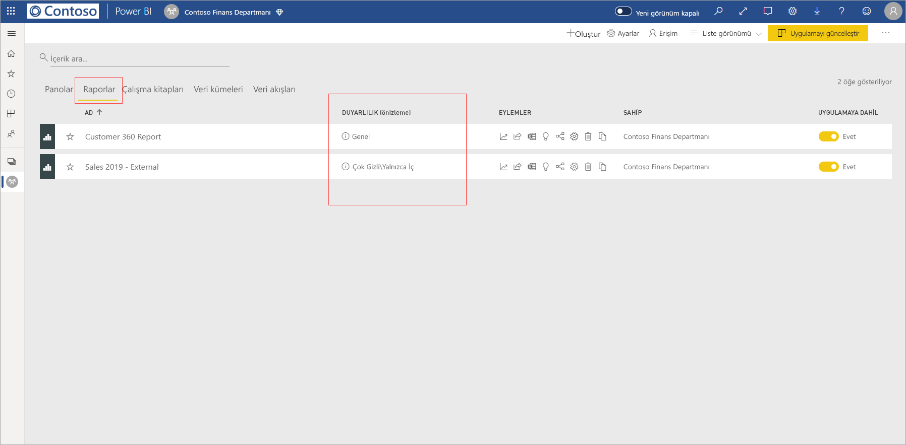
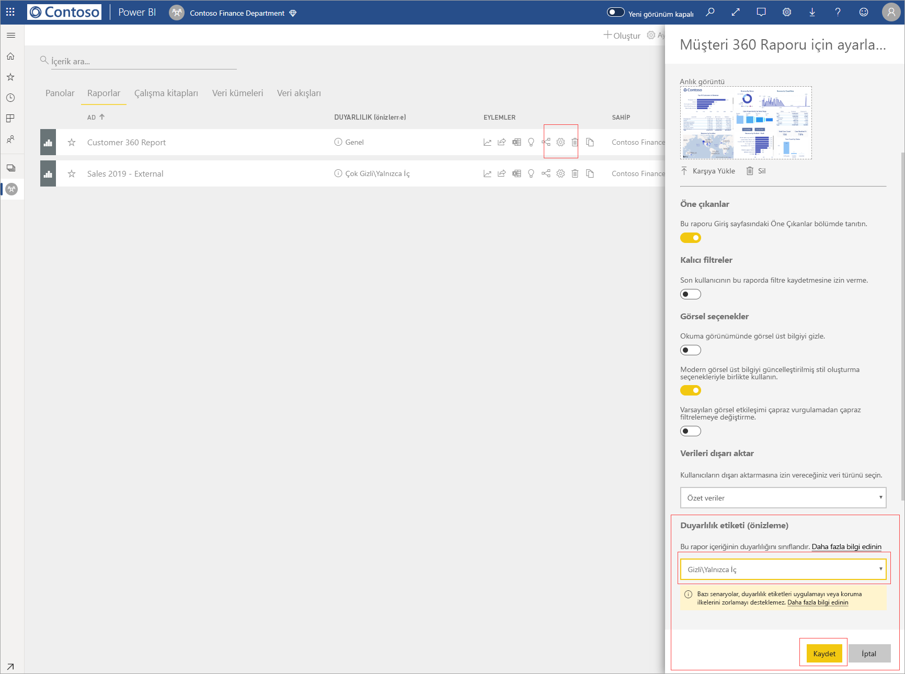
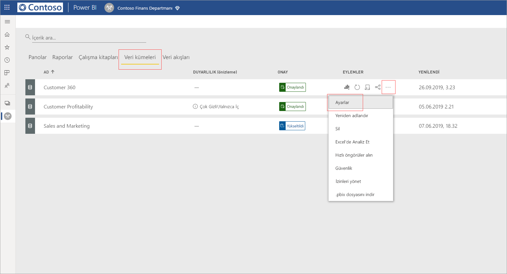
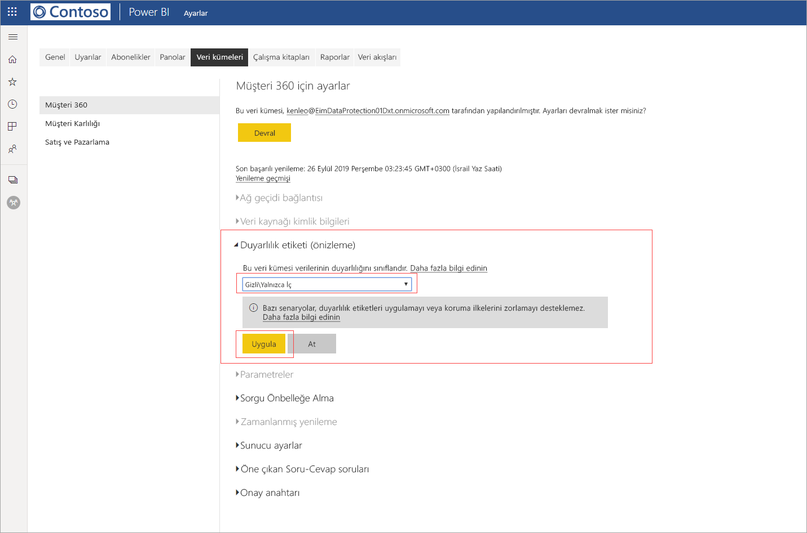
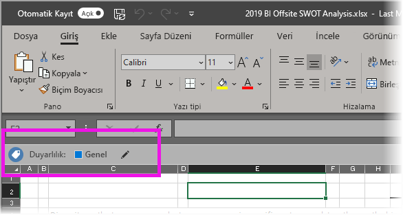

# Power BI'da veri duyarlılığı etiketleri uygulama

Rapor, pano, veri kümesi ve veri akışlarınıza uygulanan Microsoft Information Protection duyarlılık etiketleri, hassas içeriklerinizi yetkisiz veri erişimi ve sızıntılara karşı koruyabilir. Verilerinize veri duyarlılık etiketlerinin doğru şekilde uygulanması, verilerinize yalnızca yetkili kişilerin erişebilmesini sağlar. Bu makalede, içeriğinize duyarlılık etiketlerini nasıl uygulayacağınız gösterilmektedir.

Power BI’da duyarlılık etiketleri uygulayabilmek için:
* Bir Power BI Pro lisansına ve etiketlemek istediğiniz içerik üzerinde Düzenleme izinlerine sahip olmanız gerekir.
* [Power BI’da veri duyarlılık etiketlerini etkinleştirme](../admin/service-security-enable-data-sensitivity-labels.md#enable-data-sensitivity-labels) makalesinde açıklandığı gibi, veri duyarlılığı etiketlerini uygulama izinleri olan bir güvenlik grubuna dahil olmanız gerekir.
* Tüm [önkoşulların](../admin/service-security-data-protection-overview.md#requirements-for-using-sensitivity-labels-in-power-bi) ve [lisans gereksinimlerinin](../admin/service-security-data-protection-overview.md#licensing) karşılanması gerekir.

Power BI’da duyarlılık etiketleri hakkında daha fazla bilgi için bkz. [Power BI’da veri korumasına genel bakış](../admin/service-security-data-protection-overview.md).

## Duyarlılık etiketleri uygulama

Kiracınızda veri koruma etkin olduğunda panolar, raporlar, veri kümeleri ve veri akışlarının liste görünümünün duyarlılık sütununda duyarlılık etiketleri görünür.

**Rapor veya panodaki bir duyarlılık etiketini uygulama veya değiştirme**
1. **Daha fazla (...)** seçeneğine tıklayın.
1. **Ayarlar**'ı seçin.
1. Ayarlar kenar bölmesinde uygun duyarlılık etiketini seçin.
1. Ayarları kaydedin.

Aşağıdaki görüntüde rapordaki bu adımlar gösterilmektedir

**Veri kümesi veya veri akışındaki bir duyarlılık etiketini uygulama veya değiştirme**

1. **Diğer seçenekler (...)** öğesine tıklayın.
1. **Ayarlar**'ı seçin.
1. Ayarlar kenar bölmesinde uygun duyarlılık etiketini seçin.
1. Ayarları uygulayın.

Aşağıdaki iki görüntüde, veri kümesindeki bu adımlar gösterilmektedir.

**Diğer seçenekler (...)** öğesini ve sonra **Ayarlar**’ı seçin.

Ayarlar sayfasında duyarlılık etiketi bölümünü açın, istediğiniz duyarlılık etiketini seçin ve **Uygula**'ya tıklayın.

## Duyarlılık etiketlerini kaldırma
Rapor, pano, veri kümesi veya veri akışından duyarlılık etiketini kaldırmak için, [etiketleri uygulama işlemiyle aynı yordamı](#applying-sensitivity-labels) izleyin ama verilerin duyarlılığını sınıflandırmanız istendiğinde **(Hiçbiri)** öğesini seçin. 

## Dışarı aktarılmış dosyalarda veri koruması

Duyarlılık etiketleriyle ilişkili veri koruması, verilere yalnızca Excel, PowerPoint ve PDF dosyalarına aktarıldıklarında uygulanır. Excel’de Analiz Et, .csv’ye aktar, veri kümesi indirmeleri (.pbix), Power BI Hizmeti Live Connect veya diğer dışarı aktarma biçimleri için desteklenmez. Verileri dışarı aktarma seçenekleri Power BI kiracı yöneticisi [dışarı aktarma ayarları](../service-admin-portal.md#export-and-sharing-settings) tarafından kontrol edilir.

Duyarlılık etiketine sahip bir [rapordan verileri](https://docs.microsoft.com/power-bi/consumer/end-user-export) Excel, PowerPoint veya PDF dosyasına dışarı aktarıldığında duyarlılık etiketi, oluşturulan dosya tarafından devralınır. Duyarlılık etiketi dosyada görünür olur ve dosyaya erişim, yeterli izinlere sahip olan kullanıcılarla sınırlandırılır.

## Önemli noktalar ve sınırlamalar

Aşağıdaki listede, Power BI’daki duyarlılık etiketlerinin bazı sınırlamaları verilmiştir:

**Genel**
* Duyarlılık etiketleri yalnızca panolara, raporlara, veri kümelerine ve veri akışlarına uygulanabilir. Bunlar, şu anda [sayfalandırılmış raporlar](../paginated-reports/report-builder-power-bi.md) ve çalışma kitapları için kullanılamaz.
* Power BI varlıklarındaki duyarlılık etiketleri çalışma alanı listesi, veri kökeni, sık kullanılanlar, son kullanılanlar ve uygulama görünümlerinde görünür durumdadır. Etiketler şu anda “benimle paylaşılan” görünümünde görünür değildir. Ancak, görünür olmasa bile, Power BI varlığına uygulanmış bir etiketin Excel, PowerPoint ve PDF dosyalarına aktarılmış veriler üzerinde her zaman kalıcı olacağını unutmayın.
* Duyarlılık etiketleri yalnızca genel (ortak) buluttaki kiracılar için desteklenir. Duyarlılık etiketleri diğer bulutlardaki kiracılar için desteklenmez.
* Veri duyarlılık etiketleri şablon uygulamaları için desteklenmez. Şablon uygulama oluşturucu tarafından ayarlanan duyarlılık etiketleri, uygulama ayıklandığında ve yüklendiğinde kaldırılır ve yüklü bir şablon uygulamada uygulama tüketicisi tarafından yapıtlara eklenen duyarlılık etiketleri, uygulama güncelleştirildiğinde kaybolur (sıfırlanır).
* Power BI [İletme](https://docs.microsoft.com/microsoft-365/compliance/encryption-sensitivity-labels?view=o365-worldwide#let-users-assign-permissions), [kullanıcı tanımlı](https://docs.microsoft.com/microsoft-365/compliance/encryption-sensitivity-labels?view=o365-worldwide#let-users-assign-permissions) ve [HYOK](https://docs.microsoft.com/azure/information-protection/configure-adrms-restrictions) koruma türlerinin duyarlılık etiketlerini desteklemez. İletme ve kullanıcı tanımlı koruma türleri [Microsoft 365 güvenlik merkezinde](https://security.microsoft.com/) ve [Microsoft 365 uyumluluk merkezinde](https://compliance.microsoft.com/) tanımlanan etiketleri ifade eder.

**Dışarı Aktarma**
* Etiket ve koruma denetimleri yalnızca veriler Excel, PowerPoint ve PDF dosyalarına aktarıldığında zorlanır. Veriler .csv veya .pbix dosyalarına, Excel’de Analiz Et’e veya başka bir dışarı aktarma yoluna aktarıldığında etiket ve koruma zorlanmaz.
* Dışarı aktarılan bir dosyaya duyarlılık etiketi ve koruma uygulandığında, dosyaya içerik işaretlemesi eklenmez. Ancak, etiket içerik işaretlemelerini uygulayacak şekilde yapılandırıldıysa dosya Office masaüstü uygulamalarında açıldığında içerik işaretlemeleri Azure Information Protection birleşik etiketleme istemcisi tarafından otomatik olarak uygulanır. Masaüstü uygulamaları, mobil uygulamalar ve web uygulamaları için yerleşik etiketleme kullandığınızda içerik işaretlemeleri otomatik olarak uygulanmaz. Diğer ayrıntılar için bkz. [Office uygulamaları içerik işaretlemesini ve şifrelemeyi ne zaman uygular?](https://docs.microsoft.com/microsoft-365/compliance/sensitivity-labels-office-apps?view=o365-worldwide#when-office-apps-apply-content-marking-and-encryption).
* Power BI’dan dosya aktaran kullanıcının, duyarlık etiketi ayarlarına uygun olarak bu dosyaya erişme ve dosyayı düzenleme izinleri vardır. Verileri dışarı aktaran kullanıcı, dosya üzerinde sahip izinleri almaz.
* Veriler bir dosyaya dışarı aktarıldığında etiket uygulanamıyorsa dışarı aktarma işlemi başarısız olur. Dışarı aktarma işleminin etiket uygulanamadığından başarısız olup olmadığını denetlemek için başlık çubuğunun ortasındaki rapor veya pano adına tıklayın ve açılan bilgi menüsünde “Duyarlılık etiketi yüklenemiyor” yazıp yazmadığına bakın. Bu, uygulanan etiket güvenlik yöneticisi tarafından yayımdan kaldırıldıysa veya silindiyse ya da geçici bir sistem sorununun sonucu olarak oluşur.

## Sonraki adımlar

Bu makalede, Power BI'da veri duyarlılık etiketlerini uygulama işlemi açıklanmıştır. Aşağıdaki makalelerde Power BI’da veri koruma hakkında daha fazla bilgi verilmektedir. 

* [Power BI’da veri korumasına genel bakış](../admin/service-security-data-protection-overview.md)
* [Power BI'da veri duyarlılığı etiketlerini etkinleştirme](../admin/service-security-enable-data-sensitivity-labels.md)
* [Power BI’da Microsoft Cloud App Security denetimlerini kullanma](../admin/service-security-using-microsoft-cloud-app-security-controls.md)