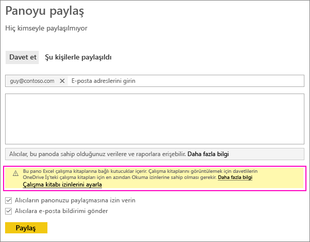
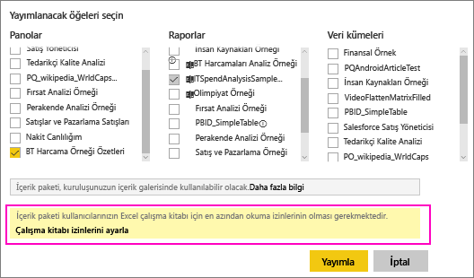
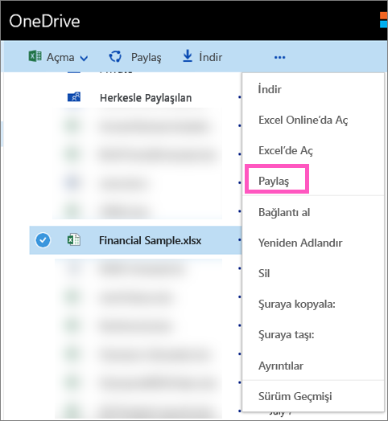

# OneDrive'daki bir Excel dosyasıyla bağlantılı bir Power BI panosunu paylaşma
Power BI'da,[OneDrive İş'teki Excel çalışma kitaplarına bağlanabilir](../connect-data/service-excel-workbook-files.md) ve söz konusu çalışma kitabındaki kutucukları bir panoya sabitleyebilirsiniz. Söz konusu panoyu paylaştığınızda veya panonun bulunduğu bir içerik paketi oluşturduğunuzda:

* İş arkadaşlarınız çalışma kitabının izinlerine ihtiyaç duymadan kutucukları görüntüleyebilir. Böylece, bir içerik paketi oluşturabilir ve iş arkadaşlarınızın, OneDrive'daki Excel çalışma kitabında oluşturulmuş kutucukları görebildiğinden emin olabilirsiniz.
* Kutucuğa dokunulduğunda çalışma kitabı Power BI'da açılır. Çalışma kitabı, yalnızca iş arkadaşlarınızın OneDrive İş'teki çalışma kitabına yönelik [okuma izinlerine](https://support.office.com/article/Share-documents-or-folders-in-Office-365-1fe37332-0f9a-4719-970e-d2578da4941c) sahip olması halinde açılır.

## Çalışma kitabı kutucukları içeren bir panoyu paylaşma
OneDrive İş'teki bir Excel çalışma kitabıyla bağlantılı bir panoyu paylaşmak için bkz. [Pano paylaşma](service-share-dashboards.md). Buradaki fark, bağlantılı Excel çalışma kitabına yönelik izinleri, paylaşımı gerçekleştirmeden önce değiştirme seçeneğine sahip olmanızdır.

  

1. İş arkadaşlarınızın e-posta adreslerini girin.
2. İş arkadaşlarınızın Power BI'da Excel çalışma kitabını görüntüleyebilmesini sağlamak için **Go to OneDrive for Business to set workbook permissions** (Çalışma kitabı izinlerini ayarlamak üzere OneDrive İş'e gidin) seçeneğini belirleyin.
3. OneDrive'da, gerektiği şekilde [izinleri değiştirin](https://support.office.com/article/Share-files-and-folders-and-change-permissions-9fcc2f7d-de0c-4cec-93b0-a82024800c07).
4. **Paylaş**'ı seçin.

>[!NOTE]
>İş arkadaşlarınız bu çalışma kitabından başka kutucuklar sabitleyemez veya Power BI'da Excel çalışma kitabına yönelik değişiklikler yapamaz.
> 
> 

## Çalışma kitabı kutucuklarının bulunduğu bir pano içeren kuruluş içerik paketleri oluşturma
[Bir içerik paketini yayımladığınızda](service-organizational-content-pack-create-and-publish.md) belirli iş arkadaşlarınıza veya gruplara erişim verirsiniz. Çalışma kitabı bağlantıları içeren bir içerik paketini yayımlayacağınız durumlarda, yayımlamayı gerçekleştirmeden önce bağlantılı Excel çalışma kitabına yönelik izinleri değiştirme seçeneğine sahip olursunuz.

1. **İçerik paketi oluştur** ekranında; e-posta adreslerini girin, içerik paketi için bir başlık ve açıklama sağlayın, ayrıca bir resim yükleyin.
2. OneDrive İş'teki Excel çalışma kitabıyla bağlantılı panoyu ve/veya raporu seçin.
   
    
3. **Go to OneDrive for Business to set workbook permissions** (Çalışma kitabı izinlerini ayarlamak üzere OneDrive İş'e gidin) seçeneğini belirleyin.
4. OneDrive'da, gerektiği şekilde [izinleri değiştirin](https://support.office.com/article/Share-files-and-folders-and-change-permissions-9fcc2f7d-de0c-4cec-93b0-a82024800c07).
5. **Yayımla** seçeneğini belirleyin.

## Power BI çalışma alanınızdan pano paylaşma
Power BI çalışma alanından pano paylaşma, dosyaların özel OneDrive İş'iniz yerine bir Microsoft 365 çalışma alanı sitesinde bulunması dışında, kendi çalışma alanınızdan pano paylaşmayla benzerlik gösterir. Çalışma alanınız dışındaki kişilerle panoyu paylaşmadan önce Excel çalışma kitabına yönelik izinleri değiştirin.

## Sonraki adımlar
* [Excel'deki kutucukları Power BI panolarına sabitleme](../create-reports/service-dashboard-pin-tile-from-excel.md)
* [Power BI hizmetinde tasarımcılara yönelik temel kavramlar](../fundamentals/service-basic-concepts.md)
* Başka bir sorunuz mu var? [Power BI Topluluğu'na başvurun](https://community.powerbi.com/)
