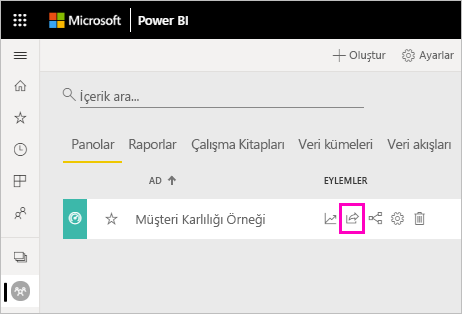
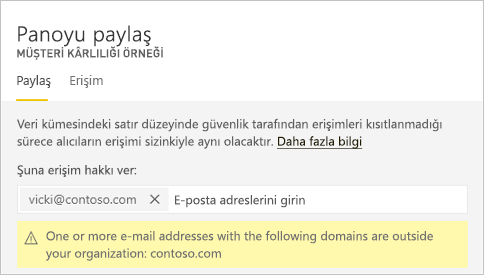
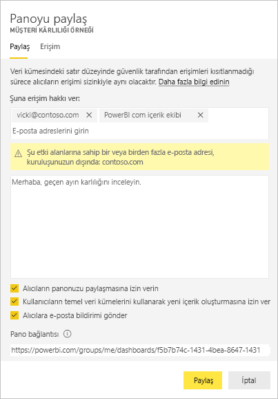
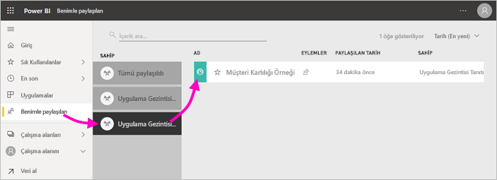
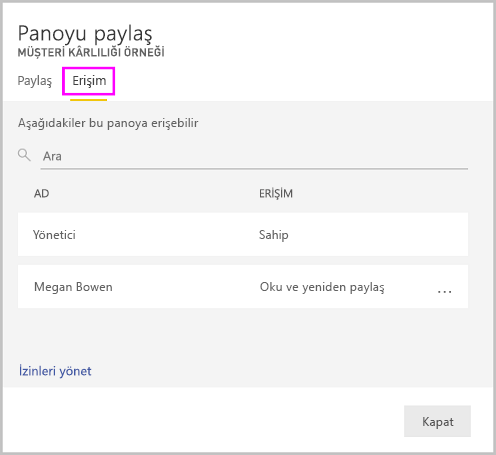
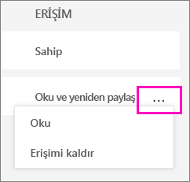
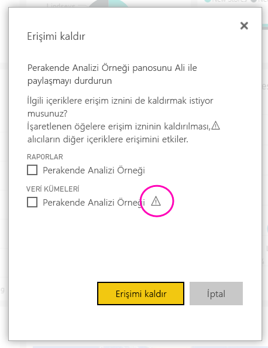

# Power BI panolarını ve raporları iş arkadaşlarıyla ve diğer kullanıcılarla paylaşma
*Paylaşım*, başkalarına Power BI hizmetindeki pano ve raporlarınıza erişim vermenin en kolay yoludur. Kuruluşunuz hem içindeki hem de dışındaki kişilerle paylaşabilirsiniz.

Bir pano veya raporu paylaştığınızda, paylaştığınız kişiler panoyu görüntüleyebilir ve panoyla etkileşim kurabilir ancak panoyu düzenleyemez. Temeldeki veri kümesine satır düzeyi güvenlik (RLS) uygulanmadığı sürece, sizin pano ve raporlarda gördüğünüz verilerin aynısını görürler ve veri kümesinin tamamına erişim elde ederler.  Paylaşımda bulunduğunuz iş arkadaşlarınız, izin vermeniz durumunda panoyu veya raporu kendi iş arkadaşlarıyla da paylaşabilir. Kuruluşunuz dışındaki kişiler panoyu ya da raporu görüntüleyebilir ve bunlarla etkileşim kurabilir ancak paylaşamaz. 

Panoları ve raporları Power BI hizmetindeki pek çok yerden paylaşabilirsiniz: Sık Kullanılanlar, En Son, Çalışma Alanım. Çalışma alanında [Yönetici, Üye veya Katkıda Bulunan rolüne](service-new-workspaces.md#roles-in-the-new-workspaces) sahipseniz, diğer çalışma alanlarından da paylaşabilirsiniz. Sahibi izin veriyorsa Benimle paylaşılanlar bölümündeki panoları ve raporları da paylaşabilirsiniz. 

Power BI hizmeti, pano ve raporlar üzerinde işbirliği yapmaya ve bunları dağıtmaya yönelik başka yöntemler de sunmaktadır. İçinde bulunduğunuz koşullara en uygun olan seçeneği bulmak için [Power BI’da işbirliği yapma ve paylaşma yollarını](service-how-to-collaborate-distribute-dashboards-reports.md) okuyun. 

Paylaşım ile kuruluşunuz içindeki veya dışındaki içeriği paylaşırken [Power BI Pro lisansı](../fundamentals/service-features-license-type.md) gerekir. İçerik [Premium kapasitede](../admin/service-premium-what-is.md) değilse, alıcılarınızın da Power BI Pro lisansı olması gerekir. 

Doğrudan Power BI Desktop’tan pano *paylaşamazsınız*. [Power BI Desktop’taki raporları](../create-reports/desktop-upload-desktop-files.md) Power BI hizmetinde yayımlarsınız. Bununla birlikte [Power BI mobil uygulamalarından pano paylaşabilirsiniz](../consumer/mobile/mobile-share-dashboard-from-the-mobile-apps.md).  

## Pano veya raporu paylaşma

1. Pano veya rapor listesinde ya da açık bir pano veya raporda **Paylaş** :::image type="icon" source="../media/power-bi-share-icon.png" border="false"::: seçeneğini belirleyin.

2. Üstteki kutuya kişilerin, dağıtım gruplarının veya güvenlik gruplarının tam e-posta adreslerini girin. Dinamik dağıtım listeleri ile paylaşım yapamazsınız. 
   
   Adresleri kuruluşunuz dışında olan kişilerle paylaşım yapabilirsiniz ancak bu durumda bir uyarıyla karşılaşırsınız. Bu makaledeki [kuruluşunuz dışında paylaşma](#share-a-dashboard-or-report-outside-your-organization) hakkında daha fazla bilgi edinin.
   
    
 
   >[!NOTE]
   >Giriş kutusu en çok 100 ayrı kullanıcı veya grubu destekler. Daha fazla kişiyle paylaşma yolları için bu makaledeki [100’den fazla kullanıcıyla paylaşma](#share-with-more-than-100-separate-users) bölümüne bakın.

3. İsterseniz ileti ekleyebilirsiniz. İsteğe bağlıdır.
4. İş arkadaşlarınızın içeriğinizi diğer kullanıcılarla paylaşmasına izin vermek için **Alıcıların panonuzu (veya raporunuzu) paylaşmasına izin verin** onay kutusunu işaretleyin.
   
   Başkalarının da paylaşmasına izin verme, *yeniden paylaşım* olarak adlandırılır. İzin vermeniz halinde alıcılar, Power BI hizmetinden ve mobil uygulamalardan yeniden paylaşım yapabilir veya e-posta davetini kuruluşunuzdaki diğer çalışanlara iletebilir. Davetin süresi bir ay sonra dolar. Kuruluşunuz dışındaki kişiler yeniden paylaşım yapamaz. İçeriğin sahibi olarak yeniden paylaşmayı devre dışı bırakabilir veya yeniden paylaşımı tek bir durum için geri alabilirsiniz. Bu makaledeki [Paylaşımı durdurma veya değiştirme](#stop-or-change-sharing) bölümüne bakın.

5. **Kullanıcıların temel veri kümelerini kullanarak yeni içerik oluşturmasına izin ver**'i seçerseniz, bu panonun veri kümesi temelinde diğer çalışma alanlarında kendi raporlarını oluşturabilirler. [Farklı çalışma alanlarından veri kümelerini temel alarak raporlar oluşturma](../connect-data/service-datasets-discover-across-workspaces.md) hakkında daha fazla bilgi edinin.

1. **Paylaş**'ı seçin.
   
     
   
   Power BI, kişilere (gruplara değil) paylaşılan içeriğin bağlantısını içeren bir e-posta daveti gönderir. Ekranda **Başarılı** bildirimi görüntülenir. 
   
   Kuruluşunuzdaki alıcılar bu bağlantıya tıkladığında Power BI, panoyu veya raporu bu kişilerin **Benimle paylaşılan** listesi sayfasına ekler. Söz konusu kişiler, adınızı seçerek kendileriyle paylaştığınız tüm içerikleri görebilir. 
   
   
   
   Kuruluşunuz dışındaki alıcılar bağlantıya tıkladığında panoyu veya raporu görür, ancak bunlar normal Power BI portalında görüntülenmez. Bu makaledeki [kuruluşunuz dışındaki kişilerle paylaşma](#share-a-dashboard-or-report-outside-your-organization) hakkında daha fazla bilgi edinin.

## Paylaştığınız panoya veya rapora kimlerin erişimi olduğunu görme
Bazen kimlerle paylaşımda bulunduğunuzu ve bu kişilerin kimlerle paylaşım yaptığını görmeniz gerekir.

1. Pano ve rapor listesinde veya panoda ya da raporda **Paylaş** :::image type="icon" source="../media/power-bi-share-icon.png" border="false"::: seçeneğini belirleyin. 
2. **Panoyu paylaş** veya **Raporu paylaş** iletişim kutusunda **Erişim**’i seçin.
   
    

    Kuruluşunuz dışındaki kişiler **Konuk** olarak listelenir.

    Bu görünümde, bu makalede [paylaşım izinlerini durdurabilir veya değiştirebilirsiniz](#stop-or-change-sharing). 

## Panoyu veya raporu kuruluşunuzun dışında paylaşma
Kuruluşunuz dışındaki kişilerle bir paylaşımda bulunduğunuzda bu kişiler, paylaşılan panonun veya raporun bağlantısını içeren bir e-posta alır. Paylaştığınız öğeleri görmek için Power BI’da oturum açmaları gerekir. Power BI Pro lisansları yoksa bağlantıya tıkladıktan sonra bir lisans almak için kaydolabilirler.

Oturum açtıktan sonra, paylaşılan panoyu veya raporu normal Power BI portallarında değil, kendi tarayıcı penceresinde görürler. Bu panoya veya rapora daha sonra erişmek için, bağlantıya yer işareti eklemeleri gerekir.

Bu panoda veya raporda herhangi bir içerik düzenlemesi yapamazlar. Grafiklerle etkileşimde bulunabilir ve filtreleri ya da dilimleyicileri değiştirebilirler, ancak değişikliklerini kaydedemezler. 

Paylaşılan panoyu veya raporu yalnızca doğrudan alıcılarınız görebilir. Örneğin, e-postayı Vicki@contoso.com adresine gönderdiyseniz panoyu yalnızca Vicki görebilir. Vicki bağlantıyı başka kişilere iletse bile, panoyu başka hiç kimse göremez. Vicki’nin buna erişmek için aynı e-posta adresini kullanması gerekir; Vicki başka herhangi bir e-posta adresiyle oturum açarsa panoya erişemez.

Şirket içi Analysis Services tablolu modellerde rol veya satır düzeyi güvenlik uygulanması durumunda kuruluşunuz dışındaki kişiler hiçbir veri görmez.

Dış e-posta adreslerine sahip kişilerin bulunduğu bir grupla paylaşmak için dağıtım grubu değil güvenlik grubu kullanın. Dağıtım grubundaki dış e-posta adresine sahip kullanıcılar, Azure Active Directory (Azure AD) B2B konuk kullanıcılar değilse paylaştığınız içeriği göremezler. [Azure AD B2B konuk kullanıcıları](../admin/service-admin-azure-ad-b2b.md) hakkında daha fazla bilgi edinin.

Kuruluşunuz dışındaki kişilere bir Power BI mobil uygulamasından bağlantı gönderirseniz ilgili kişiler bu bağlantıya tıkladığında pano, Power BI mobil uygulaması yerine bir tarayıcıda açılır.

### Dış kullanıcıların içeriği düzenlemesine izin verme

Power BI yöneticiniz dış konuk kullanıcıların kuruluş içeriklerini düzenlemelerine ve yönetmelerine izin verebilir. Bu durumda, dış kullanıcılarınız yalnızca tüketim deneyimine sahip olmayacaktır. Kuruluşunuzdaki içerikleri düzenleyebilir ve yönetebilirler. [Azure AD B2B ile Power BI içeriklerini dış konuk kullanıcılara dağıtma](../admin/service-admin-azure-ad-b2b.md) hakkında daha fazla bilgi edinin.

## 100’den fazla kullanıcı ile paylaşma

Tek bir paylaşım eyleminde en çok 100 kullanıcı veya grupla paylaşabilirsiniz. Öte yandan, bir öğe için 500'den fazla kullanıcıya erişim verebilirsiniz. Aşağıda bazı öneriler verilmiştir:

- Kullanıcıları tek tek belirterek birden çok kez paylaşma.
- Tüm kullanıcıları içeren bir kullanıcı grubuyla paylaşma. 
- Bir çalışma alanında rapor veya pano oluşturma, daha sonra çalışma alanından bir uygulama oluşturma. Uygulamayı birçok kişiyle paylaşabilirsiniz. [Power BI’da uygulama yayımlama](service-create-distribute-apps.md) hakkında daha fazla bilgi edinin.

## Paylaşımı durdurma veya değiştirme
Yalnızca pano veya rapor sahibi, yeniden paylaşımı etkinleştirebilir veya devre dışı bırakabilir.

### Henüz paylaşım daveti göndermediyseniz
* Göndermeden önce davetin alt bölümünde bulunan **Alıcıların panonuzu (veya raporunuzu) paylaşmasına izin verin** onay kutusunun işaretini kaldırın.

### Panoyu veya raporu zaten paylaştıysanız
1. Pano ve rapor listesinde veya panoda ya da raporda **Paylaş** :::image type="icon" source="../media/power-bi-share-icon.png" border="false"::: seçeneğini belirleyin. 
2. **Panoyu paylaş** veya **Raporu paylaş** iletişim kutusunda **Erişim**’i seçin.
   
    
3. **Oku ve yeniden paylaş**'ın yanındaki üç nokta simgesini ( **...** ) seçin ve şu seçeneği belirleyin:
   
   
   
   * **Oku**, söz konusu kişinin yeniden paylaşım yapmasını engeller.
   * **Erişimi kaldır**, söz konusu kişinin paylaşılan içeriği hiç görmemesini sağlar.

4. **Erişimi kaldır** iletişim kutusunda, ilgili içeriğe (raporlar ve veri kümeleri gibi) erişimi kaldırmak isteyip istemediğinize karar verin. Uyarı simgesine  sahip bir öğeyi kaldırmanız durumunda ilgili içeriği de silmenizde yarar vardır. Aksi takdirde, düzgün bir şekilde görüntülenmez.

    

## Sınırlamalar ve önemli noktalar
Pano ve rapor paylaşma ile ilgili olarak dikkat edilmesi gerekenler:

* İş arkadaşlarınızla bir pano paylaştığınızda, aynı zamanda temeldeki veri kümesini de paylaşmış olursunuz. İş arkadaşlarınız, erişimleri [satır düzeyi güvenlik (RLS)](../admin/service-admin-rls.md) tarafından kısıtlanmadığı sürece veri kümesinin tamamına erişim elde eder. Rapor yazarları, raporları görüntüleyip bunlarla etkileşim kurarken sütunları gizleme, görsellerdeki eylemleri sınırlandırma ve diğerleri gibi kullanıcı deneyimini özelleştiren özellikleri kullanabilir. Bu özelleştirilmiş kullanıcı deneyimi, veri kullanıcılarının veri kümesinde erişebileceği öğeleri kısıtlamaz. Her bir kullanıcının kimlik bilgilerinin erişebilecekleri verileri belirlemesini sağlamak için veri kümesinde [satır düzeyi güvenlik (RLS)](../admin/service-admin-rls.md) kullanın.
* Paylaştığınız herkes panonuzu görebilir ve [Okuma görünümünde](../consumer/end-user-reading-view.md#reading-view) ilgili raporlarla etkileşimde bulunabilir. Genel olarak, bu kişiler rapor oluşturamaz veya mevcut raporlarda yapılan değişiklikleri kaydedemez. Ancak, **Kullanıcıların temel veri kümelerini kullanarak yeni içerik oluşturmasına izin ver**'i seçerseniz, bu panonun veya raporun veri kümesi temelinde diğer çalışma alanlarında kendi raporlarını oluşturabilirler.
* Veri kümesini kimse göremez veya indiremez, ama Excel'de Çözümle özelliğini kullanarak veri kümesine doğrudan erişilebilir. Bir yönetici bir gruptaki herkes için Excel'de Çözümle özelliğini kısıtlayabilir. Öte yandan, bu kısıtlama söz konusu gruptaki herkes için ve grubun ait olduğu tüm çalışma alanlarında geçerli olur.
* Herkes el ile [verileri yenileyebilir](../connect-data/refresh-data.md).
* E-posta için Microsoft 365 hizmetini kullanıyorsanız bir dağıtım grubu ile ilişkili e-posta adresini girerek dağıtım grubu üyeleri ile paylaşımda bulunabilirsiniz.
* Sizinle aynı e-posta etki alanını paylaşan iş arkadaşlarınız ve e-posta etki alanı sizinkinden farklı olan ancak aynı kiracıda kayıtlı iş arkadaşlarınız, panoyu başka kullanıcılarla paylaşabilir. Örneğin, contoso.com ve contoso2.com etki alanlarının aynı kiracıda kayıtlı olduğunu ve e-posta adresinizin konrads@contoso.com olduğunu varsayalım. Paylaşmak için izin verdiğiniz sürece hem ravali@contoso.com hem de gustav@contoso2.com panonuzu paylaşabilir.
* İş arkadaşlarınızın belirli bir pano veya rapora zaten erişimi varsa panodayken veya rapordayken URL'yi kopyalayarak doğrudan bir bağlantı gönderebilirsiniz. Örneğin: `https://powerbi.com/dashboards/g12466b5-a452-4e55-8634-xxxxxxxxxxxx`.
* Aynı şekilde, iş arkadaşlarınızın belirli bir panoya zaten erişimi varsa [bağlantılı rapora yönelik doğrudan bir bağlantı gönderebilirsiniz](service-share-reports.md). 

## Sonraki adımlar

- [Panolar ve raporlar üzerinde nasıl işbirliği yapabilir ve bunları nasıl paylaşabilirim?](service-how-to-collaborate-distribute-dashboards-reports.md)
- [Panoları ve raporları paylaşma sorunlarını giderme](service-troubleshoot-sharing.md)
- [Paylaşılan panolara veya raporlara erişim isteme veya verme](service-request-access.md)
- [Filtre uygulanmış bir Power BI raporunu paylaşma](service-share-reports.md)
- Sorularınız mı var? [Power BI Topluluğu'na başvurun](https://community.powerbi.com/)
