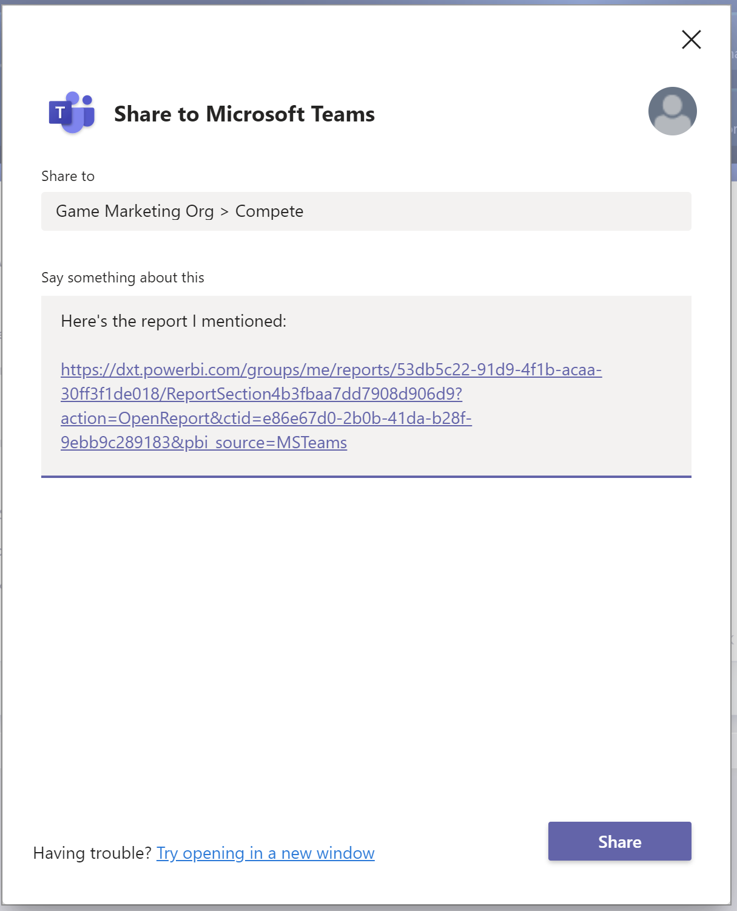

# Power BI hizmetinden doğrudan Microsoft Teams’de paylaşma

Power BI panolarını, raporlarını ve görsellerini Power BI hizmetinden doğrudan Microsoft Teams'le paylaşabilirsiniz. Power BI hizmetinde raporları ve panoları görüntülerken hızla konuşma başlatmak için **Teams’de Paylaş** özelliğini kullanın.

## Gereksinimler

Power BI’da **Teams'de Paylaş** işlevini kullanmak için bu ayarın aşağıdaki gibi olduğundan emin olun:

- Power BI yöneticileri Power BI yönetici portalındaki **Teams’de Paylaş** kiracı ayarını devre dışı bırakmamış. Bu ayar kuruluşların **Teams’de Paylaş** düğmelerini gizlemesini sağlar. Ayrıntılar için [Power BI yönetici portalı](../admin/service-admin-portal.md#share-to-teams) makalesine bakın.

Power BI ile Microsoft Teams’in birlikte nasıl çalıştığı hakkındaki arka plan bilgileri ve diğer gereksinimler için bkz. [Power BI ile Microsoft Teams’de işbirliği yapma](service-collaborate-microsoft-teams.md).

## Power BI içeriğini Microsoft Teams’de paylaşma

Power BI hizmetindeki raporlar, panolar ve görsellerin bağlantılarını Microsoft Teams kanalları ve sohbetlerinde paylaşmak için şu adımları izleyin.

1. Şu seçeneklerden birini belirtin:

   * Pano veya raporun eylem çubuğunda **Teams'de Paylaş**:

       
    
   * Tek bir görselin bağlam menüsündeki **Teams'de Paylaş**:
    
      

1. **Microsoft Teams’de Paylaş** iletişim kutusunda, bağlantıyı göndermek istediğiniz takımı veya kanalı seçin. Dilerseniz ileti ekleyebilirsiniz. Önce Microsoft Teams’de oturum açmanız istenebilir.

    

1. Bağlantıyı göndermek için **Paylaş**’ı seçin.
    
1. Bağlantı mevcut konuşmalara eklenir veya yeni bir sohbet başlatır.

    

1. Öğeyi Power BI hizmetinde açmak için bağlantıyı seçin.

1. Belirli bir görselde bağlam menüsü kullandıysanız rapor açıldığında görsel vurgulanır.

    

## Bilinen sorunlar ve sınırlamalar

- Power BI lisansına veya rapora erişim izni olmayan kullanıcılar “İçerik kullanılamıyor” iletisiyle karşılaşır.
- Tarayıcınızda katı gizlilik ayarları kullanılıyorsa **Teams’de Paylaş** düğmeleri çalışmayabilir. İletişim kutusu doğru biçimde açılmazsa **Sorun mu yaşıyorsunuz? Yeni bir pencerede açmayı deneyin** seçeneğini kullanın.
- **Teams’de Paylaş** düğmesinde bağlantı önizlemesi bulunmaz.
- Bağlantı önizlemeleri ve **Teams’de Paylaş**, kullanıcılara öğeyi görüntüleme izni vermez. İzinlerin ayrı yönetilmesi gerekir.
- Bir rapor yazarı görsel için **Daha fazla** seçeneğini **Kapalı** olarak ayarladığında görselin bağlam menülerinde **Teams’de Paylaş** düğmesi kullanılamaz.
- Diğer sorunlar için "Microsoft Teams'de İşbirliği Yapma" makalesinin [Bilinen sorunlar ve sınırlamalar](service-collaborate-microsoft-teams.md#known-issues-and-limitations) bölümüne bakın.

## Sonraki adımlar

- [Power BI ile Microsoft Teams’de işbirliği yapma](service-collaborate-microsoft-teams.md)

Başka bir sorunuz mu var? [Power BI Topluluğu'na sorun](https://community.powerbi.com/).
