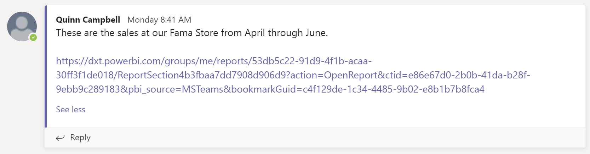

# Doğrudan Power BI hizmetinden Microsoft Teams'de sohbet

Power BI hizmetinden doğrudan Microsoft Teams'de Power BI panoları, raporları ve görselleri hakkında sohbet edebilirsiniz. Power BI hizmetinde raporları ve panoları görüntülerken hızla konuşma başlatmak için **Teams’de Sohbet** özelliğini kullanın.

## Gereksinimler

Power BI'da **Teams'de Sohbet** işlevini kullanmak için, Power BI yöneticisinin Power BI yönetici portalında **Teams'le Paylaş** kiracı ayarını devre dışı bırakmadığından emin olun. Bu ayar kuruluşların **Teams’de Sohbet** düğmelerini gizlemesini sağlar. Ayrıntılar için [Power BI yönetici portalı](../admin/service-admin-portal.md#share-to-teams) makalesine bakın.

Power BI ile Microsoft Teams’in birlikte nasıl çalıştığı hakkındaki arka plan bilgileri ve diğer gereksinimler için bkz. [Power BI ile Microsoft Teams’de işbirliği yapma](service-collaborate-microsoft-teams.md).

## Microsoft Teams'de Power BI içeriği hakkında sohbet etme

Power BI hizmetindeki raporlar, panolar ve görsellerin bağlantılarını paylaşmak ve Microsoft Teams kanalları ve sohbetlerinde bunlar hakkında sohbet etmek için şu adımları izleyin.

1. Şu seçeneklerden birini belirtin:

   * Pano veya raporun eylem çubuğunda **Teams'de Sohbet**:

       
    
   * Tek bir görselin bağlam menüsündeki **Teams'de Sohbet**:
    
      

1. **Microsoft Teams’de Paylaş** iletişim kutusunda, bağlantıyı göndermek istediğiniz takımı veya kanalı seçin. Dilerseniz ileti ekleyebilirsiniz. Önce Microsoft Teams’de oturum açmanız istenebilir.

    

1. Bağlantıyı göndermek için **Paylaş**’ı seçin.
    
1. Bağlantı mevcut konuşmalara eklenir veya yeni bir sohbet başlatır.

    

1. Öğeyi Power BI hizmetinde açmak için bağlantıyı seçin.

1. Belirli bir görselde bağlam menüsü kullandıysanız rapor açıldığında görsel vurgulanır.

    

## Bilinen sorunlar ve sınırlamalar

- Power BI lisansına veya rapora erişim izni olmayan kullanıcılar “İçerik kullanılamıyor” iletisiyle karşılaşır.
- Tarayıcınız katı gizlilik ayarları kullanıyorsa **Teams'de Sohbet** düğmeleri çalışmayabilir. İletişim kutusu doğru biçimde açılmazsa **Sorun mu yaşıyorsunuz? Yeni bir pencerede açmayı deneyin** seçeneğini kullanın.
- **Teams’de Sohbet** düğmesinde bağlantı önizlemesi bulunmaz.
- Bağlantı önizlemeleri ve **Teams’de Sohbet**, kullanıcılara öğeyi görüntüleme izni vermez. İzinlerin ayrı yönetilmesi gerekir.
- Bir rapor yazarı görsel için **Daha fazla** seçeneğini **Kapalı** olarak ayarladığında görselin bağlam menülerinde **Teams’de Sohbet** düğmesi kullanılamaz.
- Diğer sorunlar için "Microsoft Teams'de İşbirliği Yapma" makalesinin [Bilinen sorunlar ve sınırlamalar](service-collaborate-microsoft-teams.md#known-issues-and-limitations) bölümüne bakın.

## Sonraki adımlar

- [Power BI ile Microsoft Teams’de işbirliği yapma](service-collaborate-microsoft-teams.md)

Başka bir sorunuz mu var? [Power BI Topluluğu'na sorun](https://community.powerbi.com/).
