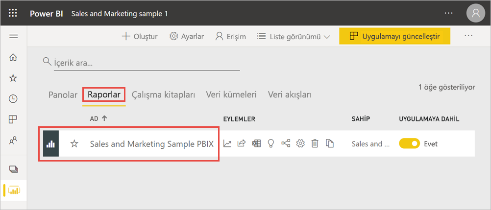
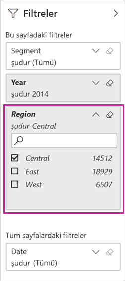
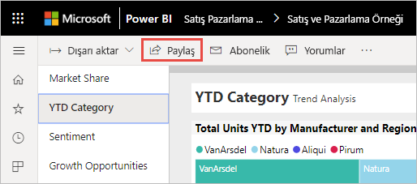
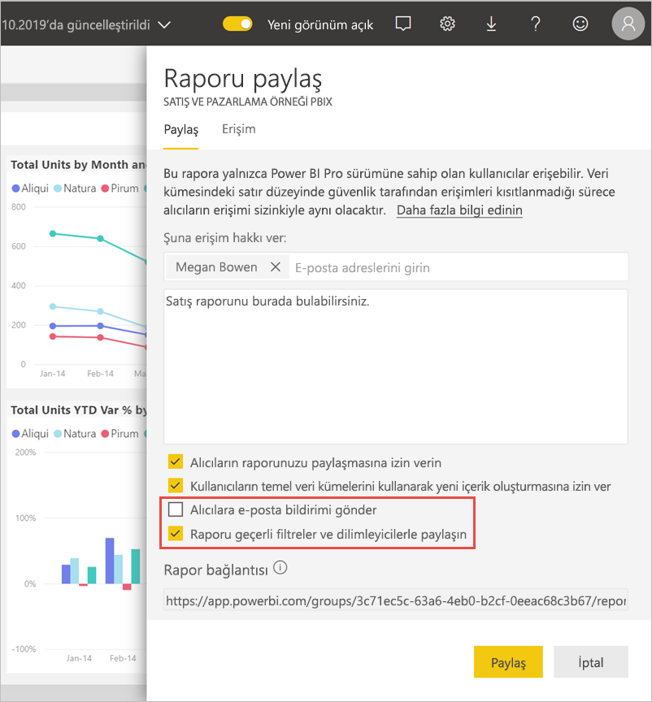
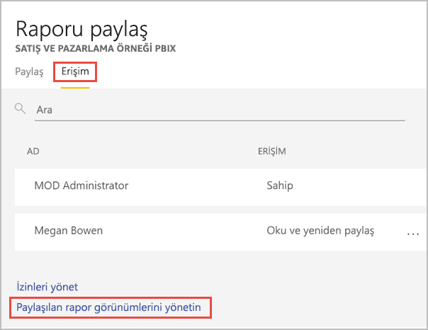
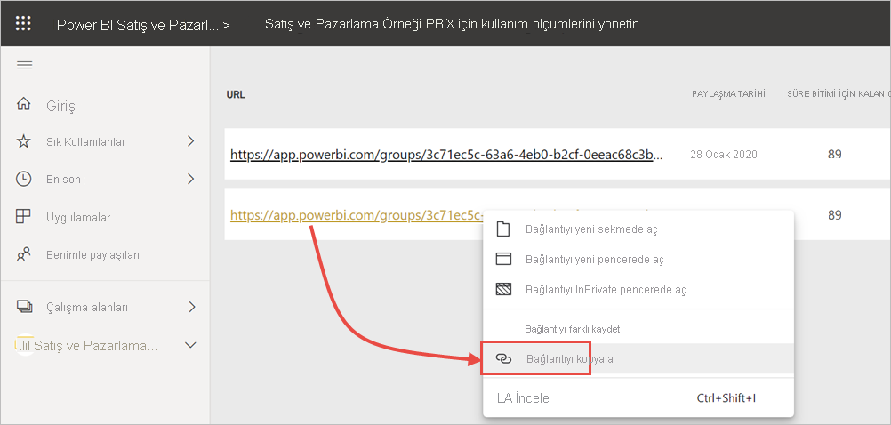

# Power BI raporunu filtreleme ve paylaşma
*Paylaşım*, kullanıcıların, panolarınıza ve raporlarınıza erişmesini sağlamanın iyi bir yoludur. Bir raporun filtrelenmiş bir sürümünü paylaşmak istediğinizde ne olur? Yalnızca belirli bir şehre, satış temsilcisine veya yıla ait verileri gösteren bir rapor istiyor olabilirsiniz. Bu makalede raporun nasıl filtrelendiği ve filtrelenmiş rapor sürümünün nasıl paylaşıldığı açıklanır. Filtrelenmiş raporu paylaşmanın bir diğer yolu da [rapor URL’sine sorgu parametreleri eklemektir](service-url-filters.md). Her iki durumda da alıcılar URL’yi ilk kez açtığında rapor filtrelenir. Rapordaki filtre seçimlerini temizleyebilirler.

Power BI ayrıca [işbirliği yapmak ve raporlarınızı dağıtmak için başka yollar sunar](service-how-to-collaborate-distribute-dashboards-reports.md). Paylaşımda siz ve alıcılarınız için bir [Power BI Pro lisansı](../fundamentals/service-features-license-type.md) gereklidir veya içerik [Premium kapasitede](../admin/service-premium-what-is.md) olmalıdır. 

## Örnek verilerle konuyu takip edin

Bu makalede Pazarlama ve Satış örneği şablon uygulamasını kullandık. Denemek ister misiniz? 

1. [Pazarlama ve Satış örneği şablon uygulamasını](https://appsource.microsoft.com/product/power-bi/microsoft-retail-analysis-sample.salesandmarketingsample?tab=Overview) yükleyin.
2. Uygulamayı seçin ve sonra da **Uygulamayı keşfet**’i seçin.

   

3. Kalem simgesini seçerek, uygulamayı yüklediğiniz çalışma alanını açın.

    

4. Çalışma alanı içerik listesinde **Raporlar**’ı ve sonra da **Satış ve Pazarlama Örneği PBIX** raporunu seçin.

    

    Artık konuyu takip etmeye hazırsınız.

## Raporda filtre ayarlama

[Düzenleme görünümünde](../consumer/end-user-reading-view.md) bir rapor açın ve filtre uygulayın.

Bu örnekte, Pazarlama ve Satış örneği şablon uygulamasının Yılbaşından Bugüne Kadar Kategori sayfasını, yalnızca **Region** değerinin **Central** değerine eşit olduğu değerleri gösterecek şekilde filtreliyoruz. 
 

Raporu kaydedin.

## Filtrelenmiş raporu paylaşma

1. **Paylaş**'ı seçin.

   

2. Bildirim yerine filtrelenmiş bağlantı gönderebilmek için **Alıcılara e-posta bildirimi gönder** seçeneğini temizleyin, **Geçerli filtreler ve dilimleyicilerle raporu paylaş**’ı ve sonra da **Paylaş**’ı seçin.

    

4. Yeniden **Paylaş**'ı seçin.

   

5. **Erişim** sekmesini ve ardından **Paylaşılan rapor görünümlerini yönet**’i seçin.

    

6. İstediğiniz URL’ye sağ tıklayın ve **Bağlantıyı kopyala**’yı seçin.

    

7. Bu bağlantıyı paylaştığınızda alıcılar filtrelenmiş raporunuzu görecektir. 

## Sınırlamalar ve önemli noktalar
Raporları paylaşma ile ilgili olarak dikkat edilmesi gerekenler:

* İzinleri yöneterek, rapor veya panoları paylaşarak ya da uygulama yayımlayarak bir veri kümesi paylaştığınızda, [satır düzeyi güvenlik (RLS)](../admin/service-admin-rls.md) tarafından erişimleri sınırlanmadığı sürece tüm veri kümesine erişim vermiş olursunuz. Rapor yazarları, raporları görüntüleyip bunlarla etkileşim kurarken sütunları gizleme, görsellerdeki eylemleri sınırlandırma ve diğerleri gibi kullanıcı deneyimini özelleştiren özellikleri kullanabilir. Bu özelleştirilmiş kullanıcı deneyimleri, veri kümesinde hangi veri erişiminin erişebileceğini kısıtlamaz. Her bir kullanıcının kimlik bilgilerinin erişebilecekleri verileri belirlemesini sağlamak için veri kümesinde [satır düzeyi güvenlik (RLS)](../admin/service-admin-rls.md) kullanın.
* 90 gün içinde paylaşılan rapor görünümü bağlantısına hiç kimse erişildiyse, bağlantı otomatik olarak sona erer.  

## Sonraki adımlar
* [Power BI'da çalışmanızı paylaşmanın yolları](service-how-to-collaborate-distribute-dashboards-reports.md)
* [Bir panoyu paylaşma](service-share-dashboards.md)
* Başka bir sorunuz mu var? [Power BI Topluluğu'na başvurun](https://community.powerbi.com/).
* Geri bildirimde bulunmak ister misiniz? [Power BI Topluluğu sitesine](https://community.powerbi.com/) giderek önerilerinizi belirtin.
