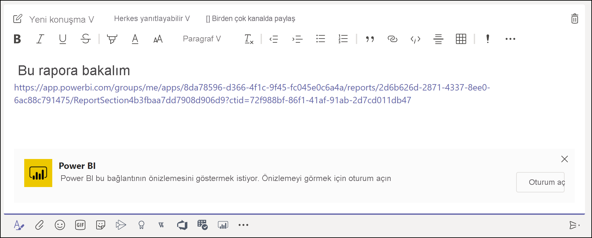
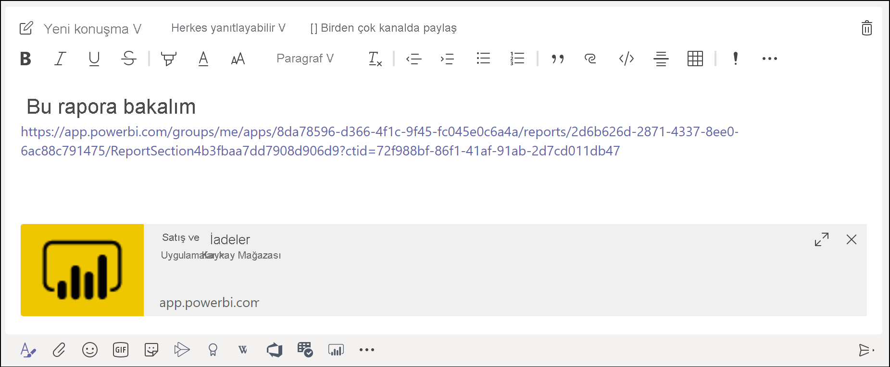
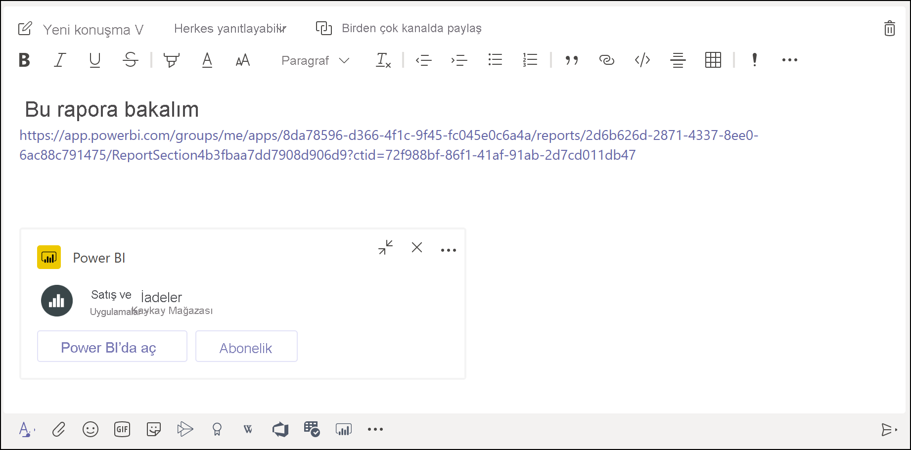

# Microsoft Teams’de Power BI bağlantı önizlemesi alma

Rapor, pano ve uygulamalarınızın bağlantısını Microsoft Teams ileti kutusuna yapıştırdığınızda, bağlantı önizlemesi bu bağlantı hakkında bilgiler gösterir. Bağlantı önizlemeleri, Power BI’daki şu öğeler için sağlanır:

- Raporlar
- Panolar
- Uygulamalar

Bağlantı önizleme hizmeti için kullanıcılarınızın oturum açması gerekir. Oturumu kapatmak için ileti kutusunun altındaki **Power BI** simgesini seçin. Sonra **Oturumu kapat** seçeneğini belirleyin.

Power BI ile Microsoft Teams’in birlikte nasıl çalıştığı hakkındaki arka plan bilgileri ve karşılanacak gereksinimler için bkz. [Power BI ile Microsoft Teams’de işbirliği yapma](service-collaborate-microsoft-teams.md).

## Bağlantı önizlemesini alma

Power BI hizmetindeki içeriğin bağlantı önizlemesini almak için bu adımları izleyin.

1. Bağlantıyı, Power BI hizmetindeki bir rapor, pano veya uygulamaya kopyalayın. Örneğin, tarayıcınızın adres çubuğundaki bağlantıyı kopyalayın.

1. Bağlantıyı Microsoft Teams ileti kutusuna yapıştırın. İstenirse bağlantı önizleme hizmetinde oturum açın. Bağlantı önizlemesinin yüklenmesi için birkaç saniye beklemeniz gerekebilir.

    

1. Temel bağlantı önizlemesi, başarıyla oturum açıldıktan sonra gösterilir.

    

1. Zengin önizleme kartını göstermek için **Genişlet** simgesini seçin.

    

1. Zengin bağlantı önizlemesi kartı, bağlantıyı ve ilgili eylem düğmelerini gösterir.

    

1. İletiyi gönderin.

## Bilinen sorunlar ve sınırlamalar

- Bağlantı önizleme hizmetinde çoklu oturum açma desteklenmez.
- Bağlantı önizlemeleri, toplantı sohbetinde veya özel kanallarda çalışmaz.
- Diğer sorunlar için "Microsoft Teams'de İşbirliği Yapma" makalesinin [Bilinen sorunlar ve sınırlamalar](service-collaborate-microsoft-teams.md#known-issues-and-limitations) bölümüne bakın.

## Sonraki adımlar

- [Power BI ile Microsoft Teams’de işbirliği yapma](service-collaborate-microsoft-teams.md)

Başka bir sorunuz mu var? [Power BI Topluluğu'na sorun](https://community.powerbi.com/).
