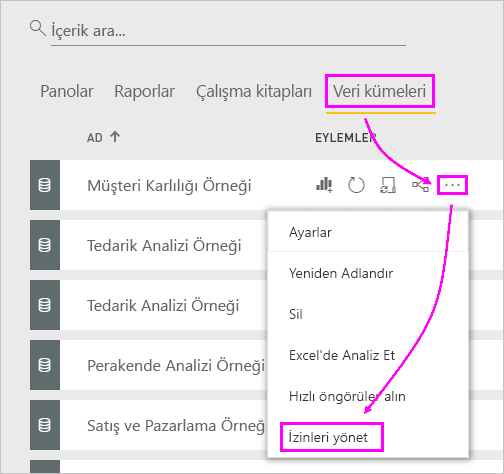

# Panoları ve raporları paylaşma sorunlarını giderme

Bir panoyu veya raporu paylaşırken ya da bunlar sizinle paylaşılırken ortaya çıkabilecek yaygın sorunlardan bazıları aşağıda verilmiştir. 

## Pano alıcıları bir kutucukta kilit simgesi görüyor

Pano paylaşımında bulunduğunuz kişiler burada kilitli bir kutucuk veya bir raporu görüntülemeye çalıştıklarında "İzin gerekiyor" iletisi görebilir.

Bu durumda bu kişilere, temel alınan veri kümesine yönelik erişim izni vermeniz gerekir.

1. İçerik listenizdeki **Veri kümeleri** sekmesine gidin.

1. Veri kümesinin yanındaki üç nokta ( **...** ) simgesini seçin ve ardından **İzinleri yönet** seçeneğini belirleyin.

    

1. **Kullanıcı ekle**'yi seçin.

    

1. Kişilerin, dağıtım gruplarının veya güvenlik gruplarının tam e-posta adreslerini girin. Dinamik dağıtım listeleri ile paylaşım yapamazsınız.

    

1. **Ekle**'yi seçin.

## Bir pano veya raporu paylaşamıyorum

Bir panoyu veya raporu paylaşmak için, temel alınan içeriği (ilgili tüm raporlar ve veri kümeleri) yeniden paylaşma iznine sahip olmanız gerekir. Paylaşım yapamayacağınızı belirten bir iletiyle karşılaşırsanız raporun yazarından size söz konusu raporlar ve veri kümeleri için yeniden paylaşma izni vermesini isteyin.

## Panoya veya rapora erişimim yok

Bir rapor veya pano bağlantısını seçtiğinizde “Erişim iste” iletisini görüyorsanız bu bağlantıyı görme izniniz yoktur. [Bu bağlantıya erişim istemeniz](service-request-access.md) gerekir.

## Sonraki adımlar

- [Power BI panolarını ve raporlarını iş arkadaşlarıyla ve başkalarıyla paylaşma](service-share-dashboards.md)
- [Panolar ve raporlar üzerinde nasıl işbirliği yapabilir ve bunları nasıl paylaşabilirim?](service-how-to-collaborate-distribute-dashboards-reports.md)
-  [Filtre uygulanmış bir Power BI raporunu paylaşma](service-share-reports.md)
- Sorularınız mı var? [Power BI Topluluğu'na başvurun](https://community.powerbi.com/)
