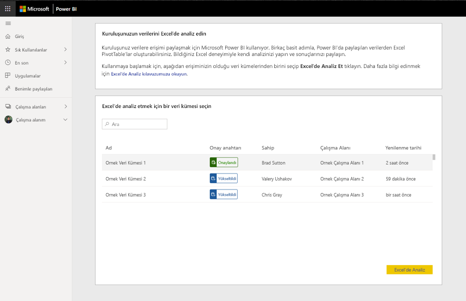
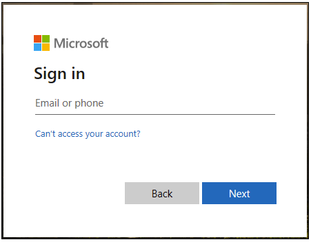

# Öğretici: Power BI Excel'de Çözümle özelliğini kullanma, Excel'den başlama

Kuruluşunuz verilere erişimi paylaşmak için Power BI kullanıyor. Excel'de PivotTable ve PivotChart oluşturmak için Excel'den Power BI Excel'de Çözümle özelliğini başlatın. Bu öğeler analiz süreçlerinize ek bağlam katabilir veya ilgili veri kümelerini bulmak ve içeri aktarmak için gereken süreyi azaltabilir.

Excel'de bir Power BI veri kümesiyle çalışmaya başlamak için "Excel'de Çözümle"yi seçin. Verileri kullanan bir PivotTable oluşturmaya yönlendirilirsiniz.  

Veri Kümeleri sayfasına dönerek kuruluşunuz tarafından paylaşılan diğer veri kümelerini bulabilirsiniz.

Bu noktada sorunla karşılaşırsanız, aşağıdaki akışın ilgili adımında **Hayır**’ı seçin ve bağlantılı forma geri bildiriminizi girin.  

Bu öğreticide aşağıdakilerin nasıl yapılacağını öğreneceksiniz:

> [!div class="checklist"]
> * Power BI Veri Kümeleri sayfasından ODC dosyasını indirme.
> * Excel’den veri kümenize erişimi etkinleştirme.
> * PivotTable, grafik ve çalışma sayfası oluşturmak için veri kümenizi kullanmaya başlama

## Önkoşullar

Bu öğreticiyi tamamlamak için aşağıdakiler gerekir:

* Power BI hesabı. Power BI’ya kaydolmadıysanız başlamadan önce [ücretsiz deneme için kaydolun](https://app.powerbi.com/signupredirect?pbi_source=web).

* [Power BI hizmeti ile çalışmaya başlama](https://docs.microsoft.com/power-bi/service-get-started) öğreticisinde listelenen tüm adımları rahatça izleyebildiğinizden emin olun.

* Power BI Premium veri kümesine ve Power BI Pro lisansına ihtiyacınız vardır; daha fazla bilgi için [Power BI Premium nedir?](https://docs.microsoft.com/power-bi/service-premium-what-is) sayfasını ziyaret edin.

* Önkoşulların tam listesini kapsamlı [Excel’de Çözümle](https://docs.microsoft.com/power-bi/service-analyze-in-excel#requirements) belgesinde bulabilirsiniz.

* Etkin bir [Microsoft Office E5 aboneliği](https://www.microsoft.com/microsoft-365/business/office-365-enterprise-e5-business-software?activetab=pivot%3aoverviewtab)

## Kullanmaya başlayın

Excel’de çalışmaya başlayın, Power BI paylaşılan verileriyle PivotTable oluşturma seçeneğini belirtin ve Power BI Veri Kümeleri sayfasına gidin.

Excel’de Çözümle iş akışını kullanırken size yol gösteren çeşitli yönergeler göreceksiniz. Devam etmek için her adımı tamamlayıp tamamlamadığınızı belirtin. Herhangi bir adımda sorunla karşılaşırsanız **Hayır**’ı seçin ve ilgili formda geri bildiriminizi sağlayın.

## ODC dosyasını indirme ve açma

İlgili listeden ve ilişkili çalışma alanından veri kümenizi seçin ve sonra da Excel’de Çözümle’ye tıklayın. Power BI bir ODC dosyası oluşturur ve bu dosyayı tarayıcıdan bilgisayarınıza indirir.

Dosyayı Excel'de açtığınızda boş bir PivotTable ve Alanlar listesiyle birlikte, Power BI veri kümesinden tablolar, alanlar ve ölçüler belirir. Excel'de tıpkı yerel bir veri kümesiyle çalışır gibi söz konusu veritabanını çözümleyebilir, PivotTable'lar ve grafikler oluşturabilirsiniz.

## Veri bağlantılarını etkinleştirme

Power BI verilerini Excel’de analiz etmek için bağlantıya güvenmeniz istenebilir. Yöneticiler Analysis Services Veritabanlarındaki şirket içi veri kümelerinde Excel'de Çözümle kullanımını Power BI Yönetici Portalı’nda devre dışı bırakabilir.

## Güncelleştirmeleri yükleme ve kimlik doğrulaması yapma

Yeni ODC dosyasını ilk kez açtığınızda Power BI hesabınızla kimlik doğrulaması yapmanız da istenebilir.  İş akışı sırasında sorunla karşılaşırsanız, daha fazla bilgi edinmek için kapsamlı [Excel’de Çözümle](https://docs.microsoft.com/power-bi/service-analyze-in-excel#sign-in-to-power-bi ) belgesini ziyaret edin veya Hayır’a tıklayın.

## İstediğiniz gibi çözümleme

Diğer yerel çalışma kitaplarına benzer biçimde, Excel’de Çözümle özelliği PivotTable’lar, grafikler oluşturmanıza, veri eklemenize ve verilerinizin görünümleriyle farklı çalışma sayfaları oluşturmanıza olanak tanır. Excel'de Çözümle özelliği, verileri tüm ayrıntı düzeylerinde veri kümesine erişim izni olan tüm kullanıcıların kullanımına sunar. Bu çalışma kitabını kaydedebilirsiniz ama Power BI’a yayımlayamaz veya geri aktaramazsınız ya da kuruluşunuzdaki diğer kullanıcılarla paylaşamazsınız. Daha fazla bilgi edinmek ve diğer kullanım örneklerini görmek için [Excel’de Çözümle](https://docs.microsoft.com/power-bi/service-analyze-in-excel#analyze-away) sayfasını ziyaret edin.

## Kaynakları temizleme

Power BI Hizmeti ve Veri Kümeleri sayfasıyla kurulan etkileşim ODC dosyasını indirmekle ve iş akışına tıklamakla sınırlı olmalıdır. Bu adımlardan herhangi birinde sorunla karşılaşırsanız, uygun adımda **Hayır**’ı seçin ve bağlantılı formda geri bildiriminizi sağlayın. Formda, sorunla ilgili daha fazla bilgi için bir bağlantı bulunur. Veri Kümeleri sayfasını yeniden ziyaret edip işlemi bir kez daha deneyin veya başka bir veri kümesi seçin.

## Sonraki adımlar

Aşağıdaki makaleler de ilginizi çekebilir:

* [Power BI Desktop'ta çapraz rapor detaylandırma özelliğini kullanma](https://docs.microsoft.com/power-bi/desktop-cross-report-drill-through)

* [Power BI Desktop’ta dilimleyicileri kullanma](https://docs.microsoft.com/power-bi/visuals/power-bi-visualization-slicers)
