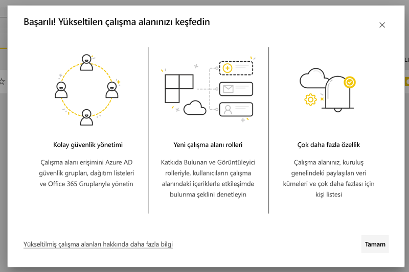
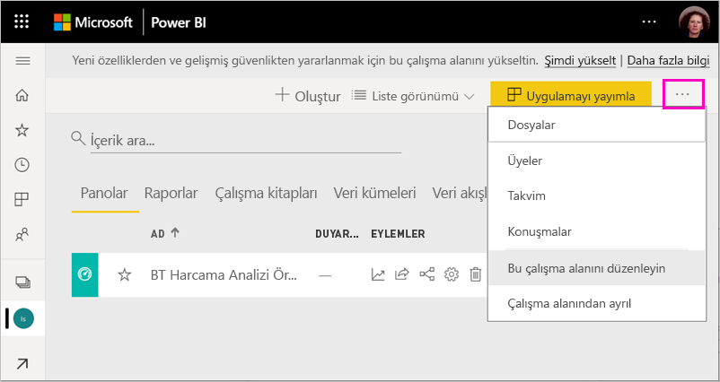
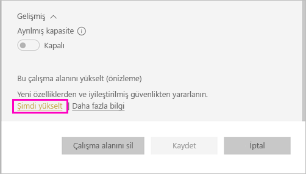
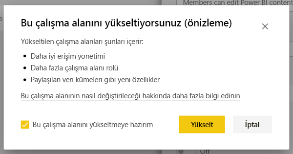
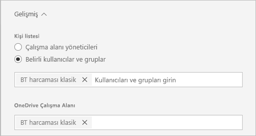
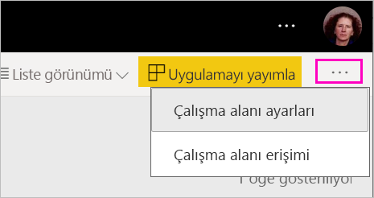
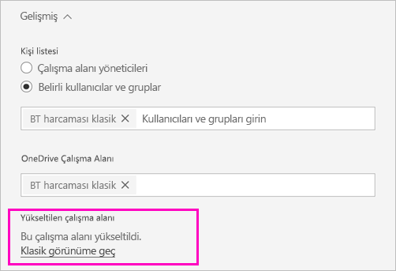
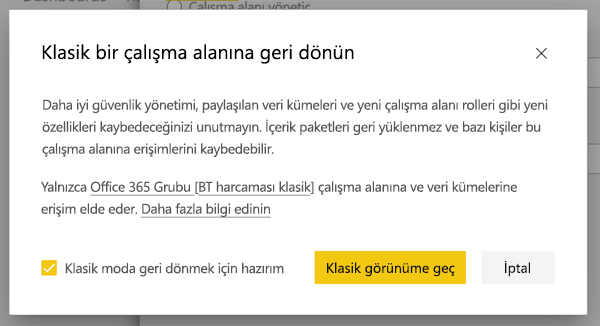
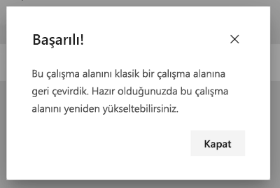

# Power BI'da klasik çalışma alanlarını yeni çalışma alanlarına yükseltme

Bu makalede klasik bir çalışma alanını yeni çalışma alanı deneyimine yükseltme veya *geçirme* işlemleri açıklanır. Tüm klasik çalışma alanlarını yükseltebilirsiniz. Yeni çalışma alanlarında daha ayrıntılı çalışma alanı rolleri olduğundan, içeriğe erişimi daha iyi yönetebilirsiniz. Ayrıca yükseltilen çalışma alanlarını daha büyük bir esneklikle yönetebilirsiniz çünkü özgün Microsoft 365 gruplarıyla aralarında daha gevşek bir bağlantı vardır. [Yeni çalışma alanı deneyimi](service-new-workspaces.md) hakkında bilgi edinin.

>[!NOTE]
>Çalışma alanı yükseltmesi Genel Önizleme olarak kullanıma sunuldu. 

Öte yandan çalışma alanınızda bilmeniz ve planlama yapmanız gereken değişiklikler olabilir. Örneğin yeni çalışma alanı deneyiminde içerik paketleri desteklenmez. Bu makalenin devamındaki [Yükseltmenin önemli noktaları ve sınırlamaları](#upgrade-considerations-and-limitations) bölümüne bakın.

## Yükseltme sonrasında yapmanız gerekenler

Yükseltmeniz uygulandıktan *sonra* birkaç şey yapmalısınız. Yükseltme *öncesinde* bunları planlamanız iyi olacaktır:
- Erişim listesini gözden geçirin ve [yükseltmeden sonraki izinleri](#permissions-after-upgrade) anlayın.
- [Kişi listesini](#modify-the-contact-list) gözden geçirin ve istediğiniz gibi ayarlandığından emin olun.
- Henüz yapmadıysanız [yeni çalışma alanı deneyimi](service-new-workspaces.md) hakkında bilgi edinin.

## Klasik çalışma alanını yükseltme

Her çalışma alanı yöneticisi çalışma alanını yükseltebilir. Klasik çalışma alanlarında, çalışma alanının yöneticisi olmak için temel Microsoft 365 grubunun Sahibi olmanız gerekir. Çalışma alanını yükseltmek için aşağıdaki adımları izleyin.

1. Çalışma alanı içerik listesinde **Diğer seçenekler** ( **...** ) > **Bu çalışma alanını düzenle**'yi seçin.

    

1. **Gelişmiş** seçeneğini genişletin ve **Şimdi yükselt**'i seçin.

    

1. İletişim kutusundaki bilgileri gözden geçirin. Çalışma alanında içerik paketleri yayımladıysanız veya yüklediyseniz uyarılar görürsünüz. Hazır olduğunuzda **Bu çalışma alanını yükseltmeye hazırım** seçeneğini işaretleyin ve **Yükselt**'i seçin.

    

2. Yükseltme sırasında **Yükseltiliyor** iletisini görürsünüz. Çalışma alanınızın yükseltilmesi genellikle bir dakikadan kısa sürer.

1. Yükseltme bittikten sonra **Başarılı** iletişim kutusunu görürsünüz. Yeni çalışma alanlarının klasik çalışma alanlarından nasıl farklı olduğunu anlamak için [Yeni çalışma alanlarında çalışmayı düzenleme](service-new-workspaces.md) makalesini okumanızı öneririz.

### Diğer çalışma alanı kullanıcıları üzerindeki etkisi

Yükseltmeyi az sayıda kullanıcının etkin olarak çalışma alanını görüntülediği ve düzenlediği iş dışı saatlerde yapmanızı öneririz.

Çalışma alanını etkin bir şekilde kullanan kullanıcılardan tarayıcılarını yenilemeleri istenir. O sırada bir raporu düzenlemekte olan kullanıcılara, yenileme öncesinde kaydetme seçeneği sağlanır.

## Yükseltmenin önemli noktaları ve sınırlamaları

- Çalışma alanınızın URL'leri ve kimlikleri, çalışma alanındaki içerik ve çalışma alanından yayımlanmış uygulama değişmez. Çalışma alanınıza yüklenmiş olan içerik paketlerinin içeriği ayrı işlenir. Ayrıntılar için bu makalenin [Yükseltme sırasında içerik paketleri](#content-packs-during-upgrade) bölümüne bakın.
- Yeni çalışma alanı deneyiminde içerik paketleri desteklenmez. Yükseltme sırasında bunların nasıl işlendiğini öğrenmek için [yayımlanmış içerik paketleri](#published-content-packs) veya [yüklenmiş içerik paketleri](#installed-content-packs) ile ilgili bölümleri okuyun. Çalışma alanınıza yüklenmiş veya yayımlanmış içerik paketlerini yükseltme yapmadan önce silmenizi öneririz.
- Klasik çalışma alanınızın Microsoft 365 grubu Power BI'daki çalışma alanı yükseltmesinden etkilenmez. Microsoft 365 tarafından yönetilen Teams, SharePoint siteleri, posta kutuları veya diğer kaynaklar değişmez. Power BI çalışma alanınızı yükselttikten sonra bunlar olduğu gibi kalır. Microsoft 365 grubu daha önce olduğu gibi var olmaya devam eder.
- Yükseltmeden sonra çalışma alanınızın güvenliği sağlama yönteminde değişiklikler olur. Ayrıntılar için [yükseltmeden sonra çalışma alanı izinleri](#permissions-after-upgrade) bölümüne bakın.
- İhtiyacınız olabileceği düşünülerek **klasik çalışma alanına dönme** seçeneği sağlanmıştır. Öte yandan bu seçenek çalışma alanının yükseltme öncesi durumunu tüm yönleriyle geri yüklemez. Yalnızca yeni çalışma alanı deneyiminde çalışan özellikleri kullanmaya başladıysanız geri dönemezsiniz. Geri dönme seçeneği, yükseltmeyi izleyen 30 gün içinde kullanılabilir.

## Yükseltmeden sonraki izinler

Yükseltmeden sonraki izinleri gözden geçirmek için çalışma alanı içerik listesinin üst kısmındaki menü çubuğunda **Erişim**'i seçin.

Yükseltilen çalışma alanında tüm Microsoft 365 gruplarının Sahipleri tek tek Yönetici rolüne eklenir. Microsoft 365 grubunun kendisini bir çalışma alanı rolüne eklenir. Hangi role ekleneceği klasik çalışma alanının *salt okuma* veya *okuma-yazma* olarak ayarlanmasına bağlıdır:

- Çalışma alanı **Üyeler Power BI içeriğini düzenlenebilir** olarak ayarlandıysa, yükseltmeden sonra Microsoft 365 grubu çalışma alanı listesine **Üye** rolüyle eklenir.
- Çalışma alanı **Üyeler Power BI içeriğini yalnızca okuyabilir** olarak ayarlandıysa, yükseltmeden sonra Microsoft 365 grubu çalışma alanı listesine **Görüntüleyen** rolüyle eklenir.

Microsoft 365 grubuna çalışma alanında bir rol verildiğinden, yükseltmeden sonra Microsoft 365 grubuna eklenen tüm kullanıcılar çalışma alanında bu role sahip olur. Bununla birlikte yükseltmeden sonra Microsoft 365 grubuna yeni Sahipler eklerseniz, bunların çalışma alanında Yönetici rolü olmaz.

### Yükseltmeden önceki ve sonraki roller arasındaki farklar

Çalışma alanı rolleri klasik çalışma alanlarıyla yeni çalışma alanlarında birbirinden farklıdır. Yeni çalışma alanı deneyimi Microsoft 365 gruplarına, güvenlik gruplarına veya dağıtım listelerine çalışma alanı rolleri vermenize olanak tanır.

- **Üyeler** tek tek öğeleri paylaşabilir ve Üye, Katkıda Bulunan veya Görüntüleyen rolleri aracılığıyla çalışma alanının tamamına erişim verebilir
- **Görüntüleyenler** içeriği yalnızca görüntüleyebilir ve Oluşturma izni olmadığı sürece temel verileri dışarı aktaramaz veya herhangi bir çalışma alanı veri kümesi için Excel'de analiz edemez.

Paylaşım veya uygulama izni aracılığıyla çalışma alanındaki öğelere erişimi olan kullanıcıların bu erişimi devam eder. Çalışma alanına erişimi olan herkesin çalışma alanından yayımlanan uygulamaya da erişimi vardır. Bu kullanıcılar uygulama erişim listesinde yer almaz.

Yeni Katkıda Bulunan rolünü kullanmayı değerlendirmenizi öneririz. Yükseltmeden sonra Erişim bölmesinde Microsoft 365 grubunu Katkıda Bulunan rolünü alacak şekilde değiştirebilirsiniz.

Yükseltmeden sonra, erişimi tek tek kullanıcılara rol atamalarıyla yönetmek yerine çalışma alanı yöneticileri için güvenlik veya Microsoft 365 grubu ya da dağıtım listesi oluşturmayı göz önünde bulundurabilirsiniz.

[Yeni çalışma alanlarındaki roller](service-new-workspaces.md#roles-in-the-new-workspaces) hakkında daha fazla bilgi edinin.

## Yükseltmeden sonra lisanslama

Yönetici, Üye veya Katkıda Bulunan çalışma alanı rollerindeki kullanıcıların çalışma alanına erişmek için Power BI Pro lisansına ihtiyacı vardır.

Çalışma alanı bir paylaşılan kapasitede yer alıyorsa, Görüntüleyen çalışma alanı rolündeki kullanıcıların da çalışma alanına erişmek için Power BI Pro lisansına ihtiyacı olur. Öte yandan çalışma alanı Premium kapasitedeyse, Görüntüleyen rolündeki kullanıcıların çalışma alanına erişmek için Pro lisansına ihtiyacı yoktur.

## Diğer yeni çalışma alanı özellikleri

Yeni çalışma alanı deneyimi, klasik çalışma alanlarında bulunmayan özelliklere sahiptir. Farklılıklardan biri, çalışma alanı yöneticileri veya sahiplerinden farklı bir kişi listesi ayarlayabilmektir. Benzerliklerden biri de hala Microsoft 365 grubu SharePoint belge kitaplığına bağlı olmasıdır.

### Kişi listesinde değişiklik yapma

1. Çalışma alanı ayarlarına erişmek için çalışma alanı içerik listesinin üst kısmındaki menü çubuğunda **Ayarlar**'ı seçin.

    

2. **Gelişmiş**'in altında, çalışma alanı **Kişi listesi** çalışma alanının yükseltildiği Microsoft 365 grubu olacak şekilde yapılandırılır. Kişi listesine daha fazla kullanıcı veya grup ekleyebilir veya bunu çalışma alanı yöneticilerine geçirebilirsiniz.

    

### OneDrive çalışma alanı 

Yükseltmeden sonra **OneDrive** çalışma alanı Microsoft 365 grubu SharePoint belge kitaplığına bağlanır. Bu belge kitaplığı **Veri Al > Dosyalar** deneyiminde **OneDrive** seçeneği olarak gösterilir. Microsoft 365 grubunda yer almadığı sürece tüm çalışma alanı kullanıcılarının bu belge kitaplığı üzerinde izni olmayacağını bilmelisiniz.

## Yükseltme sırasında içerik paketleri

Yeni çalışma alanı deneyimi içerik paketlerini desteklemez. Bunun yerine çalışma alanında içerik dağıtmak için uygulamaları ve paylaşılan veri kümelerini kullanın. Yükseltme öncesinde yayımlanmış veya yüklenmiş içerik paketlerini çalışma alanından kaldırmanızı öneririz. Öte yandan yükseltirken yayımlanmış veya yüklenmiş içerik paketleri varsa yükseltme işlemi aşağıda açıklandığı gibi içeriği korumaya çalışır.  Yükseltmeyi yaptıktan sonra içerik paketini veya içeriğin içerik paketiyle ilişkisini geri yüklemenin hiçbir yolu yoktur.

### Yayımlanmış içerik paketleri

Çalışma alanından yayımlanmış içerik paketleri yükseltme sırasında kaldırılır. Yükseltmeden sonra, klasik çalışma alanına geri dönseniz bile bunları yayımlayamaz veya güncelleştiremezsiniz. Başkaları içerik paketinizi kendi çalışma alanlarına yükledilerse, yükseltmeden sonra çalışma alanlarında içerik paketi içeriğinin bir kopyasını görürler. Ayrıntılar için **yüklenmiş içerik paketleri** bölümüne bakın.

### Yüklenmiş içerik paketleri

Çalışma alanınızı yükselttiğinizde veya içerik paketinin yayımlandığı çalışma alanı yükseltildiyse, yüklenmiş içerik paketlerinde önemli değişiklikler olur. Yükseltmeden sonra çalışma alanınız içerik paketi içeriğinin bir kopyasını içerir. Özgün çalışma alanındaki özgün veri kümesine bağlıdır.

Öte yandan önemli değişiklikler vardır:

- Artık içerik paketi güncelleştirildiğinde içerik güncelleştirilmez.
- URL'ler ve öğe tanımlayıcıları değişir, başkalarıyla paylaştığınız tüm yer işaretlerinin veya bağlantıların güncelleştirilmesi gerekir.
- Çalışma alanınızda özgün içerik paketinde yapılan tüm kullanıcı özelleştirmeleri kaybolur. Özelleştirmeler arasında abonelikler, uyarılar, kişisel yer işaretleri, kalıcı filtreler ve sık kullanılanlar sayılabilir.
- Yeni kullanıcılar içerik paketinde yer alan veri kümelerine erişemeyebilir. Çalışma alanı kullanıcılarının verilere erişebildiğinden emin olmak için veri kümesi sahibiyle çalışmanız gerekir.

## Klasik çalışma alanına geri dönme

Yükseltme deneyiminin bir parçası olarak size yükseltmeyi izleyen 30 gün içinde klasik çalışma alanına dönme seçeneği sağlanır. Bu özellik çalışma alanı içeriğinin özgün Microsoft 365 grubuyla ilişkilendirmesini geri yükler. Kuruluşunuzun yeni çalışma alanı deneyimini kullanırken önemli sorunlarla karşılaşması durumunda bu seçenek kullanılabilir. Ancak sınırlamaları vardır. Önce bu makalenin [Klasik çalışma alanına geri dönerken dikkate alınacak noktalar](#considerations-for-switching-back-to-classic) bölümünü okuyun.

Geri dönmek için, çalışma alanının yükseltilmeden önce ilişkilendirilmiş olduğu Microsoft 365 grubunun Sahibi olmanız gerekir. Şu adımları izleyin.

1. Çalışma alanı içerik listesinde **Diğer seçenekler** ( **...** ) > **Çalışma alanı ayarları**'nı seçin.

    

1. **Gelişmiş** seçeneğini genişletin ve **Klasik görünüme geç**'i seçin. Size bu seçenek sağlanmıyorsa bu makalenin [Klasik çalışma alanına geri dönerken dikkate alınacak noktalar](#considerations-for-switching-back-to-classic) bölümüne bakın.

    

1. Hazır olduğunuzda **Klasik moda geri dönmek için hazırım** kutusunu işaretleyin ve **Klasik görünüme geç**'i seçin. Bu iletişim kutusunda uyarıları veya engelleyiciler görebilirsiniz. Bu sorunlarla karşılaşıyorsanız bu makalenin [geri dönerken dikkate alınacak noktalar](#considerations-for-switching-back-to-classic) bölümünü okuyun.

    

1. Geri dönme işlemi tamamlandığında bir onay iletişim kutusu görürsünüz.

    

### Klasik çalışma alanına geri dönerken dikkate alınacak noktalar

Çalışma alanınızla ilgili olarak aşağıdaki ifadelerden biri doğruysa geri dönemezsiniz:

- Microsoft 365 grubu silindi.
- Yükseltme yapmanızın üzerinden 30 günden fazla geçti.
- Çalışma alanındaki veri kümeleri, başka çalışma alanlarındaki raporlar veya panolar tarafından kullanıldı. Bu nasıl olur? Yükseltmeden önce çalışma alanından bir içerik paketi yayımladığınızı ve birinin bu içerik paketini başka bir çalışma alanına yüklediğini düşünün. Yükseltmeden hemen sonra, veri kümeleri o içerik paketinde raporlar ve panolar tarafından kullanıldı.
- Çalışma alanı bir uygulama yaşam döngüsü yönetimi işlem hattının parçası.
- Çalışma alanı şablon uygulamaları için kullanıldı.
- Çalışma alanı büyük modeller özelliğini kullanıyor.
- Çalışma alanı yeni kullanım ölçümleri özelliğini kullanıyor.

Klasik çalışma alanına dönün, özgün çalışma alanının eksiksiz bir kopyasını geri yüklemezsiniz. Aşağıdaki değişiklikler olur:

- Çalışma alanının izinleri yükseltilmiş çalışma alanının başlangıçta bağlandığı Microsoft 365 grubu tarafından ayarlanır.
  - Microsoft 365 grubunun tüm yöneticileri klasik çalışma alanının yöneticisi olur.
  - Microsoft 365 grubunun tüm üyeleri klasik çalışma alanının üyesi olur. Klasik çalışma alanı **Üyeler Power BI içeriğini yalnızca okuyabilir** olarak ayarlandıysa, bu ayar geri yüklenir.
  - Yükseltme tamamlandıktan sonra çalışma alanına eklenen tüm kullanıcılar veya kullanıcı grupları (Microsoft 365 grubu dışında) çalışma alanına erişimi kaybeder. Erişim vermek için onları Microsoft 365 grubuna ekleyin. Microsoft 365 gruplarının üyelikte güvenlik ve dağıtım gruplarının iç içe yerleştirilmesine izin vermediğine dikkat edin.
  - Çalışma alanı için uygulamaya erişim alan kullanıcıların uygulama erişimi devam eder.
  - Paylaşım aracılığıyla çalışma alanındaki öğelere erişim alan kullanıcıların erişimi devam eder.
- Yükseltme öncesinde klasik çalışma alanından yayımlanan içerik paketleri geri yüklenmez.
- Yükseltme öncesinde klasik çalışma alanına yüklenen içerik paketleri geri yüklenmez.
- Yükseltmeden sonra çalışma alanında kullanıcılar tarafından oluşturulan abonelikler kaldırılır. Yükseltmeden önce var olan abonelikler beklendiği gibi çalışmaya devam eder.
- Veri uyarıları saklanmaz. Bunlar kaldırılır.
- Yükseltmeden sonra çalışma alanını yeniden adlandırdıysanız, çalışma alanının adı Microsoft 365 grubunun adıyla eşleşecek şekilde geri yüklenir.
- Yenilemeler gibi devam eden işlemler çalışma alanı yükseltmesinden etkilenmez.

## Kiracınız için yeni çalışma alanlarına geçişi yönetme 

Bazı kuruluşlar çalışma alanlarının çoğunu veya tümünü yeni çalışma alanı deneyimine taşımak ister. Çalışma alanı yükseltme araçları, çalışma alanı yöneticilerinin yükseltme yapabilmesine odaklanır. Böyle bir işlemi yönetmek isteyen kuruluşlar aşağıdaki adımları uygulayabilir.

1. Power BI yönetim portalında çalışma alanı listesi ve buna karşılık gelen API, Power BI'da tüm çalışma alanlarının listesini sağlar. Klasik çalışma alanları listede Grup türünde gösterilir.
2. Çalışma alanlarını yükseltmeleri için tek tek grup sahipleriyle veya Microsoft 365 yöneticinizle birlikte çalışın. Çalışma alanını yükseltmek istiyorsanız grubun Sahibi olmanız gerekir.

Çalışma alanı yükseltme özelliği toplu veya programlı yükseltme için araç sağlamaz. Bunlara ek olarak, kuruluşunuzda yeni oluşturulan Microsoft 365 grupları Power BI'da gösterilmeye devam eder.
   
   
## Bilinen sorunlar

Bilinen bazı sorunlarla karşılaşabilirsiniz:
- Yükseltmeden sonra kullanıcılar “Model yüklenemedi” uyarı iletişim kutusunu görebilir. Bu ileti yanlışlıkla gösterilir ve yoksayılabilir. 
- Yükseltmeden sonra, bazı çalışma alanı adları yükseltmeden önceki adlarından farklı olabilir. Bu sorun oluştuğunda, çalışma alanı adı önceki adlarından birine döndürülür veya boş kalır. Bu sorunu çözmek için çalışma alanını dilediğiniz bir adla yeniden adlandırın.
- Yüklü içerik paketine sahip olan bir çalışma alanını yükselttikten sonra, çalışma alanında yükseltmeden önce görülemeyen ek panolar görebilirsiniz. Bu sorun, bir içerik paketinin yakın zamanda güncelleştirilmediği bazı durumlarda oluşur. Bu panoları güvenli bir şekilde kaldırabilirsiniz.

## Sonraki adımlar

* [Yeni çalışma alanı deneyimlerinde çalışmayı düzenleme](service-new-workspaces.md)
* [Yeni çalışma alanlarını oluşturma](service-create-the-new-workspaces.md)
* [Klasik çalışma alanları oluşturma](service-create-workspaces.md)
* Sorularınız mı var? [Power BI Topluluğu'na sorun](https://community.powerbi.com/)
