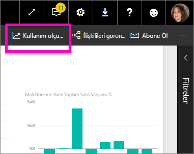

# Klasik çalışma alanlarında kullanım ölçümlerini izleme

Kullanım ölçümleri panolarınızın ve raporlarınızın etkisini anlamanıza yardımcı olur. Pano kullanım ölçümlerini veya rapor kullanım ölçümlerini çalıştırdığınızda bu panolarla raporların kuruluşunuz genelinde nasıl, kimler tarafından ve ne amaçla kullanıldığını görebilirsiniz. Bu makalede [klasik çalışma alanları](service-create-workspaces.md) için kullanım ölçümleri raporları özetlenir. Raporlarınız yeni çalışma alanlarından birinde yer alıyorsa [Yeni çalışma alanı deneyiminde kullanım ölçümlerini izleme](service-modern-usage-metrics.md) makalesine bakın  

Kullanım ölçümleri raporları salt okunur biçimdedir. Öte yandan kullanım ölçümleri raporunu kopyalayabilirsiniz. Kopyalama işlemi, düzenleyebileceğiniz standart bir Power BI raporu oluşturur. Ayrıca Power BI Desktop'ta temel veri kümesine dayanan ve çalışma alanındaki tüm panolar veya tüm raporlar için kullanım ölçümlerini içeren kendi raporlarınızı da oluşturabilirsiniz. Başlangıç olarak kopyalanan rapor yalnızca seçili pano veya raporun ölçümlerini gösterir. Varsayılan filtreyi kaldırabilir ve seçili çalışma alanının tüm kullanım ölçümleriyle temel veri kümesine erişebilirsiniz. Yöneticiniz izin verdiyse belirli kullanıcıların adlarını bile görebilirsiniz.

> [!NOTE]
> SharePoint Online'a eklenen raporların kullanımı, kullanım ölçümleriyle izlenir. Bununla birlikte, kullanım ölçümleri "kimlik bilgilerinin kullanıcıya ait olduğu" veya "kimlik bilgilerinin uygulamaya ait olduğu" akışlar aracılığıyla eklenen pano ve raporları izlemez. [Web'de yayımla](service-publish-to-web.md) aracılığıyla eklenen raporların kullanımı da kullanım ölçümleriyle izlenmez.

## Kullanım ölçümleri neden önemlidir?

İçeriğinizin nasıl kullanıldığını bilmeniz etkinizi göstermenize ve çalışmalarınızı önceliklendirmenize yardımcı olur. Kullanım ölçümleriniz, raporlarınızdan birinin kuruluşunuzdaki çok sayıda kullanıcı tarafından her gün kullanıldığını, oluşturduğunuz panolardan birinin ise hiç görüntülenmediğini gösterebilir. Bu tür geri bildirimler çalışmalarınızı yönlendirme açısından benzersizdir.

Kullanım ölçümleri raporlarını yalnızca Power BI hizmetinde çalıştırabilirsiniz. Öte yandan kullanım ölçümleri raporunu kaydeder veya bir panoya sabitlerseniz mobil cihazlarda açıp raporla etkileşimli çalışabilirsiniz.

## Önkoşullar

- Kullanım ölçümleri verilerini çalıştırmak ve bu verilere erişmek için Power BI Pro lisansı gerekir. Öte yandan kullanım ölçümleri özelliği, atanan lisanslarından bağımsız olarak tüm kullanıcılara ilişkin kullanım bilgilerini toplar.
- Belirli bir panoya veya rapora ilişkin kullanım ölçümlerine erişmek için söz konusu pano veya rapor üzerinde düzenleme erişiminiz olmalıdır.
- Power BI yöneticinizin içerik oluşturucuları için kullanım ölçümlerini etkinleştirmiş olması gerekir. Power BI yöneticiniz kullanım ölçümlerinde kullanıcı başına veri toplanmasını da etkinleştirmiş olabilir. [Yönetim portalında bu seçenekleri etkinleştirmeyi](../admin/service-admin-portal.md#control-usage-metrics) öğrenin. 

## Kullanım Ölçümleri raporunu görüntüleme

1. İlgili panoyu veya raporu içeren çalışma alanından başlayın.
2. Çalışma alanı içerik listesinden veya panonun ya da raporun içinden **Kullanım ölçümleri**  simgesini seçin.

    

    
3. Bunu ilk kez yaptığınızda Power BI, kullanım ölçümleri raporunu oluşturur ve hazır olduğunda sizi bilgilendirir.

    
4. Sonuçları görmek için **Kullanım ölçümlerini görüntüle**'yi seçin.

    Kullanım ölçümleri, Power BI panolarını ve raporlarını dağıtma ve bunların bakımını yapma konusunda size yardımcı olur. Raporunuzun en faydalı sayfalarını ve hangilerini kaldırmanız gerektiğini merak mı ediyorsunuz? Öğrenmek için **Rapor sayfası**'na göre dilimleyin. Panonuz için bir mobil düzen oluşturmanız gerekip gerekmediğini merak mı ediyorsunuz? İçeriğinize mobil uygulamalardan ve web tarayıcısından erişen kullanıcıların sayısını görmek için **Platformlar**'a göre dilimleyin.

5. İsteğe bağlı olarak, bir görselleştirmenin üzerine gelin ve görselleştirmeyi bir panoya eklemek için raptiye simgesini seçin. Alternatif olarak, sayfanın tamamını bir panoya eklemek için üstteki menü çubuğunda **Canlı Sayfayı Sabitleme**'yi seçin. Panodan kullanım ölçümlerini daha kolay izleyebilir veya başkalarıyla paylaşabilirsiniz.

    > [!NOTE]
    > Kullanım ölçümleri raporundaki kutucuklardan birini bir panoya sabitlerseniz bu panoyu uygulamaya ekleyemezsiniz.

### Dashboard Usage Metrics raporu

### Report Usage Metrics raporu

## Kullanım Ölçümleri raporu hakkında

Pano veya raporun yanındaki **Kullanım ölçümleri**’ni veya  simgesini seçtiğinizde Power BI bu içeriğin son 90 güne ait kullanım ölçümlerinin yer aldığı, önceden oluşturulmuş bir rapor üretir.  Rapor zaten aşina olduğunuz Power BI raporlarına benzer. Son kullanıcılarınızın web üzerinden mi yoksa mobil uygulamadan mı erişim sağladığını görebilir, bu bilgiye göre dilimleme yapabilirsiniz. Panolarınız ve raporlarınız geliştikçe kullanım ölçümleri raporları da yeni verilerle güncelleştirilecektir.  

Kullanım ölçümleri raporları **Son görüntülenen**, **Çalışma Alanı**, **Sık Kullanılanlar** veya diğer içerik listelerinde gösterilmez. Bu raporlar uygulamaya eklenemez. Kullanım ölçümleri raporundaki kutucuklardan birini bir panoya sabitlerseniz bu panoyu uygulamaya ekleyemezsiniz.

Rapor verilerini yakından incelemek veya temel veri kümesiyle kendi raporlarınızı oluşturmak için iki seçeneğiniz vardır: 

- Power BI hizmetinde raporun bir kopyasını oluşturma. Ayrıntılar için bu makalenin devamındaki [Kullanım Ölçümleri raporunun kopyasını kaydetme](#save-a-copy-of-the-usage-metrics-report) bölümüne bakın.
- Power BI Desktop'tan veri kümesine bağlanma. Her çalışma alanında veri kümesinin adı "Rapor Kullanım Ölçümleri Modeli" şeklindedir. Ayrıntılar için [Yayımlanan veri kümesine bağlantı oluşturma](../connect-data/desktop-report-lifecycle-datasets.md#establish-a-power-bi-service-live-connection-to-the-published-dataset) konusuna bakın.

    

## Hangi ölçümler raporda yer alır?

| Metric | Pano | Rapor | Açıklama |
| --- | --- | --- | --- |
| Distribution method dilimleyicisi |evet |evet |Kullanıcıların içeriğe erişme şekli. Bunun için 3 olası yöntem vardır. Kullanıcılar panoya veya rapora bir [çalışma alanına](../consumer/end-user-experience.md) üye olarak, içeriğin [kendileriyle paylaşılması](service-share-dashboards.md) yoluyla veya bir içerik paketini/uygulamayı yükleyerek erişebilir.  Uygulamadan gerçekleştirilen görüntüleme işlemleri "içerik paketi" olarak değerlendirilir. |
| Platforms dilimleyicisi |evet |evet |Panoya veya rapora Power BI hizmetinden (powerbi.com) mi yoksa mobil cihazdan mı erişim sağlandı? Mobile seçeneğine iOS, Android ve Windows uygulamalarımızın tamamı dahildir. |
| Report page dilimleyicisi |hayır |evet |Raporda 1'den fazla sayfa varsa raporu görüntülenen sayfalara göre dilimleyebilirsiniz. "Boş", rapor sayfasının yeni eklendiğini (yeni sayfanın gerçek adının dilimleyici listesinde görüntülenmesini izleyen 24 saat içinde) veya rapor sayfalarının silindiğini gösterir. Bu gibi durumlarda "Boş" seçeneği görüntülenir. |
| Views per day |evet |evet |Günlük toplam görüntüleme sayısı. Görüntüleme, kullanıcıların bir rapor sayfasını veya panoyu yüklemesi olarak tanımlanır. |
| Unique viewers per day |evet |evet |Panoyu veya raporu görüntüleyen *farklı* kullanıcıların sayısı (AAD kullanıcı hesabına göre). |
| Views per user |evet |evet |Her bir kullanıcıya göre ayrılmış şekilde, son 90 güne ait görüntüleme sayısı. |
| Shares per day |evet |hayır |Panonun başka bir kullanıcı veya grupla paylaşılma sayısı. |
| Total views |evet |evet |Son 90 gün içindeki görüntüleme sayısı. |
| Total viewers |evet |evet |Son 90 gün içindeki benzersiz görüntüleyen sayısı. |
| Total shares |evet |hayır |Panonun veya raporun son 90 gün içinde paylaşılma sayısı. |
| Total in organization |evet |evet |Kuruluşun tamamında son 90 gün içinde en az bir kez görüntülenen tüm panoların veya raporların sayısı.  Sıralamayı hesaplamak için kullanılır. |
| Derece: Toplam görüntüleme sayısı |evet |evet |Kuruluştaki tüm panoların veya raporların son 90 gün içindeki toplam görüntülenme sayısı değerlendirildiğinde bu panonun veya raporun sırası. |
| Derece: Toplam paylaşım sayısı |evet |hayır |Kuruluştaki tüm panoların son 90 gün içindeki toplam paylaşılma sayısı değerlendirildiğinde bu panonun veya raporun sırası. |

## Kullanım Ölçümleri raporunun kopyasını kaydetme

Kullanım ölçümleri raporunu kendi gereksinimlerinize göre özelleştirebileceğiniz normal bir Power BI raporuna dönüştürmek için **Farklı kaydet**'i kullanın. Ayrıca Power BI Desktop'ı kullanarak temel veri kümesine dayanan özel kullanım ölçümleri raporları da oluşturabilirsiniz. Ayrıntılar için [Yayımlanan veri kümesine bağlantı oluşturma](../connect-data/desktop-report-lifecycle-datasets.md#establish-a-power-bi-service-live-connection-to-the-published-dataset) konusuna bakın.

Üstelik çalışma alanındaki tüm pano veya raporlara ilişkin kullanım bilgilerini içeren bağlantılı veri kümesinden de yararlanabilirsiniz. Bu size daha fazla olanak getirir. Örneğin, çalışma alanınızdaki panoları kullanım açısından karşılaştıran bir rapor oluşturabilirsiniz. Ayrıca, söz konusu uygulama içinde dağıtılmış olan tüm içeriğe ilişkin kullanım bilgilerini toplayarak Power BI uygulamanız için bir kullanım ölçümleri panosu oluşturabilirsiniz.  Filtreyi kaldırma hakkındaki bilgileri ve [çalışma alanına yönelik tüm kullanım ölçümlerini](#see-all-workspace-usage-metrics) bu makalenin sonraki bölümlerinde bulabilirsiniz.

### Kullanım raporunun kopyasını oluşturma

Önceden hazırlanmış salt okunur bir kullanım raporunun kopyasını oluşturduğunuzda, Power BI raporun düzenlenebilir bir kopyasını oluşturur. İlk bakışta iki rapor aynı görünür. Ama artık raporu Düzenleme görünümünde açabilir; yeni görselleştirme, filtre ve sayfa ekleyebilir, var olan görselleştirmeleri değiştirebilir veya silebilir ve başka işlemler yapabilirsiniz. Power BI yeni raporu geçerli çalışma alanına kaydeder.

1. Önceden oluşturulmuş kullanım ölçümleri raporunda **Dosya > Farklı Kaydet**'i seçin. Power BI düzenlenebilir bir Power BI raporu oluşturur ve bunu geçerli çalışma alanına kaydeder.

    
2. Raporu, Düzenleme görünümü'nde açın ve [diğer Power BI raporlarında olduğu gibi etkileşim kurun](../create-reports/service-interact-with-a-report-in-editing-view.md). Örneğin, yeni sayfalar ekleyebilir, yeni görselleştirmeler oluşturabilir, filtreler ekleyebilir, yazı tiplerini ve renklerini biçimlendirebilirsiniz.

    
3. Yeni rapor geçerli çalışma alanında **Raporlar** sekmesine kaydedilir ve **Son görüntülenen** içerik listesine eklenir.

    

## *Tüm* çalışma alanı kullanım ölçümlerini görün

Çalışma alanındaki tüm pano veya raporlara ait ölçümleri görmek için bir filtreyi kaldırmanız gerekir. Rapor varsayılan olarak yalnızca bu raporu oluşturduğunuz panoya veya rapora ait ölçümleri görüntüleyecek şekilde filtrelenmiştir.

1. Düzenleme görünümünde düzenlenebilir yeni raporu açmak için **Raporu düzenle**'yi seçin.

    
2. Filtreler bölmesinde **Rapor düzeyi filtreleri** demetini bulun ve **ReportGuid**'in yanındaki silgiyi seçerek filtreyi kaldırın.

    

    Raporunuzda artık çalışma alanının tamamına ait ölçümler görüntülenir.

## Kullanım ölçümleri için Power BI yönetici denetimleri

Kullanım ölçümleri raporları, genel yöneticiler veya Power BI yöneticileri tarafından etkinleştirilip devre dışı bırakılabilecek bir özelliktir. Yöneticiler kullanım ölçümlerine erişim sahibi olan kullanıcılar üzerinde ayrıntılı denetime sahiptir. Bu denetimler kuruluştaki tüm kullanıcılar için varsayılan olarak **Açık** durumdadır.

> [!NOTE]
> Yalnızca Power BI kiracısının yöneticileri Yönetim portalını ve düzenleme ayarlarını görebilir. 

Varsayılan olarak, kullanım ölçümleri için kullanıcı başına veriler etkinleştirilir ve içerik tüketicisinin hesap bilgileri ölçüm raporuna eklenir. Yöneticiler kullanıcılardan bazıları veya tümü için bu bilgilerin kullanıma sunulmasını istemezse, belirtilen güvenlik grupları veya kuruluşun tamamı için özelliği devre dışı bırakabilir. Bu durumda hesap bilgileri raporda *Adsız* olarak gösterilir.

Yöneticiler kullanım ölçümlerini kuruluşun tamamı için devre dışı bırakırken **Tüm mevcut kullanım ölçümleri içeriğini silin** seçeneğini kullanarak kullanım ölçümleri raporları kullanılarak oluşturulmuş olan mevcut tüm raporları ve pano kutucuklarını silebilir. Bu seçenek, kullanmakta olanlar dahil olmak üzere kuruluştaki kullanıcılar için kullanım ölçümlerine yönelik erişimi kaldırır. Kullanım ölçümleri içeriğini silme işlemi geri alınamaz.

Bu ayarlarla ilgili ayrıntılar için Yönetim portalı makalesinde [Kullanım ölçümlerini denetleme](../admin/service-admin-portal.md#control-usage-metrics) konusuna bakın. 

## Ulusal bulutlarda kullanım ölçümleri

Power BI, ayrı ayrı ulusal bulutlarda kullanılabilir. Bu bulutlar hizmet teslimi, veri dayanıklılığı, erişim ve denetimle ilgili yerel yasal düzenlemelere yönelik benzersiz bir modelle birlikte, Power BI'ın küresel sürümüyle aynı güvenlik, gizlilik, uyumluluk ve saydamlık düzeyleri sunar. Yerel yasal düzenlemelere yönelik bu benzersiz modelden dolayı, ulusal bulutlarda kullanım ölçümleri sağlanmaz. Daha fazla bilgi için [ulusal bulutlar](https://powerbi.microsoft.com/clouds/) konusuna bakın.

## Önemli noktalar ve sınırlamalar

### Denetim günlükleri ile kullanım ölçümleri arasındaki tutarsızlıklar

Kullanım ölçümleriyle denetim günlüklerini karşılaştırırken farklılıklar olabileceğini ve bunların nedenlerini anlamak önemlidir. *Denetim günlükleri* Power BI hizmetinin verileri kullanılarak toplanırken, *kullanım ölçümleri* istemcide toplanır. Denetim günlüklerindeki etkinliklerin toplam sayısı, aşağıdaki farklardan dolayı her zaman kullanım ölçümleriyle uyuşmaz:

* Kullanım ölçümleri bazen ağ bağlantılarındaki tutarsızlıklar, reklam engelleyiciler veya istemciden etkinlikleri göndermeyi aksatan diğer sorunlar nedeniyle etkinlikleri eksik sayabilir.
* Bu makalede daha önce açıklandığı gibi belirli görünüm türleri kullanım ölçümlerine dahil edilmez.
* Kullanım ölçümleri istemcinin isteği Power BI hizmetine geri göndermesine gerek olmadan yenilemesi durumlarında, bazen etkinlikleri fazla sayabilir. Örneğin, sayfa tanımı zaten tarayıcıda olduğundan, rapor sayfalarını değiştirmek sunucuya bir rapor yükleme isteği vermez.
* Kullanım ölçümleri raporu için paylaşım devre dışı bırakıldı. Kullanıcılara rapora okuma erişimi vermek için öncelikle çalışma alanı erişimi vermeniz gerekir.

### REST API'ler ile kullanım ölçümleri arasındaki tutarsızlıklar

Power BI [Rapor REST API'leri](/rest/api/power-bi/reports) ve [Yönetici REST API'leri](/rest/api/power-bi/admin) de Power BI hizmet verilerini kullanır. Önceki bölümde açıklanan nedenlerle API'lerden gelen rapor sayıları kullanım ölçümlerindeki rapor sayılarından farklı olabilir. API'lerden türetilen rapor sayıları istemci sorunlarından etkilenmez, dolayısıyla doğru kabul edilmelidir. Ayrıca, yönetim API 'Lerinin size Power BI dağıtımının "geçerli durum" i olduğunu ve yalnızca istek sırasında neler olduğunu düşündüğüne dikkat edin. Klasik kullanım ölçümleri raporunda 90 gün veri bulunur ve "Toplam sayım", 90 gün içinde görüntülenen benzersiz raporları temsil eder. Raporlar görüntülendikten sonra silinirse, bunlar yönetici API 'Leri tarafından sayılmaz, ancak kullanım raporunu beslemenin geçmiş verilerinde sayılır.

### Klasik Kullanım Ölçümleri, Özel Bağlantılar için desteklenmez 

Kuruluşunuzda [Özel Bağlantılar](../admin/service-security-private-links.md) kullanılıyorsa klasik kullanım ölçümleri raporlarında veri bulunmaz. Özel bağlantı üzerinden istemci bilgisi aktarımı konusunda bir sınırlama mevcuttur. 

### Diğer önemli noktalar

Çalışma alanınızdaki içeriği, aynı çalışma alanının içinden en az bir kez görüntülemeniz gerekir. Çalışma alanından içerikler en az bir kez görüntülenmemişse veriler Kullanım Ölçümleri Raporundaki uygulama görünümleriyle ilişkilendirilmez. Bu rapor için veri işleme engelini kaldırmak üzere içerikleri çalışma alanınızdan en az bir kez görüntüleyin.

## Sık sorulan sorular

Kullanım ölçümleriyle denetim günlükleri arasındaki farklılıklara ek olarak, kullanım ölçümleri hakkında aşağıda yer alan soru ve yanıtlar kullanıcılara ve yöneticilere yararlı olabilir:

**S:**    Bir pano veya raporda kullanım ölçümlerini çalıştıramıyorum

**Y:**    Kullanım ölçümlerimi yalnızca sahip olduğunuz veya düzenleme izniniz olan içeriklerde görürsünüz.

**S:**    Kullanım ölçümleri, eklenen pano ve raporlara ilişkin görüntülenme verilerini yakalayabilir mi?

**Y:**    Kullanım ölçümleri şu anda tümleşik panolar, raporlar ve [web’de yayınlama](service-publish-to-web.md) akışının kullanımını yakalamayı desteklememektedir. Bu gibi durumlarda mevcut web analizi platformlarını kullanarak içeriği barındıran uygulamaya veya portala ilişkin kullanımı takip etmenizi öneririz.

**S:**    Hiçbir içerikte kullanım ölçümleri çalıştıramıyorum.

**Y1:**    Yöneticiler bu özelliği kuruluş çapında devre dışı bırakabilir.  Böyle bir durumun söz konusu olup olmadığını görmek için yöneticinizle iletişime geçin.

**Y2:**    Kullanım ölçümleri Power BI Pro özelliğidir.

**S:**    Veriler güncel değil gibi görünüyor. Örneğin, dağıtım yöntemleri görünmüyor, rapor sayfaları eksik vb.

**Y:**    Verilerin güncelleştirilmesi 24 saat sürebilir.

**S:**    Çalışma alanında dört rapor var ancak kullanım ölçümleri raporu yalnızca üçünü gösteriyor.

**Y:**    Kullanım ölçümleri raporu, yalnızca son 90 gün içinde erişilmiş olan raporları (veya panoları) kapsar.  Bir rapor (veya pano) gösterilmiyorsa en son 90 günden daha uzun bir süre önce kullanılmıştır.

## Sonraki adımlar

[Yönetim portalında Power BI’ı yönetme](../admin/service-admin-portal.md)

Başka bir sorunuz mu var? [Power BI Topluluğu'na başvurun](https://community.powerbi.com/)
