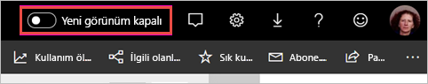
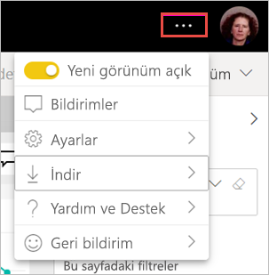

# Çalışma alanının ‘yeni görünümünü’ kabul etme (önizleme)

Çalışma alanlarının yeni görünümü, Power BI hizmetinin [yeni görünümüyle](../consumer/service-new-look.md) örtüşüyor. Power BI hizmetini (app.powerbi.com) kullanan herkes kabul edebilir. Siyah üst bilgi çubuğunda **Yeni görünüm**’ü açtığınızda, raporlar ve çalışma alanlarının yeni görünümünü kabul edersiniz. Hem klasik hem de yeni tüm çalışma alanları yeni görünümden yararlanabilir.

**Power BI Desktop**’taki yeni görünüm hakkında bilgi mi arıyorsunuz? [Power BI Desktop’taki güncelleştirilmiş şeridi kullanma](../create-reports/desktop-ribbon.md) bölümüne bakın.

## Yeni görünümün özellikleri

:::image type="content" source="media/service-workspaces-new-look/power-bi-workspace-new-look-numbered.png" alt-text="Çalışma alanlarının, açıklama için balon numaraları içeren yeni görünümü":::

|Sayı  |Nasıl çalışır? |
|---------|---------|
|    | **Veri Al**: Çalışma alanınıza içerik eklemek artık daha kolay. Verilere bağlanmak, dosya açmak ve yeni raporlar, panolar ve daha fazlasını oluşturmak için **+ Yeni** düğmesini seçin.  |
|   | **Değiştirici görüntüleme**: Veri akışları, veri kümeleri, raporlar ve panolar arasındaki bağlantıları ve bunların diğer veri kaynaklarına olan bağlantılarını görmek için, **Liste** görünümü ile **Köken** görünümü arasında geçiş yapın. |
|  | **Çalışma alanı içinde arama**: Yeni arama kutusunda, çalışma alanındaki tüm içerikte arama yapın.  |
|   | **Liste ve sekmeler**: Çalışma alanındaki tüm içerikler, panolar, raporlar, veri kümeleri ve diğerlerinden oluşan SharePoint gibi düz bir listede bulunur. Artık çalışma alanını büyük olasılıkla boş olan bir **Panolar** sekmesine açmayacak ve içeriğinizin nerede olduğunu merak etmeyeceksiniz. Yeni sekme düzeni aşağıda verilmiştir:  **Tümü**: Çalışma alanındaki tüm içeriği (panolar, raporlar, çalışma kitapları, sayfalandırılmış raporlar, veri kümeleri ve veri akışları) gösterir.  **İçerik**: Tüketim için oluşturulan tüm içeriği (panolar, raporlar, çalışma kitapları ve sayfalandırılmış raporlar) çalışma alanı içinde toplar.  **Veri kümeleri + veri akışları**: Kolay veri yönetimi için tüm veri kümelerini ve veri akışlarını çalışma alanında toplar. |
|  | **Filtreler**: Yüzlerce yapıt içeren çalışma alanları için, Filtreler bölmesindeki içeriği filtreleyebilirsiniz. Filtre uygulandıktan sonra, filtreyi içerik listesinin üst kısmında görürsünüz. |

**Hızlı eylemler**: Listedeki içeriğin üzerine geldiğinizde, ilgili öğe için en yaygın eylemlerle birlikte **Diğer seçenekler** (...) menüsündeki kullanılabilir diğer seçenekleri de görürsünüz.

:::image type="content" source="media/service-workspaces-new-look/power-bi-workspace-new-look-quick-actions.png" alt-text="Yeni çalışma alanındaki hızlı eylemler":::

## Yeni görünümü kabul etme

Herhangi bir Power BI hizmeti kullanıcısı yeni görünümü kullanmayı seçebilir. **Yeni görünüm kapalı** öğesini **Yeni görünüm açık** konumuna kaydırın.

Eski görünüme dönmeniz gerekirse, bunu **kapalı**  konumuna geri kaydırmanız yeterlidir. Bu düğmeyi görmüyorsanız sağ üst köşedeki üç nokta menüsünü seçin.

## Sonraki adımlar

- [Power BI Desktop’taki güncelleştirilmiş şeridi kullanma](../create-reports/desktop-ribbon.md)
- [Power BI hizmetinin ‘yeni görünümü’](../consumer/service-new-look.md)
- Sorularınız mı var? [Power BI Topluluğu'na başvurun](https://community.powerbi.com/)
