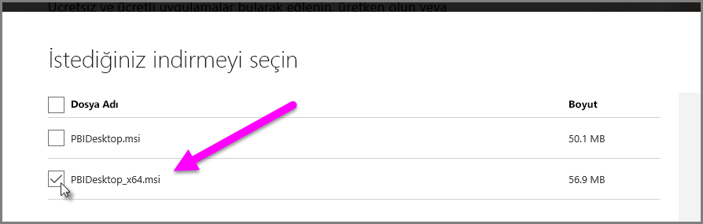

# Power BI Desktop'ta Access ve Excel .xls dosyalarını içeri aktarma sorunlarını giderme

Power BI Desktop'ta hem Access veritabanları hem de Excel çalışma kitaplarının önceki sürümleri (Excel 97-2003 türünde .XLS dosyaları), *Access Veritabanı Altyapısı*'nı kullanır. Access Veritabanı Altyapısı'nın düzgün şekilde çalışmasını engelleyebilecek üç yaygın durum söz konusudur.

## 1\. Durum: Access Veritabanı Altyapısı’nın yüklenmemiş olması

Power BI Desktop hata iletisi Access Veritabanı Altyapısı'nın yüklenmediğini belirtiyorsa, Power BI Desktop sürümünüzle eşleşen (32 bit veya 64 bit) Access Veritabanı Altyapısı sürümünü yüklemeniz gerekir. Access Veritabanı Altyapısı'nı [indirmeler sayfasından](https://www.microsoft.com/download/details.aspx?id=13255) yükleyebilirsiniz.

>[!NOTE]
>Yüklenen Access Veritabanı Altyapısı bit sürümü, Microsoft Office yüklemenizin bit sürümünden farklıysa Office uygulamaları, Access Veritabanı Altyapısı'nı kullanamaz.

## 2\. Durum: Access Veritabanı Altyapısı bit sürümünün (32 bit veya 64 bit) Power BI Desktop bit sürümünüzden farklı olması

Bu durum genellikle Microsoft Office'in yüklenen sürümü 32 bit, yüklenen Power BI Desktop sürümü ise 64 bit olduğunda oluşur. Tersi de olabilir ve her iki durumda da bit sürümü uyumsuzluğu oluşur. Office 365 aboneliği kullanıyorsanız farklı bir sorun ve çözüm için [Durum 3](#situation-3-trouble-using-access-or-xls-files-with-an-office-365-subscription)’e bakın. Aşağıdaki çözümlerden herhangi biri bit sürümü uyuşmazlığından kaynaklanan bu hatayı giderebilir:

### Çözüm 1

Power BI Desktop'ın sürümünü Microsoft Office yüklemenizin bit sürümüyle eşleşecek şekilde değiştirin. 

1. Power BI Desktop'ın bit sürümünü değiştirmek için Power BI Desktop'ı kaldırın ve ardından Office yüklemenizle eşleşen Power BI Desktop sürümünü yükleyin. 

1. Bir Power BI Desktop sürümü seçmek için, Power BI Desktop indirme sayfasında **Gelişmiş indirme seçenekleri**'ni seçin.
   
   
   
1. Görünen indirme sayfasında dilinizi ve ardından **İndir** düğmesini seçin. 
 
1. Görünen ekranda 32 bit sürüm için PBIDesktop.msi onay kutusunu, 64 bit sürüm için ise PBIDesktop_x64.msi onay kutusunu işaretleyin. 

   Aşağıdaki ekran görüntüsünde 64 bit sürüm seçilidir.
   
   
   
   >[!NOTE]
   >Power BI Desktop'ın 32 bit sürümünü kullanıyorsanız, çok büyük veri modelleri oluştururken yetersiz bellek sorunlarıyla karşılaşabilirsiniz.

### Çözüm 2

Microsoft Office bit sürümünü Power BI Desktop yüklemenizin bit sürümüyle eşleşecek şekilde değiştirin:

1. Microsoft Office’i kaldırın

2. Office’in Power BI Desktop yüklemenizle eşleşen sürümünü yükleyin.

### Çözüm 3

Hata, bir .XLS dosyası (bir Excel 97-2003 çalışma kitabı) açmaya çalıştığınızda oluşuyorsa .XLS dosyasını Excel'de açıp .XLSX dosyası olarak kaydederek Access Veritabanı Altyapısı'nı kullanmaktan kaçınabilirsiniz.

### Çözüm 4

Önceki üç çözüm uygun değilse Access Veritabanı Altyapısı'nın iki sürümünü birden yüklemek de mümkündür. Ancak, bu geçici çözüm önerilmez. İki sürümü birden yüklemek Excel ve Power BI Desktop için bu Power Query sorununu giderse de, Access Veritabanı Altyapısı'nın ilk yüklenen bit sürümünü otomatik olarak kullanan tüm uygulamalar için hatalara ve sorunlara neden olur. 

Access Veritabanı Altyapısının her iki bit sürümünü de yüklemek için aşağıdaki adımları izleyin:

1. [İndirme sayfasından](https://www.microsoft.com/download/details.aspx?id=13255) Access Veritabanı Altyapısının her iki bit sürümünü de yükleyin. 

1. Access Veritabanı Altyapısı'nın her bir sürümünü, */passive* anahtarını kullanarak çalıştırın. Örnek:
   
       c:\users\joe\downloads\AccessDatabaseEngine.exe /passive
   
       c:\users\joe\downloads\AccessDatabaseEngine_x64.exe /passive

## 3\. Durum: Bir Office 365 aboneliğiyle Access veya .XLS dosyaları kullanılırken sorun yaşanması

Bir Office 365 aboneliği (**Office 2013** veya **Office 2016**) kullanıyorsanız Access Veritabanı Altyapısı sağlayıcısı *yalnızca* Microsoft Office işlemlerinin erişebildiği sanal bir kayıt defteri konumuna kayıtlıdır. Sonuç olarak, Mashup Altyapısı (Office 365 Excel ve Power BI Desktop dışındaki çalıştırma işlemlerinden sorumludur ve bir Office işlemi değildir), Access Veritabanı Altyapısı sağlayıcısını kullanamaz.

Bu durumu ortadan kaldırmak için Power BI Desktop yüklemenizin bit sürümüyle (bit sürümleri hakkında daha fazla bilgi için önceki bölümlere göz atın) eşleşen [Access Veritabanı Altyapısı yeniden dağıtılabilir paketini indirip yükleyin](https://www.microsoft.com/download/details.aspx?id=13255). Bit sürümleri hakkında daha fazla bilgi için bu makalenin önceki bölümlerine bakın.

## İçeri aktarma sorunlarına neden olabilecek diğer durumlar

Access veya .XLS dosyalarıyla ilgili mümkün olduğu kadar çok sayıda sorunu ele almak için elimizden geleni yapıyoruz. Bu makalede ele alınmayan bir sorunla karşılaşırsanız sorunla ilgili sorunuzu [Power BI Desteği](https://powerbi.microsoft.com/support/)'ne gönderin. Birçok müşteriyi etkileyebilecek sorunları düzenli olarak kontrol edip makalelerimizde bu sorunlara yer veriyoruz.

