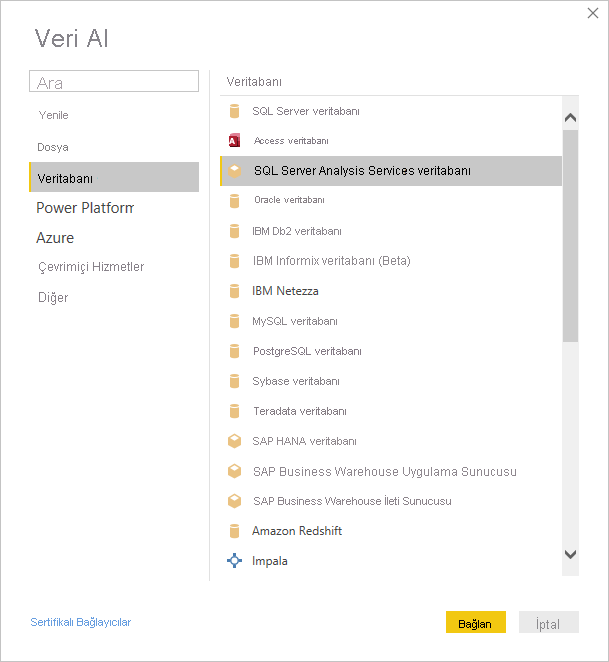
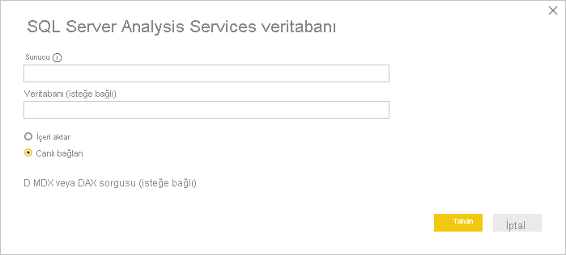
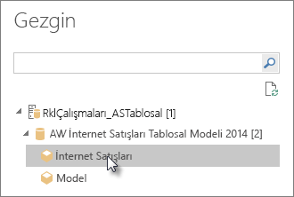
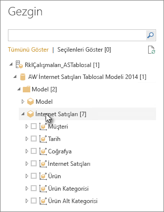

# Power BI Desktop’taki Analysis Services tablo verilerine bağlanma
Power BI Desktop uygulamasında SQL Server Analysis Services tablo modellerinize bağlanmak ve onlardan veri almak için kullanabileceğiniz iki yöntem bulunur: Canlı bağlantı kullanarak keşfetme veya öğeleri seçip Power BI Desktop'a aktarma.

Şimdi bu yöntemlere daha yakından bakalım.

**Canlı bağlantı kullanarak keşfetme**: Canlı bağlantı kullandığınızda tablo modelinizdeki veya perspektifinizdeki tablolar, sütunlar ve ölçüler gibi öğeler Power BI Desktop uygulamasının **Alanlar** bölmesindeki listede görünür. Power BI Desktop’ın gelişmiş görselleştirme ve rapor araçlarını kullanarak tablo modelinizi yeni ve oldukça etkileşimli şekillerde keşfedebilirsiniz.

Canlı bağlantı sırasında tablo modelinizdeki veriler Power BI Desktop’a aktarılmaz. Görselleştirmelerle etkileşim kurduğunuzda Power BI Desktop, tablo modelini sorgular ve gördüğünüz sonuçları hesaplar. Son işleme zamanına göre veya tablo modelindeki DirectQuery tablolarından her zaman tablo modelindeki en güncel verilere bakıyor olursunuz. 

Unutmayın, tablo modelleri oldukça güvenlidir. Power BI Desktop’ta görünen öğeler bağlantı kurduğunuz tablo modelindeki izinlere göre değişiklik gösterir.

Power BI Desktop'ta oluşturduğunuz dinamik raporları Power BI sitenizde yayımlayarak paylaşabilirsiniz. Tablo modeline canlı bağlantı içeren bir Power BI Desktop dosyasını Power BI sitenizde yayımladığınızda bir yönetici tarafından şirket içi veri ağ geçidi yüklenmesi ve yapılandırılması gerekir. Daha fazla bilgi için bkz. [Şirket içi veri ağ geçidi](service-gateway-onprem.md).

**Öğeleri seçme ve Power BI Desktop'a aktarma**: Bu seçeneği kullanarak bağlandığınızda tablo modelinizde veya perspektifinizde bulunan tablo, sütun ve ölçü gibi öğeleri seçerek bir Power BI Desktop modeline yükleyebilirsiniz. Power BI Desktop’ın Power Query Düzenleyicisi'ni kullanarak içeriği ve modelleme özelliklerini şekillendirebilir, verilere ek modelleme işlemi uygulayabilirsiniz. Power BI Desktop ile tablo modeli arasında canlı bağlantı sağlanmadığından Power BI Desktop modelinizi çevrimdışı olarak keşfedebilir veya Power BI sitenizde yayımlayabilirsiniz.

## Tablo modeline bağlanmak için
1. Power BI Desktop uygulamasının **Giriş** sekmesinde **Veri Al** > **Daha Fazla** > **Veritabanı**'nı seçin.
   
1. **SQL Server Analysis Services veritabanı**'nı ve ardından **Bağlan**'ı seçin.
   
   
3. **SQL Server Analysis Services veritabanı** penceresinde **Sunucu** adını girin, bir bağlantı modu seçin ve ardından **Tamam**'ı seçin.
   
   
4. **Gezgin** penceresinde seçtiğiniz bu adım seçtiğiniz bağlantı moduna göre değişiklik gösterir:

   - Canlı bağlantı kuruyorsanız bir tablo modeli veya perspektif seçin.
  
      
   - Öğe seçip veri almayı tercih ederseniz tablo modeli veya perspektif seçin ve ardından yüklenecek tabloyu veya sütunu belirtin. Verilerinizi yüklemeden önce şekillendirmek için **Sorguları Düzenle**'yi seçerek Power Query Düzenleyicisi'ni açın. Hazır olduğunuzda **Yükle**'yi seçerek verileri Power BI Desktop'a aktarın.

      

## Sık sorulan sorular
**Soru:** Şirket içi veri ağ geçidine ihtiyacım var mı?

**Cevap:** Duruma göre değişir. Power BI Desktop ile bir tablo modeline canlı bağlantı kuruyorsanız ancak bunu Power BI sitenizde yayımlama planınız yoksa ağ geçidine ihtiyaç duymazsınız. Diğer taraftan Power BI sitenizde yayımlamayı düşünüyorsanız Power BI hizmetiyle şirket içi Analysis Services sunucunuz arasında güvenli bağlantı kurulması için veri ağ geçidine ihtiyacınız vardır. Veri ağ geçidi yüklemeden önce Analysis Services sunucunuzun yöneticisiyle iletişime geçmeyi unutmayın.

Öğeleri seçip veri alma seçeneğini kullanıyorsanız tablo modeli verilerini doğrudan Power BI Desktop dosyanıza aktarmış olursunuz ve ağ geçidi kullanmanız gerekmez.

**Soru:** Power BI hizmetinden bir tablo modeline canlı bağlantı kurmayla Power BI Desktop’tan canlı bağlantı kurma arasındaki fark nedir?

**Cevap:** Power BI hizmetindeki sitenizde bulunan bir tablo modelinden kuruluşunuzdaki şirket içi Analysis Services veritabanına canlı bağlantı kurduğunuzda, bu iki nokta arasındaki iletişimin güvenliğini sağlamak için şirket içi ağ geçidine ihtiyaç duyulur. Power BI Desktop’tan bir tablo modeline canlı bağlantı kurduğunuzda Power BI Desktop ve bağlandığınız Analysis Services sunucusu şirket içi ortamda çalıştığından ağ geçidine ihtiyaç yoktur. Ancak Power BI Desktop dosyanızı Power BI sitenizde yayımlamak için bir ağ geçidi kullanmanız gerekir.

**Soru:** Canlı bağlantı oluşturduktan sonra aynı Power BI Desktop dosyasındaki başka bir veri kaynağına bağlanabilir miyim?

**Cevap:** Hayır. Verileri canlı keşfederken aynı dosyadaki başka türde veri kaynağına bağlanamazsınız. Önceden verileri içeri aktardıysanız veya Power BI Desktop dosyasında farklı bir veri kaynağına bağlandıysanız canlı keşfetme için yeni bir dosya oluşturmanız gerekir.

**Soru:** Canlı bağlantı oluşturduktan sonra Power BI Desktop'ta modeli düzenleyebilir veya sorgulayabilir miyim?

**Cevap:** Power BI Desktop'ta rapor düzeyinde ölçüler oluşturabilirsiniz ancak canlı verileri keşfederken diğer tüm sorgulama ve modelleme özellikleri devre dışı bırakılır.

**Soru:** Oluşturduğum canlı bağlantı güvenli mi?

**Cevap:** Evet. Analysis Services sunucusuna bağlanmak için geçerli Windows kimlik bilgileriniz kullanılır. Canlı keşfetme sırasında Power BI hizmetinde veya Power BI Desktop uygulamasında temel ya da kayıtlı kimlik bilgileri kullanamazsınız.

**Soru:** Gezgin'de bir model ve bir perspektif görüyorum. Fark nedir?

**Cevap:** Perspektif, bir tablo modelinin belirli bir görünümüdür. Veri analiz ihtiyaçlarına göre yalnızca belirli tabloları, sütunları veya ölçüleri kapsıyor olabilir. Tablo modelinde her zaman en az bir perspektif bulunabilir ve bu modeldeki her şeyi içerebilir. Hangi perspektifi seçeceğinizden emin değilseniz yöneticinizle iletişime geçmeniz gerekir.

**Soru:** Power BI'ın davranış şeklini değiştiren Analysis Services özellikleri var mı?

**Cevap:** Evet. Tablosal modelinizin kullandığı özelliklere bağlı olarak Power BI Desktop'taki deneyim değişebilir. Bazı örnekler:
* Modelde ölçülerin tablolarda sütunlar boyunca gruplandırılması yerine **Alanlar** bölmesindeki listenin en üstünde birlikte gruplandırıldığını görebilirsiniz. Endişelenmeyin, bunları yine normal şekilde kullanabilirsiniz, yalnızca bu yolla daha kolay bulabilirsiniz.

* Tablosal modelde hesaplama grupları tanımlandıysa, bunları yalnızca model ölçüleriyle birlikte kullanabilirsiniz. Görsele sayısal alanlar ekleyerek oluşturduğunuz örtülü ölçülerle kullanamazsınız. Ayrıca modelin **DiscourageImplicitMeasures** bayrağı el ile ayarlanmış olabilir ve bu da aynı etkiyi yapar. Daha fazla bilgi edinmek için bkz. [Analysis Services'te hesaplama grupları](https://docs.microsoft.com/analysis-services/tabular-models/calculation-groups#benefits).

## İlk bağlantının ardından sunucu adını değiştirme
Canlı keşfetme bağlantısıyla bir Power BI Desktop dosyası oluşturduktan sonra bağlantıyı farklı bir sunucuya almak isteyebileceğiniz durumlar söz konusu olabilir. Örneğin Power BI Desktop dosyasını geliştirme sunucusuna bağlıyken oluşturduysanız Power BI hizmetinde yayımlamadan önce bağlantıyı üretim sunucusuna geçirmek isteyebilirsiniz.

Sunucu adını değiştirmek için:

1. **Giriş** sekmesinden **Sorguları Düzenle**'yi seçin.

2. **SQL Server Analysis Services veritabanı** penceresinde yeni **Sunucu** adını girip **Tamam**'ı seçin.

   
## Sorun giderme 
Aşağıdaki listede SQL Server Analysis Services (SSAS) veya Azure Analysis Services’a bağlanma sırasında yaşandığı bilinen tüm sorunlar açıklanmıştır: 

* **Hata: Model şeması yüklenemedi**: Bu hata genellikle Analysis Services’a bağlanan kullanıcının veritabanına/modele erişimi olmadığında oluşur.

