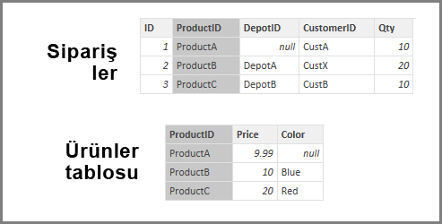
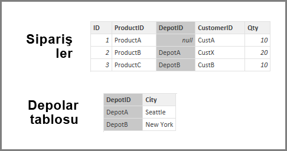
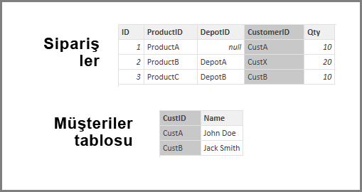

# Power BI Desktop'taki Bilgi Tutarlılığı Varsay ayarını uygulama
**DirectQuery** kullanarak bir veri kaynağına bağlanırken, veri kaynağınızda daha verimli sorgular çalıştırılmasını sağlamak için **Bilgi Tutarlılığı Varsay** seçeneğini kullanabilirsiniz. Bu özellik, temel alınan verilere ilişkin bazı gereksinimlere sahiptir ve yalnızca **DirectQuery** ile kullanılabilir.

**Bilgi tutarlılığı varsay** ayarı, veri kaynağındaki sorguların **OUTER JOIN** yerine **INNER JOIN** deyimlerini kullanmasını sağlar ve böylece sorgu verimliliği artar.

## Bilgi tutarlılığı varsay ayarını kullanmaya ilişkin gereksinimler
Bu gelişmiş bir ayardır ve yalnızca, verilere **DirectQuery** kullanılarak bağlanıldığında etkinleştirilir. **Bilgi tutarlılığı varsay** ayarının düzgün çalışabilmesi için aşağıdaki gereksinimler söz konusudur:

* İlişkide **From** sütununda bulunan veriler hiçbir zaman *Null* veya *boş* olmaz
* **From** sütunundaki her bir değer için **To** sütununda karşılık gelen bir değer bulunur

Bu bağlamda **From** sütunu, *Tek - Çok* ilişkisindeki *Çok* kısmıdır veya *Birebir* ilişkide birinci tablodaki sütundur.

## Bilgi tutarlılığı varsay ayarının kullanımına ilişkin örnek
Aşağıdaki örnekte, **Bilgi tutarlılığı varsay**'ın veri bağlantılarında kullanıldığında nasıl davrandığı gösterilmiştir. Örnekte bir **Orders** tablosu, **Products** tablosu ve **Depots** tablosu bulunan bir veri kaynağına bağlanılmıştır.

1. **Orders** tablosunu ve **Products** tablosunu gösteren aşağıdaki görüntüde **Orders[ProductID]** ve **Products[ProductID]** arasında bilgi tutarlılığı olduğuna dikkat edin. **Orders** tablosundaki **[ProductID]** sütunu hiçbir zaman *Null* değildir ve tüm değerler **Products** tablosunda da görünür. Bu nedenle, daha verimli sorgular elde etmek için **Bilgi tutarlılığı varsay** ayarlanmalıdır. (Bu ayar kullanıldığında, görsellerde gösterilen değerler değişmez.)
   
   
2. Sonraki görüntüde **Orders[DepotID]** ve **Depots[DepotID]** arasında hiçbir bilgi tutarlılığı olmadığına dikkat edin. Bunun nedeni, bazı **Orders** değerleri için *DepotID* değerinin *Null* olmasıdır. Bu nedenle, **Bilgi Tutarlılığı Varsay** ayarı *belirlenmemelidir*.
   
   
3. Son olarak, aşağıdaki tablolarda **Orders[CustomerID]** ve **Customers[CustID]** arasında hiçbir bilgi tutarlılığı yoktur. **CustomerID**, *Customers* tablosunda bulunmayan bazı değerler (bu örnekte *CustX*) içerir. Bu nedenle, **Bilgi Tutarlılığı Varsay** ayarı *belirlenmemelidir*.
   
   

## Bilgi tutarlılığı varsay ayarı
Bu özelliği etkinleştirmek için aşağıdaki görüntüde gösterildiği üzere **Bilgi tutarlılığı varsay**'ın yanındaki onay kutusunu seçin.

Bu ayar seçili olduğunda, verilerde *Null* değer veya eşleşmeyen satır olmadığı doğrulanır. *Ancak*, çok yüksek sayıda değer içeren durumlarda doğrulamadan sonra bilgi tutarlılığı sorunları olmayacağı garanti edilemez.

Ayrıca doğrulama işlemi, ilişkinin düzenlendiği sırada gerçekleşir ve verilerde daha sonra yapılan değişiklikleri *yansıtmaz*.

## Bilgi tutarlılığı varsay ayarını yanlışlıkla ayarlarsanız ne olur?
Verilerde bilgi tutarlılığı sorunları varken **Bilgi tutarlılığı varsay**'ı ayarlamanız hata oluşmasına neden olmaz. Ancak, verilerde görünür tutarsızlıklar oluşmasına neden olur. Örneğin, yukarıda açıklanan **Depots** tablosu ile ilişki örneğinde sonuç aşağıdaki gibi olur:

* Toplam *Order Qty* değerini gösteren bir görsel, 40 değerini görüntüler
* Toplam *Order Qty by Depot City* değerini gösteren bir görsel, toplamda yalnızca *30* değerini görüntüler. Bunun nedeni, **DepotID** değeri *Null* olan Order ID 1 verilerinin dahil edilmemesidir.

## Sonraki adımlar
[DirectQuery](desktop-use-directquery.md) hakkında daha fazla bilgi edinin

[Power BI'daki İlişkiler](../transform-model/desktop-create-and-manage-relationships.md) hakkında daha fazla bilgi edinin

[Power BI Desktop'taki İlişki Görünümü](../transform-model/desktop-relationship-view.md) hakkında daha fazla bilgi edinin.
