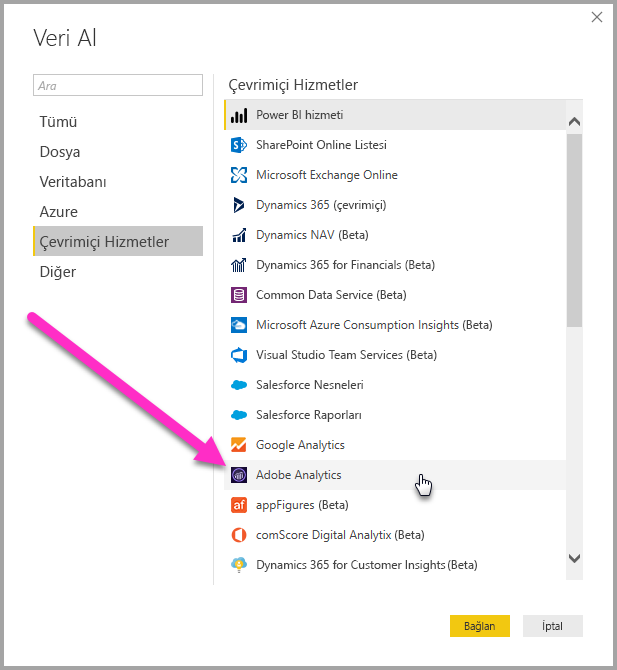
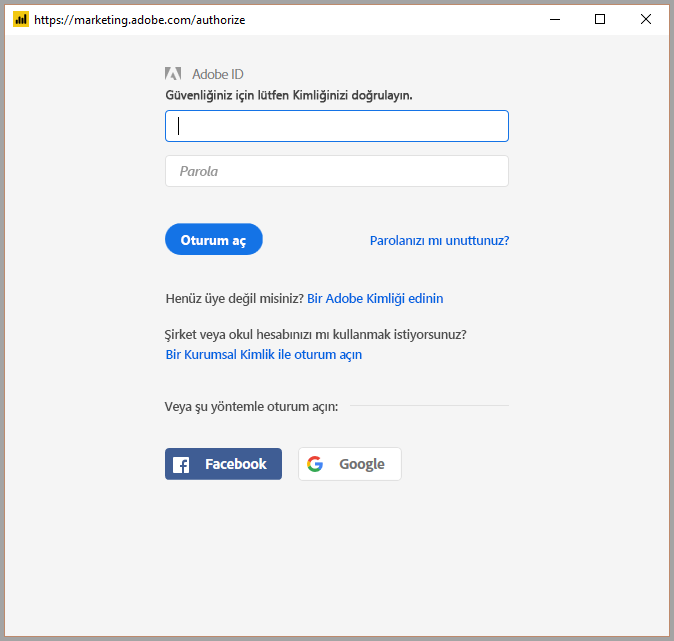
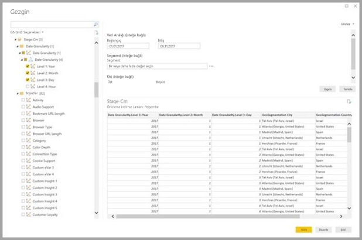
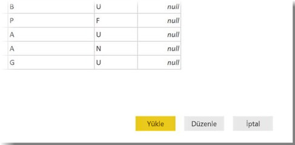

# Power BI Desktop'ta Adobe Analytics'e bağlanma 
Tıpkı Power BI Desktop’taki diğer veri kaynaklarında olduğu gibi **Power BI Desktop**’ta da **Adobe Analytics**’e bağlanabilir ve temel alınan verileri kullanabilirsiniz. 

## Adobe Analytics verilerine bağlanma
**Adobe Analytics** verilerine bağlanmak için Power BI Desktop’ın **Giriş** şeridindeki **Veri Al** seçeneğini belirleyin. Soldaki kategorilerden **Çevrimiçi Hizmetler**’i seçtiğinizde **Adobe Analytics bağlayıcıyı** görürsünüz.

Görünen **Adobe Analytics** penceresinde **Oturum aç** düğmesini seçin ve Adobe Analytics hesabınızda oturum açmak için kimlik bilgilerinizi sağlayın. Aşağıdaki resimde gösterildiği gibi Adobe oturum açma penceresi görünür.

İstendiğinde kullanıcı adınızı ve parolanızı girin. Bağlantı kurulduktan sonra tek bir tablosal çıktı oluşturmak için Power BI **Gezgini** iletişim kutusunda birden fazla boyutun ve ölçünün önizlemesini görüntüleyip seçebilirsiniz. Seçili öğeler için gerekli giriş parametrelerini de sağlayabilirsiniz. 

Seçili tabloyu **Yüklemeyi** seçtiğinizde tablonun tamamı **Power BI Desktop**'a getirilir. Sorguyu **Düzenlemeyi** seçtiğinizde ise kullanmak istediğiniz veri kümesini filtreleyebileceğiniz ve iyileştirebileceğiniz, ardından, iyileştirilen bu veri kümesini **Power BI Desktop**'a yükleyebileceğiniz **Sorgu Düzenleyicisi** açılır.

## Sonraki adımlar
Power BI Desktop'ı kullanarak çok çeşitli türlerdeki verilere bağlanabilirsiniz. Veri kaynakları hakkında daha fazla bilgi için aşağıdaki kaynaklara bakın:

* [Power BI Desktop nedir?](../fundamentals/desktop-what-is-desktop.md)
* [Power BI Desktop'taki veri kaynakları](desktop-data-sources.md)
* [Power BI Desktop'ta Verileri Şekillendirme ve Birleştirme](desktop-shape-and-combine-data.md)
* [Power BI Desktop'ta Excel çalışma kitaplarına bağlanma](desktop-connect-excel.md)   
* [Verileri doğrudan Power BI Desktop'a girme](desktop-enter-data-directly-into-desktop.md)   
