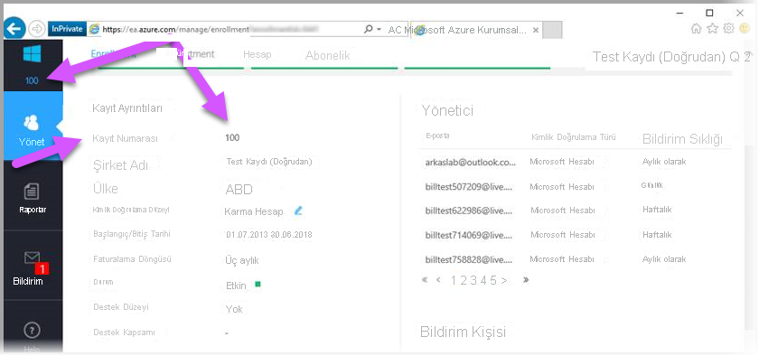
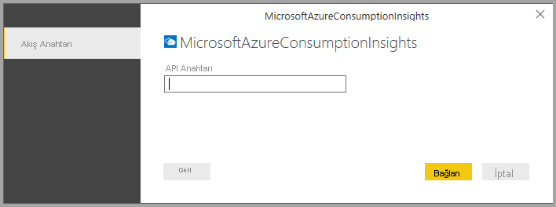
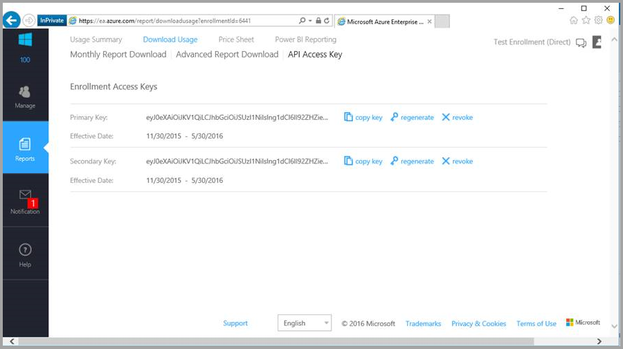
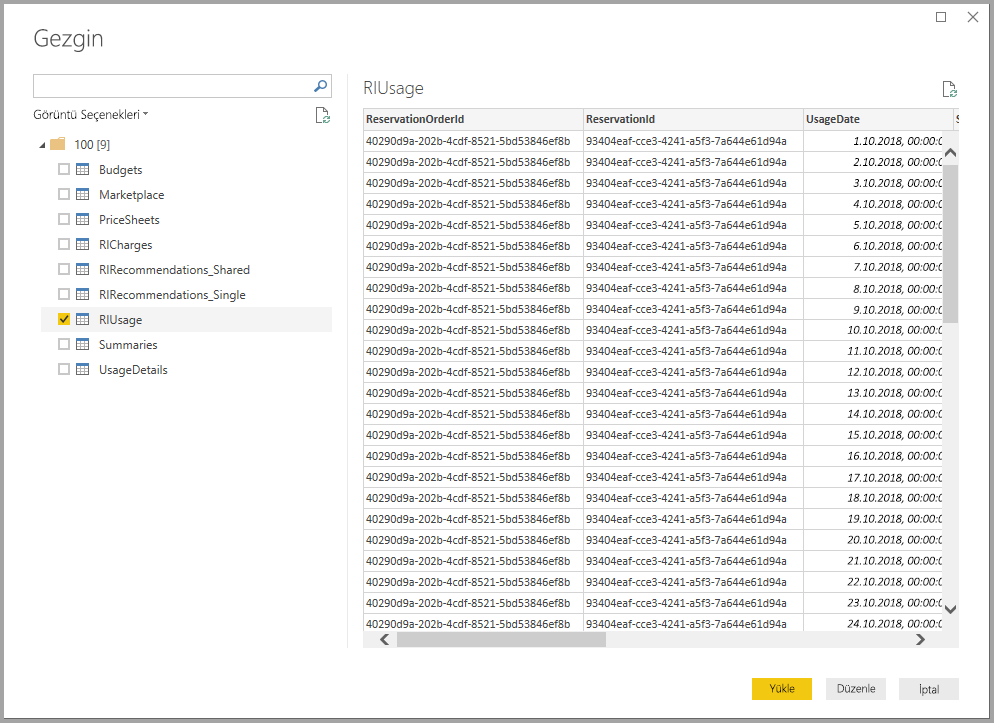
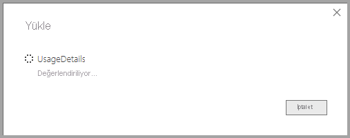
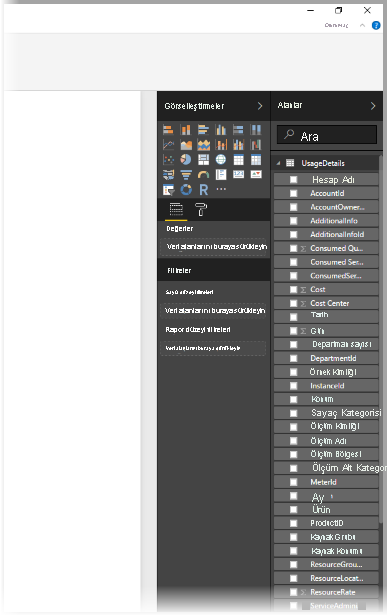
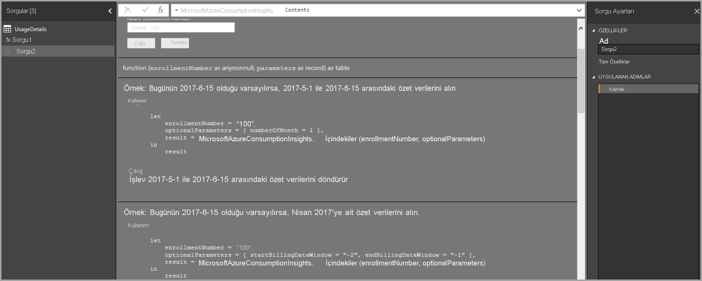
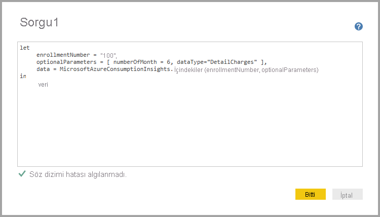

# Power BI Desktop’ta Azure Consumption Insights verilerine bağlanma

Power BI Desktop'ı Azure’a bağlanmak için kullanabilir ve kuruluşunuzun Azure hizmet kullanımı hakkında ayrıntılı veriler alabilirsiniz. Bu verilerle, Azure harcamalarınızı daha iyi anlamak ve analiz etmek için özel raporlar ve ölçümler oluşturabilirsiniz.

> [!NOTE]
> Microsoft Azure Consumption Insights (Beta) için sınırlı destek vardır. Yeni işlevler için [Power BI için Azure Maliyet Yönetimi bağlayıcısını](desktop-connect-azure-cost-management.md) kullanın.

## Azure Consumption Insights ile bağlanma

Azure Consumption Insights, Azure Kurumsal Anlaşma faturalama hesaplarınıza bağlanmanızı sağlar.

Bu bölümde Azure Kurumsal Bağlayıcısı'nı kullanarak gereken verileri nasıl geçirebileceğinizi öğreneceksiniz. Ayrıca **ACI** (Azure Consumption Insights) API'sinde bir *kullanım ayrıntıları sütunları* eşlemesi bulacaksınız.

**Azure Consumption Insights** bağlayıcısını başarılı bir şekilde kullanabilmek için Azure portalının Kurumsal özelliklerine erişiminizin olması gerekir.

**Power BI Desktop**'ta **Azure Consumption Insights** bağlayıcısını kullanmak için: 

1. **Giriş** şeridinde **Veri Al**'ı seçin.

1. Soldaki kategorilerden **Çevrimiçi Hizmetler**’i seçin.  

1. **Microsoft Azure Consumption Insights (Beta)** öğesini seçin. 

1. **Bağlan**'ı seçin.

   

   Görüntülenen iletişim kutusuna **Azure Kayıt Numaranızı** girin.

   

   * Kayıt numaranızı, [Azure Enterprise Portal](https://ea.azure.com)'da aşağıdaki görüntüde gösterilen konuma giderek bulabilirsiniz:

  

   Bu bağlayıcı sürümü yalnızca https://ea.azure.com sayfasından gelen kurumsal kayıtları destekler. Çin'e ait kayıtlar şu anda desteklenmemektedir.

   Bağlanmak için *Erişim anahtarınızı* girin.

   

   * Kayıt için Erişim anahtarınızı [Azure Enterprise Portal](https://ea.azure.com)'da bulabilirsiniz.

  

*Erişim anahtarınızı* girip **Bağlan**'ı seçtiğinizde bir **Gezgin** penceresi açılır ve kullanılabilir dokuz tabloyu gösterir:

| Tablo        | Açıklama |
|------------- | -------------------------------------------------------------|
| **Budgets** | Mevcut bütçe hedeflerine göre gerçek maliyetleri ve kullanımı görüntülemek için bütçe ayrıntıları. |
| **MarketPlace** | Kullanım tabanlı Azure Market ücretleri. |
| **PriceSheets** | Kayıt işlemi için ölçüme göre uygun oranlar. |
| **RICharges** | Son 24 ayda Ayrılmış Örneklerinizle ilişkili ücretler. |
| **RIRecommendations_Single** | Son 7, 30 veya 60 günde tek bir aboneliğinizdeki kullanım eğilimlerinden yola çıkarak Ayrılmış Örnek için satın alma önerileri. |
| **RIRecommendations_Shared** | Son 7, 30 veya 60 günde tüm aboneliklerinizdeki kullanım eğilimlerinden yola çıkarak Ayrılmış Örnek için satın alma önerileri. |
| **RIUsage** | Mevcut Ayrılmış Örneklerinizin geçen ayki tüketim ayrıntıları. |
| **Summaries** | Bakiyelerin, yeni satın alma işlemlerinin, Azure Market hizmeti ücretlerinin, ayarlamaların ve fazla kullanım ücretlerinin aylık özeti. |
| **UsageDetails** | Tüketilen miktarların dökümü ve tahmini kayıt ücretleri. |

Önizlemeyi görmek için herhangi bir tablonun yanındaki onay kutusunu seçebilirsiniz. Tablo adlarının yanlarında bulunan kutuları işaretleyerek bir veya birden fazla tablo seçebilir ve ardından **Yükle** seçeneğini belirleyebilirsiniz.

> [!NOTE]
> *Summary* ve *PriceSheet* tabloları yalnızca kayıt düzeyindeki API Anahtarı için kullanılabilir. Ayrıca, *UsageDetails* ve *PriceSheets* tabloları, varsayılan olarak geçerli aya ilişkin verileri içerir. *Summaries* ve *Marketplace* tabloları, geçerli ay ile sınırlı değildir.
>
>

**Yükle**'yi seçtiğinizde veriler, **Power BI Desktop**'a yüklenir.

Belirlediğiniz veriler yüklendikten sonra, seçtiğiniz tabloları ve alanları **Alanlar** bölmesinde görebilirsiniz.

## Azure Tüketim Öngörüleri'ni kullanma
**Azure Consumption Insights** bağlayıcısını kullanabilmek için Azure portalının Kurumsal özelliklerine erişirsiniz.

**Azure Consumption Insights** bağlayıcısı aracılığıyla verileri başarıyla yüklediğinizde, **Sorgu Düzenleyicisi**'ni kullanarak kendi özel ölçülerinizi ve sütunlarınızı oluşturabilirsiniz. Ayrıca **Power BI** hizmetinde paylaşabileceğiniz görseller, raporlar ve panolar da oluşturabilirsiniz.

Boş bir sorguyla örnek Azure özel sorgu koleksiyonunu alabilirsiniz. Bu alma işlemini yapmanın iki yolu vardır: 

**Power BI Desktop**'ta: 

1. **Giriş** şeridini seçin 
2. **Veri Al** > **Boş Sorgu**'yu seçin 

Alternatif olarak **Sorgu Düzenleyicisi**'nde: 

1. Soldaki **Sorgular** bölmesine sağ tıklayın 
2. Görüntülenen menüde **Yeni Sorgu > Boş Sorgu**'yu seçin

**Formül çubuğuna** şunları yazın:

    = MicrosoftAzureConsumptionInsights.Contents

Aşağıdaki resimde, görüntülenen bir örnek koleksiyonu gösterilir.

Raporlarla çalışırken ve sorgu oluştururken şunları yapabilirsiniz:

* Geçerli tarihten itibaren ay sayısını tanımlamak için *numberOfMonth* parametresini kullanın
  * Bir ile 36 arasında bir değer kullanın. Bu değer geçerli tarihten itibaren kaç aya ilişkin verileri içeri aktarmak istediğinizi belirtir. En çok 12 aylık verileri almanızı öneririz. Bu sınır Power BI sorgu içeri aktarma kısıtlamalarına ve veri hacmi eşiklerine ulaşmanızı önler.
* Tarihteki bir ay aralığını tanımlamak için *startBillingDataWindow* ve *endBillingDataWindow* parametrelerini kullanın
* *numberOfMonth* parametresini, *startBillingDataWindow* veya *endBillingDataWindow* parametresiyle birlikte kullanmayın

## Azure Kurumsal Bağlayıcısı'ndan geçiş yapma

Bazı müşteriler *Azure Kurumsal Bağlayıcısı (Beta)* kullanarak görsel oluşturur. En sonunda bu bağlayıcı **Azure Consumption Insights** bağlayıcısıyla değiştirilecektir. Yeni bağlayıcının aşağıdakiler gibi özellikleri ve geliştirmeleri vardır:

* *Bakiye Özeti* ve *Market Alışverişleri* için kullanılabilen ek veri kaynakları
* *startBillingDataWindow* ve *endBillingDataWindow* gibi yeni ve gelişmiş parametreler
* Daha iyi performans ve yanıtlama hızı

Aşağıdaki adımlarda **Azure Consumption Insights** bağlayıcısına nasıl geçiş yapılacağı gösterilir. Bu adımlarda, özel panolar veya raporlar oluştururken zaten yaptığınız çalışmalar korunur.

### 1\. Adım: Yeni bağlayıcıyı kullanarak Azure’a bağlanma
İlk adım, bu makalenin başlarında ayrıntılarıyla açıklandığı gibi **Azure Consumption Insights** bağlayıcısını kullanmaktır. Bu adımda **Power BI Desktop**'taki **Giriş** şeridinde **Veri Al > Boş Sorgu** seçeneğini belirleyin.

### 2\. Adım: Gelişmiş Düzenleyici'de sorgu oluşturma
**Sorgu Düzenleyicisi**'ndeki **Giriş** şeridinin **Sorgu** bölümünde **Gelişmiş Düzenleyici**'yi seçin. Görüntülenen **Gelişmiş Düzenleyici** penceresine şu sorguyu girin:

    let    
        enrollmentNumber = "100",
        optionalParameters = [ numberOfMonth = 6, dataType="DetailCharges" ],
        data = MicrosoftAzureConsumptionInsights.Contents(enrollmentNumber, optionalParameters)   
    in     
        data

*enrollmentNumber* değerini kendi kayıt numaranızla değiştirmelisiniz. Numaranızı [Azure Enterprise Portal](https://ea.azure.com)'dan alabilirsiniz. *numberOfMonth* parametresi, güncel tarihten itibaren kaç ay öncesine ait verileri almak istediğinizi belirtir. Geçerli ay için sıfır (0) değerini kullanın.

**Gelişmiş Düzenleyici** penceresinde **Bitti**'yi seçtiğinizde önizleme yenilenir ve tabloda belirtilen ay aralığına ilişkin veriler görüntülenir. **Kapat & Uygula**'yı seçip geri dönün.

### 3\. Adım: Ölçüleri ve özel sütunları yeni rapora taşıma
Bu adımda, oluşturduğunuz özel sütunları veya ölçüleri yeni ayrıntılar tablosuna taşımanız gerekir. Uygulamanız gereken adımlar:

1. Not Defteri'ni (veya başka bir metin düzenleyiciyi) açın.
2. Taşımak istediğiniz ölçüyü seçin ve *Formül* alanındaki metni kopyalayıp Not Defteri'ne yerleştirin.

   
3. İlk ayrıntılar tablosunu *Query1* olarak yeniden adlandırın.
4. Yeni tablo ölçüleri ve özel sütunlar oluşturmak için tabloya sağ tıklayın ve **Yeni Ölçü**'yü seçin. Ardından depolanmış ölçülerinizi ve sütunlarınızı hepsi bitene kadar kesin ve yapıştırın.

### 4\. Adım: İlişkili tabloları yeniden bağlantılı hale getirme
Pek çok panoda, arama veya filtreleme için kullanılan ek tablolar (tarih tabloları veya özel projeler için kullanılan tablolar gibi) bulunur. Bu ilişkiler yeniden oluşturulduğunda, kalan sorunların büyük kısmı çözülmüş olur. Bunun nasıl yapılacağı aşağıda açıklanmaktadır.

- **Power BI Desktop**'taki **Modelleme** sekmesinde **İlişkileri Yönet**'i seçtiğinizde, söz konusu modeldeki ilişkileri yönetmenize olanak sağlayan bir pencere açılır. Tablolarınızı gereken şekilde yeniden bağlantılı hale getirin.

    

### 5\. Adım: Görsellerinizi doğrulama ve alan biçimlendirmesini gereken şekilde ayarlama
Bu noktada özgün görselleriniz, tablolarınız ve detaylandırma özelliklerinizden çoğunun beklendiği gibi çalışması gerekir. Bununla birlikte genel görünümü tam olarak biçimlendirmek için bazı küçük ayarlamalar gerekebilir. Tüm panolarınızı ve görsellerinizi tek tek hızla inceleyerek istediğiniz gibi göründüğünden emin olun.

## Kullanım verilerini almak için Azure Tüketim Öngörüleri (ACI) API'sini kullanma
Azure tarafından sağlanan bir [**Azure Tüketim Öngörüleri (ACI) API**](https://azure.microsoft.com/blog/announcing-general-availability-of-consumption-and-charge-apis-for-enterprise-azure-customers/)'si de mevcuttur. ACI API'sini kulla6narak Azure kullanım bilgilerini toplama, raporlama ve görselleştirmeye yönelik kendi özel çözümlerinizi oluşturabilirsiniz.

### Adları ve kullanım ayrıntılarını portal, bağlayıcı ve API arasında eşleme
Azure Portalındaki sütunların ve ayrıntıların adları API ve bağlayıcıda benzerdir ama her zaman tam olarak aynı değildir. Durumu netleştirmek için aşağıdaki tabloda eşleme sağlanır. Ayrıca, ilgili sütunun kullanımdan kaldırılıp kaldırılmadığı da belirtilmiştir. Daha fazla bilgi edinmek ve terim açıklamalarını görmek için bkz. [Azure faturalama verileri sözlüğü](https://docs.microsoft.com/azure/billing/billing-enterprise-api-usage-detail).

| ACI Bağlayıcısı/İçerik Paketi Sütun Adı | ACI API'si Sütun Adı | EA Sütun Adı | Kullanımdan kalktı/Geriye dönük uyumluluk için mevcut |
| --- | --- | --- | --- |
| AccountName |accountName |Hesap Adı |Hayır |
| AccountId |accountId | |Evet |
| AccountOwnerId |accountOwnerEmail |AccountOwnerId |Hayır |
| AdditionalInfo |additionalInfo |AdditionalInfo |Hayır |
| AdditionalInfold | | |Evet |
| Tüketilen Miktar |consumedQuantity |Tüketilen Miktar |Hayır |
| Tüketim Hizmeti |consumedService |Tüketim Hizmeti |Hayır |
| ConsumedServiceId |consumedServiceId | |Evet |
| Maliyet |cost |ExtendedCost |Hayır |
| Maliyet Merkezi |costCenter |Maliyet Merkezi |Hayır |
| Tarih |date |Tarih |Hayır |
| Gün | |Gün |Hayır |
| DepartmentName |departmentName |Bölüm Adı |Hayır |
| DepartmentID |departmentId | |Evet |
| Örnek Kimliği | | |Evet |
| InstanceId |instanceId |Örnek Kimliği |Hayır |
| Konum | | |Evet |
| Sayaç Kategorisi |meterCategory |Sayaç Kategorisi |Hayır |
| Ölçüm kimliği | | |Evet |
| Ölçüm Adı |meterName |Sayaç Adı |Hayır |
| Tarife Bölgesi |meterRegion |Tarife Bölgesi |Hayır |
| Sayaç Alt Kategorisi |meterSubCategory |Sayaç Alt Kategorisi |Hayır |
| MeterId |meterId |Ölçüm kimliği |Hayır |
| Ay | |Ay |Hayır |
| Ürün |product |Ürün |Hayır |
| ProductId |productId | |Evet |
| Kaynak Grubu |resourceGroup |Kaynak Grubu |Hayır |
| Kaynak Konumu |resourceLocation |Kaynak Konumu |Hayır |
| ResourceGroupId | | |Evet |
| ResourceLocationId |resourceLocationId | |Evet |
| ResourceRate |resourceRate |ResourceRate |Hayır |
| ServiceAdministratorId |serviceAdministratorId |ServiceAdministratorId |Hayır |
| ServiceInfo1 |serviceInfo1 |ServiceInfo1 |Hayır |
| ServiceInfo1Id | | |Evet |
| ServiceInfo2 |serviceInfo2 |ServiceInfo2 |Hayır |
| ServiceInfo2Id | | |Evet |
| Depolama Hizmeti Tanımlayıcısı |storeServiceIdentifier |Depolama Hizmeti Tanımlayıcısı |Hayır |
| StoreServiceIdentifierId | | |Evet |
| Abonelik Adı |subscriptionName |Abonelik Adı |Hayır |
| Etiketler |tags |Etiketler |Hayır |
| TagsId | | |Evet |
| Ölçü Birimi |unitOfMeasure |Ölçü Birimi |Hayır |
| Yıl | |Yıl |Hayır |
| SubscriptionId |subscriptionId |SubscriptionId |Evet |
| SubscriptionGuid |subscriptionGuid |SubscriptionGuid |Hayır |

## Sonraki adımlar

Power BI Desktop’ı kullanarak birçok farklı veri kaynağına bağlanabilirsiniz. Daha fazla bilgi için aşağıdaki makaleleri inceleyin:

* [Power BI Desktop’ta Azure Maliyet Yönetimi verilerine bağlanma](desktop-connect-azure-cost-management.md)
* [Power BI Desktop nedir?](../fundamentals/desktop-what-is-desktop.md)
* [Power BI Desktop'ta Veri Kaynakları](desktop-data-sources.md)
* [Power BI Desktop'ta Verileri Şekillendirme ve Birleştirme](desktop-shape-and-combine-data.md)
* [Power BI Desktop'ta Excel çalışma kitaplarına bağlanma](desktop-connect-excel.md)   
* [Verileri doğrudan Power BI Desktop'a girme](desktop-enter-data-directly-into-desktop.md)   
