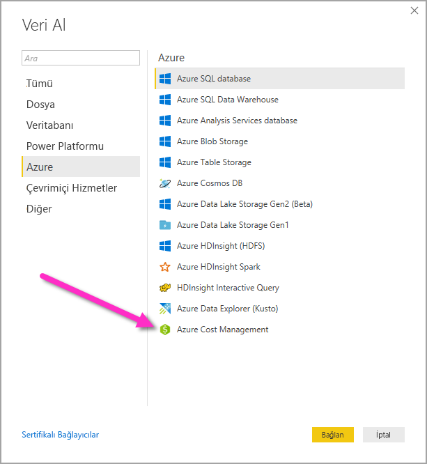

# Power BI Desktop'ta Azure Maliyet Yönetimi bağlayıcısı ile görseller ve raporlar oluşturma

Azure harcamalarınızı daha iyi anlamanıza yardımcı olan güçlü, özelleştirilmiş görselleştirmeler ve raporlar oluşturmak için Power BI Desktop için Azure Maliyet Yönetimi bağlayıcısını kullanabilirsiniz. Azure Maliyet Yönetimi bağlayıcısı şu anda [Microsoft Müşteri Sözleşmesi](https://azure.microsoft.com/pricing/purchase-options/microsoft-customer-agreement/) veya [Kurumsal Anlaşması](https://azure.microsoft.com/pricing/enterprise-agreement/) olan müşterileri destekler.  

Azure Maliyet Yönetimi bağlayıcısı, Azure’da kimlik doğrulaması için OAuth 2.0 kullanır ve bağlayıcıyı kullanacak kullanıcıları tanımlar. Bu işlemde oluşturulan belirteçler belirli bir süre için geçerlidir. Power BI sonraki oturum açma için belirteci saklar. OAuth 2.0, bu izinlerin güvenli bir şekilde işlenmesini sağlamak için arka planda devam eden işlemin standardıdır. Bağlanmak istiyorsanız, Kurumsal Anlaşmalar için [Kuruluş Yöneticisi](https://docs.microsoft.com/azure/billing/billing-understand-ea-roles) hesabını veya Microsoft Müşteri Sözleşmeleri için [Faturalama hesabı sahibini](https://docs.microsoft.com/azure/billing/billing-understand-mca-roles) kullanmanız gerekir. 

> [!NOTE]
> Bu bağlayıcı, önceden kullanılabilir olan [Azure Consumption Insights ve Azure Maliyet Yönetimi (Beta)](desktop-connect-azure-consumption-insights.md) bağlayıcılarının yerini alır. Önceki bağlayıcı ile oluşturulan raporların bu bağlayıcı kullanılarak yeniden oluşturulması gerekir.

## Azure Maliyet Yönetimi’ni kullanarak bağlanma

Power BI Desktop’ta **Azure Maliyet Yönetimi bağlayıcısını** kullanmak için:

1.  **Giriş** şeridinde **Veri Al**’ı seçin.
2.  Veri kategorileri listesinden **Azure**’ı seçin.
3.  **Azure Maliyet Yönetimi**’ni seçin.

    

4. Görüntülenen iletişim kutusunda, **Microsoft Müşteri Sözleşmeleri** için **Faturalama Profili Kimliği** bilginizi veya **Kurumsal Anlaşma** için **Kayıt Numarası** bilginizi girin. 

## Microsoft Müşteri Sözleşmesi hesabına bağlanma 

Bir **Microsoft Müşteri Sözleşmesi** hesabına bağlanmak için, Azure portalından **Faturalama profili kimliğinizi** alabilirsiniz:

1.  [Azure portalında](https://portal.azure.com/)**Maliyet Yönetimi + Faturalandırma**’ya gidin.
2.  Faturalama profilinizi seçin. 
3.  Menüdeki **Ayarlar** bölümünde, kenar çubuğundan **Özellikler**’i seçin.
4.  **Faturalama profili** bölümünde **Kimlik**’i seçin. 
5.  **Kapsam Seçin** için **Faturalama Profili Kimliği**’ni seçin ve önceki adımdaki faturalama profili kimliğini yapıştırın. 
6.  Ay sayısını girip **Tamam**’ı seçin.

    

7.  İstendiğinde, Azure kullanıcı hesabı ve parolanızla oturum açın. 

## Kurumsal Anlaşma hesabına bağlanma

Bir Kurumsal Anlaşma (EA) hesabıyla bağlantı kurmak için, Azure portalından kayıt kimliğinizi alabilirsiniz:

1.  [Azure portalında](https://portal.azure.com/)**Maliyet Yönetimi + Faturalandırma**’ya gidin.
2.  Fatura hesabınızı seçin.
3.  **Genel Bakış** menüsünde **Faturalama hesabı kimliği**’ni kopyalayın.
4.  **Kapsam Seçin** için **Kayıt Numarası**’nı seçin ve önceki adımdaki faturalama profili kimliğini yapıştırın. 
5.  Ay sayısını girip **Tamam**’ı seçin.

    

6.  İstendiğinde, Azure kullanıcı hesabı ve parolanızla oturum açın. 

## Bağlayıcı aracılığıyla kullanılabilir olan veriler

Başarıyla kimlik doğrulaması yapmanızın ardından **Gezgin** penceresi, aşağıdaki kullanılabilir veri tablolarıyla birlikte görüntülenir:

| **Tablo** | **Açıklama** |
| --- | --- |
| **Balance summary** | Kurumsal Anlaşmalar için bakiye özeti. |
| **Faturalama olayları** | Yeni faturalar, kredi satın almaları vb. için olay günlüğü. Yalnızca Microsoft Müşteri Sözleşmesi. |
| **Budgets** | Mevcut bütçe hedeflerine göre gerçek maliyetleri ve kullanımı görüntülemek için bütçe ayrıntıları. |
| **Charges** | Azure kullanımı, Market ücretleri ve ayrı faturalanan ücretlerin ay bazında özeti. Yalnızca Microsoft Müşteri Sözleşmesi. |
| **Credit lots** | Belirtilen faturalama profili için Azure kredi lot satın alma ayrıntıları. Yalnızca Microsoft Müşteri Sözleşmesi. |
| **Pricesheets** | Sağlanan faturalama profili veya Kurumsal Anlaşma kaydı için geçerli ölçüm ücretleri. |
| **RI charges** | Son 24 ayda Ayrılmış Örneklerinizle ilişkili ücretler. |
| **RI recommendations (shared)** | Son 7, 30 veya 60 günde tüm aboneliklerinizdeki kullanım eğilimlerinden yola çıkarak Ayrılmış Örnek için satın alma önerileri. |
| **RI recommendations (single)** | Son 7, 30 veya 60 günde tek bir aboneliğinizdeki kullanım eğilimlerinden yola çıkarak Ayrılmış Örnek için satın alma önerileri. |
| **RI usage details** | Mevcut Ayrılmış Örneklerinizin geçen ayki tüketim ayrıntıları. |
| **RI usage summary** | Günlük Azure rezervasyon kullanım yüzdesi. |
| **Usage details** | Kurumsal Anlaşma kaydında belirtilen faturalama profilinin tüketilen miktar ve tahmini ücretlerinin dökümü. |
| **İtfa edilen kullanım ayrıntıları** | Kurumsal Anlaşma kaydında belirtilen faturalama profilinin tüketilen miktar ve tahmini itfa edilen ücretlerinin dökümü. |

Önizleme iletişim kutusunu görmek için bir tablo seçebilirsiniz. Tablo adlarının yanlarında bulunan kutuları seçerek bir veya daha fazla tablo seçebilir ve ardından **Yükle** seçeneğini belirleyebilirsiniz.

**Yükle**’yi seçtiğinizde veriler Power BI Desktop’a yüklenir. 

Seçtiğiniz veriler yüklendiğinde, veri tabloları ve alanları **Alanlar** bölmesinde gösterilir.

## Sonraki adımlar

Power BI Desktop’ı kullanarak birçok farklı veri kaynağına bağlanabilirsiniz. Daha fazla bilgi için aşağıdaki makaleleri inceleyin:

* [Power BI Desktop nedir?](../fundamentals/desktop-what-is-desktop.md)
* [Power BI Desktop'ta Veri Kaynakları](desktop-data-sources.md)
* [Power BI Desktop'ta Verileri Şekillendirme ve Birleştirme](desktop-shape-and-combine-data.md)
* [Power BI Desktop'ta Excel çalışma kitaplarına bağlanma](desktop-connect-excel.md)   
* [Verileri doğrudan Power BI Desktop'a girme](desktop-enter-data-directly-into-desktop.md)   
