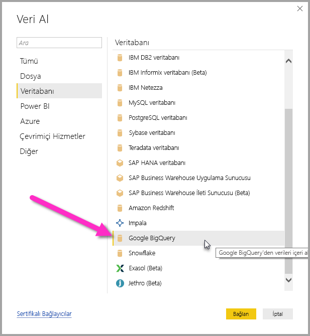
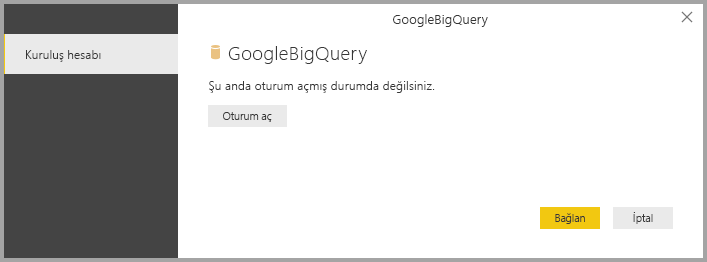
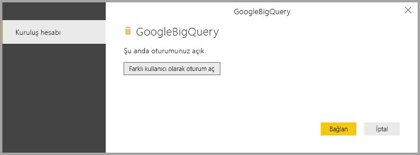
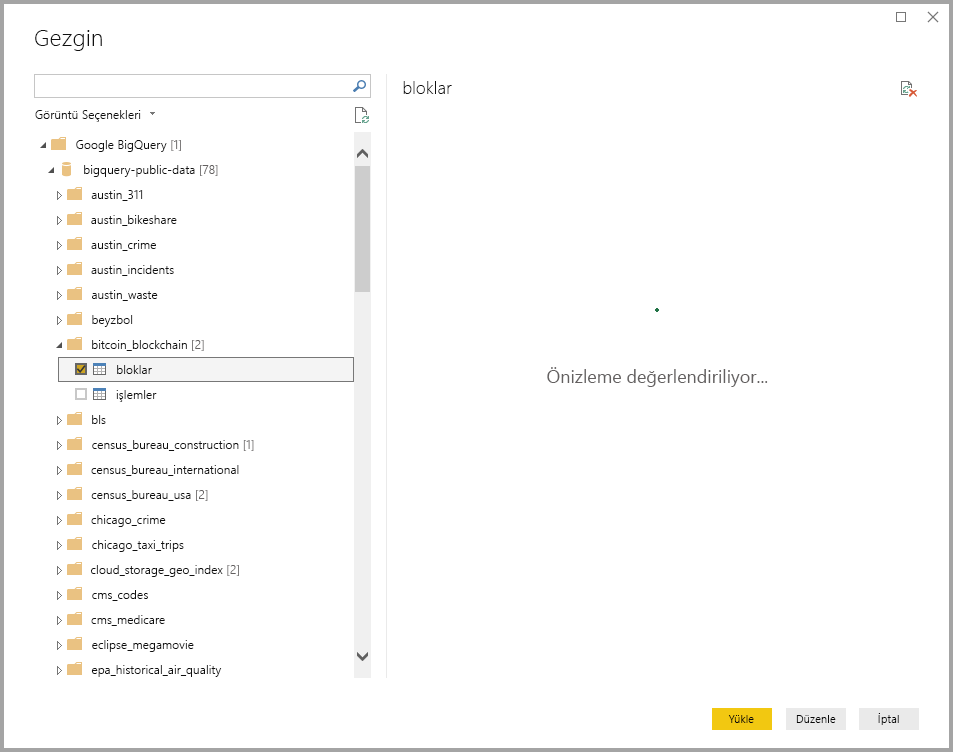

# <a name="connect-to-a-google-bigquery-database-in-power-bi-desktop"></a>Power BI Desktop'ta bir Google BigQuery veritabanına bağlanma
Power BI Desktop'ta bir Google **BigQuery** veritabanına bağlanabilir ve veritabanındaki verileri diğer Power BI Desktop veri kaynakları gibi kullanabilirsiniz.

## <a name="connect-to-google-bigquery"></a>Google BigQuery'ye bağlanma
Bir Google **BigQuery** veritabanına bağlanmak için Power BI Desktop'ta **Giriş** şeridinden **Veri Al**'ı seçin. Soldaki kategorilerden **Veritabanı**'nı seçtiğinizde **Google BigQuery**'yi görebilirsiniz.



Açılan **Google BigQuery** penceresinde, Google BigQuery hesabınızda oturum açın ve **Bağlan**'ı seçin.



Oturum açtığınızda aşağıdaki pencereyi gösterirsiniz ve bu kimliğinizin doğrulandığını gösterir. 



Bağlantı başarıyla kurulduktan sonra bir **Gezgin** penceresi açılır ve sunucudaki kullanılabilir verileri görüntüler. Bu veriler arasından **Power BI Desktop**'a aktarılıp kullanılacak bir veya birden çok öğe seçebilirsiniz.



## <a name="considerations-and-limitations"></a>Önemli Noktalar ve Sınırlamalar
Google **BigQuery** bağlayıcısı ile ilgili olarak göz önünde bulundurmanız gereken bazı sınırlar ve hususlar vardır:

* Google BigQuery bağlayıcısı Power BI Desktop'ta ve Power BI hizmetinde bulunur. Power BI hizmetinde bağlayıcıya Power BI'dan Google BigQuery'ye olan Buluttan Buluta bağlantı kullanılarak erişilebilir.

Power BI'yı Google BigQuery **Faturalama Projesi** ile kullanabilirsiniz. Power BI varsayılan olarak kullanıcı için döndürülen listedeki ilk projeyi kullanır. Power BI ile kullanırken Faturalama Projesi davranışını özelleştirmek için aşağıdaki adımları uygulayın:

 * Power BI Desktop'ta **Power Query Editor** kullanılarak özelleştirilebilecek, Kaynak adımında temel alınan M'de aşağıdaki seçeneği belirtin:

    ```Source = GoogleBigQuery.Database([BillingProject="Include-Billing-Project-Id-Here"])```

## <a name="next-steps"></a>Sonraki adımlar
Power BI Desktop'ı kullanarak çok çeşitli türlerdeki verilere bağlanabilirsiniz. Veri kaynakları hakkında daha fazla bilgi için aşağıdaki kaynaklara bakın:

* [Power BI Desktop nedir?](../fundamentals/desktop-what-is-desktop.md)
* [Power BI Desktop'taki veri kaynakları](desktop-data-sources.md)
* [Power BI Desktop'ta Verileri Şekillendirme ve Birleştirme](desktop-shape-and-combine-data.md)
* [Power BI Desktop'ta Excel çalışma kitaplarına bağlanma](desktop-connect-excel.md)   
* [Verileri doğrudan Power BI Desktop'a girme](desktop-enter-data-directly-into-desktop.md)   
