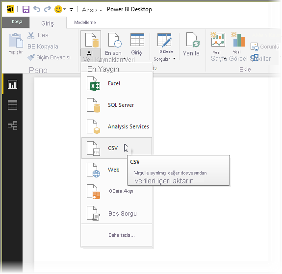
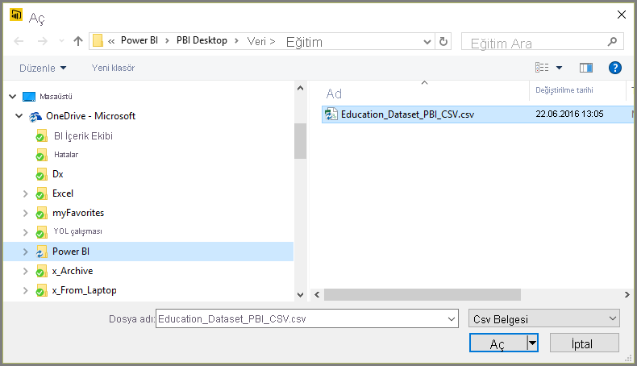
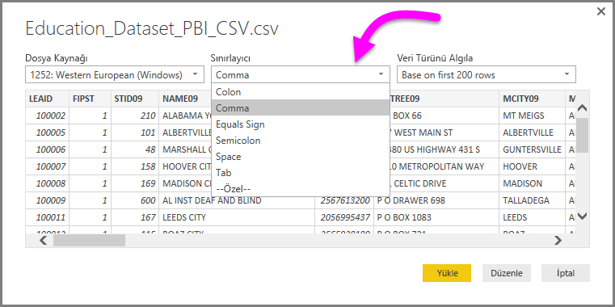
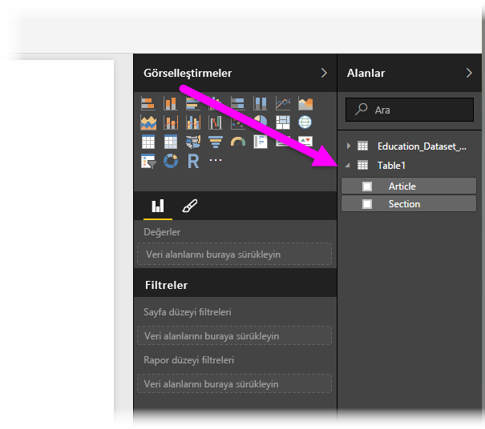

# Power BI Desktop'ta CSV dosyalarına bağlanma
Power BI Desktop'tan virgülle ayrılmış değer (*CSV*) dosyalarına bağlanma işlemi Excel çalışma kitaplarına bağlanma işlemiyle oldukça benzerdir. Her iki işlem de kolayca gerçekleştirilebilir ve bu makalede, erişiminizin bulunduğu herhangi bir CSV dosyasına nasıl bağlanacağınız adım adım gösterilmiştir.

Başlamak için, Power BI Desktop'taki **Giriş** şeridinde **Veri Al > CSV** seçeneğini belirleyin.

Görüntülenen **Aç** iletişim kutusundan CSV dosyanızı seçin.

**Aç** seçeneğini belirlediğinizde, Power BI Desktop dosyaya erişir ve dosya kaynağı, sınırlayıcı türü ve dosyadaki veri türlerini algılamak için kullanılması gereken satır sayısı gibi bazı dosya özniteliklerini belirler.

Bu dosya öznitelikleri ve seçenekler, aşağıda gösterildiği gibi, **CSV al** iletişim kutusunun üst kısmındaki açılır seçicilerde gösterilir. Açılır seçicilerdeki başka bir seçeneği belirleyerek, algılanan bu ayarlardan herhangi birini elle değiştirebilirsiniz.

Seçimlerinizden memnun olduğunuzda, dosyayı Power BI Desktop'a aktarmak için **Yükle**'yi seçebilir veya içeri aktarma işleminden önce verileri daha fazla şekillendirmek ve dönüştürmek üzere **Sorgu Düzenleyicisi**'ni açmak için **Düzenle** seçeneğini belirleyebilirsiniz.

Verileri Power BI Desktop'a yükledikten sonra, tabloyu ve sütunlarını (Power BI Desktop'ta Alanlar olarak gösterilir), Power BI Desktop'taki Rapor görünümü'nün sağ tarafındaki **Alanlar** bölmesinde görürsünüz.

Yapmanız gereken tüm işlemler bunlardır. Ardından, CSV dosyanızdaki veriler Power BI Desktop'a aktarılır.

Görsel ve rapor oluşturmak veya diğer Excel çalışma kitapları, veritabanları ya da başka bir veri kaynağı gibi, bağlanmak veya içeri aktarmak isteyebileceğiniz verilerle etkileşime geçmek için Power BI Desktop'taki verileri kullanabilirsiniz.

> [!IMPORTANT]
> Power BI Desktop, bir CSV dosyasını içeri aktardığınızda, Güç Sorgu Düzenleyicisi’nde gerçekleştirilen bir adım olarak *columns=x* parametresi oluşturur (*x* değeri, ilk içeri aktarma işlemi esnasında CSV dosyasında bulunan sütunların sayısıdır). Bunun ardından daha fazla sütun eklenirse ve veri kaynağı yenilemeye ayarlanırsa, sütunların ilk *x* sayısının ötesindeki hiçbir sütun yenilenmez. 

## Sonraki adımlar
Power BI Desktop'ı kullanarak çok çeşitli türlerdeki verilere bağlanabilirsiniz. Veri kaynakları hakkında daha fazla bilgi için aşağıdaki kaynaklara bakın:

* [Power BI Desktop nedir?](../fundamentals/desktop-what-is-desktop.md)
* [Power BI Desktop'ta Veri Kaynakları](desktop-data-sources.md)
* [Power BI Desktop'ta Verileri Şekillendirme ve Birleştirme](desktop-shape-and-combine-data.md)
* [Power BI Desktop'ta Excel çalışma kitaplarına bağlanma](desktop-connect-excel.md)   
* [Verileri doğrudan Power BI Desktop'a girme](desktop-enter-data-directly-into-desktop.md)   
