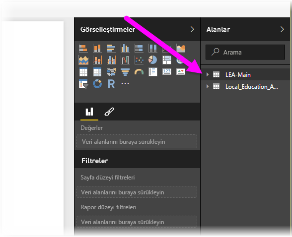

# Power BI Desktop'ta Excel çalışma kitaplarına bağlanma
Power BI Desktop'tan bir Excel çalışma kitabına bağlanmak kolaydır ve bu makalede, söz konusu işlemi nasıl gerçekleştireceğiniz adım adım gösterilmektedir.

Power BI Desktop'taki **Giriş** şeridinde **Veri Al > Excel** seçeneğini belirleyin.

Görüntülenen **Aç** iletişim kutusunda çalışma kitabınızı seçin.

Power BI Desktop, çalışma kitabındaki diğer veri öğelerinde bulunan tabloları **Gezgin** penceresinde görüntüler. Sol bölmede bir tablo seçtiğinizde, sağ bölmede verilerin önizlemesi görüntülenir.

Verileri içeri aktarmak için Yükle düğmesini seçebilir veya Power BI Desktop'a aktarmadan önce **Sorgu Düzenleyicisi** ile düzenlemek istiyorsanız **Düzenle** seçeneğini belirleyebilirsiniz.

Verilerinizi yüklediğinizde Power BI Desktop, **Yükle** penceresini ve yüklenmekte olan verilerle ilişkili etkinliği görüntüler.  

Yükleme tamamlandığında Power BI Desktop, ekranın sağ tarafındaki **Alanlar** bölmesinde, Excel çalışma kitabınızdan içeri aktarılan tabloları ve alanları görüntüler.

İşte bu kadar!

Artık görsel ve rapor oluşturmak veya diğer Excel çalışma kitapları, veritabanları ya da başka bir veri kaynağı gibi bağlanmak veya içeri aktarmak isteyebileceğiniz verilerle etkileşime geçmek için Power BI Desktop'a Excel çalışma kitabınızdan aktardığınız verileri kullanmaya hazırsınız.

## Sonraki adımlar
Power BI Desktop'ı kullanarak çok çeşitli türlerdeki verilere bağlanabilirsiniz. Veri kaynakları hakkında daha fazla bilgi için aşağıdaki kaynaklara bakın:

* [Power BI Desktop nedir?](../fundamentals/desktop-what-is-desktop.md)
* [Power BI Desktop'ta Veri Kaynakları](desktop-data-sources.md)
* [Power BI Desktop'ta Verileri Şekillendirme ve Birleştirme](desktop-shape-and-combine-data.md)
* [Power BI Desktop'ta CSV dosyalarına bağlanma](desktop-connect-csv.md)   
* [Verileri doğrudan Power BI Desktop'a girme](desktop-enter-data-directly-into-desktop.md)   
