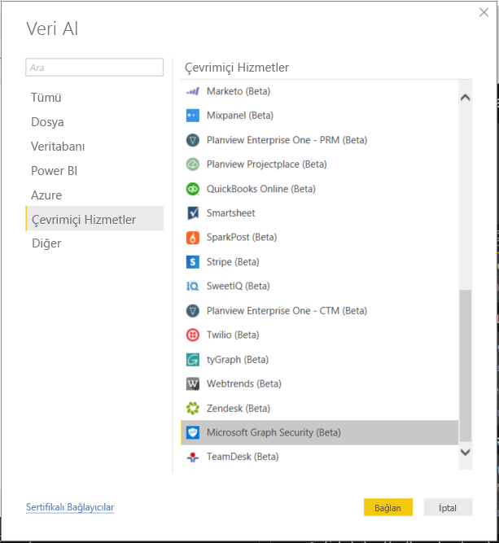
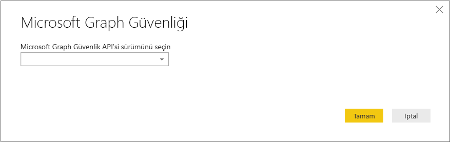
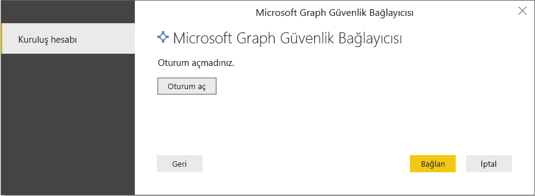
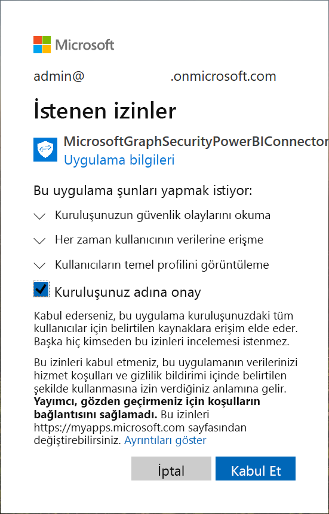
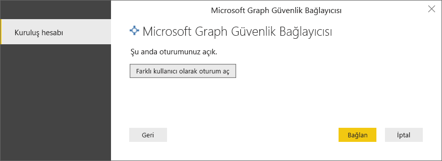
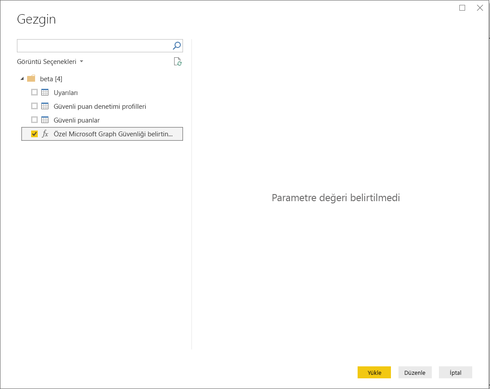
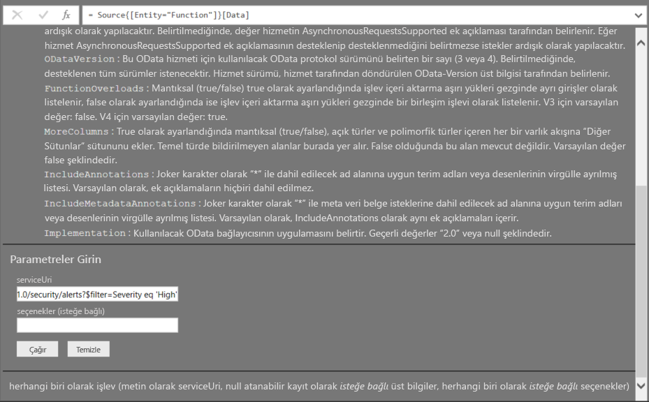
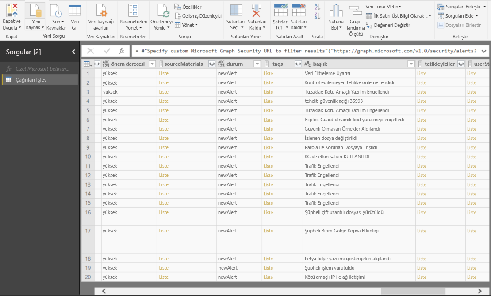

# Power BI Desktop’ta Microsoft Graph Güvenliği API’sine bağlanma

[Microsoft Graph Güvenliği API’sine](https://aka.ms/graphsecuritydocs) bağlanmak için Power BI Desktop Microsoft Graph Güvenlik bağlayıcısını kullanın. Bu sayede panolar ve raporlar oluşturabilir, güvenlikle ilgili [uyarılar](https://docs.microsoft.com/graph/api/resources/alert?view=graph-rest-1.0) ve [güvenlik puanı](https://docs.microsoft.com/graph/api/resources/securescores?view=graph-rest-beta) içgörüleri kazanabilirsiniz.

Microsoft Graph Güvenlik API’si, uyarı bağıntılarını kolaylaştırmak için Microsoft ve ekosistem iş ortaklarından [birden çok güvenlik çözümünü](https://aka.ms/graphsecurityalerts) birbirine bağlar. Bu birleşim zengin bağlamsal bilgilere erişim sağlar ve otomasyonu basitleştirir. Maliyetleri ve karmaşıklığı azaltırken kuruluşların birden çok güvenlik ürününden içgörüleri hızlıca alarak harekete geçmesini sağlar.

## Microsoft Graph Güvenlik bağlayıcısını kullanma önkoşulları

Microsoft Graph Güvenliği bağlayıcısını kullanmak için, Azure Active Directory (Azure AD) kiracı yöneticisinden *açıkça* onay almanız gerekir. Bkz. [Microsoft Graph Güvenliği kimlik doğrulaması gereksinimleri](https://aka.ms/graphsecurityauth).
Onay, bağlayıcının uygulama kimliğini ve adını gerektirir (burada belirtilmiştir ve [Azure portalda](https://portal.azure.com) bulunabilir):

| Özellik | Değer |
|----------|-------|
| **Uygulama adı** | `MicrosoftGraphSecurityPowerBIConnector` |
| **Uygulama Kimliği** | `cab163b7-247d-4cb9-be32-39b6056d4189` |
| **Yönlendirme URI'si** | `https://oauth.powerbi.com/views/oauthredirect.html` |
|||

Bağlayıcıya onay vermek için Azure AD kiracısı yöneticiniz aşağıdaki yöntemlerden birini kullanabilir:

* [Azure AD uygulamaları için onay verme](https://docs.microsoft.com/azure/active-directory/develop/v2-permissions-and-consent)

* [Uygulama onayı deneyimi](https://docs.microsoft.com/azure/active-directory/develop/application-consent-experience) aracılığıyla ilk çalıştırma sırasında mantıksal uygulamanızın gönderdiği bir isteği yanıtlayın
   
Microsoft Graph Güvenlik bağlayıcısında oturum açan kullanıcı hesabına Azure AD Güvenlik Okuyucusu rolü atanmalıdır (kullanıcı **Güvenlik Yöneticisi** rolüne üye *değilse*). Bkz. [Kullanıcılara Azure AD rolleri atama](https://docs.microsoft.com/graph/security-authorization#assign-azure-ad-roles-to-users).

## Microsoft Graph Güvenlik bağlayıcısını kullanma

Bağlayıcıyı kullanmak için aşağıdaki adımları izleyin:

1. Power BI Desktop'taki **Giriş** şeridinde bulunan **Veri Al** > **Diğer** seçeneğini belirleyin.
2. Pencerenin sol tarafındaki kategorilerden **Çevrimiçi Hizmetler**’i seçin.
3. **Microsoft Graph Güvenlik (Beta)** seçeneğini belirleyin.

    
    
4. Açılan **Microsoft Graph Güvenliği** penceresinde sorgulanacak Microsoft Graph API’si sürümünü seçin: **v1.0** veya **beta**.

    
    
5. İstendiğinde Azure Active Directory hesabınızda oturum açın. Önceki bölümlerde belirtildiği gibi, bu hesabın *Güvenlik Okuyucusu* veya *Güvenlik Yöneticisi* rolüne sahip olması gerekir.

     
    
6. Kiracı yönetici sizseniz *ve* size henüz Microsoft Graph Güvenliği Power BI bağlayıcısı (uygulaması) onayı verilmediyse aşağıdaki iletişim kutusuyla karşılaşırsınız. **Kuruluşunuz adına onay verin**’i seçin.

    
    
7. Oturum açtığınızda, kimliğinizin doğrulandığını gösteren aşağıdaki iletişim kutusunu görürsünüz. **Bağlan**'ı seçin.

    
    
8. Bağlandıktan sonra, **Gezgin** penceresi uyarıları, güvenlik puanlarını ve 4. adımda seçtiğiniz sürüm için [Microsoft Graph Güvenlik API’sinde](https://aka.ms/graphsecuritydocs) kullanılabilen diğer varlıkları görüntüler. İçeri aktarıp Power BI Desktop’ta kullanmak üzere bir veya daha fazla varlık seçin. Daha sonra, 9. adımdan sonra gösterilen sonuç görünümünü almak için **Yükle**’yi seçin.

    
    
9. Microsoft Graph Güvenlik API'sinde gelişmiş bir sorgu kullanmak isterseniz **Sonuçları filtrelemek için özel Microsoft Graph Güvenlik URL'si belirtin**’i seçin. Microsoft Graph Güvenlik API'sine gerekli izinlerle bir [OData.Feed](https://docs.microsoft.com/power-bi/desktop-connect-odata) sorgusu yapmak için bu işlevi kullanın.

   Aşağıdaki örnek `https://graph.microsoft.com/v1.0/security/alerts?$filter=Severity eq 'High'` *serviceUri*’sini kullanır. En son sonuçları filtrelemek, sıralamak veya getirmek üzere sorgular oluşturmak için bkz. [OData sistem sorgusu seçeneği](https://docs.microsoft.com/graph/query-parameters).

   
    
   **Invoke** seçeneğini belirlediğinizde, **OData.Feed** işlevi API’ye Sorgu Düzenleyicisi’ni açan bir çağrı yapar. Kullanmak istediğiniz veri kümesini filtreler ve iyileştirirsiniz. Daha sonra, bu verileri Power BI Desktop’a yükleyin.

Sorguladığımız Microsoft Graph Güvenliği varlıkları için sonuç penceresi aşağıdadır:

   
    

Artık Power BI Desktop’ta Microsoft Graph Güvenliği bağlayıcısından içeri aktarılan verileri kullanmak için hazırsınız. Grafikler veya raporlar oluşturabilirsiniz. Alternatif olarak, Excel çalışma kitapları, veritabanları veya diğer veri kaynaklarından içeri aktardığınız diğer verilerle etkileşim kurabilirsiniz.

## Sonraki adımlar
* [Microsoft Graph Güvenliği GitHub Power BI örneklerinde](https://aka.ms/graphsecuritypowerbiconnectorsamples) bu bağlayıcıyı kullanan Power BI örneklerini ve şablonlarını gözden geçirin.

* Kullanıcı senaryoları ve ek bilgiler için [bu Microsoft Graph Güvenliği Power BI Bağlayıcısı blog gönderisine](https://aka.ms/graphsecuritypowerbiconnectorblogpost) göz atın.

* Power BI Desktop’ı kullanarak çok çeşitli türlerdeki verilere bağlanabilirsiniz. Daha fazla bilgi için aşağıdaki kaynaklara göz atın:

    * [Power BI Desktop nedir?](../fundamentals/desktop-what-is-desktop.md)
    * [Power BI Desktop'ta veri kaynakları](desktop-data-sources.md)
    * [Power BI Desktop'ta verileri şekillendirme ve birleştirme](desktop-shape-and-combine-data.md)
    * [Power BI Desktop'ta Excel çalışma kitaplarına bağlanma](desktop-connect-excel.md)
    * [Verileri doğrudan Power BI Desktop'a girme](desktop-enter-data-directly-into-desktop.md)
