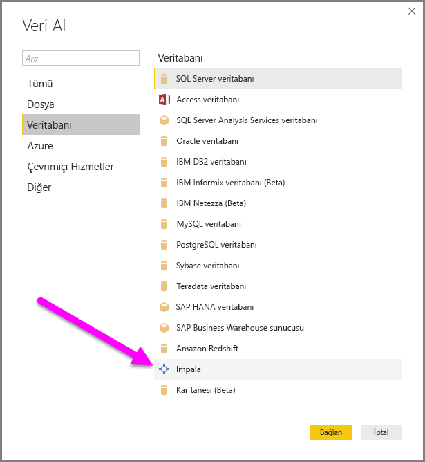
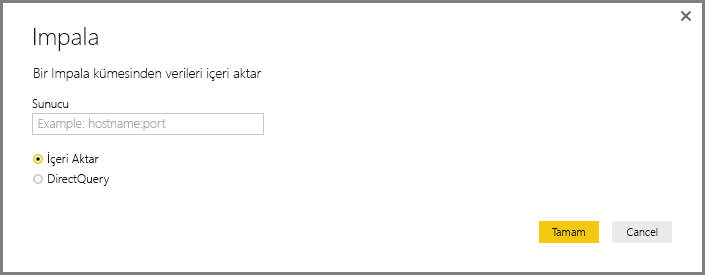
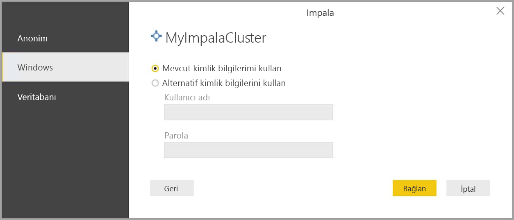
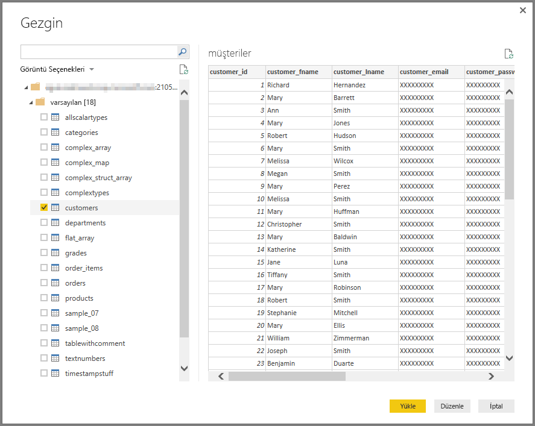

# Power BI Desktop'ta bir Impala veritabanına bağlanma
Tıpkı Power BI Desktop'taki diğer veri kaynaklarında olduğu gibi Power BI Desktop'ta bir **Impala** veritabanına bağlanabilir ve temel alınan verileri kullanabilirsiniz.

## Impala veritabanlarına bağlanma
Bir **Impala** veritabanına bağlanmak için aşağıdaki adımları izleyin: 

1. Power BI Desktop'taki **Giriş** şeridinde bulunan **Veri Al** seçeneğini belirleyin. 

2. Soldaki kategorilerden **Veritabanı**'nı seçin. Açılan sayfada **Impala**'yı göreceksiniz.

    

3. Açılan **Impala** penceresindeki kutuya Impala sunucunuzun adını yazın veya yapıştırın. Ardından **Tamam**'ı seçin. **İçeri aktar** seçeneğini belirleyerek verileri doğrudan Power BI'a aktarabilir veya **DirectQuery**'yi kullanabilirsiniz. [DirectQuery'yi kullanma](desktop-use-directquery.md) hakkında daha fazla bilgi edinin.

    

4. İstendiğinde, kimlik bilgilerinizi girin veya anonim olarak bağlanın. Impala bağlayıcısı Anonim, Temel (kullanıcı adı + parola) ve Windows kimlik doğrulamasını destekler.

    

    > [!NOTE]
    > Belirli bir **Impala** sunucusu için kullanıcı adı ve parolanızı girdiğinizde Power BI Desktop, sonraki bağlantı denemelerinde de aynı kimlik bilgilerini kullanır. **Dosya > Seçenekler ve ayarlar > Veri kaynağı ayarları**'na giderek bu kimlik bilgilerini değiştirebilirsiniz.

5. Bağlantı kurulduktan sonra sunucudaki verileri gösteren bir **Gezgin** penceresi açılır. Bu verilerden içeri aktarmak ve **Power BI Desktop**'ta kullanmak istediklerinizi seçin.

    

## Önemli noktalar ve sınırlamalar
**Impala** bağlayıcısı ile ilgili olarak göz önünde bulundurmanız gereken bazı sınırlamalar ve önemli noktalar vardır:

* Impala bağlayıcısı, desteklenen üç kimlik doğrulama mekanizmasından biri kullanılarak şirket içi veri ağ geçidi üzerinde desteklenir.

## Sonraki adımlar
Power BI Desktop'ı kullanarak bağlanabileceğiniz çok çeşitli türlerde veri kaynağı mevcuttur. Veri kaynakları hakkında daha fazla bilgi için aşağıdaki kaynaklara bakın:

* [Power BI Desktop nedir?](../fundamentals/desktop-what-is-desktop.md)
* [Power BI Desktop'ta veri kaynakları](desktop-data-sources.md)
* [Power BI Desktop'ta verileri şekillendirme ve birleştirme](desktop-shape-and-combine-data.md)
* [Power BI Desktop'ta Excel çalışma kitaplarına bağlanma](desktop-connect-excel.md)   
* [Verileri doğrudan Power BI Desktop'a girme](desktop-enter-data-directly-into-desktop.md)   
