# Power BI Desktop'ta LinkedIn Satış Gezgini’ne bağlanma

**Power BI Desktop**'ta, aynı Power BI Desktop'taki diğer tüm veri kaynakları gibi ilişkileri bulmaya ve oluşturmaya yardımcı olmak ve ilerleme durumunuza ilişkin hazır raporlar oluşturmak için **LinkedIn Satış Gezgini**'ne bağlanabilirsiniz.

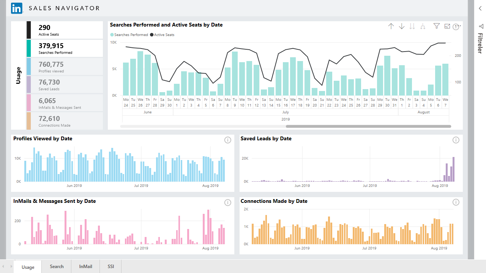

**LinkedIn Satış Gezgini**'ni kullanarak LinkedIn verilerine bağlanmak için LinkedIn Satış Gezgini Kurumsal planınız olmalı ve Satış Gezgini Anlaşmasında Yönetici veya Raporlama Kullanıcısı olmalısınız.

Aşağıdaki video **LinkedIn Satış Gezgini** şablon uygulamasını kullanmaya yönelik hızlı bir tur ve öğretici sağlar. Bu uygulama [bu makalenin devamında](#using-the-linkedin-sales-navigator-template-app) ayrıntılı olarak açıklanır. 

> [!VIDEO https://www.youtube.com/embed/ZqhmaiORLw0]

## LinkedIn Satış Gezgini'ne bağlanma

**LinkedIn Satış Gezgini** verilerine bağlanmak için Power BI Desktop’ın **Giriş** şeridindeki **Veri Al** seçeneğini belirleyin. Sol taraftaki kategorilerden **Çevrimiçi Hizmetler**'i seçin, ardından **LinkedIn Satış Gezgini (Beta)** öğesini görene kadar ekranı kaydırın.

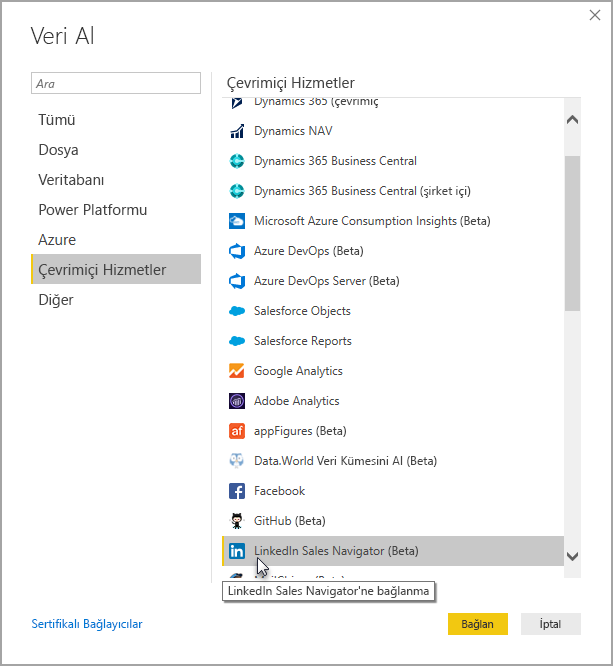

Henüz geliştirme aşamasında olan bir üçüncü taraf bağlayıcıya bağlandığınız bildirilir. 

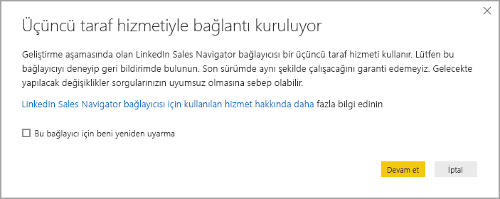

**Devam**'ı seçtiğinizde hangi verileri istediğiniz belirtmeniz istenir.

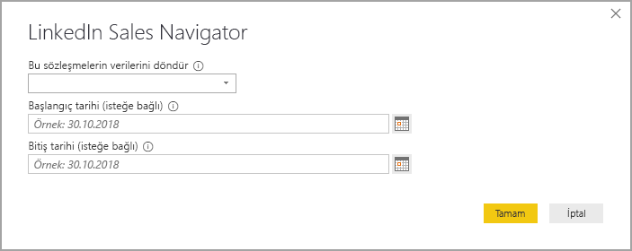

Görüntülenen **LinkedIn Satış Gezgini** penceresinde, ilk aşağı açılan seçicide hangi verilerin döndürülmesini istediğinizi seçin. *Tüm kişiler*'i veya *Seçili kişiler*'i seçebilirsiniz. Aldığı verileri belirli bir zaman penceresiyle sınırlamak için başlangıç ve bitiş tarihlerini belirtebilirsiniz.

Siz bilgileri sağladıktan sonra, Power BI Desktop LinkedIn Satış Gezgini anlaşmanızla ilişkilendirilmiş verilere bağlanır. Web sitesi üzerinden LinkedIn Satış Gezgini'nde oturum açarken kullandığınız e-posta adresinin aynısını kullanın. 

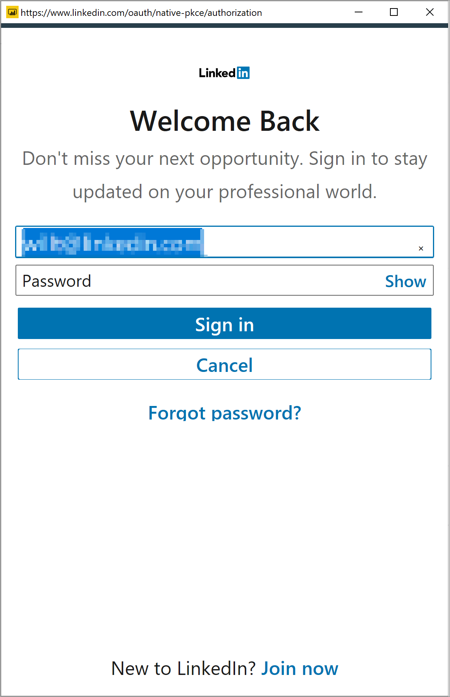

Başarıyla bağlandığınızda, **Gezgin** penceresinde LinkedIn Satış Gezgini anlaşmanızdan verileri seçmeniz istenir.

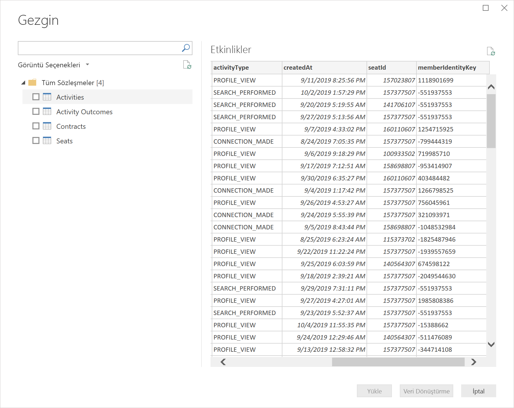

LinkedIn Satış Gezgini verilerinizle istediğiniz raporları oluşturabilirsiniz. İşleri kolaylaştırmak için indirebileceğiniz bir de LinkedIn Satış Gezgini .PBIX dosyası vardır. Bu dosyada zaten sağlanmış olana örnek veriler yer alır. Bu sayede sıfırdan başlamak yerine veriler ve raporlarla tanışabilirsiniz.

PBIX dosyasını aşağıdaki konumlardan indirebilirsiniz:
* [LinkedIn Satış Gezgini için PBIX](service-template-apps-samples.md)

PBIX dosyasının yanı sıra LinkedIn Satış Gezgini'nde indirip kullanabileceğiniz bir şablon uygulaması da bulunur. Sonraki bölümde şablon uygulaması ayrıntılarıyla açıklanır.

## LinkedIn Satış Gezgini şablon uygulamasını kullanma

**LinkedIn Satış Gezgini**'nin kullanımını olabildiğince kolaylaştırmak için, LinkedIn Satış Gezgini verilerinizden otomatik olarak hazır bir rapor oluşturan [şablon uygulamasını](service-template-apps-overview.md) kullanabilirsiniz.

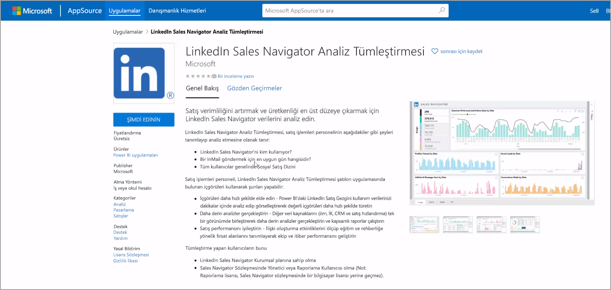

Uygulamayı indirdiğinizde verilerinize bağlanmayı veya örnek verilerle uygulamayı keşfetmeyi seçebilirsiniz. Örnek verileri inceledikten sonra istediğiniz zaman geri dönebilir ve kendi LinkedIn Satış Gezgini verilerinize bağlanabilirsiniz. 

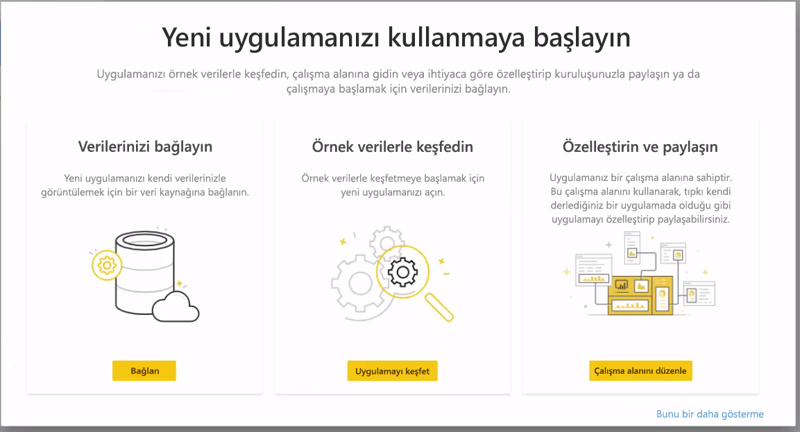

**LinkedIn Satış Gezgini** şablon uygulamasını şu bağlantıdan alabilirsiniz:
* [LinkedIn Satış Gezgini şablon uygulaması](https://appsource.microsoft.com/en-us/product/power-bi/pbi-contentpacks.linkedin_navigator)

Şablon uygulaması bilgilerinizi analiz etmeye ve paylaşmaya yardımcı olmak için dört sekme sağlar:

* Kullanım
* Search
* InMail
* SSI

**Kullanım** sekmesinde bir bütün olarak LinkedIn Satış Gezgini verileriniz gösterilir.

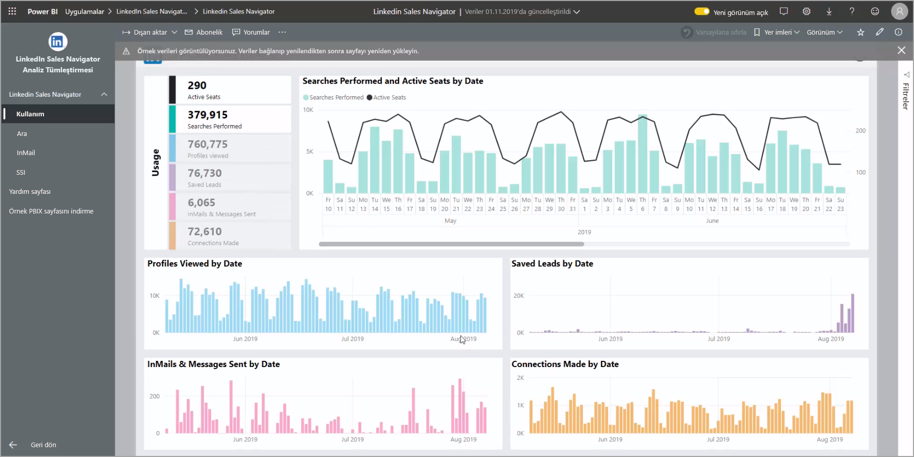

**Arama** sekmesi arama sonuçlarınızda daha derin detaya gitmenizi sağlar:

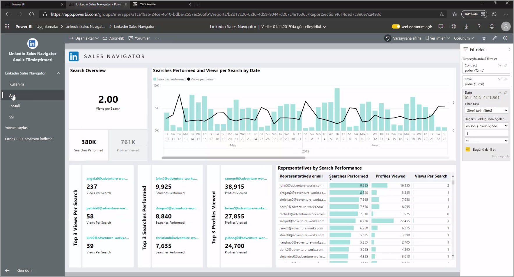

**InMail** sekmesinde, gönderilen InMail sayısı, kabul oranları ve diğer kullanışlı bilgiler dahil olmak üzere InMail kullanımınıza ilişkin içgörüler sağlanır:

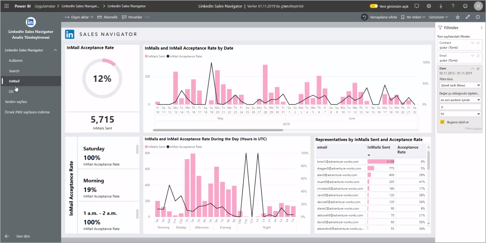

**SSI** sekmesi sosyal satış dizininizle (SSI) ilgili ek ayrıntılar sağlar:

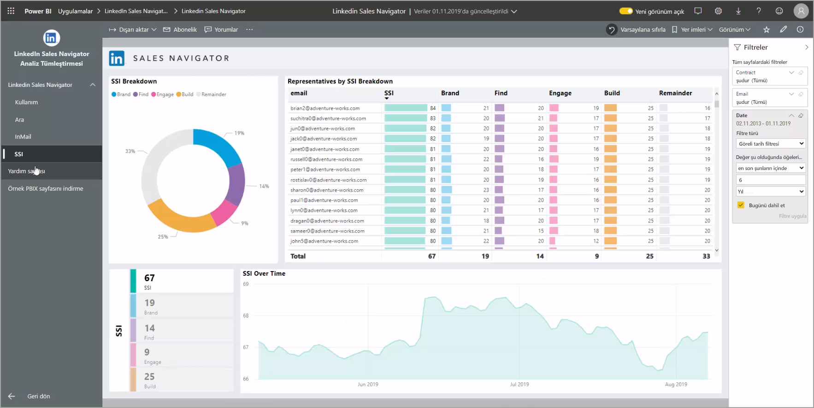

Örnek verilerden kendi verilerinize geçmek için, sağ üst köşede **uygulamayı düzenle**'yi (kalem simgesi) seçin ve sonra da görüntülenen ekranda **Verilerinize bağlanın** öğesini seçin.

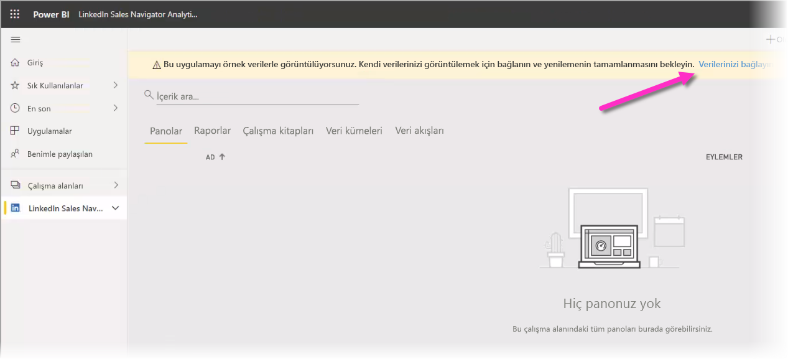

Burada kaç günlük verilerin yükleneceğini seçerek kendi verilerinize bağlanabilirsiniz. En çok 365 günlük veriyi yükleyebilirsiniz. Oturum açmanız gerekir ve yine web sitesi üzerinden LinkedIn Satış Gezgini'nde oturum açarken kullandığınız e-posta adresinin aynısını kullanmalısınız. 

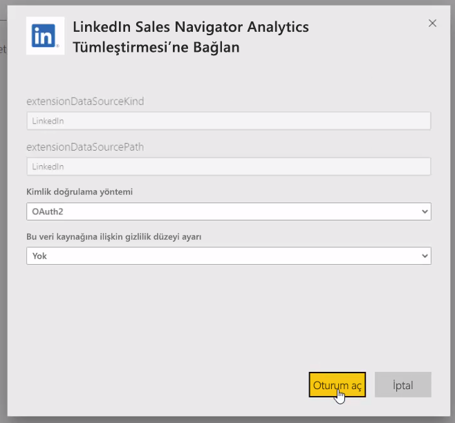

Şablon uygulaması, uygulamadaki verileri kendi verilerinizle yeniler. Uygulamanızdaki verilerin yenileme sıklığınızda belirtilen düzeyde güncel olması için bir zamanlanmış yenileme de ayarlayabilirsiniz. 

Veriler güncelleştirildikten sonra uygulamanın sizin verilerinizle doldurulduğunu görebilirsiniz.

## Yardım alma

Verilerinize bağlanırken sorunlarla karşılaşırsanız, https://www.linkedin.com/help/sales-navigator adresinden LinkedIn Satış Gezgini desteğine başvurabilirsiniz. 

## Sonraki adımlar
Power BI Desktop'ı kullanarak çok çeşitli türlerdeki verilere bağlanabilirsiniz. Veri kaynakları hakkında daha fazla bilgi için aşağıdaki kaynaklara bakın:

* [Power BI Desktop nedir?](../fundamentals/desktop-what-is-desktop.md)
* [Power BI Desktop'taki veri kaynakları](desktop-data-sources.md)
* [Power BI Desktop'ta Verileri Şekillendirme ve Birleştirme](desktop-shape-and-combine-data.md)
* [Power BI Desktop'ta Excel çalışma kitaplarına bağlanma](desktop-connect-excel.md)   
* [Verileri doğrudan Power BI Desktop'a girme](desktop-enter-data-directly-into-desktop.md)   
