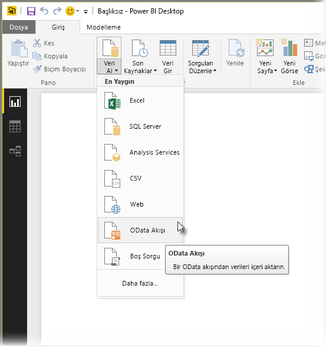
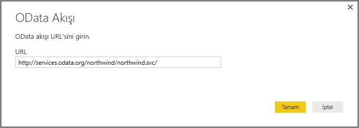
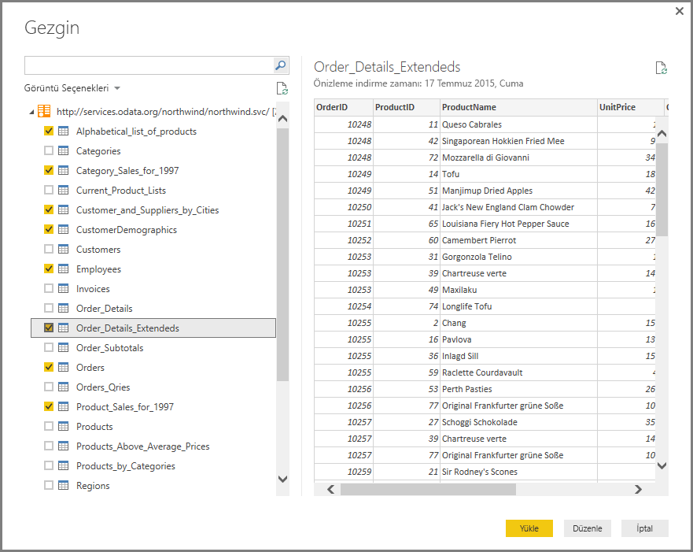
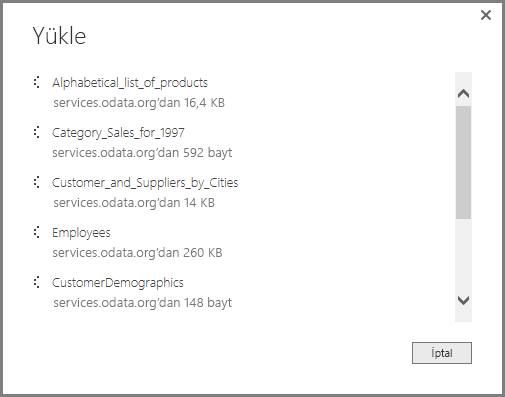
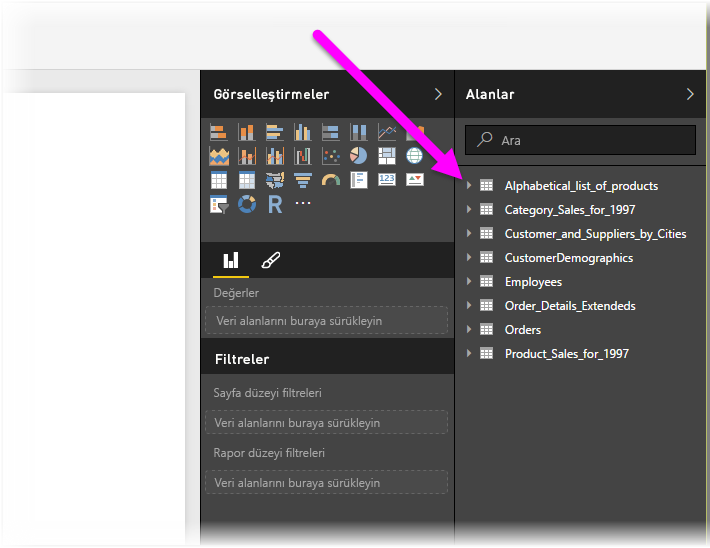

# Power BI Desktop'ta OData akışlarına bağlanma
Tıpkı Power BI Desktop'taki diğer veri kaynaklarında olduğu gibi Power BI Desktop'ta bir **OData akışına** bağlanabilir ve temel alınan verileri kullanabilirsiniz.

Bir OData akışına bağlanmak için Power BI Desktop'ın **Giriş** şeridindeki **Veri Al > OData Akışı** seçeneğini belirleyin.

Açılan **OData Akışı** penceresine OData akışınızın URL'sini yazın veya yapıştırın ve **Tamam**'ı seçin.

Power BI Desktop, OData akışına bağlanır ve mevcut tablolarla diğer veri öğelerini **Gezgin** penceresinde gösterir. Bir öğeyi seçtiğinizde **Gezgin** penceresinin sağ tarafındaki bölmede verilerinizin bir önizlemesi görüntülenir. İstediğiniz sayıda tabloyu seçerek içeri aktarabilirsiniz. **Gezgin** penceresinde, seçili olan tablonun önizlemesi görüntülenir.

**Düzenle** düğmesini seçerek **Sorgu Düzenleyicisi**'ni açabilir, burada, Power BI Desktop'a aktarmadan önce OData akışındaki verileri şekillendirebilir ve dönüştürebilirsiniz. Dilerseniz **Yükle** düğmesini seçerek, sol bölmede seçtiğiniz tüm veri öğelerini içeri aktarabilirsiniz.

**Yükle**'yi seçtiğimizde, Power BI Desktop seçilen öğeleri içeri aktarır ve bir **Yükle** penceresinde içeri aktarma işleminin ilerleme durumunu görüntüler.

İşlem tamamlandıktan sonra, Power BI Desktop seçilen tabloları ve diğer veri öğelerini Power BI Desktop'taki *Raporlar* görünümünün sağ tarafında bulunan **Alanlar** bölmesinde kullanılabilir hale getirir.

İşte bu kadar!

Artık görsel ve rapor oluşturmak veya diğer Excel çalışma kitapları, veritabanları ya da başka bir veri kaynağı gibi bağlanmak veya içeri aktarmak isteyebileceğiniz verilerle etkileşime geçmek için Power BI Desktop'a OData akışınızdan aktardığınız verileri kullanmaya hazırsınız.

## Sonraki adımlar
Power BI Desktop'ı kullanarak çok çeşitli türlerdeki verilere bağlanabilirsiniz. Veri kaynakları hakkında daha fazla bilgi için aşağıdaki kaynaklara bakın:

* [Power BI Desktop nedir?](../fundamentals/desktop-what-is-desktop.md)
* [Power BI Desktop'ta Veri Kaynakları](desktop-data-sources.md)
* [Power BI Desktop'ta Verileri Şekillendirme ve Birleştirme](desktop-shape-and-combine-data.md)
* [Power BI Desktop'ta Excel çalışma kitaplarına bağlanma](desktop-connect-excel.md)   
* [Verileri doğrudan Power BI Desktop'a girme](desktop-enter-data-directly-into-desktop.md)   
