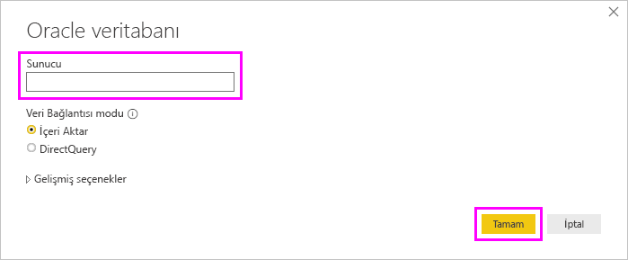

# Power BI Desktop'la Oracle veritabanına bağlanma
Power BI Desktop'tan bir Oracle veritabanına bağlanmak için Power BI Desktop'ın çalıştığı bilgisayarda doğru Oracle istemci yazılımının yüklü olması gerekir. Kullandığınız Oracle istemci yazılımı, yüklediğiniz Power BI Desktop sürümüne göre değişiklik gösterir: 32 bit veya 64 bit. Ayrıca Oracle sunucunuzun sürümüne de bağlıdır.

Desteklenen Oracle sürümleri: 
- Oracle Server 9 ve üzeri
- Oracle Data Access Client (ODAC) yazılımı 11.2 ve üzeri

> [!NOTE]
> Power BI Desktop, Şirket İçi Veri Ağ Geçidi veya Power BI Rapor Sunucusu için bir Oracle veritabanı yapılandırıyorsanız [Oracle Bağlantı Türü](/sql/reporting-services/report-data/oracle-connection-type-ssrs?view=sql-server-ver15) makalesindeki bilgilere göz atın. 

## Power BI Desktop'ın hangi sürümünün yüklü olduğunu belirleme
Power BI Desktop'ın hangi sürümünün yüklü olduğunu belirlemek için **Dosya** > **Yardım** > **Hakkında**'yı seçip **Sürüm** satırına bakın. Aşağıdaki resimde Power BI Desktop'ın 64 bit sürümü yüklüdür:

## Oracle istemcisini yükleme
- Power BI Desktop'ın 32 bit sürümü için [32 bit Oracle istemcisini indirip yükleyin](https://www.oracle.com/technetwork/topics/dotnet/utilsoft-086879.html).

- Power BI Desktop'ın 64 bit sürümü için [64 bit Oracle istemcisini indirip yükleyin](https://www.oracle.com/database/technologies/odac-downloads.html).

> [!NOTE]
> Oracle Server'ınızla uyumlu bir Oracle Data Access Client (ODAC) seçin. Örneğin ODAC 12.x her zaman Oracle Server sürüm 9'u desteklemez.
> Oracle İstemcisinin Windows yükleyicisini seçin.
> Oracle istemcisinin kurulumu sırasında kurulum sihirbazında ilgili onay kutusunu seçerek *Makine düzeyinde ASP.NET için ODP.NET ve/veya Oracle Providers’ı yapılandır* seçeneğini etkinleştirdiğinizden emin olun. Oracle istemci sihirbazının bazı sürümlerinde onay kutusu varsayılan olarak seçilidir; bazılarında ise seçili değildir. Power BI’ın Oracle veritabanınıza bağlanabilmesi için onay kutusunun seçili olduğundan emin olun.

## Oracle veritabanlarına bağlanma
Gerekli Oracle istemci sürücüsünü yükledikten sonra Oracle veritabanına bağlanabilirsiniz. Bağlantı kurmak için aşağıdaki adımları uygulayın:

1. **Giriş** sekmesinde **Veri Al**'ı seçin. 

2. Görüntülenen **Veri Al** penceresinde **Diğer**'i seçin (gerekirse), **Veritabanı** > **Oracle veritabanı**'nı seçin ve sonra da **Bağlan**'ı seçin.
   
   
3. Görüntülenen **Oracle veritabanı** iletişim kutusuna **Sunucu** adını girip **Tamam**'ı seçin. SID gerekiyorsa şu biçimi kullanarak bu değeri belirtin: *SunucuAdı/SID*; burada *SID* veritabanının benzersiz adıdır. *SunucuAdı/SID* biçimi işe yaramıyorsa *SunucuAdı/HizmetAdı* biçimini kullanın. Burada *HizmetAdı* bağlanmak için kullandığınız diğer addır.

   

   > [!NOTE]
   > Yerel bir veritabanı veya otonom veritabanı bağlantıları kullanıyorsanız bağlantı hatalarını engellemek için sunucu adını tırnak işareti içine almanız gerekebilir. 
      
4. Yerel veritabanı sorgusu kullanarak verileri içeri aktarmak istiyorsanız sorgunuzu **SQL deyimi** kutusuna girin. Bu kutuya ulaşmak için **Oracle veritabanı** iletişim kutusunun **Gelişmiş seçenekler** bölümünü genişletmeniz gerekir.
   
   

5. **Oracle veritabanı** iletişim kutusuna Oracle veritabanı bilgilerinizi (SID veya yerel veritabanı sorgusu gibi isteğe bağlı bilgiler dahil) girdikten sonra bağlanmak için **Tamam**'ı seçin.
5. Oracle veritabanı için veritabanı kullanıcısı kimlik bilgileri gerekiyorsa açılan iletişim kutusuna bu bilgileri girin.

## Sorun giderme

Adlandırma söz dizimi yanlış olduğunda veya doğru yapılandırılmadığında Oracle'da çeşitli hatalarla karşılaşabilirsiniz:

* ORA-12154: TNS: could not resolve the connect identifier specified (TNS: Belirtilen bağlantı tanımlayıcısı çözümlenemiyor).
* ORA-12514: TNS: listener does not currently know of service requested in connect descriptor (TNS: dinleyici, bağlantı tanımlayıcıda istenen hizmeti şu anda tanımıyor).
* ORA-12541: TNS: no listener (TNS: dinleyici yok).
* ORA-12170: TNS:Connect timeout occurred (TNS: Bağlantı zaman aşımı oluştu).
* ORA-12504: TNS: listener was not given the SERVICE_NAME in CONNECT_DATA (TNS: dinleyiciye CONNECT_DATA konumunda SERVICE_NAME verilmedi).

Oracle istemcisi yüklü olmadığında veya doğru yapılandırılmadığında bu hatalar oluşabilir. Yüklüyse tnsnames.ora dosyasının düzgün şekilde yapılandırıldığını ve uygun net_service_name kullandığınızı doğrulayın. Ayrıca, Power BI Desktop'ı kullanan makine ile ağ geçidini çalıştıran makine arasında aynı net_service_name değerinin kullanıldığından emin olmanız gerekir. Daha fazla bilgi için bkz. [Oracle istemcisini yükleme](#install-the-oracle-client).

Oracle sunucu sürümü ve Oracle Data Access İstemci sürümü arasındaki uyumsuzluktan kaynaklanan bir sorunla karşılaşabilirsiniz. Bazı bileşimler uyumsuz olduğundan genellikle bu sürümlerin eşleşmesini istersiniz. Örneğin ODAC 12.x, Oracle Server sürüm 9'u desteklemez.

Power BI Desktop'ı Microsoft Store'dan indirdiyseniz, bir Oracle sürücü hatasından dolayı Oracle veritabanlarına bağlanamayabilirsiniz. Bu sorunla karşılaşırsanız, şu hata iletisi döndürülür: *Nesne başvurusu ayarlanmadı*. Sorunu gidermek için aşağıdakilerden adımlardan birini uygulayın:

* Power BI Desktop'ı Microsoft Store yerine [İndirme Merkezi](https://www.microsoft.com/download/details.aspx?id=58494)'nden indirin.

* Microsoft Store'daki sürümü kullanmak istiyorsanız, yerel bilgisayarınızda oraons.dll dosyasını _12.X.X\client_X_ klasöründen _12.X.X\client_X\bin_ klasörüne kopyalayın; burada _X_, sürüm ve dizin numaralarını gösterir.

Bir Oracle veritabanına bağlanırken Power BI Gateway’de *Nesne başvurusu ayarlanmadı* hata iletisini görürseniz, [Veri kaynağınızı yönetme - Oracle](service-gateway-onprem-manage-oracle.md) makalesindeki yönergeleri izleyin.

Power BI Rapor Sunucusu kullanıyorsanız [Oracle Bağlantı Türü](/sql/reporting-services/report-data/oracle-connection-type-ssrs?view=sql-server-ver15) makalesindeki kılavuza göz atın.