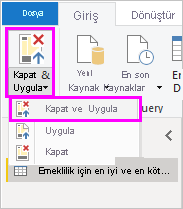

# Power BI Desktop'ta veri kaynaklarına bağlanma

Power BI Desktop ile durmadan büyüyen veri dünyasına kolayca bağlanabilirsiniz. Power BI Desktop'ı [indirebilir](https://go.microsoft.com/fwlink/?LinkID=521662) ve yükleyebilirsiniz (henüz yapmadıysanız).

Power BI Desktop'ta kullanılabilecek *çok çeşitli* veri kaynakları bulunur. Aşağıdaki resimde, **Veri Al** > **Diğer** > **Web**'e seçerek verilere nasıl bağlanacağınız gösterilir.

## Verilere bağlanma örneği

Bu örnekte, bir **Web** veri kaynağına bağlanacağız.

Emekliye ayrıldığınızı hayal edin. Bol bol güneş ışığının, düşük vergilerin ve yeterli sağlık hizmetlerinin bulunduğu bir yerde yaşamak istiyorsunuz. Belki de... bir veri analistisiniz ve müşterilerinize yardımcı olmak istiyorsunuz. Bu örnekte ise bir yağmurluk üreticisi olan müşterinizin satış için *çok* yağmur alan yerlere odaklanmasına yardımcı olmayı hedeflediğinizi varsayalım.

İşte size her iki senaryo için de bu konulara yönelik olarak işinize yarayacak veriler içeren bir web kaynağı:

[https://www.bankrate.com/finance/retirement/best-places-retire-how-state-ranks.aspx](https://www.bankrate.com/finance/retirement/best-places-retire-how-state-ranks.aspx)

**Veri Al** > **Diğer** > **Web**'i seçin. **Web'den** alanına adresi girin.

**Tamam**'ı seçtiğinizde, Power BI Desktop'ın *Sorgu* işlevi çalışmaya başlar. Power BI Desktop, web kaynağı ile bağlantı kurar ve **Gezgin** penceresi söz konusu web sayfasında bulduğu sonuçları görüntüler. Bu örnekte, bir tablonun yanı sıra genel Belgeyi de bulur. Beklentilerimizi karşılayan tabloyu listeden seçiyoruz. **Gezgin** penceresi, bir önizleme görüntüler.

Bu noktada, tabloyu yüklemeden önce sorguyu düzenlemek için pencerenin alt kısmından **Veri Dönüştürme**'yi seçebilir veya doğrudan tabloyu yükleyebilirsiniz.

Tabloyu yüklemek ve Power Query Düzenleyicisi'ni başlatmak için **Veri Dönüştürme**'yi seçin. **Sorgu Ayarları** bölmesi görüntülenir. Görüntülenmezse, şeritten **Görünüm**'ü seçin ve sonra da **Sorgu Ayarları**'nı seçerek **Sorgu Ayarları** bölmesini görüntüleyin. Aşağıdaki şekilde görünür.

Metin türünde olan tüm bu puanların sayı olmasına ihtiyacımız var. Hiç sorun değil. Bunları değiştirmek için sütun üst bilgisine sağ tıklayıp **Türü Değiştir** > **Tamsayı**'yı seçmeniz yeterlidir. Birden fazla sütun seçmek için, öncelikle bir sütun seçip Shift tuşunu basılı tutarak bitişiğindeki diğer sütunları seçin ve ardından bir sütun başlığına sağ tıklayarak seçili tüm sütunları değiştirin. Bitişik olmayan sütunları seçmek için Ctrl tuşunu kullanın.

**Sorgu Ayarları**'ndaki **UYGULANAN ADIMLAR**, yapılan tüm değişiklikleri yansıtır. Siz verilerde değişiklik yaptıkça Power Query Düzenleyicisi bu değişiklikleri **UYGULANAN ADIMLAR** bölümünde kaydeder. Adımları gerektiği şekilde ayarlayabilir, yeniden ziyaret edebilir, yeniden düzenleyebilir veya silebilirsiniz.

Tabloda yapılan ek değişiklikler tablo yüklendikten sonra da gerçekleştirilebilir ancak şimdilik bunu yapmayacağız. İşlemi tamamladığınızda **Giriş** şeridinden **Kapat ve Uygula**'yı seçin; Power BI Desktop değişiklikleri uygular ve Power Query Düzenleyicisi'ni kapatır.

Veri modeli yüklüyken, Power BI Desktop'taki **Rapor** görünümünde alanları tuvale sürükleyerek görselleştirmeler oluşturmaya başlayabiliriz.

Kuşkusuz bu tek veri bağlantısı bulunan basit bir modeldir. Çoğu Power BI Desktop raporunda ise zengin bir veri modeli oluşturan ilişkiler ile ihtiyaçlarınızı karşılamak üzere şekillendirilmiş farklı veri kaynaklarına yönelik bağlantılar bulunur.

## Sonraki adımlar
Power BI Desktop ile yapabileceğiniz çok şey var. Özellikleri hakkında daha fazla bilgi için aşağıdaki kaynaklara bakın:

* [Power BI Desktop nedir?](../fundamentals/desktop-what-is-desktop.md)
* [Power BI Desktop’taki Sorgu Düzenleyicisi'ni kullanma hakkında](../transform-model/desktop-query-overview.md)
* [Power BI Desktop'ta veri kaynakları](desktop-data-sources.md)
* [Power BI Desktop'ta verileri şekillendirme ve birleştirme](desktop-shape-and-combine-data.md)
* [Power BI Desktop'taki genel sorgu görevlerini gerçekleştirme](../transform-model/desktop-common-query-tasks.md)   

Bize geri bildirim sağlamak ister misiniz? Harika! Power BI Desktop’taki **Fikir Sunun** menü öğesini kullanın veya [Topluluk Geri Bildirimi](https://community.powerbi.com/t5/Community-Feedback/bd-p/community-feedback)’ni ziyaret edin. Geri bildirimlerinizi sabırsızlıkla bekliyoruz!

