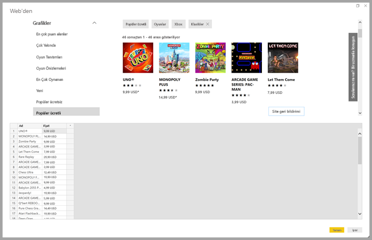
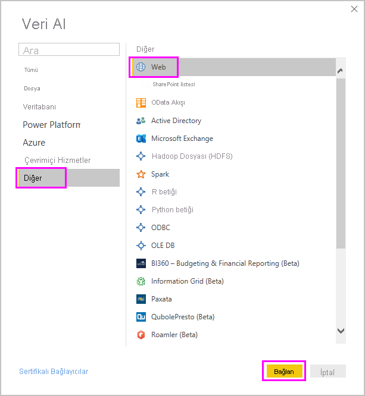
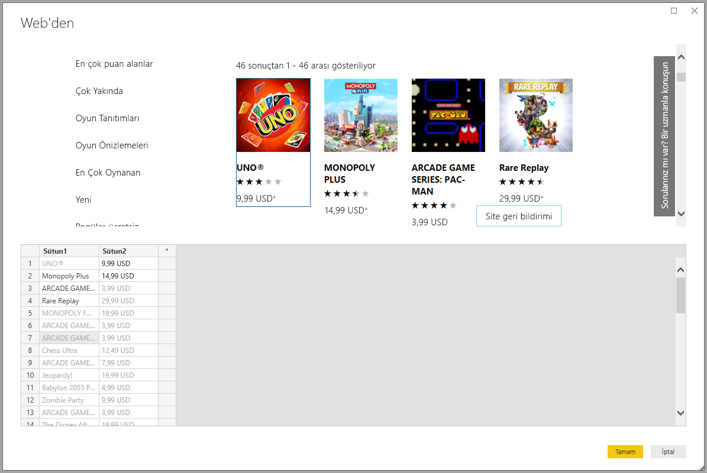
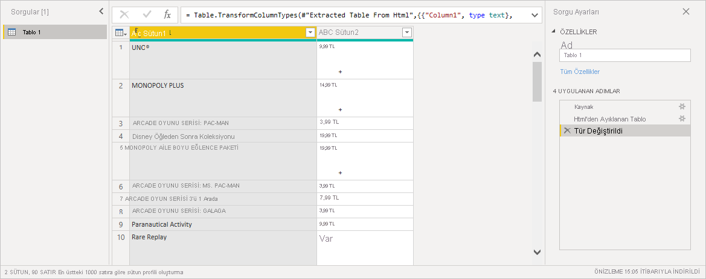

# Örnek sağlayarak web sayfası verilerini alma

Bir web sayfasından veri almak, kullanıcıların web sayfalarından kolayca veri ayıklamasına ve bu verileri *Power BI Desktop*’a aktarmasına olanak tanır. Öte yandan Web sayfalarındaki veriler genellikle kolayca ayıklanabilen düzgün tablolarda yer almaz. Veriler yapılandırılmış ve tutarlı olsa bile bu tür sayfalardan veri almak zor olabilir.

İşte çözümü. *Örneğe göre web’den veri alma* özelliği sayesinde, bağlayıcı iletişim kutusunda bir veya daha fazla örnek vererek ayıklamak istediğiniz verileri Power BI Desktop’a gösterebilirsiniz. Power BI Desktop sayfadaki örneklerinizle eşleşen diğer verileri toplar. Bu çözüm sayesinde, tablolarda bulunan veriler *ve* diğer tablo dışı veriler dahil olmak üzere Web sayfalarından tüm veri türlerini ayıklayabilirsiniz.

Grafikteki fiyatlar yalnızca örnek amaçlıdır.

## Örneğe göre Web’den Veri Alma özelliğini kullanma

**Giriş** şeridi menüsünde **Veri Al**'ı seçin. Görüntülenen iletişim kutusunda, sol bölmedeki kategorilerden **Diğer**’i ve sonra **Web**’i seçin. Devam etmek için **Bağlan**’ı seçin.

**Web'den** seçildiğinde, verileri ayıklamak istediğiniz Web sayfasının URL’sini girin. Bu makalede biz Microsoft Store Web sayfasını kullanacağız ve bu bağlayıcının nasıl çalıştığını göstereceğiz.

Takip etmek isterseniz bu makalede kullandığımız [Microsoft Store URL'sini](https://www.microsoft.com/store/top-paid/games/xbox?category=classics) kullanabilirsiniz:

    https://www.microsoft.com/store/top-paid/games/xbox?category=classics

**Tamam**’ı seçtiğinizde, Web sayfasından otomatik olarak algılanan tüm tabloların sunulduğu **Gezgin** iletişim kutusuna gidersiniz. Aşağıdaki resimde gösterilen durumda hiçbir tablo bulunmamıştır. Örnekleri sağlamak için **Örnek kullanarak tablo ekle**'yi seçin.

**Örnekleri kullanarak tablo ekle**, Web sayfası içeriğinin önizlemesini görebileceğiniz etkileşimli bir pencere sağlar. Ayıklamak istediğiniz verilerin örnek değerlerini girin.

Bu örnekte, sayfadaki her bir oyunun *Ad* ve *Fiyat* verilerini ayıklayacağız. Her sütun için sayfadan birkaç örnek belirterek bunu yapabiliriz. Siz örnekleri girdiğinizde *Power Query* akıllı veri ayıklama algoritmalarını kullanarak örnek girdilerin desenine uyan verileri ayıklar.

> [!NOTE]
> Değer önerileri yalnızca uzunluğu 128 karakter veya altında olan değerleri içerir.

Web sayfasından ayıklanan verilerden memnun kalırsanız **Tamam**'ı seçerek Power Query Düzenleyicisi'ne gidin. Daha fazla dönüştürme uygulayabilir veya verileri şekillendirebilirsiniz; örneğin bu verileri kaynaklarımızdaki başka verilerle birleştirebilirsiniz.

Buradan, görseller oluşturabilir veya Power BI Desktop raporlarınızı oluştururken web sayfası verilerini diğer şekillerde kullanabilirsiniz.

## Sonraki adımlar

Power BI Desktop'ı kullanarak çok çeşitli türlerdeki verilere bağlanabilirsiniz. Veri kaynakları hakkında daha fazla bilgi için aşağıdaki kaynaklara bakın:

* [Add a column from an example in Power BI Desktop (Power BI Desktop'ta örnekten sütun ekleme)](../create-reports/desktop-add-column-from-example.md)
* [Power BI Desktop'tan Web sayfalarına bağlanma](desktop-connect-to-web.md)
* [Power BI Desktop'ta veri kaynakları](desktop-data-sources.md)
* [Power BI Desktop'ta verileri şekillendirme ve birleştirme](desktop-shape-and-combine-data.md)
* [Power BI Desktop'ta Excel çalışma kitaplarına bağlanma](desktop-connect-excel.md)
* [Power BI Desktop'ta CSV dosyalarına bağlanma](desktop-connect-csv.md)
* [Verileri doğrudan Power BI Desktop'a girme](desktop-enter-data-directly-into-desktop.md)
