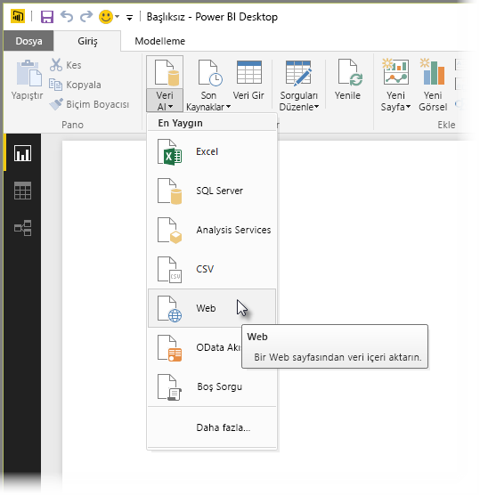
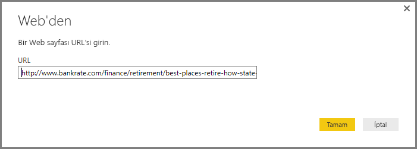
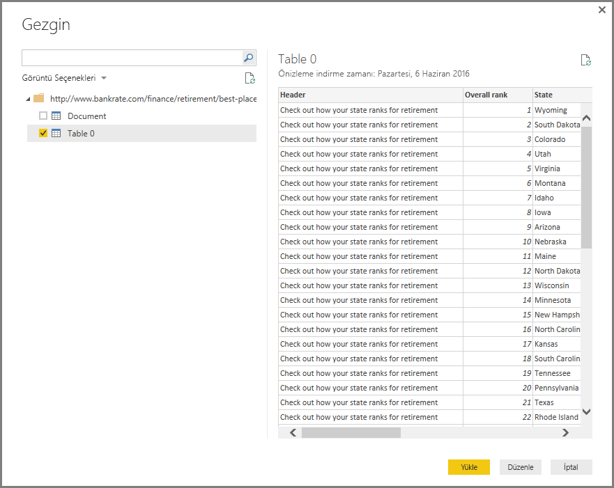
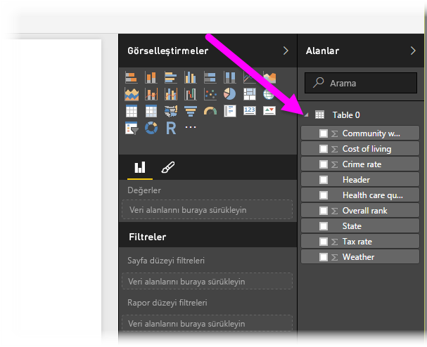

# Power BI Desktop'tan Web sayfalarına bağlanma

Power BI Desktop'ta bir Web sayfasına bağlanıp verilerini içeri aktararak görsellerinizde ve veri modellerinizde kullanabilirsiniz.

Power BI Desktop'ta **Giriş** şeridinden **Veri Al > Web**'i seçin.

Verilerini içeri aktarmak istediğiniz Web sayfasının URL'sini girmenizi isteyen bir iletişim kutusu açılır.

URL'yi yazdıktan (veya yapıştırdıktan) sonra **Tamam**'ı seçin. Power BI Desktop belirttiğiniz sayfaya bağlanır ve sayfadaki verileri **Gezgin** penceresinde görüntüler. Kullanılabilir veri öğelerinden birini (sayfanın tamamını içeren bir tablo gibi) seçtiğinizde **Gezgin** penceresinin sağ tarafında, seçtiğiniz verilerin önizlemesi görüntülenir.

**Düzenle** düğmesini seçerek **Sorgu Düzenleyicisi**'ni başlatabilir, burada, Power BI Desktop'a aktarmadan önce Web sayfasındaki verileri şekillendirebilir ve dönüştürebilirsiniz. Dilerseniz **Yükle** düğmesini seçerek, sol bölmede seçtiğiniz tüm veri öğelerini içeri aktarabilirsiniz.

**Yükle**'yi seçtiğinizde Power BI Desktop seçilen öğeleri içeri aktarır ve Power BI Desktop'ta Raporlar Görünümü'nün sağ tarafında bulunan **Alanlar** bölmesinde kullanılabilir hale getirilir.

Web sayfalarına bağlanmak ve verilerini Power BI Desktop'a aktarmak için yapmanız gerekenler bu kadardır.

Bu işlemin ardından, içeri aktarılan alanları Rapor tuvaline sürükleyebilir ve dilediğiniz görselleştirmeleri oluşturabilirsiniz. Ayrıca Web sayfasından aldığınız bu verileri diğer tüm verilerle olduğu gibi kullanabilirsiniz. Verileri şekillendirebilir, modelinizdeki diğer veri kaynaklarıyla arasında ilişki oluşturabilir ve istediğiniz Power BI raporunu oluşturmak için diğer tüm işlevlerden faydalanabilirsiniz.

Web sayfalarına bağlanma hakkında ayrıntılı bilgi için bkz. [Power BI Desktop ile Çalışmaya Başlama Kılavuzu](../fundamentals/desktop-getting-started.md).

## Sonraki adımlar
Power BI Desktop'ı kullanarak çok çeşitli türlerdeki verilere bağlanabilirsiniz. Veri kaynakları hakkında daha fazla bilgi için aşağıdaki kaynaklara bakın:

* [Power BI Desktop'taki veri kaynakları](desktop-data-sources.md)
* [Power BI Desktop'ta Verileri Şekillendirme ve Birleştirme](desktop-shape-and-combine-data.md)
* [Power BI Desktop'ta Excel çalışma kitaplarına bağlanma](desktop-connect-excel.md)   
* [Power BI Desktop'ta CSV dosyalarına bağlanma](desktop-connect-csv.md)   
* [Verileri doğrudan Power BI Desktop'a girme](desktop-enter-data-directly-into-desktop.md)   
