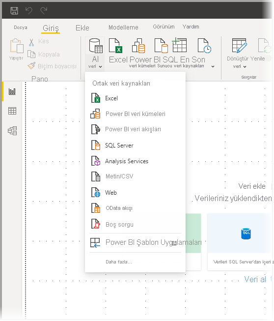
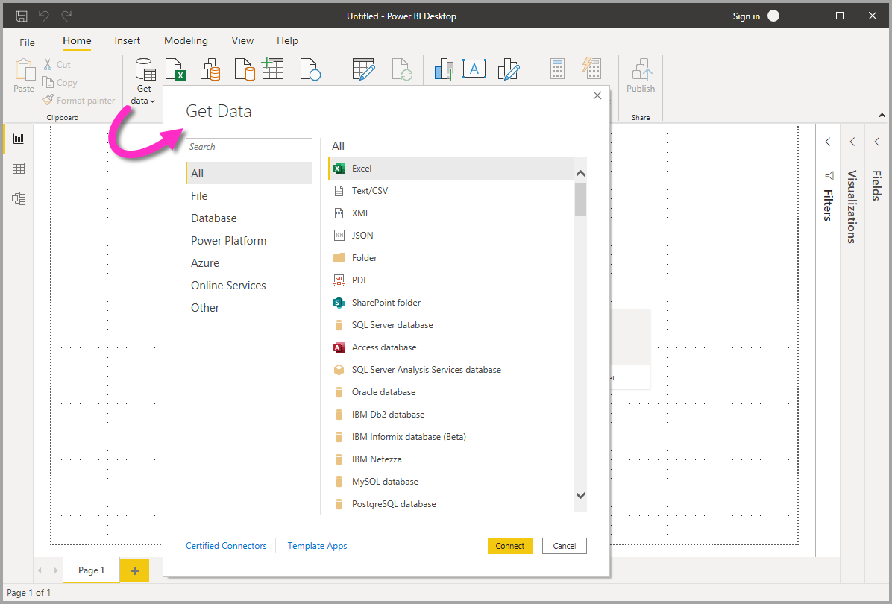
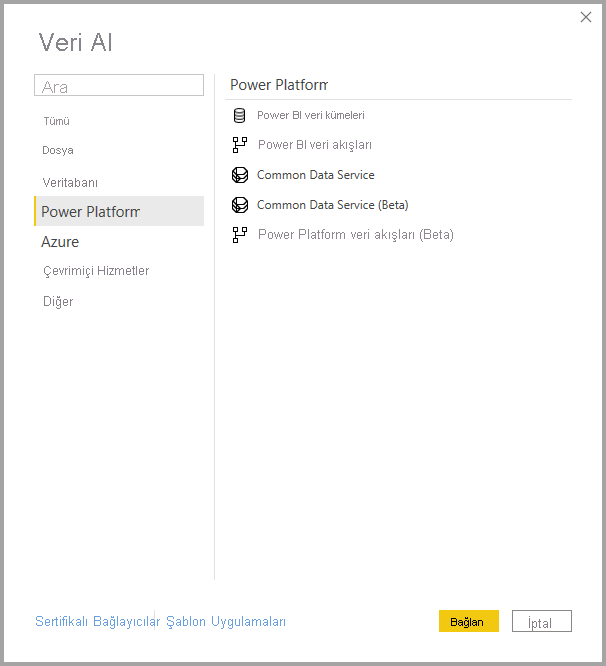
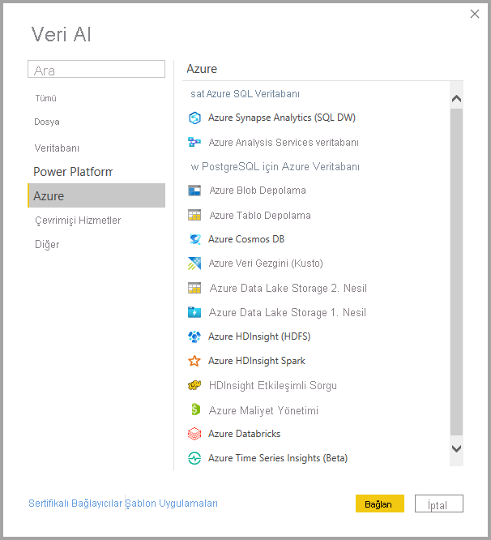
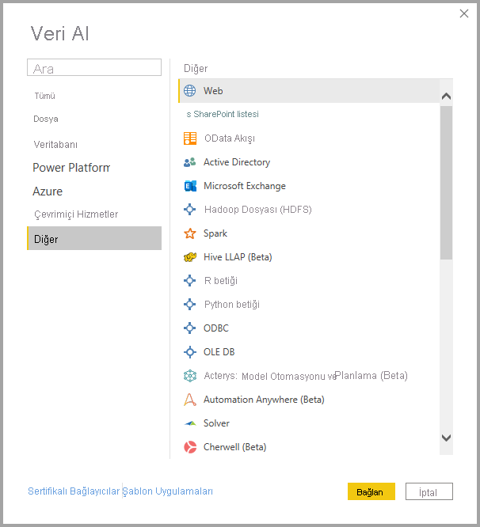

# <a name="data-sources-in-power-bi-desktop"></a>Power BI Desktop'taki veri kaynakları

Power BI Desktop ile birçok farklı kaynaktaki verilere bağlanabilirsiniz. Kullanılabilir veri kaynaklarının tam listesi için bkz. [Power BI veri kaynakları](power-bi-data-sources.md).

**Giriş** şeridini kullanarak verilere bağlanırsınız. **En Yaygın** veri türleri menüsünü göstermek için **Veri Al** düğme etiketini veya aşağı oku seçin.



**Veri Al** iletişim kutusuna gitmek için **En Yaygın** veri türleri menüsünü görüntüleyin ve **Diğer**’i seçin. Ayrıca **Veri Al** simgesini seçtiğinizde **En Yaygın** menüsünü atlayarak doğrudan **Veri Al** iletişim kutusunu görüntüleyebilirsiniz.



> [!NOTE]
> Power BI ekibi, Power BI Desktop ve Power BI hizmetinde kullanıma sunulan veri kaynaklarının sayısını sürekli olarak artırmaktadır. Bu nedenle, sık sık **Beta** veya **Önizleme** olarak işaretlenmiş veri kaynaklarıyla karşılaşırsınız. Bunlar, üzerinde çalışılmakta olan veri kaynaklarının ilk sürümleridir. **Beta** veya **Önizleme** olarak işaretlenen veri kaynakları için destek ve işlevsellik sınırlıdır. Bunlar, üretim ortamlarında kullanılmamalıdır. Ayrıca, Power BI Desktop için **Beta** veya **Önizleme** olarak işaretlenen herhangi bir veri kaynağı, genel olarak kullanılabilir (GA) hale gelene kadar Power BI hizmetinde veya diğer Microsoft hizmetlerinde kullanılamayabilir.

> [!NOTE]
> Birçok Power BI Desktop veri bağlayıcısı, kimlik doğrulaması için Internet Explorer 10 (veya daha yeni bir sürümü) uygulamasına ihtiyaç duyar. 


## <a name="data-sources"></a>Veri kaynakları

**Veri Al** iletişim kutusu veri türlerini şu kategorilerde düzenler:

* Tümü
* Dosya
* Veritabanı
* Power Platformu
* Azure
* Çevrimiçi Hizmetler
* Diğer

**Tümü** kategorisi, tüm kategorilerdeki bütün veri bağlantı türlerini içerir.

### <a name="file-data-sources"></a>Dosya veri kaynakları

**Dosya** kategorisinde, aşağıdaki veri bağlantıları sağlanır:

* Excel
* Metin/CSV
* XML
* JSON
* Klasör
* PDF
* SharePoint klasörü

Aşağıda, **Dosya** kategorisine ilişkin **Veri Al** penceresi gösterilmektedir.


### <a name="database-data-sources"></a>Veritabanı veri kaynakları

**Veritabanı** kategorisinde aşağıdaki veri bağlantıları sağlanır:

* SQL Server veritabanı
* Access veritabanı
* SQL Server Analysis Services veritabanı
* Oracle veritabanı
* IBM Db2 veritabanı
* IBM Informix veritabanı (Beta)
* IBM Netezza
* MySQL veritabanı
* PostgreSQL veritabanı
* Sybase veritabanı
* Teradata veritabanı
* SAP HANA veritabanı
* SAP Business Warehouse Uygulama Sunucusu
* SAP Business Warehouse İleti Sunucusu
* Amazon Redshift
* Impala
* Google BigQuery
* Vertica
* Snowflake
* Essbase
* AtScale küpleri
* Data Virtuality LDW (Beta)
* Denodo
* Dremio
* Exasol
* Indexima
* InterSystems IRIS (Beta)
* Jethro (Beta)
* Kyligence
* Linkar PICK Style / MultiValue Databases (Beta)
* MariaDB (Beta)
* MarkLogic
* BI Bağlayıcısı
* Actian (Beta)

> [!NOTE]
> Bazı veri bağlayıcıları için **Dosya > Seçenekler ve ayarlar > Seçenekler** bölümüne gidip **Önizleme Özellikleri**'ni seçerek ilgili bağlayıcıyı etkinleştirmeniz gerekir. Yukarıda belirtilen bağlayıcılardan bazılarını görmüyorsanız söz konusu bağlayıcıları kullanmak için **Önizleme Özellikleri** ayarlarınızı kontrol edin. Ayrıca, *Beta* veya *Önizleme* olarak işaretlenen veri kaynakları için destek ve işlevselliğin sınırlı olduğunu ve bunların, üretim ortamlarında kullanılmaması gerektiğini unutmayın.

Aşağıda, **Veritabanı** kategorisine ilişkin **Veri Al** penceresi gösterilmektedir.


### <a name="power-platform-data-sources"></a>Power Platform veri kaynakları

**Power Platform** kategorisinde aşağıdaki veri bağlantıları sağlanır:

* Power BI veri kümeleri
* Power BI veri akışları
* Microsoft Dataverse
* Power Platform veri akışları (Beta)

Aşağıdaki görüntüde **Power Platform** kategorisine ilişkin **Veri Al** penceresi gösterilmektedir.



### <a name="azure-data-sources"></a>Azure veri kaynakları

**Azure** kategorisinde, aşağıdaki veri bağlantıları sağlanır:

* Azure SQL Veritabanı
* Azure Synapse Analytics (SQL DW)
* Azure Analysis Services veritabanı
* PostgreSQL için Azure Veritabanı
* Azure Blob Depolama
* Azure Tablo Depolama
* Azure Cosmos DB
* Azure Veri Gezgini (Kusto)
* Azure Data Lake Storage Gen2
* Azure Data Lake Storage 1. Nesil
* Azure HDInsight (HDFS)
* Azure HDInsight Spark
* HDInsight Etkileşimli Sorgu
* Azure Maliyet Yönetimi
* Azure Databricks
* Azure Time Series Insights (Beta)


Aşağıda, **Azure** kategorisine ilişkin **Veri Al** penceresi gösterilmektedir.



### <a name="online-services-data-sources"></a>Çevrimiçi Hizmetler veri kaynakları

**Çevrimiçi Hizmetler** kategorisinde, aşağıdaki veri bağlantıları sağlanır:

* SharePoint Online Listesi
* Microsoft Exchange Online
* Dynamics 365 (çevrimiçi)
* Dynamics NAV
* Dynamics 365 Business Central
* Dynamics 365 Business Central (şirket içi)
* Microsoft Azure Consumption Insights (Beta)
* Azure DevOps (yalnızca Panolar)
* Azure DevOps Server (yalnızca Panolar)
* Salesforce Nesneleri
* Salesforce Raporları
* Google Analytics
* Adobe Analytics
* appFigures (Beta)
* Data.World - Veri Kümesi Al (Beta)
* GitHub (Beta)
* LinkedIn Satış Gezgini (Beta)
* Marketo (Beta)
* Mixpanel (Beta)
* Planview Enterprise One - PRM (Beta)
* QuickBooks Online (Beta)
* Smartsheet
* SparkPost (Beta)
* SweetIQ (Beta)
* Planview Enterprise One - CTM (Beta)
* Twilio (Beta)
* Zendesk (Beta)
* Asana (Beta)
* Dynamics 365 Customer Insights (Beta)
* Emigo Data Source
* Entersoft Business Suite (Beta)
* FactSet Analytics
* Palantir Foundry
* Industrial App Store
* Intune Veri Ambarı (Beta)
* Microsoft Graph Güvenliği (Beta)
* Power BI için Projectplace
* Product Insights (beta)
* Quick Base
* Spigit (Beta)
* TeamDesk (Beta)
* Webtrends Analytics (Beta)
* Witivio (Beta)
* Workplace Analytics (Beta)
* Zoho Creator (Beta)
* eWay-CRM (Beta)
* Hexagon PPM Smart API


Aşağıda, **Çevrimiçi Hizmetler** kategorisine ilişkin **Veri Al** penceresi gösterilmektedir.


### <a name="other-data-sources"></a>Diğer veri kaynakları

**Diğer** kategorisinde, aşağıdaki veri bağlantıları sağlanır:

* Web
* SharePoint listesi
* OData Akışı
* Active Directory
* Microsoft Exchange
* Hadoop Dosyası (HDFS)
* Spark
* Hive LLAP
* R betiği
* Python betiği
* ODBC
* OLE DB
* Acterys: Model Automation & Planning (Beta)
* Automation Anywhere (Beta)
* Solver
* Cherwell (Beta)
* Cognite Data Fusion
* FHIR
* Information Grid (Beta)
* Jamf Pro (Beta)
* Power BI için MicroStrategy
* Paxata
* QubolePresto (Beta)
* Roamler (Beta)
* Shortcuts Business Insights (Beta)
* Siteimprove
* SurveyMonkey (Beta)
* Tenforce (Smart)List
* TIBCO(R) Veri Sanallaştırması (Beta)
* Vena (Beta)
* Vessel Insight (Beta)
* Zucchetti HR Infinity (Beta)
* Anaplan Connector v1.0 (Beta)
* Starburst Enterprise Presto (Beta)
* Boş Sorgu


Aşağıda, **Diğer** kategorisine ilişkin **Veri Al** penceresi gösterilmektedir.



> [!NOTE]
> Şu anda, güvenliği Azure Active Directory ile sağlanan özel veri kaynaklarına bağlanılamamaktadır.

### <a name="template-apps"></a>Şablon uygulamalar

**Veri Al** penceresinin alt tarafındaki **Şablon Uygulamaları** bağlantısını seçerek kuruluşunuza yönelik şablon uygulamaları bulabilirsiniz. 


Kullanılabilir Şablon Uygulamaları, kuruluşunuza göre farklılık gösterebilir.

## <a name="connecting-to-a-data-source"></a>Veri kaynağına bağlanma

Bir veri kaynağına bağlanmak için **Veri Al** penceresinde söz konusu veri kaynağını seçin ve ardından **Bağlan** seçeneğini belirleyin. Aşağıdaki görüntüde, **Diğer** veri bağlantısı kategorisinde yer alan **Web** seçeneği belirlenmiştir.


Veri bağlantısının türüne özel bir bağlantı penceresi görüntülenir. Gerekli olması halinde kimlik bilgilerinizi girmeniz istenir. Aşağıdaki görüntüde, bir Web veri kaynağına bağlanmak için girilen bir URL gösterilmektedir.


URL’yi veya kaynak bağlantısı bilgilerini girin ve **Tamam**’ı seçin. Power BI Desktop veri kaynağı bağlantısını gerçekleştirir ve kullanabileceğiniz veri kaynaklarını **Gezgin** penceresinde görüntüler.


Verileri yüklemek için, **Gezgin** bölmesinin alt kısmındaki **Yükle** düğmesini seçin. Verileri yüklemeden önce Power Query Düzenleyicisi’nde sorguyu dönüştürmek veya düzenlemek için **Veri Dönüştürme** düğmesini seçin.

Power BI Desktop'ta veri kaynaklarına bağlanmak için tüm yapmanız gereken bu! Sayısı sürekli artan veri kaynaklarımızdaki verilere bağlanın ve veri kaynaklarımızın bulunduğu listeyi sık sık kontrol edin. Yeni veri kaynakları eklemeye devam edeceğiz.

## <a name="using-pbids-files-to-get-data"></a>Verileri almak için PBIDS dosyalarını kullanma

PBIDS dosyaları, belirli bir yapısı olan ve Power BI veri kaynağı dosyası olarak tanımlanması için .PBIDS uzantısına sahip olan Power BI Desktop dosyalarıdır.

Kuruluşunuzdaki yeni veya başlangıç düzeyindeki rapor oluşturanlara yönelik **Veri Al** deneyimini kolaylaştırmak için bir PBIDS dosyası oluşturabilirsiniz. Mevcut raporlardan PBIDS dosyası oluşturursanız başlangıç düzeyindeki rapor yazarlarının aynı verilerden yeni raporlar oluşturması daha kolay olur.

Yazar PBIDS dosyasını açtığında Power BI Desktop açılır ve kullanıcıdan kimlik doğrulaması yapıp dosyada belirtilen veri kaynağına bağlanması için kimlik bilgileri istenir. **Gezinti** iletişim kutusu görüntülenir ve kullanıcının veri kaynağından modele yüklenecek tabloları seçmesi gerekir. PBIDS dosyasında belirtilmemişse, kullanıcıların veritabanlarını ve bağlantı modunu seçmesi de gerekebilir.

Bu noktadan itibaren kullanıcı görselleştirmeler oluşturmaya başlayabilir veya modele yeni bir tablo kümesi yüklemek için **Son Kaynaklar**’ı seçebilir.

Şu anda PBIDS dosyaları tek dosyada yalnızca bir veri kaynağını destekler. Birden fazla veri kaynağı belirtilmesi bir hatayla sonuçlanır.


### <a name="how-to-create-a-pbids-connection-file"></a>PBIDS bağlantı dosyası oluşturma

Kullanmak istediğiniz verilere bağlı olan bir Power BI Desktop (.PBIX) dosyanız varsa bu bağlantı dosyalarını Power BI Desktop'tan kolayca dışarı aktarabilirsiniz. PBIDS dosyalarının Desktop'tan otomatik olarak oluşturulmasını sağladığından tercih edilen yöntem budur. İsterseniz dosyayı bir metin düzenleyici aracılığıyla el ile oluşturabilir veya düzenleyebilirsiniz. 

PBIDS dosyasını oluşturmak için **Dosya > Seçenekler ve ayarlar > Veri kaynağı ayarları**'nı seçin:


Açılan iletişim kutusunda PBIDS olarak dışarı aktarmak istediğiniz veri kaynağını belirleyip **PBIDS olarak dışarı aktar**'ı seçin.


**PBIDS olarak dışarı aktar** düğmesini seçtiğinizde Power BI Desktop, PBIDS dosyasını oluşturur. Bu dosyayı yeniden adlandırıp istediğiniz yere kaydedebilir ve başkalarıyla paylaşabilirsiniz. İsterseniz dosyayı bir metin düzenleyici ile açıp üzerinde değişiklik yapabilir, aşağıdaki görüntüde gösterildiği gibi dosyanın bağlantı modunu değiştirebilirsiniz. 


PBIDS dosyalarınızı metin düzenleyici aracılığıyla el ile oluşturmak isterseniz tek bir bağlantı için gerekli giriş bilgilerini belirtmeniz ve dosyayı PBIDS uzantısıyla kaydetmeniz gerekir. İsterseniz bağlantı modu olarak DirectQuery veya İçeri Aktarma’yı belirtebilirsiniz. Dosyada **mode** ayarı yoksa veya null ise, Power BI Desktop’ta dosyayı açan kullanıcıdan **DirectQuery** veya **İçeri Aktarma**’yı seçmesi istenir.


### <a name="pbids-file-examples"></a>PBIDS dosyası örnekleri

Bu bölümde, yaygın olarak kullanılan veri kaynaklarından bazı örnekler sağlanmaktadır. PBIDS dosya türü yalnızca Power BI Desktop’ta da desteklenen veri bağlantılarını destekler. Bunun belirli istisnaları vardır: Wiki URL'leri, Live Connect ve Boş Sorgu.

PBIDS dosyası, kimlik doğrulaması bilgilerini ve tablo ve şema bilgilerini *içermez*.  

Aşağıda kod parçacıkları PBIDS dosyalarının birkaç yaygın örneğini gösterir ama bunlar eksiksiz veya kapsamlı değildir. Diğer veri kaynakları için, [Protokol ve adres bilgileri için Veri Kaynağı Başvurusu (DSR) biçimi](/azure/data-catalog/data-catalog-dsr#data-source-reference-specification) bölümüne bakabilirsiniz.

Bağlantı dosyalarını düzenliyorsanız veya el ile oluşturuyorsanız bu örnekler yalnızca kolaylık sağlamak için verilmiştir; tüm örnekleri kapsamaz ve DSR biçiminde desteklenen tüm bağlayıcıları içermez.

#### <a name="azure-as"></a>Azure AS

```json
{ 
    "version": "0.1", 
    "connections": [ 
    { 
        "details": { 
        "protocol": "analysis-services", 
        "address": { 
            "server": "server-here" 
        }, 
        } 
    } 
    ] 
}
```

#### <a name="folder"></a>Klasör

```json
{ 
  "version": "0.1", 
  "connections": [ 
    { 
      "details": { 
        "protocol": "folder", 
        "address": { 
            "path": "folder-path-here" 
        } 
      } 
    } 
  ] 
} 
```

#### <a name="odata"></a>OData

```json
{ 
  "version": "0.1", 
  "connections": [ 
    { 
      "details": { 
        "protocol": "odata", 
        "address": { 
            "url": "URL-here" 
        } 
      } 
    } 
  ] 
} 
```

#### <a name="sap-bw"></a>SAP BW

```json
{ 
  "version": "0.1", 
  "connections": [ 
    { 
      "details": { 
        "protocol": "sap-bw-olap", 
        "address": { 
          "server": "server-name-here", 
          "systemNumber": "system-number-here", 
          "clientId": "client-id-here" 
        }, 
      } 
    } 
  ] 
} 
```

#### <a name="sap-hana"></a>SAP Hana

```json
{ 
  "version": "0.1", 
  "connections": [ 
    { 
      "details": { 
        "protocol": "sap-hana-sql", 
        "address": { 
          "server": "server-name-here:port-here" 
        }, 
      } 
    } 
  ] 
} 
```

#### <a name="sharepoint-list"></a>SharePoint listesi

URL SharePoint sitesi içindeki bir listeyi değil, SharePoint sitesinin kendisini işaret etmelidir. Kullanıcılar, bu siteden bir veya daha fazla liste seçmesine olanak sağlayan bir gezgin alır. Bu listelerin her biri modelde bir tablo olur.

```json
{ 
  "version": "0.1", 
  "connections": [ 
    { 
      "details": { 
        "protocol": "sharepoint-list", 
        "address": { 
          "url": "URL-here" 
        }, 
       } 
    } 
  ] 
} 
```

#### <a name="sql-server"></a>SQL Server

```json
{ 
  "version": "0.1", 
  "connections": [ 
    { 
      "details": { 
        "protocol": "tds", 
        "address": { 
          "server": "server-name-here", 
          "database": "db-name-here (optional) "
        } 
      }, 
      "options": {}, 
      "mode": "DirectQuery" 
    } 
  ] 
} 
```

#### <a name="text-file"></a>Metin dosyası

```json
{ 
  "version": "0.1", 
  "connections": [ 
    { 
      "details": { 
        "protocol": "file", 
        "address": { 
            "path": "path-here" 
        } 
      } 
    } 
  ] 
} 
```

#### <a name="web"></a>Web

```json
{ 
  "version": "0.1", 
  "connections": [ 
    { 
      "details": { 
        "protocol": "http", 
        "address": { 
            "url": "URL-here" 
        } 
      } 
    } 
  ] 
} 
```

#### <a name="dataflow"></a>Veri akışı

```json
{
  "version": "0.1",
  "connections": [
    {
      "details": {
        "protocol": "powerbi-dataflows",
        "address": {
          "workspace":"workspace id (Guid)",
          "dataflow":"optional dataflow id (Guid)",
          "entity":"optional entity name"
        }
       }
    }
  ]
}
```

## <a name="next-steps"></a>Sonraki adımlar

Power BI Desktop ile her şeyi yapabilirsiniz. Özellikler hakkında daha fazla bilgi edinmek için aşağıdaki kaynaklara bakın:

* [Power BI Desktop nedir?](../fundamentals/desktop-what-is-desktop.md)
* [Power BI Desktop ile sorgulara genel bakış](../transform-model/desktop-query-overview.md)
* [Power BI Desktop'taki veri türleri](desktop-data-types.md)
* [Power BI Desktop'ta verileri şekillendirme ve birleştirme](desktop-shape-and-combine-data.md)
* [Power BI Desktop'taki genel sorgu görevleri](../transform-model/desktop-common-query-tasks.md)