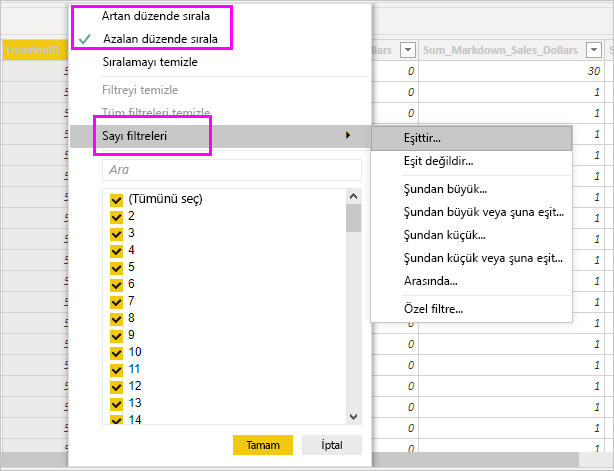

# Power BI Desktop'taki Veri görünümüyle çalışma

*Veri görünümü*, *Power BI Desktop* modelinizdeki verileri incelemenize, araştırmanıza ve anlamanıza yardımcı olur. Tabloları, sütunları ve verileri *Power Query Düzenleyicisi*'nde görüntülemekten farklıdır. Veri görünümüyle verilerinizin modele yüklendikten *sonraki* halini incelersiniz.

> [!NOTE]
> Veri görünümü verileri modele yüklendikten sonra gösterdiği için, tüm veri kaynakları DirectQuery’ye dayalı olduğunda Veri görünümü simgesi görünmez. 

Bazen verilerinizi modellerken rapor tuvalinde görsel oluşturmadan bir tablo veya sütundaki verileri görmek istersiniz. Satır düzeyine kadar görmek isteyebilirsiniz. Bu, özellikle ölçü ve hesaplanmış sütun oluşturduğunuzda veya bir veri türü ya da veri kategorisi tanımlamanız gerektiğinde yararlıdır.

Veri görünümünde bulunan öğelerden bazılarına daha yakından bakalım.

1. **Veri görünümü simgesi**. Veri görünümüne girmek için bu simgeyi seçin.

2. **Veri Kılavuzu**. Bu alan seçilen tabloyu ve içindeki tüm sütunlarla satırları gösterir. *Rapor* görünümünde gizlenen sütunlar gri renkte görünür. Bir sütuna sağ tıklayarak seçeneklere ulaşabilirsiniz.

3. **Modelleme şeridi**. Burada ilişkileri yönetebilir, hesaplama oluşturabilir, bir sütunun veri türünü, biçimini ve veri kategorisini değiştirebilirsiniz.

4. **Formül çubuğu**. Ölçüler ve Hesaplanmış sütunlar için Veri Analizi İfadesi (DAX) formülleri girebilirsiniz.

5. **Ara**. Modelinizdeki bir tabloyu veya sütunu arayabilirsiniz.

6. **Alanlar listesi**. Veri kılavuzunda görüntülemek istediğiniz tabloyu veya sütunu seçebilirsiniz.

## Veri görünümünde filtreleme

Veri görünümünde ayrıca verileri filtreleyebilir ve sıralayabilirsiniz. Her sütunda sıralama yönünü (uygulandıysa) belirleyen bir simge gösterilir.

Değerleri tek tek filtreleyebilir veya sütundaki verileri temel alarak gelişmiş filtrelemeyi kullanabilirsiniz.

> [!NOTE]
> Power BI modeli geçerli kullanıcı arabiriminizden farklı bir kültürde oluşturulduğunda arama kutusu metin alanları dışındaki Veri görünümü kullanıcı arabirimi bölümlerinde görünmez. Örneğin bu durum İngilizce-ABD dilinde oluşturulmuş modeli İspanyolca görüntülediğinizde geçerli olabilir.

## Sonraki adımlar

Power BI Desktop ile her şeyi yapabilirsiniz. Özellikler hakkında daha fazla bilgi edinmek için aşağıdaki kaynaklara bakın:

* [Power BI Desktop nedir?](../fundamentals/desktop-what-is-desktop.md)
* [Power BI Desktop ile sorgulara genel bakış](../transform-model/desktop-query-overview.md)
* [Power BI Desktop'taki veri türleri](desktop-data-types.md)
* [Power BI Desktop'ta verileri şekillendirme ve birleştirme](desktop-shape-and-combine-data.md)
* [Power BI Desktop'taki genel sorgu görevleri](../transform-model/desktop-common-query-tasks.md)
