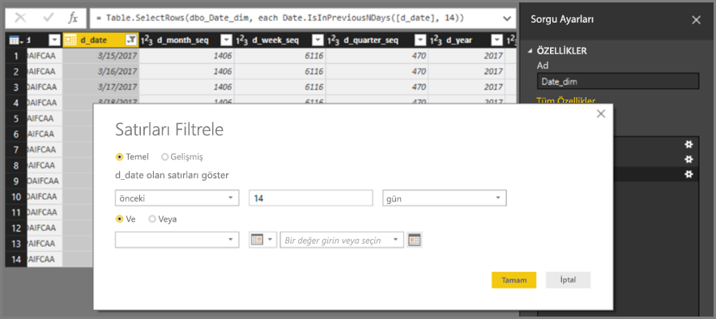
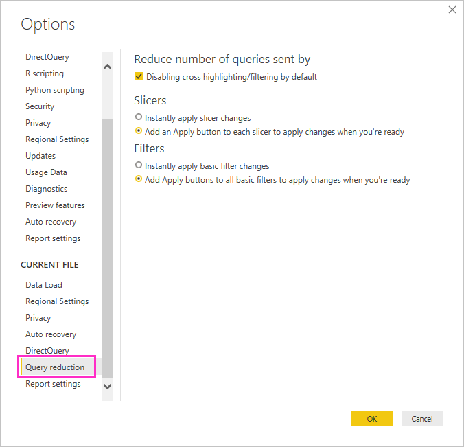
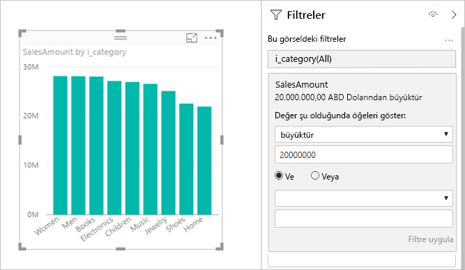
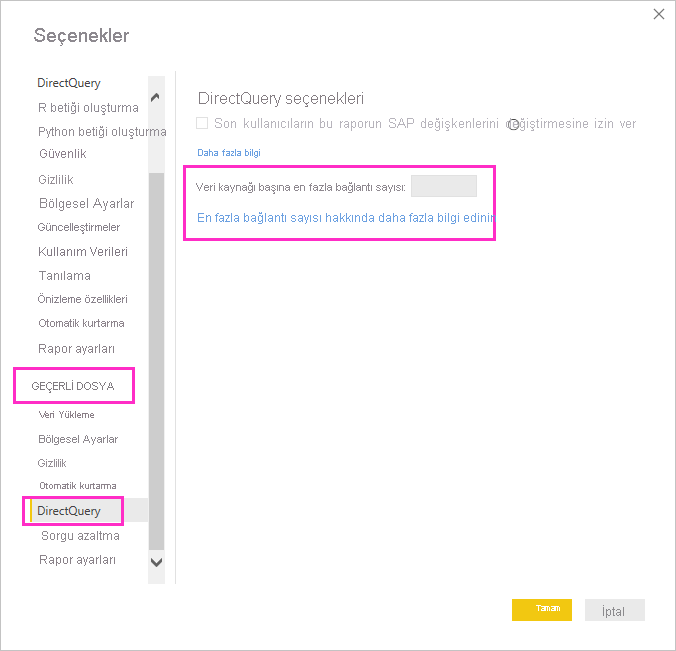
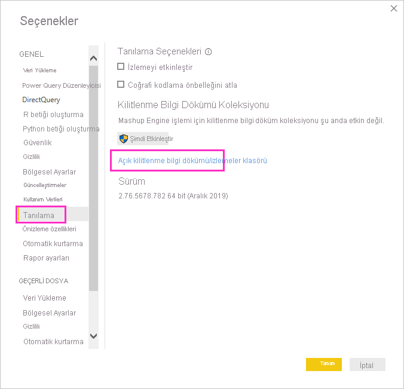
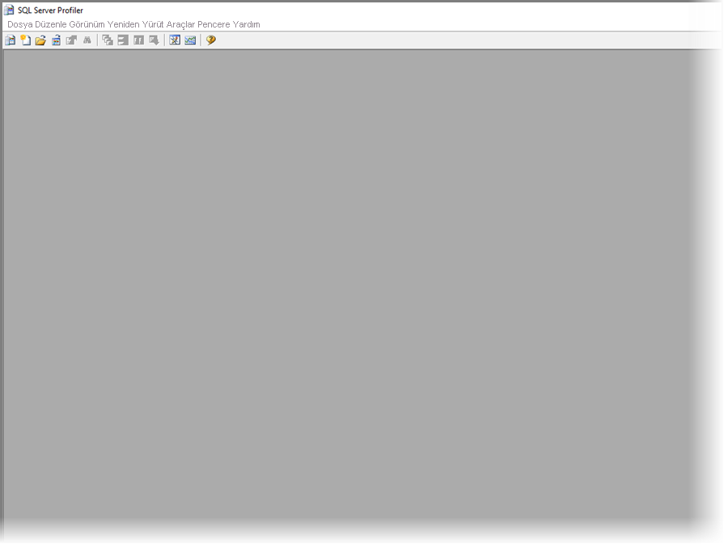
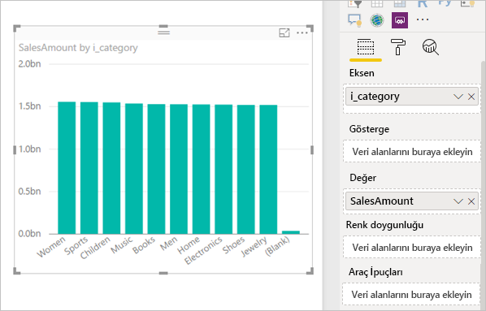

# <a name="about-using-directquery-in-power-bi"></a>Power BI'da DirectQuery kullanma hakkında

*Power BI Desktop*'ı veya *Power BI hizmetini* kullanırken her türde farklı veri kaynağına bağlanabilir ve bu veri bağlantılarını farklı yollarla gerçekleştirebilirsiniz. En çok kullanılan veri alma yöntemi olan *içeri aktarma* seçeneğini kullanarak Power BI'a veri aktarabilir veya *DirectQuery* olarak bilinen yöntemle verilerin bulunduğu özgün kaynak deposuna doğrudan bağlanabilirsiniz. Bu makalede DirectQuery özellikleri açıklanır:

* DirectQuery için farklı bağlantı seçenekleri
* İçeri aktarma yerine DirectQuery kullanmanın tercih edilebileceği durumlara yönelik kılavuz
* DirectQuery kullanmanın dezavantajları
* DirectQuery kullanımına yönelik en iyi yöntemler

İçeri aktarma veya DirectQuery'yi seçmeye yönelik en iyi yöntemleri uygulayın:

* Power BI'a veri aktarmak için mümkün olan her durumda içeri aktarma seçeneğini kullanmanız gerekir. İçeri aktarma sayesinde Power BI'ın yüksek performanslı sorgu altyapısından faydalanarak yüksek oranda etkileşimli ve tam özellikli bir deneyim elde edebilirsiniz.
* Verileri içeri aktarma seçeneği, hedefinizi karşılamıyorsa DirectQuery kullanmayı deneyin. Örneğin, veriler sıklıkla değişiyorsa ve raporların en güncel verileri içermesi gerekiyorsa DirectQuery en iyi seçenek olabilir. Bununla birlikte DirectQuery kullanımı yalnızca, temel alınan veri kaynağı tarafından normal toplama sorgusu için etkileşimli sorgu (5 saniyeden kısa) sağlanabildiği ve oluşturulan sorgu yüklemesinin işlenebildiği durumlarda uygundur. Ayrıca, DirectQuery kullanımına yönelik sınırlamaların belirtildiği listeyi de dikkatlice incelemeniz gerekir.

Hem içeri aktarma hem de DirectQuery için Power BI tarafından sunulan özellikler zaman içinde geliştirilmektedir. İçeri aktarma işleminin daha fazla durumda kullanılabilmesi amacıyla, içeri aktarılan verilerin kullanımında daha çok esneklik sağlamanın yanı sıra DirectQuery kullanımına yönelik dezavantajların bazılarının ortadan kaldırılması gibi değişiklikler görülebilir. İyileştirmelerden bağımsız olarak, temel alınan veri kaynağının performansı DirectQuery kullanımı sırasında dikkate alınması gereken önemli bir nokta olmaya devam edecektir. Temel alınan veri kaynağı yavaşsa bu kaynak için DirectQuery seçeneğinin kullanılması uygun olmaz.

Bu makalede *SQL Server Analysis Services* değil, Power BI ile DirectQuery kullanımı ele alınır. DirectQuery ayrıca SQL Server Analysis Services hizmetinin özelliklerinden biridir. Bu makalede yer verilen bilgilerin çoğu o özellik için de geçerlidir. İki özellik arasında önemli farklar da vardır. SQL Server Analysis Services ile DirectQuery kullanımı hakkında bilgi için bkz. [SQL Server 2016 Analysis Services'da DirectQuery](https://download.microsoft.com/download/F/6/F/F6FBC1FC-F956-49A1-80CD-2941C3B6E417/DirectQuery%20in%20Analysis%20Services%20-%20Whitepaper.pdf).

Bu makalede, raporun Power BI Desktop'ta oluşturulduğu durumlarda DirectQuery için önerilen iş akışına odaklanılmakla birlikte, doğrudan Power BI hizmetine bağlanma konusuna da değinilmektedir.

## <a name="power-bi-connectivity-modes"></a>Power BI bağlantı modları

Power BI aşağıdakiler de dahil olmak üzere çok sayıda çeşitli veri kaynağına bağlanır:

* Çevrimiçi hizmetler (Salesforce, Dynamics 365 ve diğerleri)
* Veritabanları (SQL Server, Access, Amazon Redshift ve diğerleri)
* Basit dosyalar (Excel, JSON ve diğerleri)
* Diğer veri kaynakları (Spark, Web siteleri, Microsoft Exchange ve diğerleri)

Bu kaynaklar için verileri Power BI'a aktarma seçeneği kullanılabilir. Bazıları için bağlantı DirectQuery kullanılarak da sağlanabilir. DirectQuery'yi destekleyen kaynakların özeti için bkz. [DirectQuery tarafından desteklenen veri kaynakları](power-bi-data-sources.md). DirectQuery ileride daha çok kaynak için kullanıma sunulacak ve bu süreçte öncelikli olarak, iyi bir etkileşimli sorgu performansı göstermesi beklenen kaynaklara odaklanılacaktır.

SQL Server Analysis Services için özel bir durum söz konusudur. SQL Server Analysis Services'a bağlanırken verileri içeri aktarmayı seçebilir veya *canlı bağlantıyı* kullanabilirsiniz. Canlı bağlantı kullanımı, DirectQuery ile benzerlik gösterir. Veriler içeri aktarılmaz ve görsellerin yenilenmesi için her seferinde temel alınan veri kaynağı sorgulanır. Canlı bağlantı diğer birçok açıdan farklı olduğu için farklı bir terim olması açısından *canlı bağlantı* yerine *DirectQuery* kullanılır.

Verilere bağlanmaya yönelik üç seçenek vardır: *içeri aktarma*, *DirectQuery* ve *canlı bağlantı*.

### <a name="import-connections"></a>İçeri aktarma bağlantıları

İçeri aktarma seçeneğinde Power BI Desktop'ta SQL Server gibi bir veri kaynağına bağlanmak için **Veri Al** seçeneği kullanıldığında, bu bağlantının davranışı şu şekilde olur:

* İlk Veri Al deneyimi sırasında, tüm seçili tablo kümeleri veri kümesi döndürecek bir sorguyu tanımlar. Bu sorgular, veriler yüklenmeden önce filtre uygulama, verileri toplama veya farklı tabloları birleştirme gibi işlemler için düzenlenebilir.
* Yüklemenin ardından, bu sorgular tarafından tanımlanan verilerin tümü Power BI önbelleğine aktarılır.
* Power BI Desktop'ta bir görsel oluşturulmasının ardından, içeri aktarılan veriler sorgulanır. Power BI deposu, sorgunun hızlı olmasını sağlar. Tüm değişiklikler görsele hemen yansıtılır.
* Temel alınan verilerdeki değişiklikler görsellere yansıtılmaz. Verilerin yeniden içeri aktarılması için *Yenile* komutunun kullanılması gerekir.
* Rapor, *.pbix* dosyası olarak Power BI hizmetinde yayımlandıktan sonra, bir veri kümesi oluşturulur ve Power BI hizmetine yüklenir. İçeri aktarılan veriler bu veri kümesine eklenir. Ardından, bu veriler için zamanlanmış yenileme (örneğin, verileri her gün yeniden içeri aktarmak üzere) yapılabilir. Özgün veri kaynağının konumuna bağlı olarak bir şirket içi veri ağ geçidinin yapılandırılması gerekebilir.
* Var olan bir raporu Power BI hizmetinde açarken veya yeni bir rapor yazarken, etkileşimin sağlanması amacıyla, içeri aktarılan veri tekrar sorgulanır.
* Görseller veya rapor sayfalarının tamamı, pano kutucukları olarak sabitlenebilir. Temel alınan veri kümesi yenilendiğinde kutucuklar da otomatik olarak yenilenir.

### <a name="directquery-connections"></a>DirectQuery bağlantıları

DirectQuery seçeneğinde, Power BI Desktop'ta bir veri kaynağına bağlanmak için **Veri Al** seçeneği kullanıldığında, bu bağlantının davranışı şu şekilde olur:

* İlk Veri Al deneyimi sırasında kaynak seçilir. İlişkisel kaynaklar için her biri mantıksal olarak veri kümesi döndüren bir sorguyu tanımlayan tablolardan oluşan bir küme seçilir. SAP BW gibi çok boyutlu kaynaklar için yalnızca kaynak seçilir.
* Ancak yüklemeden sonra Power BI deposuna hiçbir veri aktarılmaz. Bunun yerine, Power BI Desktop'ta bir görsel oluşturulduktan sonra, gerekli verilerin alınması için temel alınan veri kaynağına sorgular gönderilir. Görselin yenilenme süresi temel alınan veri kaynağının performansına bağlıdır.
* Temel alınan verilerdeki değişiklikler var olan görsellere hemen yansıtılmaz. Bu seçenekte de yenileme yapılması gerekir. Her bir görsel için gerekli sorgular yeniden gönderilir ve görsel gereken şekilde güncelleştirilir.
* Rapor Power BI hizmetinde yayımlandıktan sonra, Power BI hizmetinde içeri aktarma işleminde olduğu gibi bir veri kümesi oluşturulur. Ancak, bu veri kümesine *hiçbir veri* eklenmez.
* Var olan bir raporu Power BI hizmetinde açarken veya yeni bir rapor yazarken gerekli verilerin alınması amacıyla, temel alınan veri kaynağı yeniden sorgulanır. Özgün veri kaynağının konumuna bağlı olarak, verilerin yenilenmiş olması durumunda içeri aktarma modunda olduğu gibi, bir şirket içi veri ağ geçidinin yapılandırılması gerekebilir.
* Görseller veya rapor sayfalarının tamamı, Pano kutucukları olarak sabitlenebilir. Kutucuklar, panonun hızlıca açılmasının sağlanması için zamanlanmış şekilde (örneğin, saatte bir) otomatik olarak yenilenir. Bu yenilemenin sıklığı, verilerin hangi sıklıkta değiştiğinin ve son verilerin gösterilmesinin ne kadar önemli olduğunun yansıtılması amacıyla denetlenebilir. Bir pano açıldığında kutucuklar son yenileme tarihindeki verileri yansıtır ve temel alınan kaynakta yapılan en son değişiklikleri göstermeyebilir. Güncel olduğundan emin olmak için açık panoları yenileyebilirsiniz.

### <a name="live-connections"></a>Canlı bağlantılar

SQL Server Analysis Services hizmetine bağlanılırken, seçili veri modelinden veri aktarma veya bu veri modeli ile canlı bağlantı kurma seçeneği sunulur. İçeri aktarma seçeneğini kullandığınızda bu dış SQL Server Analysis Services kaynağına yönelik bir sorgu tanımlarsınız ve veriler normal şekilde içeri aktarılır. Canlı bağlantı kurma seçeneğini kullanırsanız hiçbir sorgu tanımlanmaz ve dış modelin tamamı alan listesinde gösterilir.

Önceki paragrafta açıklanan durum aşağıdaki kaynaklarla bağlantı kurulurken de geçerlidir ancak verileri içeri aktarma seçeneği sunulmaz:

* Power BI veri kümeleri (örneğin, önceden oluşturulmuş ve hizmette yayımlanmış bir Power BI veri kümesine, üzerine yeni bir rapor yazmak amacıyla bağlanılırken).
* Microsoft Dataverse.

SQL Server Analysis Services üzerinden alınan raporların Power BI hizmetinde yayımlandıktan sonraki davranışı, şu açılardan DirectQuery raporları ile benzerlik gösterir:

* Var olan bir raporu Power BI hizmetinde açarken veya yeni bir rapor yazarken, temel alınan SQL Server Analysis Services kaynağı sorgulanır (şirket içi veri ağ geçidi gerekebilir).
* Pano kutucukları bir zamanlamaya göre (örneğin, saatte bir) otomatik olarak yenilenir.

İki özellik arasında önemli farklar da vardır. Örneğin, canlı bağlantılar için, raporu açan kullanıcının kimliği her zaman temel alınan SQL Server Analysis Services kaynağına aktarılır.

Bu karşılaştırmalara değindiğimize göre, makalenin geri kalanında yalnızca DirectQuery'ye odaklanabiliriz.

## <a name="when-is-directquery-useful"></a>DirectQuery ne zaman fayda sağlar?

Aşağıdaki tabloda, DirectQuery ile bağlanmanın özellikle faydalı olabileceği senaryolar açıklanmaktadır. Verilerin özgün kaynakta bırakılmasının yararlı kabul edilebileceği durumlar da dahil edilmiştir. Açıklamaya, belirtilen senaryonun Power BI'da kullanılıp kullanılamayacağı bilgisi de eklenmiştir.

| Sınırlama | Açıklama |
| --- | --- |
| Verilerin sıklıkla değişmesi ve gerçek zamanlıya yakın raporlamanın gerekli olması |İçeri aktarılan verilerin bulunduğu modeller en fazla saatte bir yenilenebilir (Power BI Pro veya Power BI Premium abonelikleriyle daha sık yenilenebilir). Veriler sürekli değişiyorsa ve raporlarda son verilerin gösterilmesi gerekiyorsa zamanlanmış yenileme ile İçeri Aktarma seçeneğinin kullanılması bu ihtiyaçları karşılamayabilir. Power BI'a doğrudan veri akışı da yapabilirsiniz. Ancak bu durum için desteklenen veri hacimlerine yönelik sınırlamalar mevcuttur. <br/> <br/> Bunun aksine, DirectQuery kullanıldığında bir raporun veya panonun açılmasının ya da yenilenmesinin ardından her zaman kaynaktaki en son veriler gösterilir. Buna ek olarak, pano kutucukları daha sık şekilde (her 15 dakikada bir) güncelleştirilebilir. |
| Verilerin çok büyük olması |Veriler çok büyükse tümünün içeri aktarılması uygun olmaz. Bunun aksine, sorgulama işlemi yerinde gerçekleştiğinden DirectQuery için büyük bir veri aktarımı gerekmez. <br/> <br/> Ancak [DirectQuery kullanmanın etkileri](#implications-of-using-directquery) bölümünde anlatıldığı üzere büyük veriler, temel alınan kaynakta sorgulama performansının çok yavaş olacağı anlamına da gelebilir. Verilerin tüm ayrıntılarıyla içeri aktarılması her zaman gerekli değildir. Bunun yerine, veriler içeri aktarma sırasında önceden toplanabilir. *Sorgu Düzenleyicisi*, içeri aktarma sırasında önceden toplama yapmayı kolaylaştırır. Uç durumlar söz konusu olduğunda, her bir görsel için tam olarak gerekli olan toplama verileri içeri aktarılabilir. Büyük veriler için en kolay yaklaşım DirectQuery olsa da, temel alınan kaynağın çok yavaş olduğu durumlarda toplama verilerinin içeri aktarılması da tercih edilebilir. |
| Temel alınan kaynakta güvenlik kurallarının tanımlanmış olması |Veriler içeri aktarıldığında Power BI, Power BI Desktop'tan geçerli kullanıcı kimlik bilgilerini veya Power BI hizmetinden zamanlanmış yenileme yapılandırmasında tanımlanan kimlik bilgilerini kullanarak veri kaynağına bağlanır. Böyle bir rapor, veriler *içeri aktarma* modunda yayımlanırken ve paylaşılırken raporun yalnızca söz konusu verileri görme izni olan kullanıcılarla paylaşıldığına veya veri kümesinin parçası olarak satır düzeyi güvenlik tanımlandığına dikkat edilmesi gerekir. <br/> <br/> DirectQuery, rapor görüntüleyicisinin kimlik bilgilerinin temel alınan kaynağa geçirilmesine ve burada güvenlik kurallarının uygulanmasına izin verir. SQL Azure veri kaynakları ve veri ağ geçidi aracılığıyla şirket içi SQL sunucuları için çoklu oturum açma desteği sunulur. Ayrıntılı bilgi için bkz. [Power BI'daki ağ geçitleri için çoklu oturum açmaya (SSO) genel bakış](service-gateway-sso-overview.md). |
| Veri hakimiyeti kısıtlamalarının geçerli olması |Bazı kuruluşların veri hakimiyeti ilkeleri bulunur, böylece veriler kuruluş dışına çıkamaz. İçeri aktarma tabanlı bir çözüm sorunlara neden olabilir. Bunun aksine, DirectQuery ile bu veriler temel alınan kaynakta kalır. <br/> <br/> Ancak, DirectQuery ile dahi zamanlanmış kutucuk yenilemesi nedeniyle görsel düzeydeki bazı veri önbellekleri Power BI hizmetinde tutulur. |
| Temel alınan veri kaynağının, ölçüler içeren bir OLAP kaynağı olması |Temel alınan veri kaynağı, SAP HANA veya SAP Business Warehouse gibi *ölçüler* içeriyorsa verilerin içeri aktarılması başka sorunlara neden olur. İçeri aktarılan verilerin, sorgu ile tanımlandığı üzere belirli bir toplama düzeyinde olduğu anlamına gelir. Örneğin, **Class**, **Year** ve **City** verilerine göre **TotalSales** ölçüsü. Ardından, daha yüksek düzeyde bir toplama işlemine ihtiyaç duyan verileri (**Year** verilerine göre **TotalSales** gibi) gerektiren bir görsel oluşturulursa toplam değer yeniden hesaplanır. Bu toplam, **Toplam** ve **Minimum** gibi toplanabilen ölçüler için sorun oluşturmazken, **Ortalama** ve **Ayrı Say** gibi toplanamayan ölçüler için soruna yol açar. <br/> <br/> Doğru toplama verilerinin (belirli bir görsel için gerektiği şekilde) doğrudan kaynaktan alınmasının kolaylaştırılması amacıyla, sorguların DirectQuery'de olduğu gibi görsel başına gönderilmesi gerekir. <br/> <br/> SAP Business Warehouse (BW) bağlantısında, DirectQuery'nin seçilmesi ölçülerin bu şekilde işlenmesini sağlar. SAP BW hakkında bilgi için bkz. [DirectQuery ve SAP BW](desktop-directquery-sap-bw.md). <br/> <br/> Ancak, şu anda SAP HANA üzerinden DirectQuery, ilişkisel kaynakla aynı şekilde işler ve içeri aktarma deneyimindekine benzer bir davranış sunar. Bu yaklaşıma [DirectQuery ve SAP HANA](desktop-directquery-sap-hana.md) makalesinde ayrıntılı olarak değinilmiştir. |

Özetlemek gerekirse, Power BI'daki mevcut özellikleri göz önünde bulundurulduğunda DirectQuery, aşağıdaki senaryolarda avantaj sunmaktadır:

* Verilerin sıklıkla değişmesi ve gerçek zamanlıya yakın raporlamanın gerekli olması.
* Çok büyük verileri önceden toplama gerekmeden işleme.
* Veri hakimiyeti kısıtlamalarının geçerli olması.
* Kaynağın, SAP BW gibi ölçüler içeren çok boyutlu bir kaynak olması.

Önceki listede bulunan ayrıntılar yalnızca Power BI kullanımına yöneliktir. Verileri içeri aktarmak için bunun yerine dış SQL Server Analysis Services veya Azure Analysis Services modeli kullanabilirsiniz. Daha sonra Power BI ile bu modele bağlanabilirsiniz. Bu yaklaşım ek yapılandırma gerektirse de daha iyi bir esneklik sunar. Daha büyük hacimli veriler içeri aktarılabilir. Veri yenileme sıklığı konusunda bir kısıtlama olmaz.

## <a name="implications-of-using-directquery"></a>DirectQuery kullanmanın etkileri

Bu bölümde açıklandığı üzere, DirectQuery kullanmanın olumsuz etkileri olabilir. Bu sınırlamaların bazıları, kullanılan kaynağa bağlı olarak biraz farklılık gösterebilir. Uygun olduğunda sınırlamalara değinilecek ve önemli ölçüde farklılık gösteren kaynaklar ayrı makalelerde ele alınacaktır.

### <a name="performance-and-load-on-the-underlying-source"></a>Temel alınan kaynakta performans ve yükleme

DirectQuery kullanılırken genel deneyim büyük oranda, temel alınan veri kaynağının performansına bağlıdır. Her görselin yenilenmesi (örneğin, bir dilimleyici değeri değiştirildikten sonra) birkaç saniye (genellikle 5 saniyeden az) sürüyorsa bu deneyimin makul düzeyde olduğu kabul edilir. Verileri Power BI'a aktarırken almaya alışkın olduğunuz anlık yanıtla karşılaştırdığınızda bu işlemin yavaş ilerlediğini düşünebilirsiniz. Kaynağın yavaş olması, görsellerin on saniyeden daha uzun sürede yüklenmesine neden oluyorsa deneyim oldukça zayıf olacaktır. Sorgular zaman aşımına bile uğrayabilir.

Temel alınan kaynağın performansının yanı sıra kaynağın üzerindeki yüke de dikkat etmeniz gerekir. Yük, performansı etkiler. Paylaşılan bir raporu ve bu raporun yenilediği panoları açan her kullanıcı, temel alınan kaynağa görsel başına en az bir sorgu gönderir. Bunun için, kaynağın böyle bir sorgu yükünü, makul performans göstermeye devam ederken işleyebilmesi gerekir.

### <a name="security-implications-when-combining-data-sources"></a>Veri kaynaklarını birleştirmenin güvenlik üzerindeki etkileri

Tıpkı verileri içeri aktarırken olduğu gibi, [Birleşik modeller](../transform-model/desktop-composite-models.md) özelliğini kullanarak bir DirectQuery modelinde birden fazla veri kaynağını kullanmak mümkündür. Birden çok veri kaynağı kullandığınızda, verilerin temel alınan veri kaynaklarında nasıl taşındığını ve bu işlemin getirdiği [güvenlik etkilerini](../transform-model/desktop-composite-models.md#security-implications) anlamak önemlidir.

### <a name="limited-data-transformations"></a>Veri dönüştürme işlemine yönelik sınırlamalar

Benzer şekilde, Sorgu Düzenleyicisi'nde uygulanabilecek veri dönüştürme işlemlerine yönelik sınırlamalar mevcuttur. Veriler içeri aktarıldığında, görsel oluşturmada kullanılmadan önce söz konusu verilerin temizlenmesi ve yeniden şekillendirilmesi için bir dizi kapsamlı dönüştürme işlemi (JSON belgelerini ayrıştırma veya bir sütundaki verileri satır biçiminde özetleme gibi) kolayca uygulanabilir. Bu dönüştürme işlemleri için DirectQuery'de daha fazla sınırlama mevcuttur.

İlk olarak, SAP Business Warehouse gibi bir OLAP kaynağına bağlanılırken hiçbir dönüştürme tanımlanamaz ve dış modelin tamamı kaynaktan alınır. SQL Server gibi ilişkisel kaynaklarda her sorgu için bir dizi dönüştürme tanımlanabilir, ancak bu dönüştürme işlemleri performans nedeniyle sınırlıdır.

Bu tür dönüştürme işlemlerinin veriler yenilendikçe değil, temel alınan kaynağa her sorgu gönderildiğinde uygulanması gerekir. Böylece bu işlem, tek bir yerel sorguya makul şekilde çevrilebilen dönüştürmelerle sınırlıdır. Fazla karmaşık bir dönüştürme kullanmanız durumunda, dönüştürmenin silinmesini veya modelin içeri aktarma moduna geçirilmesini belirten bir hata iletisi alırsınız.

Ayrıca, **Veri Al** iletişim kutusundan veya Sorgu Düzenleyicisi'nden elde edilen sorgu, görsel için gereken verileri almak üzere oluşturulan ve gönderilen sorgulardaki bir alt seçimde kullanılır. Sorgu Düzenleyicisi'nde tanımlanan sorgu, bu bağlamda geçerli olmalıdır. Özellikle Ortak Tablo İfadeleri kullanılarak veya Saklı Yordamları çağıran bir sorgu oluşturulamaz.

### <a name="modeling-limitations"></a>Modelleme sınırlamaları

Bu bağlamda *modelleme* terimi, ham veriler kullanılarak rapor yazılırken verilerin iyileştirilmesi ve zenginleştirilmesi anlamına gelir. Örnekler arasında şunlar yer almaktadır:

* Tablolar arasında ilişki tanımlama
* Yeni hesaplamalar ekleme (hesaplanmış sütunlar ve ölçüler)
* Sütunları ve ölçüleri yeniden adlandırma ve gizleme
* Hiyerarşi tanımlama
* Sütunlar için biçimlendirme, varsayılan özetleme ve sıralama düzeni tanımlama
* Değerleri gruplandırma veya kümeleme

DirectQuery kullanılırken bu model zenginleştirmelerinin birçoğu yapılabilir ve daha sonraki kullanımların iyileştirilmesi için ham veriler de zenginleştirilebilir. Ancak, DirectQuery ile bazı modelleme özellikleri kullanılamaz veya sınırlıdır. Sınırlamalar, genellikle performans sorunlarından kaçınmak için uygulanır. Tüm DirectQuery kaynaklarında yaygın olarak görülen sınırlamalar burada listelenmiştir. [Sonraki adımlar](#next-steps) bölümünde bahsedildiği gibi kaynaklar için farklı sınırlamalar uygulanabilir.

* **Yerleşik tarih hiyerarşisi yoktur:** Veriler içeri aktarılırken, tüm tarih/tarih saat sütunlarında varsayılan olarak yerleşik bir tarih hiyerarşisi de bulunur. Örneğin, **OrderDate** sütununu içeren satış siparişleri tablosunu içeri aktarıyorsanız bir görselde **OrderDate** kullanılırken, kullanılacak uygun düzeyi (yıl, ay, gün) seçebilirsiniz. DirectQuery'de bu yerleşik tarih hiyerarşisi kullanılamaz. Temel alınan kaynakta **Date** tablosu bulunuyorsa (birçok veri ambarında yaygın olarak bulunur) DAX Akıllı Zaman Gösterimi işlevlerinin normal şekilde kullanılabilir.
* **Yalnızca saniye doğruluğu için tarih/saat desteği:** Veri kümenizdeki saat sütunlarını kullanırken, Power BI yalnızca temel alınan kaynağa yönelik sorguları bir saniye ayrıntısı düzeyinde verir. Milisaniyeler için DirectQuery kaynağına sorgu gönderilmez. Kaynak sütunlarınızdan saatin bu kısmını kaldırmanız gerekir.
* **Hesaplanmış sütunlara yönelik sınırlamalar:** Hesaplanmış sütunlar satır içi işlemlerle sınırlıdır; herhangi bir toplama işlevi kullanılmadan yalnızca aynı tablonun diğer sütunlarındaki değerlerine başvurabilir. Buna ek olarak, izin verilen DAX skaler işlevleri (`LEFT()` gibi), temel alınan kaynağa kolayca gönderilebilecek olanlarla sınırlıdır. Kaynağın tam olarak hangi özelliklere sahip olduğuna göre değişiklik gösterir. Hesaplanmış bir sütun için DAX yazılırken, desteklenmeyen işlevler otomatik tamamlamada listelenmez ve kullanılırsa hataya neden olur.
* **Üst-alt DAX işlevleri desteği yok:** DirectQuery modelinde, genellikle Üst-Alt yapıları (hesaplar grafiği ve çalışan hiyerarşileri gibi) işleyen `DAX PATH()` işlev ailesini kullanmak mümkün değildir.
* **Hesaplanan tablolar desteklenmez:** DAX ifadesi kullanarak hesaplanan tablo tanımlama özelliği, DirectQuery modunda desteklenmez.
* **İlişki filtrelemesi:** Çift yönlü filtreleme hakkında bilgi için bkz. [Çift yönlü çapraz filtreleme](https://download.microsoft.com/download/2/7/8/2782DF95-3E0D-40CD-BFC8-749A2882E109/Bidirectional%20cross-filtering%20in%20Analysis%20Services%202016%20and%20Power%20BI.docx). Bu teknik incelemede SQL Server Analysis Services bağlamında örnekler verilmiştir. Temel noktalar, Power BI için de geçerlidir.
* **Kümeleme yok:** DirectQuery kullanılırken grupları otomatik olarak bulmak için Kümeleme özelliği kullanılamaz.

### <a name="reporting-limitations"></a>Raporlama sınırlamaları

DirectQuery modelleri için neredeyse tüm raporlama özellikleri desteklenir. Bu nedenle, temel alınan kaynak uygun düzeyde performans sunduğu sürece aynı görselleştirme kümesi kullanılabilir. Bir rapor yayımlandıktan sonra Power BI hizmetinde sunulan özelliklerin bazılarında önemli sınırlamalar bulunur:

* **Hızlı İçgörüler desteklenmez:** Power BI Hızlı İçgörüler ilgi çekici olabilecek içgörüleri keşfetmek için karmaşık bir algoritma kümesi uygulayarak veri kümenizin farklı alt kümelerinde arama yapar. Çok yüksek performanslı sorgular gerektiğinden bu özellik DirectQuery modundaki veri kümelerinde kullanılamaz.
* **Soru-Cevap desteklenmez:** Power BI Soru-Cevap, kullanımı kolay, doğal dil özelliklerinden yararlanarak verilerinizi araştırmanızı ve grafikler ile graflar biçiminde cevaplar almanızı sağlar. Ancak bu özellik, DirectQuery kullanan veri kümelerinde şu anda desteklenmiyor.
* **Excel'de İncele özelliğinin kullanılması performans düşüşüne yol açabilir:** Veri kümesinde “Excel'de İncele” özelliğini kullanarak verilerinizi inceleyebilirsiniz. Bu yaklaşım, Excel'de Özet Tabloların ve Özet Grafiklerin oluşturulmasını sağlar. DirectQuery kullanan veri kümelerinde bu özellik desteklense de, Power BI'da görsel oluşturmaya kıyasla performans genelde daha yavaş olur. Bu nedenle, senaryolarınız için Excel kullanımı önemliyse DirectQuery kullanıp kullanmayacağınıza karar verirken bu sınırlamayı göz önünde bulundurun.
* **Metin sütunları için en fazla uzunluk:** DirectQuery kullanan veri kümelerindeki bir metin sütununda yer alan veriler için en fazla uzunluk 32.764 karakterdir. Daha uzun metinler üzerinde raporlama hatayla sonuçlanır.

### <a name="security"></a>Güvenlik

Bu makalede daha önce bahsedildiği üzere, DirectQuery'deki bir rapor Power BI hizmetinde yayımlanmasının ardından, temel alınan veri kaynağına bağlanmak için her zaman aynı kimlik bilgilerini kullanır. Bu davranış, farklı sonuçlar veren SQL Server Analysis Services'a yönelik canlı bağlantılar için değil, yalnızca DirectQuery için geçerlidir. Bir DirectQuery raporunun yayımlanmasının hemen ardından, kullanılacak kullanıcı kimlik bilgilerinin yapılandırılması gerekir. Kimlik bilgileri yapılandırılmadan raporun Power BI hizmetinde açılması hataya neden olur.

Kullanıcı kimlik bilgileri sağlandıktan sonra, *raporu açan kullanıcıdan bağımsız olarak* bu kimlik bilgileri kullanılır. Bu açıdan içeri aktarılan verilerle aynıdır. Raporda satır düzeyi güvenlik uygulanıp uygulanmadığından bağımsız olarak tüm kullanıcılar aynı verileri görür. Temel alınan kaynakta tanımlanmış herhangi bir güvenlik kuralı varsa rapor paylaşılırken de aynı dikkat gösterilmelidir.

Ayrıca "alternatif kimlik bilgileri", Power BI Desktop'tan SQL Server ile DirectQuery bağlantısı kurarken desteklenmez. Windows kimlik bilgilerinizi veya veritabanı kimlik bilgilerini kullanabilirsiniz.

### <a name="behavior-in-the-power-bi-service"></a>Power BI hizmetindeki davranış

Bu bölümde, rapor ve panonun paylaşılacağı kullanıcı sayısı, raporun karmaşıklığı ve raporda satır düzeyi güvenlik tanımlanıp tanımlanmadığı açısından arka uç veri kaynağına uygulanacak yük derecesini ifade edebilmek için DirectQuery raporunun Power BI hizmetindeki davranışı açıklanır.

#### <a name="reports--opening-interacting-with-editing"></a>Raporlar - açma, etkileşim kurma, düzenleme

Bir rapor açıldığında, o anda görünen sayfadaki tüm görseller yenilenir. Genellikle her bir görsel için, temel alınan veri kaynağına en az bir sorgu gönderilmesi gerekir. Bazı görseller için birden fazla sorgu gerekebilir. Örneğin, iki farklı olgu tablosundaki toplam değerleri gösteriyor, daha karmaşık bir ölçü içeriyor veya Ayrı Say gibi eklenebilir olmayan bir ölçünün toplamını içeriyor olabilir. Yeni bir sayfaya geçildiğinde bu görseller yenilenir. Yenileme sonucunda temel alınan kaynağa yeni bir sorgu kümesi gönderilir.

Rapordaki kullanıcı etkileşimlerinin her biri, görsellerin yenilenmesine neden olabilir. Örneğin, dilimleyicide farklı bir değerin seçilmesi, etkilenen tüm görsellerin yenilenmesi için yeni bir sorgu kümesi gönderilmesini gerektirir. Bir filtre değiştirildiğinde veya diğer görselleri çapraz vurgulamak için bir görsele tıklandığında da aynı durum geçerlidir.

Aynı şekilde, yeni bir raporu düzenlemek için görselin son halini oluşturmaya yönelik her adımda sorguların gönderilmesi gerekir.

Sonuçlar bir noktaya kadar önbelleğe alınır. Aynı sonuçların kısa süre önce elde edilmiş olması durumunda görsel anında yenilenir. Satır düzeyi güvenlik tanımlanmışsa bu önbellekler kullanıcılarla paylaşılmaz.

#### <a name="dashboard-refresh"></a>Pano Yenileme

Tek başına görseller veya sayfaların tamamı panoya kutucuk olarak sabitlenebilir. DirectQuery veri kümelerini temel alan kutucuklar, zamanlamaya göre otomatik olarak yenilenir. Kutucuklar, arka uç veri kaynağına sorgu gönderir. Veri kümeleri varsayılan olarak saatte bir yenilenir ancak Veri Kümesi ayarlarının parçası olarak haftada bir veya 15 dakikada bir olacak şekilde yapılandırılabilir.

Modelde satır düzeyi güvenlik tanımlanmamışsa her kutucuk bir kez yenilenir ve sonuçlar tüm kullanıcılarla paylaşılır. Aksi takdirde katlanan bir etki söz konusu olabilir. Her kutucukta her bir kullanıcı için temel alınan veri kaynağına sorgu gönderilmesi gerekir.

10 kutucuğu olan, 100 kullanıcı ile paylaşılan, satır düzeyi güvenlik ile DirectQuery kullanan bir veri kümesinde oluşturulan ve 15 dakikada bir yenilenecek şekilde yapılandırılan bir pano için arka uç kaynağa 1000 dakikada bir en az 15 sorgu gönderilir.

Satır düzeyi güvenlik kullanımına ve yenileme zamanlaması yapılandırmasına dikkat edilmelidir.

#### <a name="time-outs"></a>Zaman aşımı

Power BI hizmetinde her sorgu için dört dakikalık bir zaman aşımı uygulanır. Daha uzun süren sorgular başarısız olur. Daha önce de bahsedildiği gibi etkileşimli sorgu performansı sağlayan kaynaklar için DirectQuery kullanmanız önerilir. Bu sınır, çok uzun yürütme süresi kaynaklı sorunları önlemeyi amaçlamaktadır.

### <a name="other-implications"></a>Diğer etkiler

DirectQuery kullanmanın diğer genel etkilerinden bazıları şunlardır:

* **Veriler değişiyorsa, en son verilerinin gösterildiğinden emin olmak için yenileme yapılması gerekir:** Önbelleklerin kullanıldığı varsayıldığında, görselin her zaman en son verileri göstermesi garanti edilemez. Örneğin, bir görselde bir önceki günün işlemleri gösteriliyor olabilir. Bir dilimleyicinin değiştirilmesiyle, son iki güne ait işlemler gösterilecek şekilde yenilenebilir. Bunların arasında son ve yeni gelen işlemler de bulunabilir. Dilimleyicinin özgün değerine döndürülmesi, daha önce alınan önbellek değerinin yeniden gösterilmesine neden olur.

  **Yenile** seçeneği belirlendiğinde önbellekler temizlenir ve en güncel verilerin gösterilmesi için sayfadaki tüm görseller yenilenir.

* **Veriler değişiyorsa, görseller arasında tutarlılık garanti edilemez:** İster aynı sayfada ister farklı sayfalarda olsun, farklı görseller farklı zamanlarda yenilenebilir. Temel alınan kaynaktaki veriler değiştiğinde, veriler her bir görselde tam olarak aynı zamanda gösterilmeyebilir. Bazen tek bir görsel için bazen birden fazla sorgu gerektiğinden (örneğin, ayrıntıları ve toplamları elde etmek için) aslında tek bir görselde bile tutarlılık garantisi yoktur. Bu tutarlılığın sağlanması için, herhangi bir görsel yenilendiğinde tüm görsellerin yenilenme ek yükü ile birlikte, temel alınan veri kaynağında Anlık Görüntü Yalıtımı gibi ek yük getirecek özelliklerin kullanılması gerekir.

  Sayfadaki tüm görsellerin yenilenmesi için **Yenile** seçeneğinin belirlenmesi ile bu sorun büyük ölçüde azaltılabilir. İçeri aktarma modu kullanılırken de verilerin birden fazla tablodan içeri aktarılması durumunda aynı tutarlılık garantisi sorunu yaşanır.

* **Power BI Desktop'ta meta veri değişikliklerini yansıtmak için yenileme gereklidir:** Rapor yayımlandıktan sonra, **Yenile** seçeneği rapordaki görselleri yeniler. Temel alınan kaynağın şemasının değişmesi durumunda bu değişiklikler, alan listesindeki mevcut alanlar değiştirilecek şekilde otomatik olarak uygulanmaz. Temel alınan kaynaktan tablo veya sütun kaldırılmışsa yenileme işleminin ardından sorgu hatası oluşabilir. Rapor Power BI Desktop'ta açıldıktan sonra **Yenile** seçeneği belirlendiğinde modeldeki alanlar, değişiklikleri yansıtacak şekilde güncelleştirilir.

* **Herhangi bir sorguda döndürülecek satır sayısı sınırı 1 milyondur:** Temel alınan kaynağa yönelik tek bir sorgu için, döndürülebilecek satır sayısının sabit bir sınırı vardır ve bu sınır 1 milyon satırdır. Bu sınırın genellikle uygulamada bir etkisi yoktur ve görseller bu kadar çok noktayı görüntülemez. Ancak, Power BI'ın gönderilen sorguları tamamen iyileştirmediği durumlarda ve sınırı aşan bazı ara sonuçlar istendiğinde bu sınır ile karşılaşılabilir. Bu sınır aynı zamanda, bir görsel oluşturulurken daha makul bir son durumun elde edilmesi için de uygulanabilir. Örneğin, bir filtre uygulanmadığı sürece 1 milyondan fazla müşteri olması durumunda **Customer** ve **TotalSalesQuantity** sütunlarının eklenmesi bu sınıra ulaşılmasına neden olur.

  Şu hata döndürülür: Dış veri kaynağında gerçekleştirilen bir sorguya ilişkin sonuç kümesi, izin verilen maksimum boyutu ('1000000' satır) aştı."

* **İçeri aktarma modundan DirectQuery moduna geçilemez:** DirectQuery modundaki bir modeli içeri aktarma modunda kullanmak üzere değiştirmek mümkün olsa da, gerekli tüm verilerin içeri aktarılması gerekir. Ayrıca, temelde DirectQuery modunda desteklenmeyen özellikler nedeniyle önceki moda geri dönülemez. Dış ölçüleri farklı ele aldıklarından, SAP BW gibi çok boyutlu kaynaklara ait DirectQuery modelleri için de DirectQuery modundan içeri aktarma moduna geçiş yapılamaz.

## <a name="directquery-in-the-power-bi-service"></a>Power BI hizmetinde DirectQuery

Power BI Desktop'ta tüm kaynaklar desteklenir. Ayrıca, bazı kaynaklar doğrudan Power BI hizmetinden kullanılabilir. Örneğin, bir işletme kullanıcısı Salesforce'taki verilerine bağlanmak için Power BI'ı kullanabilir ve Power BI Desktop'ı kullanmadan anında bir pano elde edebilir.

DirectQuery özellikli kaynakların yalnızca ikisi hizmette doğrudan kullanılabilir:

* Spark
* Azure SQL Veri Ambarı

Ancak, bu iki kaynak üzerinde gerçekleştirilecek herhangi bir DirectQuery kullanımının Power BI Desktop'tan başlatılması önerilir. Bunun nedeni, bağlantının başlangıçta Power BI hizmetinden gerçekleştirilmesi halinde birçok önemli sınırlamanın uygulanacak olmasıdır. Power BI hizmetinden basit bir başlangıç yapılsa da elde edilen raporun zenginleştirilmesine yönelik sınırlamalar mevcuttur. Örneğin daha sonra herhangi bir hesaplama oluşturulamaz, birçok analitik özellik kullanılamaz ve hatta meta veriler, temel alınan şemadaki değişiklikler yansıtılacak şekilde yenilenemez.

## <a name="guidance-for-using-directquery-successfully"></a>DirectQuery'yi başarılı bir şekilde kullanma kılavuzu

Bu bölümde, DirectQuery'yi başarılı bir şekilde kullanmaya ilişkin üst düzey bir rehberlik sağlanır. Rehberlik için, DirectQuery'nin bu makalede açıklanan etkilerinden yola çıkılmıştır.

### <a name="back-end-data-source-performance"></a>Arka uç veri kaynağı performansı

Basit görsellerin makul bir sürede yenilenebileceğini doğrulayın. Makul bir etkileşim deneyiminin sunulması için yenilemenin 5 saniye içinde gerçekleşmesi gerekir. Görsellerin yenilenmesi 30 saniyeden uzun sürüyorsa rapor yayımlandıktan sonra büyük olasılıkla daha fazla sorun ortaya çıkacaktır. Bu sorunlar çözümü kullanılamaz hale getirebilir.

Sorguların yavaş olması durumunda temel alınan kaynağa gönderilen sorguların ve sorgu performansına ilişkin nedenlerin incelenmesi gerekir. Bu makalede, olası tüm temel alınan kaynaklarda veritabanı iyileştirmesine yönelik en iyi uygulamalar kapsamlı olarak ele alınmamıştır. Bu makalede çoğu durumda geçerli olan standart veritabanı uygulamalarına değinilmiştir:

* Tamsayı sütunlarını temel alan ilişkiler genellikle, diğer veri türlerini içeren sütunları temel alan birleşimlere göre daha iyi performans gösterir.
* Uygun dizinler oluşturulmalıdır. Dizin oluşturma genellikle, SQL Server gibi destekleyen kaynaklarda sütun deposu dizinlerinin kullanılacağı anlamına gelir.
* Kaynaktaki gerekli tüm istatistikler güncelleştirilmelidir.

### <a name="model-design-guidance"></a>Model Tasarım Kılavuzu

Modeli tanımlarken şu yönergeleri göz önünde bulundurun:

* **Sorgu Düzenleyicisi'nde karmaşık sorgular kullanmayın.** Sorgu Düzenleyicisi, karmaşık sorguyu tek bir SQL sorgusuna dönüştürür. Tek sorgu, bu tabloya gönderilen tüm sorguların alt seçimlerinde görünür. Bu sorgu karmaşıksa gönderilen her bir sorguda performans sorunlarına neden olabilir. Bir adım kümesine ilişkin asıl SQL sorgusunu elde etmek için Sorgu Düzenleyicisi'nde son adımı seçip bağlam menüsünde **Yerel Sorguyu Görüntüle** seçeneğini belirleyebilirsiniz.
* **Ölçüleri basit tutun.** Ölçülerin en azından başlangıçta basit toplamalarla sınırlanması önerilir. Ölçüler tatmin edici bir performansla çalışıyorsa, her biri için performansa dikkat ederek daha kapsamlı ölçüler tanımlanabilir.
* **Hesaplanmış sütunlarda ilişki kullanmayın.** Bu yönerge, birden fazla sütun birleştirme işleminin gerekli olduğu veritabanları için geçerlidir. Power BI şu anda FK/PK olarak birden fazla sütunu temel alan ilişkilere izin vermiyor. Sık uygulanan geçici çözüm, hesaplanmış bir sütun kullanılarak sütunların birleştirilmesi ve birleşimde bu sütunun temel alınmasıdır. Bu geçici çözüm, verilerin içeri aktarıldığı senaryo için uygun olsa da DirectQuery durumunda bir ifade üzerinde birleştirmeye neden olur. Bu sonuç genellikle dizin kullanılmasını önler ve düşük performansa neden olur. Tek geçici çözüm, temel alınan veritabanında birden çok sütunu tek bir sütun haline getirmektir.
* **Benzersiz tanımlayıcı sütunlarında ilişki kullanmayın.** Power BI, `uniqueidentifier` veri türünü yerel olarak desteklemez. `uniqueidentifier` türünde sütunlar arasında bir ilişki tanımlanması sonucunda, birleşim içeren (tür değiştirme işlemi de gerçekleşir) bir sorgu elde edilir. Bu yaklaşım da genellikle düşük performansa neden olur. Bu durum özellikle iyileştirilene kadar tek geçici çözüm, temel alınan veritabanında bulunan alternatif türdeki sütunların gerçekleştirilmesidir.
* **İlişkilerdeki "to" sütununu gizleyin.** İlişkilerdeki *to* sütunu genellikle *to* tablosunun birincil anahtarı olarak kullanılır. Bu sütun gizlenmelidir. Gizlenmesi durumunda alan listesinde görünmez ve görsellerde kullanılamaz. Genellikle ilişkilerin temel aldığı sütunlar *sistem sütunlarıdır* (örneğin, bir veri ambarındaki vekil anahtarlar). Bu sütunların gizlenmesi iyi bir uygulamadır. Sütunun anlamlı olması durumunda, aşağıdaki örnekte olduğu gibi görünür olan ve birincil anahtara eşit, basit bir ifade içeren bir hesaplanmış sütun ekleyin:

  ```sql  
      ProductKey_PK   (Destination of a relationship, hidden)
      ProductKey (= [ProductKey_PK],   visible)
      ProductName
      ...
  ```

* **Tüm hesaplanmış sütun ve veri türü değişikliklerini inceleyin.** Bu özelliklerin kullanılması her zaman zararlı değildir. Temel alınan kaynağa, sütunlara yönelik basit başvurular yerine ifadeler içeren sorguların gönderilmesine neden olur. Bu da dizinlerin kullanılamamasına neden olabilir.
* **İlişkilerde iki yönlü çapraz filtreleme kullanmayın.** İki yönlü çapraz filtrelemenin kullanılması iyi performans göstermeyen sorgu deyimlerine yol açabilir.
* ***Bilgi tutarlılığı varsay* ayarını deneyin.** İlişkilerdeki Bilgi Tutarlılığı Varsay ayarı, sorguların `OUTER JOIN` yerine `INNER JOIN` deyimleri kullanmasını sağlar. Bu yönlendirme genellikle sorgu performansını iyileştirse de veri kaynağının ayrıntılarına bağlıdır.
* **Sorgu Düzenleyicisi'nde göreli veri filtreleme kullanmayın.** Sorgu Düzenleyicisi'nde göreli veri filtreleme tanımlanabilir. Örneğin, tarihi son 14 gün olan satırları filtreleme.
  
  
  
  Ancak bu filtre, sabit tarihli (sorgunun yazıldığı tarih gibi) bir filtreye dönüştürülür. Bu sonuç, yerel sorgu görüntülendiğinde görülebilir.
  
  
  
  Bu sonuç büyük olasılıkla istediğiniz şey olmayacaktır. Filtrenin, raporun çalıştırıldığı tarih temel alınarak uygulanmasını sağlamak için filtreyi raporda bir Rapor Filtresi olarak uygulayın. Şu anda bu yaklaşımı, kaç gün geçtiğini hesaplayan bir hesaplanmış sütun oluşturup (`DAX DATE()` işlevini kullanarak) hesaplanmış sütunu bir filtrede kullanarak gerçekleştirebilirsiniz.

### <a name="report-design-guidance"></a>Rapor Tasarım Kılavuzu

DirectQuery bağlantısı kullanarak bir rapor oluştururken aşağıdaki yönergeleri dikkate alın:

* **Sorgu Azaltma seçeneklerinin kullanımını göz önünde bulundurun:** Power BI, raporda daha az sorgu gönderme ve sonuçta elde edilen sorguları çalıştırmanın çok uzun sürmesi durumunda kötü bir deneyime yol açabilecek belirli etkileşimleri devre dışı bırakma seçenekleri sağlar. Power BI Desktop’ta bu seçeneklere erişmek için **Dosya** > **Seçenekler ve ayarlar** > **Seçenekler**’e gidip **Sorgu azaltma**’yı seçin.

   

    **Sorgu azaltma** seçeneğindeki kutu seçimlerinin belirlenmesi, raporunuzun tamamında çapraz vurgulamayı devre dışı bırakmanıza olanak tanır. Ayrıca dilimleyiciler veya filtre seçimleri için **Uygula** düğmesi görüntülenmesini de sağlayabilirsiniz. Bu yaklaşım sayesinde dilimleyici ve filtre seçimlerini uygulamadan önce değiştirebilirsiniz. Dilimleyicideki **Uygulama** düğmesi seçilene kadar sorgu gönderilmez. Daha sonra seçimleriniz kullanılarak veriler filtrelenebilir.

    Bu seçenekler, raporunuzla Power BI Desktop'ta etkileşim kurarken geçerlidir. Bu seçenekler ayrıca kullanıcılarınız raporu Power BI hizmetinde kullandığında da geçerli olur.

* **Önce filtreleri uygulayın:** Bir görsel oluştururken her zaman ilk olarak, uygulanabilen filtreleri uygulayın. Örneğin, **TotalSalesAmount** ve **ProductName** öğelerini sürükleyip belirli bir yıla göre filtrelemek yerine, **Yıl** filtresini en başta uygulayın. Görsel oluşturma işleminin her adımında sorgu gönderilir. İlk sorgu tamamlanmadan başka bir değişiklik yapılabilse de, bu yaklaşım temel alınan kaynakta yine de gereksiz yük oluşturur. Filtreler erken uygulandığında, bu ara sorgular genellikle daha az yüke neden olur. Ayrıca, filtrelerin erken uygulanmaması 1 milyon satır sınırına ulaşılmasına neden olabilir.
* **Sayfadaki görsel sayısını sınırlayın:** Bir sayfa açıldığında veya sayfa düzeyi dilimleyici ya da filtre değiştirildiğinde sayfadaki tüm görseller yenilenir. Ayrıca, paralel olarak gönderilen sorgu sayısına yönelik bir sınır da mevcuttur. Görsel sayısı arttıkça bazı görseller seri olarak yenilenir ve tüm sayfanın yenilenmesi için gereken süre artar. Bu nedenle, tek bir sayfadaki görsel sayısının sınırlanması ve bunun yerine sade içeriklere sahip daha fazla sayıda sayfa oluşturulması önerilir.
* **Görseller arasındaki etkileşimi kapatmayı göz önünde bulundurun:** Varsayılan olarak, bir rapor sayfasındaki görselleştirmeleri kullanıp sayfadaki diğer görselleştirmeler için çapraz filtreleme ve çapraz vurgulama işlemleri gerçekleştirebilirsiniz. Örneğin, pasta grafiğinde **1999** seçildiğinde, sütun grafiği **1999** değerine ilişkin satış kategorisini göstermek üzere vurgulanır.
  
  
  
  DirectQuery'deki çapraz filtreleme ve çapraz vurgulama, temel alınan kaynağa sorgu gönderilmesini gerektirir. Kullanıcı seçimlerine yanıt verme süresi makul olmayan bir uzunluktaysa etkileşim kapatılmalıdır. Bu etkileşimi kapatabilirsiniz. Etkileşim, daha önce sorgu azaltma seçeneklerinde anlatıldığı gibi raporun tamamı için veya tek tek olay temelinde kapatılabilir. Daha fazla bilgi için bkz. [Görseller bir Power BI raporunda birbirini nasıl çapraz filtreler?](../consumer/end-user-interactions.md).

Önceki önerilere ek olarak, aşağıdaki raporlama özelliklerinin her biri performans sorunlarına neden olabilir:

* **Ölçü filtreleri:** Ölçü veya sütun toplamları içeren görsellerdeki ölçülerde filtre bulunabilir. Örneğin, aşağıdaki grafikte **Kategoriye** göre **SalesAmount** değeri gösterilmektedir ancak yalnızca **20 milyondan** yüksek satışa sahip kategoriler dahil edilmiştir.
  
  
  
  Bu yaklaşımın sonucunda, temel alınan kaynağa iki sorgu gönderilebilir:
  
  * İlk sorgu, koşulu karşılayan (**SalesAmount** > 20 milyon) Kategorileri alır.
  * İkinci sorgu, `WHERE` yan tümcesinde koşulu karşılayan kategoriler de dahil olmak üzere, görsel için gereken verileri alır.
  
  Bu örnekte olduğu gibi, yüzlerce veya binlerce kategori olduğunda bu yaklaşım genellikle işe yarar. Kategori sayısı çok daha fazla olduğunda performans düşebilir. Koşulu karşılayan kategoriler 1 milyondan fazlaysa sorgu başarısız olur. 1 milyon satır sınırı önceki bölümlerde anlatılmıştır.

* **Üst N filtreleri:** Bir ölçüye göre derecelendirilen ilk veya son N değeri filtrelemek için gelişmiş filtreler tanımlanabilir. Örneğin, filtreler yukarıdaki görselde yalnızca en üst sırada yer alan 10 kategoriyi içerebilir. Bu yaklaşımın sonucunda da temel alınan kaynağa iki sorgu gönderilir. Ancak, ilk sorgu temel alınan kaynaktan tüm kategorileri döndürür ve döndürülen sonuçlara dayalı olarak Üst N belirlenir. Söz konusu sütunun kardinalitesine bağlı olarak bu yaklaşım performans sorunlarına neden olabilir veya 1 milyon satır sınırı nedeniyle sorgu başarısız olabilir.

* **Ortanca Değer:** Genellikle tüm toplamalar (`Sum` veya `Count Distinct` gibi) temel alınan kaynağa gönderilir. Ancak bu toplama işlemi, temel alınan kaynak tarafından genel olarak desteklenmediğinden bu durum ortanca için geçerli değildir. Böyle durumlarda ayrıntı verileri, temel alınan kaynaktan alınır ve döndürülen sonuçlardan ortanca hesaplanır. Bu, ortancanın az sayıda sonuç üzerinden hesaplandığında durumlarda makul bir yaklaşımdır. Ancak kardinalite yüksek olduğunda performans sorunları oluşur veya 1 milyon satır sınırı nedeniyle sorgu başarısız olur. Örneğin, **Ortanca Ülke Nüfusu** makul olabilirken **Ortanca Satış Fiyatı** olmayabilir.

* **Gelişmiş metin filtreleri (_şunu içerir_ ve benzeri):** Gelişmiş filtreleme özelliği, bir metin sütununu filtrelerken *şunu içerir* ve *şununla başlar* gibi filtrelerin kullanılmasına olanak tanır. Bu filtreler, bazı veri kaynakları için performansın düşmesine neden olabilir. Özellikle, tam bir eşleşmenin gerekli olduğu durumlarda varsayılan *şunu içerir* filtresi kullanılmamalıdır. Sonuçlar aynı olsa da asıl verilere bağlı olarak, dizin kullanımı nedeniyle performans büyük ölçüde farklı olabilir.

* **Dilimleyicilerde çoklu seçim:** Dilimleyiciler, varsayılan olarak tek bir seçim yapılmasına olanak sağlar. Kullanıcı, dilimleyicide bir dizi öğe seçebileceğinden filtrelerde çoklu seçime izin verilmesi bazı performans sorunlarına neden olabilir. Örneğin kullanıcı ilgilendiği 10 ürünü seçerse her yeni seçimde kaynağa sorgular gönderilir. Kullanıcı, sorgu tamamlanmadan önce bir sonraki öğeyi seçebilse de bu yaklaşım temel alınan kaynakta ek yüke neden olur.

* **Görsellerde toplamları kapatmayı göz önünde bulundurun:** Varsayılan olarak, tablolar ve matrisler toplamları ve alt toplamları görüntüler. Çoğu durumda, bu toplam değerlerinin alınması için temel kaynağa ayrı sorgular gönderilmelidir. Bu durum, *DistinctCount* toplaması kullanılan her durumda veya SAP BW ve SAP HANA üzerinden DirectQuery kullanılan tüm durumlarda geçerlidir. Bu tür toplamlar **Biçimlendir** bölmesi kullanılarak kapatılmalıdır.

### <a name="maximum-number-of-connections-option-for-directquery"></a>DirectQuery için en fazla bağlantı sayısı seçeneği

DirectQuery’nin her temel veri kaynağı için açtığı en fazla bağlantı sayısını ayarlayabilir ve dolayısıyla her veri kaynağına aynı anda gönderilen sorgusu sayısını denetleyebilirsiniz.

DirectQuery varsayılan olarak en fazla 10 eş zamanlı bağlantı açar. Power BI Desktop'ta geçerli dosyanın üst sınırını değiştirebilirsiniz. **Dosya** > **Seçenekler ve Ayarlar** > **Seçenekler** yolunu izleyin. Soldaki bölmenin **Geçerli Dosya** bölümünden **DirectQuery**'yi seçin.



Ayarın etkinleştirilmesi için geçerli raporda en az bir DirectQuery kaynağı olmalıdır. Değer tüm DirectQuery sorgularına ve aynı rapora eklenen tüm yeni DirectQuery kaynaklarına uygulanır.

**Veri kaynağı başına en fazla bağlantı sayısı** değerini yükseltmek temel veri kaynağına daha fazla sorgu (belirtilen en yüksek sayıya kadar) gönderilebilmesini sağlar. Bu yaklaşım, tek sayfada çok sayıda görsel bulunduğunda veya rapora aynı anda çok sayıda kullanıcı eriştiğinde yararlı olur. En fazla bağlantı sayısına ulaşıldığında, bağlantı kullanılabilir duruma gelene kadar diğer sorgular kuyruğa alınır. Bu sınırın yükseltilmesi temel kaynakta daha fazla yüke yol açtığından bu ayar genel performansın artırılmasını garanti etmez.

Rapor yayımlandıktan sonra temel alınan veri kaynağına gönderilen en fazla eş zamanlı sorgu sayısı da sabit sınırlara bağlı olarak değişir. Sınırlar, raporun yayımlandığı hedef ortama bağlıdır. Farklı ortamların (Power BI, Power BI Premium veya Power BI Rapor Sunucusu gibi) her biri farklı sınırlar uygulayabilir.

> [!NOTE]
> Ekim 2020'den başlayarak Power BI Desktop'ta oluşturulan tüm modellerde varsayılan ayar olan [geliştirilmiş meta veriler](desktop-enhanced-dataset-metadata.md) etkinleştirildiğinde, en fazla DirectQuery bağlantı sayısı ayarı tüm DirectQuery kaynaklarına uygulanır. 

### <a name="diagnosing-performance-issues"></a>Performans sorunlarını tanılama

Bu bölümde performans sorunlarının nasıl tanılanacağı ve raporların iyileştirilebilmesi için ayrıntılı bilginin nasıl alınacağı açıklanmaktadır.

Performans sorunlarını tanılamaya Power BI hizmeti yerine Power BI Desktop'ta başlamanız önerilir. Performans sorunları genellikle temel alınan kaynağın performansıyla ilgilidir. Power BI Desktop'ın yalıtılmış ortamında sorunları daha kolay bir şekilde belirleyebilir ve tanılayabilirsiniz. Bu yaklaşım, Power BI ağ geçidi gibi belirli bileşenlerin ortadan kaldırılmasını sağlar. Power BI Desktop'ta performans sorunu yoksa Power BI hizmetinde rapora özgü durumları araştırabilirsiniz. [Performans Analizi](../create-reports/desktop-performance-analyzer.md), bu işlem boyunca oluşabilecek sorunları tanımlamaya yönelik yararlı bir özelliktir.

Benzer şekilde, sayfada bulunan birçok görsel yerine öncelikle tek bir görseldeki sorunların giderilmesi önerilir.

Bu bölümün önceki paragraflarında yer verilen adımların uygulandığını düşünelim. Şu an Power BI Desktop'taki bir sayfada yine de yavaş olan tek bir görselimiz var. Power BI Desktop tarafından temel alınan kaynağa gönderilen sorguları belirlemek için [performans analizi](../create-reports/desktop-performance-analyzer.md) özelliğini kullanabilirsiniz. Temel alınan veri kaynağı tarafından yayılan izlemeleri ve tanılama bilgilerini görüntülemek de mümkündür. İzleme dosyaları, sorgunun nasıl yürütüldüğüne ve nasıl iyileştirilebileceğine yönelik ayrıntılar içerebilir.

Ayrıca, sonraki bölümlerde açıklandığı üzere, kaynaktan bu tür izleme dosyalarının gelmemesi durumunda bile Power BI tarafından gönderilen sorguları, yürütme süreleriyle birlikte görüntüleyebilirsiniz.

#### <a name="determining-the-queries-sent-by-power-bi-desktop"></a>Power BI Desktop tarafından gönderilen sorguları belirleme

Varsayılan olarak, Power BI Desktop belirli bir oturum sırasındaki olayları *FlightRecorderCurrent.trc* adlı bir izleme dosyasına kaydeder.

Bazı DirectQuery kaynakları için bu günlük, temel alınan veri kaynağına gönderilen tüm sorguları içerir. Diğer DirectQuery kaynakları gelecekte dahil edilecektir. Aşağıdaki kaynaklar günlüğe sorgu göndermektedir:

* SQL Server
* Azure SQL Veritabanı
* Azure SQL Veri Ambarı
* Oracle
* Teradata
* SAP HANA

Geçerli kullanıcı için izleme dosyası *AppData* klasöründe bulunur:

*\<User>\AppData\Local\Microsoft\Power BI Desktop\AnalysisServicesWorkspaces*

Bu klasöre gitmek için Power BI Desktop'ta **Dosya** > **Seçenekler ve ayarlar** > **Seçenekler**'e gidip **Tanılama**'yı seçin. Aşağıdaki iletişim kutusu görüntülenir:



**Tanılama Seçenekleri** bölümündeki **Açık kilitlenme bilgi dökümü/izlemeler klasörü**'nü seçtiğinizde şu klasör açılır: *\<User>\AppData\Local\Microsoft\Power BI Desktop\Traces*.

Bu klasörün üst klasörüne gidildiğinde *AnalysisServicesWorkspaces* klasörünü içeren klasör görüntülenir. Bu klasör, açık olan her bir Power BI Desktop örneği için bir çalışma alanı klasörü içerir. Bu klasörler, *AnalysisServicesWorkspace2058279583* örneğinde olduğu gibi bir tamsayı son ekiyle adlandırılır.

Bu klasörün içinde bir *\\Data* klasörü bulunur. Onun içinde de geçerli Power BI oturumuna ilişkin *FlightRecorderCurrent.trc* izleme dosyası yer alır. İlişkili Power BI Desktop oturumu sona erdiğinde ilgili çalışma alanı klasörü silinir.

İzleme dosyaları, *SQL Server Profiler* aracı kullanılarak okunabilir. Bu aracı [SQL Server Management Studio](/sql/ssms/download-sql-server-management-studio-ssms) ile birlikte ücretsiz indirebilirsiniz.

SQL Server Management Studio'yu indirip yükledikten sonra SQL Server Profiler'ı çalıştırın.



İzleme dosyasını açmak için şu adımları uygulayın:

1. SQL Server Profiler'da **Dosya** > **Aç** > **İzleme dosyası**'nı seçin.

1. Şu anda açık olan Power BI oturumu için izleme dosyasının yolunu girin. Örnek: *C:\Users\<user>\AppData\Local\Microsoft\Power BI Desktop\AnalysisServicesWorkspaces\AnalysisServicesWorkspace2058279583\Data*.

1. *FlightRecorderCurrent.trc* dosyasını açın.

Geçerli oturumun tüm olayları görüntülenir. Burada olay gruplarını vurgulayan, açıklama eklenmiş bir örnek verilmiştir. Her bir grup şu olayları içerir:

* Kullanıcı arabirimi tarafından oluşturulan (örneğin, bir görselden veya kullanıcı arabirimi filtresinde bir değerler listesi doldurarak) DAX sorgusunun başını ve sonunu temsil eden bir `Query Begin` ve `Query End` olayı.
* DAX sorgusunu değerlendirme işleminin parçası olarak, temel alınan veri kaynağına gönderilen bir sorguyu temsil eden bir veya daha çok `DirectQuery Begin` ve `DirectQuery End` olay çifti.

Birden fazla DAX sorgusu paralel olarak yürütülebilir ve bu sayede farklı gruplardan olaylar araya eklenebilir. `ActivityID` değeri, hangi olayların aynı gruba dahil olduğunu belirlemek için kullanılabilir.


İlgili diğer sütunlar şunlardır:

* **TextData:** Olayın metinsel ayrıntıları. `Query Begin/End` olayları için ayrıntı, DAX sorgusudur. `DirectQuery Begin/End` olayları için ayrıntı, temel alınan kaynağa gönderilen SQL sorgusudur. Seçili olan olay için **TextData**, en alttaki bölümde de gösterilir.
* **EndTime:** Olayın tamamlandığı zaman.
* **Duration:** DAX veya SQL sorgusunu yürütmek için gereken süre (milisaniye cinsinden).
* **Error:** Hata oluşup oluşmadığını belirtir. Hata durumunda olay kırmızı renkte gösterilir.

Yukarıdaki görüntüde, diğer sütunların kolayca görülebilmesi için az ilgi çeken sütunlar daraltılmıştır.

Olası bir performans sorununun tanılanmasına yardımcı olmak üzere izleme dosyası yakalama işleminde önerilen yaklaşım şu şekildedir:

* Birden çok çalışma alanı klasörünün oluşturacağı karışıklığı önlemek için tek bir Power BI Desktop oturumu açın.
* Power BI Desktop'ta ilgili eylemleri gerçekleştirin. İlgili olayların izleme dosyasına aktarıldığından emin olmak için birkaç eylem daha gerçekleştirin.
* Önceki bir bölümde açıklanan şekilde, SQL Server Profiler'ı açın ve izleme dosyasını inceleyin. Power BI Desktop'ı kapattığınızda izleme dosyasının silindiğini unutmayın. Ayrıca Power BI Desktop'ta yapılan ek eylemler de anında görünmez. Yeni olayları görebilmek için izleme dosyasını kapatıp yeniden açmanız gerekir.
* Tek tek oturumları makul şekilde kısa (yüzlerce değil 10 saniyelik eylemler) tutun. Bu yaklaşım, izleme dosyasının kolayca yorumlanabilmesini sağlar. İzleme dosyasının boyutuyla ilgili sınırlar da vardır. Uzun oturumlarda erken gerçekleşen olayların bırakılma riski olur.

#### <a name="understanding-the-form-of-query-sent-by-power-bi-desktop"></a>Power BI Desktop tarafından gönderilen sorgu yapısını anlama

Power BI Desktop tarafından oluşturulan ve gönderilen sorguların genel biçimi, başvurulan tabloların her biri için alt seçimler kullanır. Alt seçim, Sorgu Düzenleyicisi sorgusu ile tarafından tanımlanır. Örneğin, aşağıdaki TPC-DS tablolarının SQL Server'da olduğunu varsayalım:


Şu sorguyu inceleyin:


Bu sorgu şu görseli oluşturur:



Bu görsel yenilendiğinde, burada gösterilen SQL sorgusu oluşturulur. Gördüğünüz üzere `Web Sales`, `Item` ve `Date_dim` için üç alt seçim bulunur ve görsel tarafından yalnızca dört sütuna başvurulmasına rağmen bunların her biri, ilgili tablodaki tüm sütunları döndürür. Alt seçimlerdeki gölgeli bu sorgular, tam olarak, Sorgu Düzenleyicisi'nde tanımlanan sorguların sonucudur. Alt seçimlerin bu şekilde kullanılmasının, şu ana kadar DirectQuery için desteklenen veri kaynakları için performans üzerinde herhangi etkisi ile karşılaşılmadı. SQL Server gibi veri kaynakları, diğer sütunlara yönelik başvuruları iyileştirir.

Power BI'ın bu deseni kullanma nedenlerinden biri, kullanılan SQL sorgusunun doğrudan çözümleyici tarafından sağlanabilmesidir. Yeniden yazma girişimi olmadan "verildiği gibi" kullanılır.


## <a name="next-steps"></a>Sonraki adımlar

Bu makalede, DirectQuery'nin tüm veri kaynaklarında sık kullanılan özellikleri açıklanmaktadır. Farklı kaynaklar için belirli ayrıntılar söz konusudur. Belirli kaynakların ele alındığı şu makalelere göz atın:

* [DirectQuery ve SAP HANA](desktop-directquery-sap-hana.md)
* [DirectQuery ve SAP BW](desktop-directquery-sap-bw.md)

DirectQuery hakkında daha fazla bilgi için aşağıdaki kaynağa bakın:

* [DirectQuery tarafından desteklenen Veri Kaynakları](power-bi-data-sources.md)
