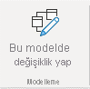
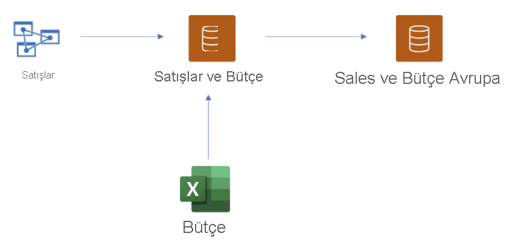
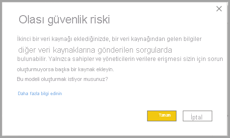
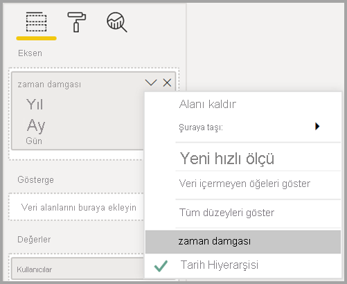

# Power BI veri kümeleri ve Azure Analysis Services için DirectQuery kullanma (önizleme)

With **Power BI veri kümeleri ve Azure Analysis Services (AAS) için DirectQuery** ile, AAS veya Power BI veri kümelerine bağlanmak için DirectQuery kullanabilir, isterseniz bunu diğer DirectQuery verileri ve içeri aktarılmış verilerle birleştirebilirsiniz. Özellikle kurumsal anlam modellerinden gelen verileri sahip oldukları diğer verilerle (örneğin Excel elektronik tabloları) birleştirmek ya da kurumsal anlam modellerinden gelen meta verileri kişiselleştirmek veya zenginleştirmek isteyen rapor yazarları bu özelliği yararlı bulacaktır.

## Önizleme özelliğini etkinleştirme

İşlevsellik şu anda önizlemede olduğundan öncelikle etkinleştirmeniz gerekir. Bunu yapmak için Power BI Desktop'ta **Dosya > Seçenekler ve ayarlar > Seçenekler**'e gidin ve **Önizleme özellikleri** bölümünde **Power BI veri kümeleri ve Analysis Services için DirectQuery** onay kutusunu işaretleyerek bu önizleme özelliğini etkinleştirin. Yaptığınız değişikliğin geçerlilik kazanması için Power BI Desktop'ı yeniden başlatmanız gerekebilir.

## Canlı bağlantılar için DirectQuery'yi kullanma

Power BI veri kümeleri ve Azure Analysis Services için DirectQuery'yi kullanırken raporunuzun yerel bir modeli olması gerekir. Canlı bağlantıdan başlayabilir ve yerel modele ekleyebilir veya yükseltebilirsiniz. Öte yandan DirectQuery bağlantısından veya içeri aktarılan verilerden başlarsanız raporunuzda otomatik olarak bir yerel model oluşturulur.

Modelinizde hangi bağlantıların kullanıldığını görmek için Power BI Desktop'ın sağ alt köşesindeki durum çubuğuna bakın. Yalnızca Azure Analysis Services kaynağına bağlıysanız aşağıdaki resme benzer bir ileti görürsünüz:

Bir Power BI veri kümesine bağlıysanız, hangi Power BI veri kümesine bağlı olduğunuzu bildiren bir ileti görürsünüz:

Canlı bağlantı kurduğunuz veri kümesindeki alanların meta verilerini özelleştirmek istiyorsanız durum çubuğundaki **Bu modelde değişiklik yap**'ı seçin. Alternatif olarak, aşağıdaki resimde gösterildiği gibi şeridin **Bu modelde değişiklik yap** düğmesine de tıklayabilirsiniz. **Rapor Görünümü**'nde **Modelleme** sekmesindeki **Bu modelde değişiklik yap** düğmesi. Model Görünümü'nde bu düğme **Giriş** sekmesindedir.

Düğme seçildiğinde yerel modelin eklendiğini onaylayan bir iletişim kutusu görüntülenir. Power BI veri kümelerindeki veya Azure Analysis Services'deki alanlarda yeni sütunlar oluşturmayı veya meta verileri değiştirmeyi etkinleştirmek için **Yerel model ekle**'yi seçin. Aşağıdaki resimde görüntülenen iletişim kutusu gösterilir. 

Analysis Services kaynağına canlı bağlantı kurduğunuzda yerel model yoktur. Power BI veri kümeleri ve Azure Analysis Services gibi canlı bağlantılı kaynaklarda DirectQuery'yi kullanmak için raporunuza yerel model eklemelisiniz. Yerel modelle Power BI hizmetine rapor yayımladığınızda, bu yerel model için bir veri kümesi de yayımlanır.

## Zincirleme

Veri kümeleri ve bunların temel aldığı veri kümeleriyle modeller bir *zincir* oluşturur. **Zincirleme** olarak adlandırılan bu işlem diğer Power BI veri kümelerini temel alan bir rapor ve veri kümesi yayımlamanıza olanak tanır. Bu, daha önce mümkün olmayan bir özelliktir.

Örneğin iş arkadaşınızın *Satış* adlı bir Azure Analysis Services modelini temel alan *Satış ve Bütçe* adlı bir Power BI veri kümesi yayımladığını ve bunu *Bütçe* adlı bir Excel sayfasıyla birleştirdiğini düşünün.

İş arkadaşınız tarafından yayımlanan *Satış ve Bütçe* Power BI veri kümesine dayalı *Satış ve Bütçe Avrupa* adlı yeni bir rapor (ve veri kümesi) yayımladığınızda, bazı başka değişiklikler ve uzantılar yaparsanız aslında *Satış* adlı Azure Analysis Services modeliyle başlayıp *Satış ve Bütçe Avrupa* adlı Power BI veri kümenizle biten ve uzunluğu üç olan bir zincire rapor ve veri kümesi eklemiş olursunuz. Aşağıdaki resim bu zincirleme işlemi görselleştirir.

Önceki resimde yer alan zincirin uzunluğu üçtür ve bu önizleme süresi boyunca en çok bu uzunlukta olabilir. Üçü aşan zincir uzunluğu desteklenmez ve hatalarla sonuçlanır.

## Güvenlik uyarısı

**Power BI veri kümeleri ve Azure Analysis Services (AAS) için DirectQuery** özelliğini kullanıldığında size aşağıdaki resimde gösterilen bir güvenlik uyarısı iletişim kutusu görüntülenir.

Veriler bir veri kaynağından diğerine gönderilebilir; bu, bir veri modelinde DirectQuery ile içeri aktarma kaynaklarını birleştirmeye yönelik aynı güvenlik uyarısıdır. Bu davranış hakkında daha fazla bilgi edinmek için [Power BI Desktop'ta bileşik modeller kullanma](../transform-model/desktop-composite-models.md) konusuna bakın.

## Denenecek özellikler ve senaryolar

Aşağıdaki listede **Power BI veri kümeleri ve Azure Analysis Services (AAS) için DirectQuery**'yi kendiniz inceleyebilmeniz için öneriler sağlanır:

- Çeşitli kaynaklardaki verilere bağlanma: İçeri aktarma (dosyalar gibi), Power BI veri kümeleri, Azure Analysis Services
- Farklı veri kaynakları arasında ilişki oluşturma
- Farklı veri kaynaklarındaki alanları kullanan ölçüler yazma
- Azure Analysis Services'in Power BI veri kümelerinden tablolar için yeni sütunlar oluşturma
- Farklı veri kaynaklarındaki sütunları kullanan görseller oluşturma

## Önemli noktalar ve sınırlamalar

**Power BI veri kümeleri ve Azure Analysis Services (AAS) için DirectQuery**'yi kullanırken aklınızda bulundurmanız gereken birkaç **önemli nokta** vardır:

- Veri kaynaklarınızı yenilerseniz ve çakışan alan veya tablo adlarıyla ilgili hatalar varsa Power BI hataları sizin için düzeltir.

- Power BI hizmetinde başka bir veri kümesine dayanan bir bileşik modelde raporlar oluşturmak için tüm kimlik bilgilerinin ayarlanması gerekir. Kimlik bilgileri ayarlanmış olsa bile Azure Analysis Services kaynakları için kimlik bilgisi ayarlarını yenileme sayfasında aşağıdaki hata görüntülenir:
    
    
- Bu kafa karıştırıcı ve yanlış olduğundan, yakında bununla ilgileneceğiz.

- RLS kuralları tanımlandıkları kaynakta uygulanır ama modeldeki diğer veri kümelerinin hiçbirine uygulanmaz. Raporda tanımlanan RLS uzak kaynaklara uygulanmaz ve uzak kaynaklarda ayarlanan RLS de diğer veri kaynaklarına uygulanmaz.

- Bu önizleme sürümünde görüntüleme klasörleri, KPI'ler, tarih tabloları, satır düzeyi güvenlik ve çeviriler kaynaktan içeri aktarılmaz. Yerel modelde yine görüntüleme klasörleri oluşturabilirsiniz.

- Tarih hiyerarşisini kullanırken bazı beklenmeyen davranışlar görebilirsiniz. Bu sorunu çözmek için, bunun yerine tarih sütunu kullanın. Görsele tarih hiyerarşisi ekledikten sonra alan adındaki aşağı oka tıklayarak ve ardından *Tarih Hiyerarşisi*'ni kullanmak yerine söz konusu alanın adına tıklayarak bir tarih sütununa geçebilirsiniz:

    

    Tarih hiyerarşileri yerine tarih sütunlarını kullanma hakkında daha fazla bilgi için bu makaleyi ziyaret edin.

- Azure Analysis Services'e DirectQuery bağlantısı olan bir modelle yapay zeka özelliklerini kullanırken yararsız hata iletileri görebilirsiniz. 

- DirectQuery kaynağıyla ALLSELECTED kullanılması eksik sonuçlara yol açar.

- Filtreler ve ilişkiler:
    - Bir veri kaynağından başka bir DirectQuery kaynağındaki tabloya uygulanan filtre yalnızca tek sütunda ayarlanabilir

    - DirectQuery kaynağındaki iki tabloyu kaynağın dışındaki bir tabloyla filtreleyerek bunlara çapraz filtre uygulamak önerilen bir tasarım değildir ve desteklenmez.

    - Filtre bir tabloya tek bir kez dokunabilir. DirectQuery kaynağının dışındaki tablolardan biri aracılığıyla tabloya aynı filtreyi iki kez uygulamak desteklenmez.

- Önizleme sırasında model zincirinin uzunluk üst sınır üçtür. Üçü aşan zincir uzunluğu desteklenmez ve hatalarla sonuçlanır. 

- Bir zincirin oluşturulmasını veya genişletilmesini önlemek için üçüncü taraf araçları kullanılarak modele bir *zincirlemeyi caydırma* bayrağı ayarlanabilir. Bunu ayarlamak için modelde *DiscourageCompositeModels* özelliğini bulun. 

Ayrıca aklınızda tutmanız gereken birkaç **sınırlama** vardır:

- Veritabanı ve sunucu adlarının parametreleri şu anda devre dışı bırakılmıştır. 

- Uzak bir kaynaktan tablolarda RLS tanımlanması desteklenmez.

- DirectQuery kaynağı olarak SQL Server Analysis Services'in (SSAS) kullanılması şu anda desteklenmemektedir. 

- "Çalışma alanım" içindeki veri kümelerinde DirectQuery'nin kullanılması şu anda desteklenmemektedir. 

- DirectQuery kullanan uzak kaynaklara yönelik bağlantıların silinmesi şu anda desteklenmemektedir.

- Power BI veri kümelerine veya Azure Analysis Services modeline bir DirectQuery bağlantısı içeren veri kümeleriyle Power BI Embedded'in kullanılması şu anda desteklenmemektedir.

- Uzak kaynaktaki sütunlar ve ölçülerin biçim dizeleri bileşik modelde içeri aktarılmaz.

- Uzak kaynaklardaki hesaplama grupları desteklenmez ve tanımlanmamış sorgu sonuçları elde edilir.

- Hesaplanan tablolarla uzak veri kaynağındaki tablolar arasında bir ilişki olduğunda bazı sorgular yanlış sonuçlar döndürebilir. Uzak veri kümesinden hesaplanan tablolar oluşturma işlemi desteklenmez ama şu anda bu işlem arabirimde engellenmemektedir.

- Sütuna göre sıralama şu anda desteklenmez.

- Otomatik sayfa yenileme (APR), veri kaynağı türüne bağlı olarak yalnızca bazı senaryolarda desteklenir. Daha fazla bilgi için [Power BI'da otomatik sayfa yenileme](../create-reports/desktop-automatic-page-refresh.md) makalesine bakın.

## Sonraki adımlar

DirectQuery hakkında daha fazla bilgi için aşağıdaki kaynaklara bakın:

- [Power BI Desktop'ta DirectQuery'yi kullanma](desktop-use-directquery.md)
- [Power BI Desktop’ta DirectQuery modelleri](desktop-directquery-about.md)
- [Power BI Desktop’ta DirectQuery modeli kılavuzu](../guidance/directquery-model-guidance.md)
- Sorularınız mı var? [Power BI Topluluğu'na sorun](https://community.powerbi.com/)
