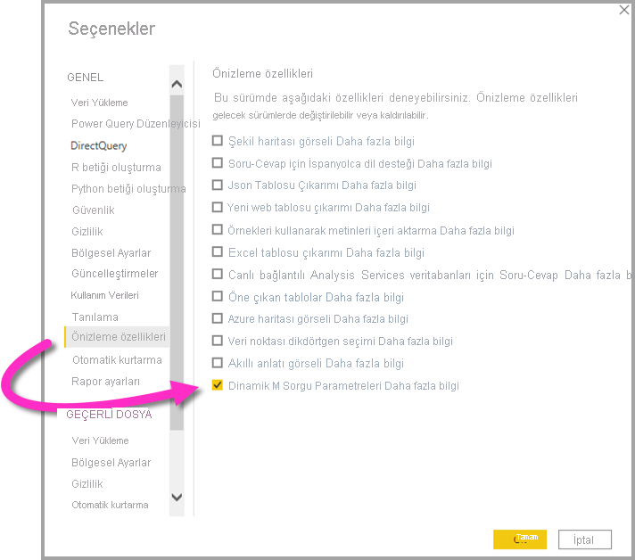

# <a name="dynamic-m-query-parameters-in-power-bi-desktop-preview"></a>Power BI Desktop'taki dinamik M sorgu parametreleri (önizleme)

**Dinamik M Sorgu Parametreleri** sayesinde model yazarları, **rapor görüntüleyicilerin** filtre veya dilimleyici kullanarak [M Sorgu Parametresi](/power-query/power-query-query-parameters) değerlerini ayarlamasına izin verebilir. Bu işlev özellikle sorgu performansını iyileştirme açısından yararlı olabilir. Model yazarları, Dinamik M Sorgu Parametreleri sayesinde filtre seçimlerinin DirectQuery kaynak sorgularına eklenmesi konusunda ek denetim sahibi olur. 

Filtrelerinin semantiği konusunda anlayış sahibi olan model yazarları genellikle veri kaynağı için etkili sorgular yazma konusunda bilgi sahibidir. Bu doğrultuda istenen sonuçları yüksek performansla elde etmek için filtre seçimlerinin kaynak sorgularına doğru noktada eklenmesini sağlayabilir.

## <a name="enabling-dynamic-m-query-parameters"></a>Dinamik M sorgu parametrelerini etkinleştirme

**Dinamik M Sorgu Parametreleri** şu an için önizleme sürümündedir ve kullanabilmek için etkinleştirmeniz gerekir. **Dosya > Seçenekler ve ayarlar > Seçenekler** yolunu izleyip sol taraftaki bölmeden **Önizleme özellikleri** 'ni seçin. Burada **Dinamik M Sorgu Parametreleri** onay kutusunun seçili olduğundan emin olun. Yaptığınız değişikliğin etkili olması için Power BI Desktop'ı yeniden başlatmanız gerekebilir.



Bu özelliğin önkoşullarından biri, geçerli bir [M Sorgu Parametresi](/power-query/power-query-query-parameters) oluşturmuş ve bir veya daha fazla DirectQuery tablosunda başvurmuş olmanız gerekir. 

> [!NOTE]
> Bu özellik tüm DirectQuery kaynakları için desteklenmediğinden bu makalenin [Önemli noktalar ve sınırlamalar](#considerations-and-limitations) bölümünü incelemeyi unutmayın.

Şimdi bir parametreye dinamik olarak **tek bir değer** geçirmeye yönelik örneği inceleyelim:

1. Power BI Desktop'ta **Veri** sekmesinden **Power Query** 'yi başlatın ve şeritteki **Parametreleri Yönet** düğmesinin altından **Yeni Parametreler** 'i seçin.

    

2. Ardından parametre için aşağıdaki bilgileri kullanın.

    

3. Eklemek istediğiniz başka parametre varsa tekrar **Yeni** 'ye tıklayın.

    

4. Parametreleri oluşturduktan sonra bunlara M sorgusunda başvurabilirsiniz. M Sorgusunu değiştirmek için ilgili Sorgu seçili durumdayken Gelişmiş Düzenleyici'yi açın:

    

5. Ardından aşağıdaki görüntüde sarı renkle vurgulanmış parametrelere M Sorgusundan başvurun. 

    

6. Parametreleri oluşturdunuz ve M Sorgusunda bunlara başvurdunuz. Şimdi bu parametre için olası değerlerin yer aldığı bir sütuna sahip olan bir tablo oluşturmanız gerekir. Bu tablo, parametrelerin filtre seçimine göre dinamik olarak ayarlanmasını sağlayacak. Bu örnekte *StartTime* ve *EndTime* parametrelerinin dinamik olmasını istiyoruz. Bu parametreler bir Tarih/Saat parametresi gerektirdiğinden parametre için tarihi ayarlamak üzere kullanılabilecek veri girişleri oluşturacağız. Öncelikle yeni bir tablo oluşturalım:

    

7. *StartTime* parametresinin değerlerini içeren ilk tablo şu şekilde olacak:

    ```StartDateTable = CALENDAR (DATE(2016,1,1), DATE(2016,12,31))```

    

8. EndTime parametresinin değerlerini içeren ikinci tablo ise şu şekilde olacak:

    ```EndDateTable = CALENDAR (DATE(2016,1,1), DATE(2016,12,31))```

    

    > [!NOTE]
    > Asıl tabloda yer almayan farklı bir sütun adı kullanmanız önerilir. Adların aynı olması durumunda seçilen değer gerçek sorguya filtre olarak uygulanır.

9. *Tarih* alanına sahip tabloları oluşturduğumuza göre her alanı bir parametreye bağlayabiliriz. Alanı bir parametreye bağlamak, alan için seçilen değerin değişmesi durumunda ilgili değerin parametreye geçirilmesi ve parametreye başvurulduğunda sorgunun güncelleştirilmesi anlamına gelir. Alanı bağlamak için **Modelleme** sekmesine gidin, yeni oluşturulan alanı seçin ve **Gelişmiş** özelliklere gidin:

    > [!NOTE]
    > Sütun veri türü, M parametre türüyle aynı olmalıdır.

    

10. **Parametreye bağla** 'nın altındaki açılan menüyü seçip alana bağlamak istediğiniz parametreyi belirleyin:

    

    Bu örnekte tek bir değer kullanıldığından (parametreyi tek bir değere ayarlama) **Çoklu seçim** ayarını **Hayır** olarak bırakmanız gerekir. Varsayılan değer bu şekildedir:

    

    Kullanım örnekleriniz için çoklu seçime (tek bir parametreye birden çok değer geçirme) ihtiyacınız varsa bu seçeneği **Evet** olarak ayarlamanız ve M sorgunuzun M sorgusunda birden çok değeri kabul edecek şekilde ayarlandığından emin olmanız gerekir. Aşağıda *RepoNameParameter* için birden çok değere izin veren bir örnek verilmiştir:

    

11. Başka parametrelere bağlamak istediğiniz farklı alanlar varsa bu adımları yineleyebilirsiniz:

    

12. Son olarak bu alana bir dilimleyicide veya filtre olarak başvurabilirsiniz:

    

Eşlenen sütunda Çoklu seçim ayarı **Hayır** olarak bırakıldıysa dilimleyicide tekli seçim modunu kullanmanız veya filtre kartında tekli seçim yapılmasını sağlamanız gerekir.

## <a name="potential-security-risk"></a>Olası güvenlik riski

Rapor okuyucularının M Sorgu parametreleri için değerleri dinamik olarak ayarlamasına izin verdiğinizde okuyucular, parametrelere M Sorgusunda nasıl başvuru yapıldığına ve parametreye geçirilen değerlere bağlı olarak **ekleme saldırılarını** kullanarak başka verilere de erişebilirler veya kaynak sistemde değişiklik yapılmasını tetikleyebilirler.

Örneğin aşağıdakine benzer bir parametreli Kusto sorgusuna sahip olduğunuzu düşünün:

```
Products
| where Category == [Parameter inserted here] & HasReleased == 'True'
 | project ReleaseDate, Name, Category, Region```
```

Parametre için makul bir değer (örneğin, *Games* ) geçiren sıradan bir kullanıcıyla herhangi bir sorun yaşamazsınız:

```
| where Category == 'Games' & HasReleased == 'True'
```

Ancak saldırganlar, daha fazla veriye erişmek için sorguyu değiştiren bir değer (örneğin, *'Games' //* ) geçirebilir:

```
Products
| where Category == 'Games'// & HasReleased == 'True'
| project ReleaseDate, Name, Category, Region
```

Bu örnekte saldırgan, sorgunun bir bölümünü açıklama haline getirerek henüz kullanıma sunulmamış olan oyunlarla ilgili bilgilere erişim sağlayabilir.

**Riski azaltma**

Güvenlik riskini azaltmak için sorgu içindeki M parametre değerlerinin dize birleştirmesini kullanmaktan kaçınmanız önerilir.  Bunun yerine bu parametre değerlerini kaynak sorgusunu oluşturan M işlemlerinde kullanarak son sorgunun M altyapısı ve bağlayıcı tarafından oluşturulmasını sağlayın. Alternatif olarak mümkünse kaynak sorgu dili ve bağlayıcılarında yerleşik olan parametre geçirme mekanizmasını kullanın. Örneğin [Azure Veri Gezgini](/azure/data-explorer/kusto/query/queryparametersstatement?pivots=azuredataexplorer), ekleme saldırılarına karşı koruma sağlayacak şekilde tasarlanmış yerleşik sorgu parametresi özelliklerine sahiptir.

İşte bazı örnekler:

* M sorgusunun filtreleme işlemlerini kullanma örneği:
    ```
    Table.SelectRows(Source, (r) =\&gt; r[Columns] = Parameter)
    ```

* Parametreyi kaynak sorgusunda bildirme (veya parametre değerini kaynak sorgusu işlevine giriş olarak geçirme) örneği:
    ```
    declare query\_parameters (Name of Parameter : Type of Parameter);
    ```

## <a name="considerations-and-limitations"></a>Önemli noktalar ve sınırlamalar

Dinamik M sorgu parametrelerini kullanırken dikkat etmeniz gereken bazı önemli noktalar ve sınırlamalar vardır:

* Tek bir parametre birden fazla alana bağlanamaz ve bunun tersi de yapılamaz.
* Bu özellik yalnızca M tabanlı veri kaynakları için desteklenir. Aşağıdaki DirectQuery kaynakları desteklenmez:
    * T-SQL tabanlı veri kaynakları: SQL Server, Azure SQL Veritabanı, Synapse SQL havuzları (Azure SQL Veri Ambarı) ve Synapse SQL OnDemand havuzları
    * Canlı bağlantı veri kaynakları: Azure Analysis Services, SQL Server Analysis Services, Power BI Veri Kümeleri
    * Desteklenmeyen diğer veri kaynakları: Oracle, Teradata ve İlişkisel SAP HANA
    * XMLA/TOM uç nokta programlamasıyla kısmen desteklenenler: SAP BW ve SAP HANA 


* Desteklenmeyen hazır parametre türleri şunlardır:
  * Herhangi biri
  * Süre
  * True/False
  * İkili

* Desteklenmeyen filtreler:
  * Göreli saat dilimleyicisi veya filtresi
  * Göreli tarih
  * Hiyerarşi dilimleyicisi
  * Çok alanlı dahil etme filtresi
  * Hariç tutma filtresi/Değil filtreleri
  * Çapraz vurgulama
  * Detaya gitme filtresi
  * Çapraz detaylandırma filtresi
  * Üst N filtresi
* Desteklenmeyen işlemler:
  * And
  * Contains
  * Küçüktür
  * Büyüktür
  * İle başlar
  * Şununla başlamaz
  * Değildir
  * İçermez
  * Tümünü seç
  * Boştur
  * Boş değildir


## <a name="next-steps"></a>Sonraki adımlar

Power BI Desktop ile her şeyi yapabilirsiniz. Özellikler hakkında daha fazla bilgi edinmek için aşağıdaki kaynaklara bakın:

* [Power BI'da DirectQuery kullanma hakkında](desktop-directquery-about.md)
* [Power BI Desktop nedir?](../fundamentals/desktop-what-is-desktop.md)
* [Power BI Desktop ile sorgulara genel bakış](../transform-model/desktop-query-overview.md)
* [Power BI Desktop'taki veri türleri](desktop-data-types.md)
* [Power BI Desktop'ta verileri şekillendirme ve birleştirme](desktop-shape-and-combine-data.md)
* [Power BI Desktop'taki genel sorgu görevleri](../transform-model/desktop-common-query-tasks.md)